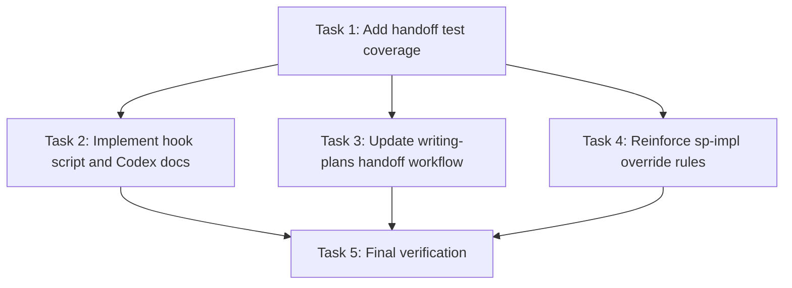

# Post-Plan Implementation Handoff Implementation Plan

> **For agentic workers:** REQUIRED SUB-SKILL: Use `simplepower:subagent-driven-development` wave-by-wave. Dispatch one wave at a time, respect review boundaries, and keep task tracking in checkbox (`- [ ]`) syntax. Use `simplepower:executing-plans` only when subagents are unavailable or the user explicitly requests inline execution.

**Goal:** Add a post-plan clear-context implementation handoff and make Simple Power `sp-impl` dispatch settings override generic same-model subagent defaults.

**Architecture:** `simplepower:writing-plans` becomes the source of the post-plan user prompt and handoff artifact contract. A small hook script reads `.simplepower/implementation-handoff.json` and emits Codex `hookSpecificOutput.additionalContext` when a pending handoff exists. Static and shell tests verify the workflow text, hook behavior, and `sp-impl` model override.

**Tech Stack:** Markdown skills and docs, Bash hook script, Bash static tests, JSON emitted through shell-safe string escaping.

---

## File Structure

| File | Responsibility |
| --- | --- |
| `tests/simplepower-static/run-tests.sh` | Add static assertions for handoff prompts, handoff artifact path, hook docs, and `sp-impl` override wording. |
| `tests/implementation-handoff/run-tests.sh` | New focused shell test runner for the handoff hook script. |
| `skills/writing-plans/scripts/implementation-handoff-hook` | New Codex hook command that reads `.simplepower/implementation-handoff.json` and emits `additionalContext` for pending handoffs. |
| `skills/writing-plans/SKILL.md` | Add post-plan clear-context prompt, handoff artifact schema, restart prompt, and hook-assisted fallback guidance. |
| `skills/subagent-driven-development/SKILL.md` | Clarify that `sp-impl` settings are explicit Simple Power overrides to generic same-model defaults. |
| `skills/using-simplepower/references/codex-tools.md` | Repeat the same override at the Codex `spawn_agent` mapping point. |
| `docs/README.codex.md` | Document manual `~/.codex/hooks.json` setup for hook-assisted implementation restart. |
| `/home/gary/.codex/AGENTS.md` | Add the local carveout so Simple Power explicit dispatch settings override the global same-model default. |

## Dependency Graph



## Dispatch Plan

### Wave 1

- **Tasks:** Task 1
- **Dependencies satisfied:** none
- **Parallel:** no
- **Review boundary:** static and focused hook tests are added and fail for the missing implementation.
- **Reviewer/fixer dispatch recommendation:** `mini-high reviewer/fixer`, because this wave only adds localized test assertions and a new shell test file.
- **Verification before downstream work:** `bash tests/simplepower-static/run-tests.sh` and `bash tests/implementation-handoff/run-tests.sh` should fail on the new missing strings/script before Tasks 2-4.

### Wave 2

- **Tasks:** Task 2, Task 3, Task 4
- **Dependencies satisfied:** Task 1
- **Parallel:** yes. Task 2 owns hook script/docs, Task 3 owns `writing-plans`, and Task 4 owns SDD/tool mapping plus the local AGENTS carveout.
- **Review boundary:** all three implementation tasks complete without overlapping writes.
- **Reviewer/fixer dispatch recommendation:** `main-equivalent reviewer/fixer`, because the wave changes workflow behavior and hook semantics.
- **Verification before downstream work:** `bash tests/simplepower-static/run-tests.sh` and `bash tests/implementation-handoff/run-tests.sh` should pass.

### Wave 3

- **Tasks:** Task 5
- **Dependencies satisfied:** Tasks 2, 3, and 4
- **Parallel:** no
- **Review boundary:** final repo checks pass and the diff contains only intended files.
- **Reviewer/fixer dispatch recommendation:** `mini-high reviewer/fixer`, because this wave is verification-only unless it finds a localized issue.
- **Verification before completion:** `bash tests/simplepower-static/run-tests.sh`, `bash tests/implementation-handoff/run-tests.sh`, `bash tests/skill-triggering/run-all.sh`, `bash tests/explicit-skill-requests/run-all.sh`, `git diff --check`, and `git -C /home/gary/.codex diff --check -- AGENTS.md` pass.

## Write Scope Table

| Task | Write scope | Files | Parallel | Risk | Review boundary | Reviewer/fixer dispatch | Verification |
| --- | --- | --- | --- | --- | --- | --- | --- |
| Task 1 | Test assertions only | `tests/simplepower-static/run-tests.sh`, `tests/implementation-handoff/run-tests.sh` | No | Low: test-only changes | Tests fail for missing implementation | `mini-high reviewer/fixer` | `bash tests/simplepower-static/run-tests.sh`, `bash tests/implementation-handoff/run-tests.sh` fail before implementation |
| Task 2 | Hook script and Codex docs | `skills/writing-plans/scripts/implementation-handoff-hook`, `docs/README.codex.md` | Yes, with Tasks 3 and 4 | Medium: hook output format must be valid JSON | Hook tests pass | `main-equivalent reviewer/fixer` | `bash tests/implementation-handoff/run-tests.sh` |
| Task 3 | Planning workflow text | `skills/writing-plans/SKILL.md` | Yes, with Tasks 2 and 4 | Medium: wording controls future behavior | Static handoff assertions pass | `main-equivalent reviewer/fixer` | `bash tests/simplepower-static/run-tests.sh` |
| Task 4 | Worker model override wording and local carveout | `skills/subagent-driven-development/SKILL.md`, `skills/using-simplepower/references/codex-tools.md`, `/home/gary/.codex/AGENTS.md` | Yes, with Tasks 2 and 3 | Medium: crosses repo and user-global instruction file | Static override assertions pass and AGENTS keeps existing rules | `main-equivalent reviewer/fixer` | `bash tests/simplepower-static/run-tests.sh` |
| Task 5 | Final verification and cleanup | no intended source writes; only localized fixes if verification reveals drift | No | Low: verification-only | All checks pass | `mini-high reviewer/fixer` | Full final verification command set |

## Task 1: Add Handoff Test Coverage

**Depends on:** none
**Write scope:** `tests/simplepower-static/run-tests.sh`, `tests/implementation-handoff/run-tests.sh`
**Parallel:** No.
**Risk:** Low, because this task only adds tests and does not change runtime behavior.
**Review boundary:** New tests fail before implementation because the hook script and workflow strings do not exist yet.
**Reviewer/fixer dispatch:** `mini-high reviewer/fixer`, because failures should be localized to assertions.
**Verification:** `bash tests/simplepower-static/run-tests.sh` and `bash tests/implementation-handoff/run-tests.sh`; expected before implementation: fail on new missing handoff/override requirements.

**Files:**
- Modify: `tests/simplepower-static/run-tests.sh`
- Create: `tests/implementation-handoff/run-tests.sh`

- [ ] **Step 1: Add static assertions for writing-plans handoff**

In `tests/simplepower-static/run-tests.sh`, after the existing `writing-plans` assertions:

```bash
require_contains "skills/writing-plans/SKILL.md" "Clear context and start implementation" "writing-plans asks about clear-context implementation handoff"
require_contains "skills/writing-plans/SKILL.md" ".simplepower/implementation-handoff.json" "writing-plans names the implementation handoff artifact"
require_contains "skills/writing-plans/SKILL.md" "implementation-handoff-hook" "writing-plans references the handoff hook script"
require_contains "skills/writing-plans/SKILL.md" 'model="gpt-5.4-mini"' "writing-plans records the sp-impl worker model in the handoff"
require_contains "skills/writing-plans/SKILL.md" "hookSpecificOutput.additionalContext" "writing-plans documents hook context injection"
```

- [ ] **Step 2: Add static assertions for hook docs and executable**

In `tests/simplepower-static/run-tests.sh`, near the docs assertions and file checks:

```bash
require_executable "skills/writing-plans/scripts/implementation-handoff-hook" "implementation handoff hook script is executable"
require_contains "docs/README.codex.md" "implementation-handoff-hook" "Codex install guide documents the implementation handoff hook"
require_contains "docs/README.codex.md" "~/.codex/hooks.json" "Codex install guide documents config-layer hook setup"
require_contains "docs/README.codex.md" ".simplepower/implementation-handoff.json" "Codex install guide documents the handoff artifact"
```

- [ ] **Step 3: Add static assertions for explicit sp-impl override wording**

In `tests/simplepower-static/run-tests.sh`, after existing SDD and Codex tool mapping checks:

```bash
require_contains "skills/subagent-driven-development/SKILL.md" "explicit Simple Power override" "SDD says sp-impl settings override generic same-model defaults"
require_contains "skills/subagent-driven-development/SKILL.md" "same-model defaults" "SDD mentions same-model default conflicts"
require_contains "skills/using-simplepower/references/codex-tools.md" "explicit Simple Power override" "Codex tool mapping says sp-impl settings override generic same-model defaults"
require_contains "skills/using-simplepower/references/codex-tools.md" 'model="gpt-5.4-mini"' "Codex tool mapping preserves the sp-impl mini model"
```

- [ ] **Step 4: Create focused hook test runner**

Create `tests/implementation-handoff/run-tests.sh` with executable mode:

```bash
#!/usr/bin/env bash
set -euo pipefail

SCRIPT_DIR="$(cd "$(dirname "${BASH_SOURCE[0]}")" && pwd)"
REPO_ROOT="$(cd "$SCRIPT_DIR/../.." && pwd)"
HOOK="$REPO_ROOT/skills/writing-plans/scripts/implementation-handoff-hook"
TMP_DIR="$(mktemp -d)"
trap 'rm -rf "$TMP_DIR"' EXIT

fail() {
    echo "  [FAIL] $1"
    exit 1
}

pass() {
    echo "  [PASS] $1"
}

echo "=== Implementation Handoff Hook Tests ==="

[[ -x "$HOOK" ]] || fail "hook script is executable"

missing_output="$(cd "$TMP_DIR" && "$HOOK")"
[[ -z "$missing_output" ]] || fail "missing handoff produces no output"
pass "missing handoff produces no output"

mkdir -p "$TMP_DIR/.simplepower"
cat > "$TMP_DIR/.simplepower/implementation-handoff.json" <<'JSON'
{
  "status": "pending",
  "plan_path": "docs/simplepower/plans/example.md",
  "hook_additional_context": "Use simplepower:subagent-driven-development for docs/simplepower/plans/example.md. Use sp-impl with model=\"gpt-5.4-mini\" and reasoning_effort=\"high\"."
}
JSON

pending_output="$(cd "$TMP_DIR" && "$HOOK")"
printf '%s\n' "$pending_output" | grep -F '"hookEventName":"UserPromptSubmit"' >/dev/null || fail "pending output names UserPromptSubmit"
printf '%s\n' "$pending_output" | grep -F '"additionalContext"' >/dev/null || fail "pending output includes additionalContext"
printf '%s\n' "$pending_output" | grep -F 'docs/simplepower/plans/example.md' >/dev/null || fail "pending output includes plan path"
printf '%s\n' "$pending_output" | grep -F 'gpt-5.4-mini' >/dev/null || fail "pending output includes sp-impl model"
pass "pending handoff emits hook context"

cat > "$TMP_DIR/.simplepower/implementation-handoff.json" <<'JSON'
{
  "status": "consumed",
  "plan_path": "docs/simplepower/plans/example.md",
  "hook_additional_context": "SHOULD_NOT_APPEAR"
}
JSON

consumed_output="$(cd "$TMP_DIR" && "$HOOK")"
[[ -z "$consumed_output" ]] || fail "consumed handoff produces no output"
pass "consumed handoff produces no output"

echo "All implementation handoff hook tests passed."
```

- [ ] **Step 5: Make the focused test runner executable**

Run:

```bash
chmod +x tests/implementation-handoff/run-tests.sh
```

Expected: command exits 0.

- [ ] **Step 6: Run tests to verify expected failures**

Run:

```bash
bash tests/simplepower-static/run-tests.sh
bash tests/implementation-handoff/run-tests.sh
```

Expected before implementation: static tests fail on missing handoff strings and missing executable hook script; hook tests fail because `skills/writing-plans/scripts/implementation-handoff-hook` does not exist.

- [ ] **Step 7: Report completion without committing**

State: `Do not commit. Report the changed files, the verification commands you ran, the expected failing results, and any remaining risks or follow-up dependencies.`

## Task 2: Implement Hook Script And Codex Docs

**Depends on:** Task 1
**Write scope:** `skills/writing-plans/scripts/implementation-handoff-hook`, `docs/README.codex.md`
**Parallel:** Yes, with Tasks 3 and 4.
**Risk:** Medium, because malformed hook JSON would make the assisted restart unreliable.
**Review boundary:** Focused hook tests pass and docs show a manual `~/.codex/hooks.json` setup.
**Reviewer/fixer dispatch:** `main-equivalent reviewer/fixer`, because hook semantics shape future implementation sessions.
**Verification:** `bash tests/implementation-handoff/run-tests.sh`; expected after implementation: pass.

**Files:**
- Create: `skills/writing-plans/scripts/implementation-handoff-hook`
- Modify: `docs/README.codex.md`

- [ ] **Step 1: Create the hook script directory**

Run:

```bash
mkdir -p skills/writing-plans/scripts
```

Expected: command exits 0.

- [ ] **Step 2: Create the handoff hook script**

Create `skills/writing-plans/scripts/implementation-handoff-hook`:

```bash
#!/usr/bin/env bash
set -euo pipefail

HANDOFF_FILE="${SIMPLEPOWER_HANDOFF_FILE:-.simplepower/implementation-handoff.json}"

if [[ ! -f "$HANDOFF_FILE" ]]; then
    exit 0
fi

if ! command -v python3 >/dev/null 2>&1; then
    exit 0
fi

python3 - "$HANDOFF_FILE" <<'PY'
import json
import sys
from pathlib import Path

path = Path(sys.argv[1])

try:
    data = json.loads(path.read_text(encoding="utf-8"))
except (OSError, json.JSONDecodeError):
    sys.exit(0)

if data.get("status") != "pending":
    sys.exit(0)

context = data.get("hook_additional_context")
if not isinstance(context, str) or not context.strip():
    plan_path = data.get("plan_path")
    sp_impl = data.get("sp_impl", {})
    context = (
        "Simple Power implementation handoff is pending. "
        f"Use `simplepower:subagent-driven-development` to execute `{plan_path}` "
        "wave-by-wave. "
        "Use `sp-impl` workers with "
        f"agent_type=\"{sp_impl.get('agent_type', 'worker')}\", "
        f"model=\"{sp_impl.get('model', 'gpt-5.4-mini')}\", "
        f"reasoning_effort=\"{sp_impl.get('reasoning_effort', 'high')}\", and "
        f"fork_context={str(sp_impl.get('fork_context', False)).lower()} "
        "unless the user explicitly overrides."
    )

payload = {
    "hookSpecificOutput": {
        "hookEventName": "UserPromptSubmit",
        "additionalContext": context,
    }
}

print(json.dumps(payload, separators=(",", ":")))
PY
```

- [ ] **Step 3: Make the hook executable**

Run:

```bash
chmod +x skills/writing-plans/scripts/implementation-handoff-hook
```

Expected: command exits 0.

- [ ] **Step 4: Document the manual Codex hook setup**

In `docs/README.codex.md`, add a section after `## Subagent Support`:

````markdown
## Implementation Handoff Hook

Simple Power can prepare a clean implementation restart after
`simplepower:writing-plans` finishes. If you choose to clear context and start
implementation, the plan writer creates `.simplepower/implementation-handoff.json`
in the active project.

Codex currently runs hooks from config-layer `~/.codex/hooks.json`. To let a
fresh post-clear prompt receive the pending handoff, add a `UserPromptSubmit`
hook entry that runs Simple Power's handoff hook:

```json
{
  "hooks": {
    "UserPromptSubmit": [
      {
        "hooks": [
          {
            "type": "command",
            "command": "~/.codex/simplepower/skills/writing-plans/scripts/implementation-handoff-hook"
          }
        ]
      }
    ],
    "SessionStart": [
      {
        "hooks": [
          {
            "type": "command",
            "command": "~/.codex/simplepower/skills/writing-plans/scripts/implementation-handoff-hook"
          }
        ]
      }
    ]
  }
}
```

The hook only injects `hookSpecificOutput.additionalContext` when the current
project contains a pending `.simplepower/implementation-handoff.json`. It does
not clear context, start implementation by itself, or inject the full plan.
````

- [ ] **Step 5: Run focused hook tests**

Run:

```bash
bash tests/implementation-handoff/run-tests.sh
```

Expected: exits 0 and prints `All implementation handoff hook tests passed.`

- [ ] **Step 6: Report completion without committing**

State: `Do not commit. Report the changed files, the verification commands you ran, the results, and any remaining risks or follow-up dependencies.`

## Task 3: Update Writing-Plans Handoff Workflow

**Depends on:** Task 1
**Write scope:** `skills/writing-plans/SKILL.md`
**Parallel:** Yes, with Tasks 2 and 4.
**Risk:** Medium, because this changes the terminal handoff users see after planning.
**Review boundary:** Static tests find the handoff prompt, artifact path, hook script reference, hook output field, and explicit `sp-impl` model in `writing-plans`.
**Reviewer/fixer dispatch:** `main-equivalent reviewer/fixer`, because this is behavior-shaping workflow text.
**Verification:** `bash tests/simplepower-static/run-tests.sh`; expected after Tasks 2-4: pass.

**Files:**
- Modify: `skills/writing-plans/SKILL.md`

- [ ] **Step 1: Add the handoff artifact contract**

In `skills/writing-plans/SKILL.md`, after the `Self-Review` section and before `## Execution Handoff`, add:

````markdown
## Clear-Context Implementation Handoff

After saving and self-reviewing the plan, ask the user:

> Plan complete and saved to `<plan-path>`. Clear context and start implementation from this plan?

If the user says no, use the normal execution handoff below.

If the user says yes, write `.simplepower/implementation-handoff.json` in the
active project before telling the user to clear context. Create `.simplepower/`
if it does not exist. The artifact is project-local state, not generated docs.

The artifact must include:

```json
{
  "status": "pending",
  "plan_path": "docs/simplepower/plans/<plan-file>.md",
  "spec_path": "docs/simplepower/specs/<spec-file>.md",
  "created_at": "<ISO-8601 timestamp>",
  "cwd": "<absolute project path>",
  "recommended_execution_skill": "simplepower:subagent-driven-development",
  "fallback_execution_skill": "simplepower:executing-plans",
  "sp_impl": {
    "agent_type": "worker",
    "model": "gpt-5.4-mini",
    "reasoning_effort": "high",
    "fork_context": false
  },
  "hook_additional_context": "Simple Power implementation handoff is pending. Use `simplepower:subagent-driven-development` to execute `docs/simplepower/plans/<plan-file>.md` wave-by-wave. Use `sp-impl` workers with agent_type=\"worker\", model=\"gpt-5.4-mini\", reasoning_effort=\"high\", and fork_context=false unless the user explicitly overrides."
}
```

Use `null` for `spec_path` if the plan was not generated from a known spec file.

The handoff hook script is
`skills/writing-plans/scripts/implementation-handoff-hook`. When installed in
Codex config-layer hooks, it reads this artifact and emits
`hookSpecificOutput.additionalContext` for a pending handoff.
````

- [ ] **Step 2: Replace the execution handoff text with a yes/no branch**

In `skills/writing-plans/SKILL.md`, update `## Execution Handoff` so it starts:

````markdown
After saving the plan and asking the clear-context handoff question:

**If the user chooses clear-context handoff:**

**"Handoff written to `.simplepower/implementation-handoff.json`. Clear context, then start implementation with: `Use simplepower:subagent-driven-development to execute <plan-path> wave-by-wave.` If the Simple Power handoff hook is installed in `~/.codex/hooks.json`, the next prompt will also receive this handoff through `hookSpecificOutput.additionalContext`."**

**If the user continues in the current context, hand off to wave-by-wave subagent-driven development:**
````

Keep the existing recommended handoff text after the current-context branch.

- [ ] **Step 3: Run static tests for writing-plans assertions**

Run:

```bash
bash tests/simplepower-static/run-tests.sh
```

Expected after Tasks 2-4: exits 0. If Task 2 or Task 4 has not landed yet, failures should be limited to their owned missing files or strings.

- [ ] **Step 4: Report completion without committing**

State: `Do not commit. Report the changed files, the verification commands you ran, the results, and any remaining risks or follow-up dependencies.`

## Task 4: Reinforce sp-impl Override Rules

**Depends on:** Task 1
**Write scope:** `skills/subagent-driven-development/SKILL.md`, `skills/using-simplepower/references/codex-tools.md`, `/home/gary/.codex/AGENTS.md`
**Parallel:** Yes, with Tasks 2 and 3.
**Risk:** Medium, because this updates both portable repo guidance and the user's global Codex instruction file.
**Review boundary:** Static tests find explicit override wording and `/home/gary/.codex/AGENTS.md` preserves the existing high-effort and same-model defaults with the new Simple Power exception.
**Reviewer/fixer dispatch:** `main-equivalent reviewer/fixer`, because it resolves instruction precedence for future subagent dispatches.
**Verification:** `bash tests/simplepower-static/run-tests.sh` and `sed -n '1,80p' /home/gary/.codex/AGENTS.md`; expected: static tests pass after Tasks 2-4 and AGENTS shows the new exception.

**Files:**
- Modify: `skills/subagent-driven-development/SKILL.md`
- Modify: `skills/using-simplepower/references/codex-tools.md`
- Modify: `/home/gary/.codex/AGENTS.md`

- [ ] **Step 1: Clarify SDD model selection override**

In `skills/subagent-driven-development/SKILL.md`, replace the first sentence under `## Model Selection` with:

```markdown
Use the following dispatch settings unless the user explicitly overrides them.
These settings are an explicit Simple Power override to generic same-model
defaults from AGENTS.md or other ambient instructions.
```

Keep the existing `sp-impl` bullet:

```markdown
- `sp-impl`: `agent_type="worker"`, `model="gpt-5.4-mini"`,
  `reasoning_effort="high"`, `fork_context=false`
```

- [ ] **Step 2: Clarify Codex tool mapping override**

In `skills/using-simplepower/references/codex-tools.md`, after the tool mapping table, add:

```markdown
The `sp-impl` mapping is an explicit Simple Power override to generic same-model
defaults from AGENTS.md or other ambient instructions. When dispatching
`sp-impl`, pass `model="gpt-5.4-mini"` and `reasoning_effort="high"` directly
in the `spawn_agent` call unless the user explicitly overrides.
```

- [ ] **Step 3: Add the local AGENTS carveout**

Update `/home/gary/.codex/AGENTS.md` to:

```markdown
# subagent
1. always spawn subagent with high effort unless specify otherwise
2. always spawn the same model as main agent unless specify otherwise
3. Exception: when a Simple Power skill or plan specifies subagent dispatch settings, those settings count as "specified otherwise" and override the same-model default. In particular, Simple Power `sp-impl` workers use `model="gpt-5.4-mini"` and `reasoning_effort="high"` unless the user explicitly overrides.
```

- [ ] **Step 4: Verify override wording**

Run:

```bash
bash tests/simplepower-static/run-tests.sh
sed -n '1,80p' /home/gary/.codex/AGENTS.md
```

Expected after Tasks 2-4: static checks pass. The `sed` output includes the two original rules and the new Simple Power exception.

- [ ] **Step 5: Report completion without committing**

State: `Do not commit. Report the changed files, the verification commands you ran, the results, and any remaining risks or follow-up dependencies.`

## Task 5: Final Verification

**Depends on:** Tasks 2, 3, and 4
**Write scope:** no intended source writes; only localized fixes if verification reveals drift
**Parallel:** No.
**Risk:** Low, because this is a verification and cleanup task.
**Review boundary:** All checks pass and both the Simple Power repo status and `/home/gary/.codex/AGENTS.md` status show only intended changes.
**Reviewer/fixer dispatch:** `mini-high reviewer/fixer`, because this wave is verification-only unless a localized failure appears.
**Verification:** `bash tests/simplepower-static/run-tests.sh`, `bash tests/implementation-handoff/run-tests.sh`, `bash tests/skill-triggering/run-all.sh`, `bash tests/explicit-skill-requests/run-all.sh`, `git diff --check`, `git -C /home/gary/.codex diff --check -- AGENTS.md`, `git status --short`, and `git -C /home/gary/.codex status --short -- AGENTS.md`.

**Files:**
- Modify only if verification reveals localized drift in files owned by Tasks 1-4.

- [ ] **Step 1: Run static checks**

Run:

```bash
bash tests/simplepower-static/run-tests.sh
```

Expected: exits 0 and prints `All Simple Power static checks passed.`

- [ ] **Step 2: Run handoff hook tests**

Run:

```bash
bash tests/implementation-handoff/run-tests.sh
```

Expected: exits 0 and prints `All implementation handoff hook tests passed.`

- [ ] **Step 3: Run skill-triggering tests**

Run:

```bash
bash tests/skill-triggering/run-all.sh
```

Expected: exits 0.

- [ ] **Step 4: Run explicit skill request tests**

Run:

```bash
bash tests/explicit-skill-requests/run-all.sh
```

Expected: exits 0.

- [ ] **Step 5: Check whitespace and final diff state**

Run:

```bash
git diff --check
git -C /home/gary/.codex diff --check -- AGENTS.md
git status --short
git -C /home/gary/.codex status --short -- AGENTS.md
```

Expected: both diff checks exit 0. `git status --short` in `/home/gary/git/simplepower` lists only intentional repo changes:

```text
 M docs/README.codex.md
 A docs/simplepower/plans/2026-05-02-post-plan-implementation-handoff.md
 A docs/simplepower/specs/2026-05-02-post-plan-implementation-handoff-design.md
 M skills/subagent-driven-development/SKILL.md
 M skills/using-simplepower/references/codex-tools.md
 M skills/writing-plans/SKILL.md
 A skills/writing-plans/scripts/implementation-handoff-hook
 M tests/simplepower-static/run-tests.sh
 A tests/implementation-handoff/run-tests.sh
```

`git -C /home/gary/.codex status --short -- AGENTS.md` lists:

```text
 M AGENTS.md
```

The exact status output may omit the spec and plan entries if they were already created in earlier planning work before implementation execution began.

- [ ] **Step 6: Final handoff**

Report: changed files, verification commands and results, whether `/home/gary/.codex/AGENTS.md` was updated, and any remaining risks. Do not commit.
