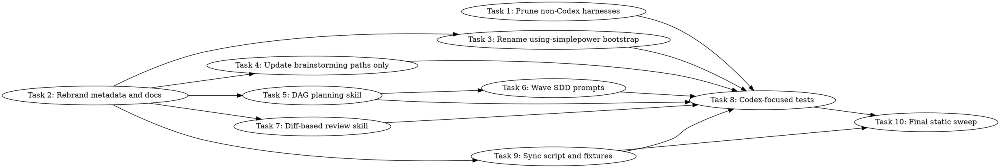

# Simple Power Codex Fork Implementation Plan

> **For agentic workers:** REQUIRED SUB-SKILL: Use `simplepower:subagent-driven-development` to implement this plan wave-by-wave. Steps use checkbox (`- [ ]`) syntax for tracking.

**Goal:** Convert this Superpowers fork into Simple Power, a Codex-only plugin with DAG-aware planning and wave-based parallel subagent execution.

**Architecture:** Keep the existing skill-based architecture, but remove active non-Codex harness support, rename active surfaces to `simplepower`, and update planning/execution skills to produce and consume dispatch waves. Execution uses `sp-impl` workers for independent implementation tasks and one wave-level reviewer/fixer using the main agent's model and effort.

**Tech Stack:** Markdown skills, Codex plugin manifest, Bash test/sync scripts, repository static checks.

---

## Dependency Graph



## Dispatch Plan

### Wave 1
**Tasks:** 1, 2
**Can run in parallel:** yes
**Shared dependencies:** none
**Write scopes:** non-overlapping
**Review:** wave-level
**Verification:** `git status --short`

### Wave 2
**Tasks:** 3, 4, 5, 7
**Can run in parallel:** yes
**Shared dependencies:** Task 2
**Write scopes:** non-overlapping skill directories
**Review:** wave-level
**Verification:** `rg -n "superpowers:|docs/superpowers|git commit|spec-reviewer|code-quality-reviewer" skills README.md docs/README.codex.md .codex .codex-plugin package.json`

### Wave 3
**Tasks:** 6, 9
**Can run in parallel:** yes
**Shared dependencies:** Task 5 for Task 6; Task 2 for Task 9
**Write scopes:** non-overlapping SDD and sync-script paths
**Review:** wave-level
**Verification:** `rg -n "sp-impl|gpt-5.4-mini|wave reviewer/fixer|plugins/simplepower|simplepower-small" skills/subagent-driven-development scripts tests/codex-plugin-sync`

### Wave 4
**Tasks:** 8
**Can run in parallel:** no
**Shared dependencies:** Tasks 1, 3, 4, 5, 6, 7, 9
**Write scopes:** test and testing docs paths
**Review:** wave-level
**Verification:** `bash tests/simplepower-static/run-tests.sh` and `npm --prefix tests/brainstorm-server test`

### Wave 5
**Tasks:** 10
**Can run in parallel:** no
**Shared dependencies:** Tasks 8, 9
**Write scopes:** whole repository
**Review:** task-level
**Verification:** final static sweep commands in Task 10

## Write Scope Table

| Task | Write Scope |
|------|-------------|
| 1 | `.claude-plugin/**`, `.cursor-plugin/**`, `.opencode/**`, `GEMINI.md`, `gemini-extension.json`, `docs/README.opencode.md`, `docs/windows/**`, `hooks/**`, `commands/**`, `tests/claude-code/**`, `tests/opencode/**`, `tests/subagent-driven-dev/**`, `tests/brainstorm-server/windows-lifecycle.test.sh`, `CLAUDE.md`, `AGENTS.md` |
| 2 | `README.md`, `.codex/INSTALL.md`, `.codex-plugin/plugin.json`, `package.json`, `.version-bump.json`, `assets/**`, `docs/README.codex.md` |
| 3 | `skills/using-superpowers/**`, `skills/using-simplepower/**`, `skills/*/SKILL.md`, `skills/*/*.md` references to `using-superpowers` |
| 4 | `skills/brainstorming/**` |
| 5 | `skills/writing-plans/**` |
| 6 | `skills/subagent-driven-development/**` |
| 7 | `skills/requesting-code-review/**`, `agents/code-reviewer.md` |
| 8 | `tests/simplepower-static/**`, `tests/skill-triggering/**`, `tests/explicit-skill-requests/**`, `tests/brainstorm-server/**`, `docs/testing.md` |
| 9 | `scripts/sync-to-codex-plugin.sh`, `tests/codex-plugin-sync/**` |
| 10 | whole repository for final reference cleanup only |

## Task 1: Hard-Prune Non-Codex Harnesses

**Depends on:** none
**Write scope:** `.claude-plugin/**`, `.cursor-plugin/**`, `.opencode/**`, `GEMINI.md`, `gemini-extension.json`, `docs/README.opencode.md`, `docs/windows/**`, `hooks/**`, `commands/**`, `tests/claude-code/**`, `tests/opencode/**`, `tests/subagent-driven-dev/**`, `tests/brainstorm-server/windows-lifecycle.test.sh`, `CLAUDE.md`, `AGENTS.md`
**Parallel:** yes
**Risk:** medium
**Review boundary:** wave-level
**Verification:** `test ! -e .claude-plugin && test ! -e .cursor-plugin && test ! -e .opencode && test ! -e GEMINI.md && test ! -e hooks && test ! -e commands`

**Files:**
- Delete: `.claude-plugin/`
- Delete: `.cursor-plugin/`
- Delete: `.opencode/`
- Delete: `GEMINI.md`
- Delete: `gemini-extension.json`
- Delete: `docs/README.opencode.md`
- Delete: `docs/windows/`
- Delete: `hooks/`
- Delete: `commands/`
- Delete: `tests/claude-code/`
- Delete: `tests/opencode/`
- Delete: `tests/subagent-driven-dev/`
- Delete: `tests/brainstorm-server/windows-lifecycle.test.sh`
- Delete: `CLAUDE.md`
- Create: `AGENTS.md`

- [ ] **Step 1: Remove non-Codex harness files**

  Remove the listed files and directories with the file editing tool or shell `rm -rf` during implementation:

  ```bash
  rm -rf .claude-plugin .cursor-plugin .opencode
  rm -rf docs/windows docs/README.opencode.md
  rm -rf hooks commands
  rm -rf tests/claude-code tests/opencode tests/subagent-driven-dev
  rm -f GEMINI.md gemini-extension.json CLAUDE.md tests/brainstorm-server/windows-lifecycle.test.sh
  ```

- [ ] **Step 2: Add a Codex-oriented contributor guide**

  Create `AGENTS.md` with this content:

  ```markdown
  # Simple Power Contributor Notes

  Simple Power is a Codex-only fork of Superpowers. Keep active docs, tests, and
  skill handoffs focused on Codex.

  ## Development Rules

  - Use `simplepower:*` skill references in active docs and examples.
  - Write generated specs under `docs/simplepower/specs/`.
  - Write generated plans under `docs/simplepower/plans/`.
  - Do not add Claude, Gemini, OpenCode, Cursor, or Copilot harness support to
    the active repo.
  - Do not add per-task commit requirements to planning or execution workflows.
  - Preserve fork attribution in user-facing docs.
  ```

- [ ] **Step 3: Verify deleted paths are gone**

  Run:

  ```bash
  test ! -e .claude-plugin
  test ! -e .cursor-plugin
  test ! -e .opencode
  test ! -e GEMINI.md
  test ! -e gemini-extension.json
  test ! -e hooks
  test ! -e commands
  test ! -e tests/claude-code
  test ! -e tests/opencode
  test ! -e tests/subagent-driven-dev
  ```

  Expected: all commands exit with status 0.

## Task 2: Rebrand Active Metadata And Codex Docs

**Depends on:** none
**Write scope:** `README.md`, `.codex/INSTALL.md`, `.codex-plugin/plugin.json`, `package.json`, `.version-bump.json`, `assets/**`, `docs/README.codex.md`
**Parallel:** yes
**Risk:** medium
**Review boundary:** wave-level
**Verification:** `rg -n "Superpowers|superpowers|Claude|Gemini|OpenCode|Cursor" README.md .codex/INSTALL.md docs/README.codex.md .codex-plugin/plugin.json package.json`

**Files:**
- Modify: `README.md`
- Modify: `.codex/INSTALL.md`
- Modify: `.codex-plugin/plugin.json`
- Modify: `package.json`
- Modify: `.version-bump.json`
- Rename: `assets/superpowers-small.svg` to `assets/simplepower-small.svg`
- Modify: `docs/README.codex.md`

- [ ] **Step 1: Replace README with Codex-only Simple Power landing page**

  Replace `README.md` with:

  ```markdown
  # Simple Power

  Simple Power is a Codex-only fork of
  [Superpowers](https://github.com/obra/superpowers), the agentic software
  development methodology by Jesse Vincent and Prime Radiant.

  This fork exists because I use Codex and want a smaller workflow tuned for
  faster parallel implementation while keeping the design and review discipline
  that works well in Superpowers.

  ## What Changed

  - Codex is the only active harness.
  - Skills use the `simplepower:*` namespace.
  - Specs are written to `docs/simplepower/specs/`.
  - Plans are written to `docs/simplepower/plans/`.
  - Planning includes task dependencies, write scopes, and dispatch waves.
  - Subagent-driven development executes safe parallel waves.
  - Per-task commits are not part of the workflow.

  ## Installation

  Clone the repository and expose its skills to Codex:

  ```bash
  git clone https://github.com/gary/simplepower.git ~/.codex/simplepower
  mkdir -p ~/.agents/skills
  ln -s ~/.codex/simplepower/skills ~/.agents/skills/simplepower
  ```

  Restart Codex after creating the symlink.

  For subagent workflows, enable Codex multi-agent support:

  ```toml
  [features]
  multi_agent = true
  ```

  ## Core Workflow

  1. `simplepower:brainstorming` turns rough ideas into an approved design.
  2. `simplepower:writing-plans` writes a DAG-aware implementation plan.
  3. `simplepower:subagent-driven-development` executes the plan wave-by-wave.
  4. `simplepower:verification-before-completion` verifies results before final
     claims.

  ## Attribution

  Simple Power is a fork of Superpowers by Jesse Vincent / Prime Radiant. The
  original project is available at <https://github.com/obra/superpowers>.

  ## License

  MIT License. See `LICENSE`.
  ```

- [ ] **Step 2: Update `.codex/INSTALL.md`**

  Replace `.codex/INSTALL.md` with:

  ```markdown
  # Installing Simple Power for Codex

  Enable Simple Power skills in Codex via native skill discovery.

  ## Prerequisites

  - OpenAI Codex CLI
  - Git

  ## Installation

  1. Clone the repository:

     ```bash
     git clone https://github.com/gary/simplepower.git ~/.codex/simplepower
     ```

  2. Create the skills symlink:

     ```bash
     mkdir -p ~/.agents/skills
     ln -s ~/.codex/simplepower/skills ~/.agents/skills/simplepower
     ```

     Windows PowerShell:

     ```powershell
     New-Item -ItemType Directory -Force -Path "$env:USERPROFILE\.agents\skills"
     cmd /c mklink /J "$env:USERPROFILE\.agents\skills\simplepower" "$env:USERPROFILE\.codex\simplepower\skills"
     ```

  3. Restart Codex.

  4. Enable subagents if you plan to use dispatching or subagent-driven
     development:

     ```toml
     [features]
     multi_agent = true
     ```

  ## Verify

  ```bash
  ls -la ~/.agents/skills/simplepower
  ```

  You should see a symlink or junction pointing to the Simple Power skills
  directory.
  ```

- [ ] **Step 3: Update `docs/README.codex.md`**

  Replace `docs/README.codex.md` with a fuller version of the install guide:

  ```markdown
  # Simple Power for Codex

  Simple Power uses Codex native skill discovery. Codex scans
  `~/.agents/skills/` at startup, parses `SKILL.md` frontmatter, and loads
  skills on demand.

  ## Manual Installation

  ```bash
  git clone https://github.com/gary/simplepower.git ~/.codex/simplepower
  mkdir -p ~/.agents/skills
  ln -s ~/.codex/simplepower/skills ~/.agents/skills/simplepower
  ```

  Restart Codex after installation.

  ## Subagent Support

  Add this to `~/.codex/config.toml`:

  ```toml
  [features]
  multi_agent = true
  ```

  This enables `simplepower:dispatching-parallel-agents` and
  `simplepower:subagent-driven-development`.

  ## Usage

  Skills are discovered automatically. Codex activates them when:

  - you mention a skill by name, such as `simplepower:brainstorming`
  - the task matches a skill description
  - `simplepower:using-simplepower` directs Codex to use another skill

  ## Updating

  ```bash
  cd ~/.codex/simplepower
  git pull
  ```

  ## Uninstalling

  ```bash
  rm ~/.agents/skills/simplepower
  rm -rf ~/.codex/simplepower
  ```
  ```

- [ ] **Step 4: Update Codex plugin manifest**

  Edit `.codex-plugin/plugin.json` to use these values:

  ```json
  {
    "name": "simplepower",
    "version": "5.0.7",
    "description": "A Codex-only agentic workflow for brainstorming, DAG planning, parallel implementation, review, and verification.",
    "homepage": "https://github.com/gary/simplepower",
    "repository": "https://github.com/gary/simplepower",
    "license": "MIT",
    "keywords": [
      "codex",
      "brainstorming",
      "parallel-agents",
      "skills",
      "planning",
      "tdd",
      "debugging",
      "code-review",
      "workflow"
    ],
    "skills": "./skills/",
    "interface": {
      "displayName": "Simple Power",
      "shortDescription": "Codex-first brainstorming, DAG planning, parallel implementation, and review",
      "longDescription": "Use Simple Power to guide Codex work through brainstorming, implementation planning, wave-based subagent execution, review, debugging, and verification.",
      "developerName": "Simple Power maintainers",
      "category": "Coding",
      "capabilities": [
        "Interactive",
        "Read",
        "Write"
      ],
      "defaultPrompt": [
        "I've got an idea for something I'd like to build.",
        "Let's add a feature to this project."
      ],
      "brandColor": "#2563EB",
      "composerIcon": "./assets/simplepower-small.svg",
      "logo": "./assets/app-icon.png",
      "screenshots": []
    }
  }
  ```

- [ ] **Step 5: Update package metadata and asset filename**

  Replace `package.json` with:

  ```json
  {
    "name": "simplepower",
    "version": "5.0.7",
    "type": "module"
  }
  ```

  Rename the SVG asset:

  ```bash
  git mv assets/superpowers-small.svg assets/simplepower-small.svg
  ```

- [ ] **Step 6: Update version bump manifest**

  Replace `.version-bump.json` with:

  ```json
  {
    "files": [
      { "path": "package.json", "field": "version" },
      { "path": ".codex-plugin/plugin.json", "field": "version" }
    ],
    "audit": {
      "exclude": [
        "CHANGELOG.md",
        "RELEASE-NOTES.md",
        "node_modules",
        ".git",
        ".version-bump.json",
        "scripts/bump-version.sh"
      ]
    }
  }
  ```

- [ ] **Step 7: Verify active docs and metadata no longer advertise old harnesses**

  Run:

  ```bash
  rg -n "Claude|Gemini|OpenCode|Cursor|superpowers|Superpowers" README.md .codex/INSTALL.md docs/README.codex.md .codex-plugin/plugin.json package.json .version-bump.json
  ```

  Expected: only the README attribution paragraph mentions `Superpowers` and the upstream URL.

## Task 3: Rename Bootstrap Skill To `using-simplepower`

**Depends on:** Task 2
**Write scope:** `skills/using-superpowers/**`, `skills/using-simplepower/**`, cross-skill references to `using-superpowers`
**Parallel:** yes
**Risk:** high
**Review boundary:** wave-level
**Verification:** `test -f skills/using-simplepower/SKILL.md && test ! -e skills/using-superpowers && rg -n "using-superpowers|superpowers:" skills`

**Files:**
- Move: `skills/using-superpowers/` to `skills/using-simplepower/`
- Modify: `skills/using-simplepower/SKILL.md`
- Modify: `skills/using-simplepower/references/codex-tools.md`
- Modify: any active skill file that references `superpowers:`

- [ ] **Step 1: Rename the bootstrap directory**

  Run:

  ```bash
  git mv skills/using-superpowers skills/using-simplepower
  ```

- [ ] **Step 2: Update `skills/using-simplepower/SKILL.md` frontmatter and language**

  In `skills/using-simplepower/SKILL.md`, make these replacements:

  ```text
  name: using-superpowers
  ```

  becomes:

  ```text
  name: using-simplepower
  ```

  Replace active prose references:

  ```text
  Superpowers skills
  superpowers:
  using-superpowers
  ```

  with:

  ```text
  Simple Power skills
  simplepower:
  using-simplepower
  ```

  Preserve the skill's triggering discipline, red flag table, priority rules,
  and user-instruction precedence.

- [ ] **Step 3: Simplify platform access to Codex only**

  In `skills/using-simplepower/SKILL.md`, replace the multi-platform "How to
  Access Skills" section with:

  ```markdown
  ## How Skills Load In Codex

  Codex discovers skills from `~/.agents/skills/` at startup. Simple Power should
  be installed at `~/.agents/skills/simplepower`, which exposes skills under the
  `simplepower:*` namespace.

  If a skill applies, follow its instructions directly. Do not read skill files
  as a substitute for using the active skill content.
  ```

- [ ] **Step 4: Update Codex tool mapping reference**

  In `skills/using-simplepower/references/codex-tools.md`, replace named-agent
  examples with Simple Power references and add the `sp-impl` mapping:

  ```markdown
  | Skill instruction | Codex equivalent |
  |-------------------|------------------|
  | `sp-impl` implementer | `spawn_agent(agent_type="worker", reasoning_effort="high", model="gpt-5.4-mini", message=...)` |
  | wave reviewer/fixer | `spawn_agent(agent_type=<main agent type>, reasoning_effort=<main effort>, message=...)` |
  | Multiple independent tasks in a wave | Multiple `spawn_agent` calls before waiting |
  ```

  Keep the existing Codex `spawn_agent`, `wait_agent`, `close_agent`, shell, and
  `update_plan` mappings.

- [ ] **Step 5: Update active skill references**

  Replace active `superpowers:` references in `skills/**/*.md` with
  `simplepower:` except for historical attribution or examples explicitly marked
  as old/upstream.

  Run:

  ```bash
  rg -n "superpowers:|using-superpowers" skills
  ```

  Expected: no active matches.

## Task 4: Update Brainstorming Paths Without Behavior Changes

**Depends on:** Task 2
**Write scope:** `skills/brainstorming/**`
**Parallel:** yes
**Risk:** medium
**Review boundary:** wave-level
**Verification:** `rg -n "superpowers|Superpowers|docs/superpowers" skills/brainstorming`

**Files:**
- Modify: `skills/brainstorming/SKILL.md`
- Modify: `skills/brainstorming/spec-document-reviewer-prompt.md`
- Modify: `skills/brainstorming/visual-companion.md`
- Modify: `skills/brainstorming/scripts/start-server.sh`
- Modify: `skills/brainstorming/scripts/stop-server.sh`
- Modify: `skills/brainstorming/scripts/frame-template.html`

- [ ] **Step 1: Update generated spec path**

  In `skills/brainstorming/SKILL.md`, replace:

  ```text
  docs/superpowers/specs/YYYY-MM-DD-<topic>-design.md
  ```

  with:

  ```text
  docs/simplepower/specs/YYYY-MM-DD-<topic>-design.md
  ```

- [ ] **Step 2: Update transition target namespace**

  In `skills/brainstorming/SKILL.md`, replace references to the next skill from
  `writing-plans` in Superpowers wording to `simplepower:writing-plans` where a
  namespace is used. Do not change the hard gates, checklist order, one-question
  rule, visual companion flow, spec self-review, or user review gate.

- [ ] **Step 3: Update browser frame branding**

  In `skills/brainstorming/scripts/frame-template.html`, replace visible
  `Superpowers` branding with `Simple Power`. Do not change WebSocket behavior,
  helper injection, lifecycle code, CSS layout, or event protocol.

- [ ] **Step 4: Update visual companion persistence path**

  In `skills/brainstorming/visual-companion.md`,
  `skills/brainstorming/scripts/start-server.sh`, and
  `skills/brainstorming/scripts/stop-server.sh`, replace:

  ```text
  .superpowers/brainstorm
  ```

  with:

  ```text
  .simplepower/brainstorm
  ```

  Preserve the existing server lifecycle, foreground/background behavior, and
  cleanup distinction between project-local and `/tmp` sessions.

- [ ] **Step 5: Update spec reviewer prompt path**

  In `skills/brainstorming/spec-document-reviewer-prompt.md`, replace:

  ```text
  docs/superpowers/specs/
  ```

  with:

  ```text
  docs/simplepower/specs/
  ```

- [ ] **Step 6: Verify only intended brainstorming references remain**

  Run:

  ```bash
  rg -n "superpowers|Superpowers|docs/superpowers|\\.superpowers" skills/brainstorming
  ```

  Expected: no matches, unless a line is an explicit upstream attribution note.

## Task 5: Add DAG Dispatch Planning To `writing-plans`

**Depends on:** Task 2
**Write scope:** `skills/writing-plans/**`
**Parallel:** yes
**Risk:** high
**Review boundary:** wave-level
**Verification:** `rg -n "Dependency Graph|Dispatch Plan|Write Scope|git commit|superpowers:" skills/writing-plans`

**Files:**
- Modify: `skills/writing-plans/SKILL.md`
- Modify: `skills/writing-plans/plan-document-reviewer-prompt.md`

- [ ] **Step 1: Update overview and save path**

  In `skills/writing-plans/SKILL.md`, replace the overview language about
  "Frequent commits" with language requiring DAG-aware implementation plans,
  write scopes, dispatch waves, and no per-task commits.

  Replace:

  ```text
  docs/superpowers/plans/YYYY-MM-DD-<feature-name>.md
  ```

  with:

  ```text
  docs/simplepower/plans/YYYY-MM-DD-<feature-name>.md
  ```

- [ ] **Step 2: Replace plan header template**

  Replace the plan header template with:

  ```markdown
  # [Feature Name] Implementation Plan

  > **For agentic workers:** REQUIRED SUB-SKILL: Use `simplepower:subagent-driven-development` to implement this plan wave-by-wave. Steps use checkbox (`- [ ]`) syntax for tracking.

  **Goal:** [One sentence describing what this builds]

  **Architecture:** [2-3 sentences about approach]

  **Tech Stack:** [Key technologies/libraries]

  ---
  ```

- [ ] **Step 3: Add required graph sections**

  Add a section requiring every plan to include:

  ```markdown
  ## Dependency Graph

  [DOT graph or adjacency list showing task dependencies]

  ## Dispatch Plan

  ### Wave N
  **Tasks:** [task numbers]
  **Can run in parallel:** yes/no
  **Shared dependencies:** [tasks or none]
  **Write scopes:** [non-overlapping scopes or serial reason]
  **Review:** wave-level or task-level
  **Verification:** [exact command]

  ## Write Scope Table

  | Task | Write Scope |
  |------|-------------|
  | N | `path`, `path/**` |
  ```

  State that a parallel wave is valid only when tasks have no dependency edges
  between them and no overlapping write scopes.

- [ ] **Step 4: Replace task template**

  Replace the old commit-oriented task template with:

  ````markdown
  ### Task N: [Component Name]

  **Depends on:** Task M, or none
  **Write scope:** `exact/path`, `exact/dir/**`
  **Parallel:** yes/no
  **Risk:** low/medium/high
  **Review boundary:** wave-level or task-level
  **Verification:** exact command with expected result

  **Files:**
  - Create: `exact/path`
  - Modify: `exact/path`
  - Test: `exact/path`

  - [ ] **Step 1: Write or update the focused test**

  ```python
  def test_specific_behavior():
      result = function(input)
      assert result == expected
  ```

  - [ ] **Step 2: Run focused verification and confirm expected result**

  Run: `pytest tests/path/test.py::test_name -v`
  Expected: FAIL before implementation or PASS after implementation, depending on the step.

  - [ ] **Step 3: Implement the minimal change**

  ```python
  def function(input):
      return expected
  ```

  - [ ] **Step 4: Run verification**

  Run: `pytest tests/path/test.py::test_name -v`
  Expected: PASS

  - [ ] **Step 5: Report changed files and concerns**

  Report status, files changed, verification output, and any concerns. Do not commit.
  ````

  Keep the instruction that code steps need concrete code, but remove all
  `git add` and `git commit` examples.

- [ ] **Step 5: Update self-review**

  Add checks for:

  ```markdown
  **Graph validity:** no cycles, no missing dependency references, every task
  appears in exactly one wave.

  **Parallel safety:** tasks in the same parallel wave have non-overlapping write
  scopes and no dependency edge between them.

  **Verification coverage:** every wave has a focused verification command and
  the plan has final integration verification.

  **No commit steps:** the plan does not require per-task commits.
  ```

- [ ] **Step 6: Update execution handoff**

  Replace the old choice between subagent-driven and inline execution with:

  ```markdown
  Plan complete and saved to `docs/simplepower/plans/<filename>.md`.

  Recommended execution: `simplepower:subagent-driven-development`, which will
  run this plan wave-by-wave using the dispatch plan.
  ```

- [ ] **Step 7: Update plan reviewer prompt**

  In `skills/writing-plans/plan-document-reviewer-prompt.md`, add review
  categories for:

  ```markdown
  | Dependency Graph | Cycles, missing dependencies, unreachable tasks |
  | Dispatch Waves | Tasks in the same wave are dependency-free relative to each other |
  | Write Scopes | Every task has a scope; parallel scopes do not overlap |
  | Verification | Each wave and final integration have exact commands |
  | Commit Policy | No per-task `git commit` requirements |
  ```

- [ ] **Step 8: Verify planning skill content**

  Run:

  ```bash
  rg -n "Dependency Graph|Dispatch Plan|Write Scope|No commit|Do not commit" skills/writing-plans
  rg -n "git commit|superpowers:|docs/superpowers" skills/writing-plans
  ```

  Expected: first command finds the new requirements. Second command finds no
  active old namespace/path or per-task commit requirements.

## Task 6: Convert SDD To Wave-Based Execution

**Depends on:** Task 5
**Write scope:** `skills/subagent-driven-development/**`
**Parallel:** yes
**Risk:** high
**Review boundary:** wave-level
**Verification:** `rg -n "sp-impl|gpt-5.4-mini|wave|reviewer/fixer|git commit|spec-reviewer|code-quality-reviewer" skills/subagent-driven-development`

**Files:**
- Modify: `skills/subagent-driven-development/SKILL.md`
- Modify: `skills/subagent-driven-development/implementer-prompt.md`
- Delete: `skills/subagent-driven-development/spec-reviewer-prompt.md`
- Delete: `skills/subagent-driven-development/code-quality-reviewer-prompt.md`
- Create: `skills/subagent-driven-development/wave-reviewer-fixer-prompt.md`

- [ ] **Step 1: Rewrite SDD overview around dispatch waves**

  In `skills/subagent-driven-development/SKILL.md`, replace the opening process
  summary with:

  ```markdown
  Execute DAG-aware implementation plans by dispatching one implementation
  subagent per independent task in the current wave, then dispatching one
  reviewer/fixer subagent for the whole wave.

  **Core principle:** parallelize only tasks that the plan proves are independent:
  no dependency edge and no overlapping write scope.
  ```

- [ ] **Step 2: Replace process graph**

  Replace the old per-task spec-review then code-quality-review graph with a
  wave process:

  ```dot
  digraph process {
    "Read plan, dependency graph, dispatch waves, write scopes" -> "More waves remain?";
    "More waves remain?" -> "Dispatch sp-impl workers for current wave" [label="yes"];
    "Dispatch sp-impl workers for current wave" -> "Wait for all wave workers";
    "Wait for all wave workers" -> "Check changed files against write scopes";
    "Check changed files against write scopes" -> "Dispatch wave reviewer/fixer";
    "Dispatch wave reviewer/fixer" -> "Run wave verification";
    "Run wave verification" -> "Wave passes?";
    "Wave passes?" -> "Mark wave complete" [label="yes"];
    "Wave passes?" -> "Debug or split task" [label="no"];
    "Mark wave complete" -> "More waves remain?";
    "More waves remain?" -> "Run final verification and report diff" [label="no"];
  }
  ```

- [ ] **Step 3: Update model selection**

  Add explicit model guidance:

  ```markdown
  ## Model Selection

  Implementation workers use `sp-impl`:

  - agent type: `worker`
  - model: `gpt-5.4-mini`
  - reasoning effort: high

  The wave reviewer/fixer uses the same agent type and reasoning effort as the
  main agent unless the user specifies otherwise.
  ```

- [ ] **Step 4: Replace red flags**

  Replace "Dispatch multiple implementation subagents in parallel" as a blanket
  red flag with:

  ```markdown
  - Dispatch implementation subagents in parallel without a dispatch wave proving
    they have no dependency edge and no overlapping write scope.
  - Start a downstream wave before the current wave passes review and
    verification.
  - Let a worker edit outside its declared write scope without stopping the wave.
  - Trust worker reports instead of inspecting the actual diff.
  - Require per-task commits.
  ```

- [ ] **Step 5: Update implementer prompt**

  In `skills/subagent-driven-development/implementer-prompt.md`, remove the
  commit requirement and add this job contract:

  ```markdown
  ## Your Role

  You are the `sp-impl` implementation worker for one task in a dispatch wave.
  Use `gpt-5.4-mini` with high reasoning effort when the platform allows model
  selection.

  ## Scope Discipline

  Your assigned write scope is:

  [WRITE_SCOPE]

  Do not edit outside that scope. If the task requires an out-of-scope edit,
  stop and report `NEEDS_CONTEXT`.

  ## Your Job

  1. Implement exactly what the task specifies.
  2. Write or update tests when the task calls for it.
  3. Run focused verification when practical.
  4. Do not commit.
  5. Self-review.
  6. Report status, files changed, tests run, and concerns.
  ```

- [ ] **Step 6: Add wave reviewer/fixer prompt**

  Create `skills/subagent-driven-development/wave-reviewer-fixer-prompt.md` with:

  ```markdown
  # Wave Reviewer/Fixer Prompt Template

  Use this template after all `sp-impl` workers in a dispatch wave finish.

  ```
  Task tool (same agent type and effort as main agent):
    description: "Review and fix Wave N"
    prompt: |
      You are reviewing and fixing one completed implementation wave.

      ## Plan Context

      [PLAN SUMMARY]

      ## Wave

      [WAVE TASKS, DEPENDENCIES, WRITE SCOPES, VERIFICATION]

      ## Worker Reports

      [REPORTS]

      ## Critical Instructions

      Do not trust worker reports. Inspect the actual diff and files.

      Review for:
      - spec compliance: everything requested was built, nothing extra was added
      - code quality: maintainability, focused files, naming, tests, integration
      - write-scope compliance: no unexpected files changed

      If you find issues inside the wave scope, fix them directly.
      If a required fix is outside wave scope, stop and report it.

      Do not commit.

      ## Report Format

      - Status: APPROVED | FIXED | BLOCKED
      - Issues found
      - Fixes made
      - Files changed
      - Verification recommended
  ```
  ```

- [ ] **Step 7: Remove old reviewer prompts**

  Delete:

  ```bash
  rm skills/subagent-driven-development/spec-reviewer-prompt.md
  rm skills/subagent-driven-development/code-quality-reviewer-prompt.md
  ```

- [ ] **Step 8: Verify SDD content**

  Run:

  ```bash
  rg -n "sp-impl|gpt-5.4-mini|wave reviewer/fixer|Do not commit|write scope" skills/subagent-driven-development
  rg -n "spec-reviewer|code-quality-reviewer|git commit|superpowers:" skills/subagent-driven-development
  ```

  Expected: first command finds the new workflow. Second command finds no active
  old reviewer prompt references, commit requirements, or old namespace.

## Task 7: Simplify Code Review To Diff-Based Manual/Final Review

**Depends on:** Task 2
**Write scope:** `skills/requesting-code-review/**`, `agents/code-reviewer.md`
**Parallel:** yes
**Risk:** medium
**Review boundary:** wave-level
**Verification:** `rg -n "BASE_SHA|HEAD_SHA|superpowers:code-reviewer|git commit|diff" skills/requesting-code-review agents/code-reviewer.md`

**Files:**
- Modify: `skills/requesting-code-review/SKILL.md`
- Modify: `skills/requesting-code-review/code-reviewer.md`
- Delete: `agents/code-reviewer.md`

- [ ] **Step 1: Remove named agent dependency**

  Delete `agents/code-reviewer.md`. Codex does not use the active named-agent
  registry in this fork; review prompts should live in skills.

- [ ] **Step 2: Update requesting-code-review skill**

  In `skills/requesting-code-review/SKILL.md`, replace commit-range review with
  diff-based review:

  ```markdown
  Use this skill when requesting a final or manual review of the current working
  tree.

  Provide the reviewer:
  - the plan or requirements
  - `git status --short`
  - `git diff`
  - tests run and results
  - known risks or skipped verification

  Do not require `BASE_SHA` or `HEAD_SHA`.
  ```

- [ ] **Step 3: Update code reviewer prompt**

  In `skills/requesting-code-review/code-reviewer.md`, replace SHA placeholders
  with:

  ```markdown
  WHAT_WAS_IMPLEMENTED: [summary]
  PLAN_OR_REQUIREMENTS: [plan or requirements]
  STATUS_OUTPUT: [git status --short]
  DIFF: [git diff]
  TESTS_RUN: [commands and results]
  ```

  Preserve the review stance: findings first, severity ordered, file/line
  references where possible, and no praise-only review.

- [ ] **Step 4: Verify no commit-range placeholders remain**

  Run:

  ```bash
  rg -n "BASE_SHA|HEAD_SHA|superpowers:code-reviewer|git commit" skills/requesting-code-review agents || true
  ```

  Expected: no matches. `agents` may not exist after deletion.

## Task 8: Add Codex-Focused Static Tests

**Depends on:** Tasks 1, 3, 4, 5, 6, 7
**Write scope:** `tests/simplepower-static/**`, `tests/skill-triggering/**`, `tests/explicit-skill-requests/**`, `tests/brainstorm-server/**`, `docs/testing.md`
**Parallel:** yes
**Risk:** medium
**Review boundary:** wave-level
**Verification:** `bash tests/simplepower-static/run-tests.sh && npm --prefix tests/brainstorm-server test`

**Files:**
- Create: `tests/simplepower-static/run-tests.sh`
- Modify: `tests/skill-triggering/run-test.sh`
- Modify: `tests/skill-triggering/run-all.sh`
- Modify: `tests/explicit-skill-requests/run-test.sh`
- Modify: `tests/brainstorm-server/server.test.js`
- Modify: `tests/brainstorm-server/ws-protocol.test.js`
- Modify: `tests/brainstorm-server/package.json`
- Modify: `docs/testing.md`

- [ ] **Step 1: Add static regression test script**

  Create `tests/simplepower-static/run-tests.sh`:

  ```bash
  #!/usr/bin/env bash
  set -euo pipefail

  fail() {
    echo "FAIL: $*" >&2
    exit 1
  }

  assert_no_active_match() {
    local pattern="$1"
    shift
    if rg -n "$pattern" "$@"; then
      fail "unexpected active match for pattern: $pattern"
    fi
  }

  test -f skills/using-simplepower/SKILL.md || fail "missing using-simplepower skill"
  test ! -e skills/using-superpowers || fail "old using-superpowers directory still exists"

  rg -n "simplepower:" skills README.md docs/README.codex.md .codex/INSTALL.md >/dev/null
  rg -n "docs/simplepower" skills README.md docs/README.codex.md >/dev/null
  rg -n "Dispatch Plan|Dependency Graph|Write Scope" skills/writing-plans/SKILL.md >/dev/null
  rg -n "sp-impl|gpt-5.4-mini|wave reviewer/fixer" skills/subagent-driven-development >/dev/null

  assert_no_active_match "superpowers:" skills README.md docs/README.codex.md .codex/INSTALL.md
  assert_no_active_match "docs/superpowers" skills README.md docs/README.codex.md .codex/INSTALL.md
  assert_no_active_match "git commit" skills/writing-plans skills/subagent-driven-development
  assert_no_active_match "spec-reviewer|code-quality-reviewer" skills/subagent-driven-development

  test ! -e .claude-plugin || fail ".claude-plugin should be pruned"
  test ! -e .cursor-plugin || fail ".cursor-plugin should be pruned"
  test ! -e .opencode || fail ".opencode should be pruned"
  test ! -e GEMINI.md || fail "GEMINI.md should be pruned"
  test ! -e gemini-extension.json || fail "gemini-extension.json should be pruned"
  test ! -e hooks || fail "hooks should be pruned"

  echo "PASS: Simple Power static checks"
  ```

  Mark it executable:

  ```bash
  chmod +x tests/simplepower-static/run-tests.sh
  ```

- [ ] **Step 2: Convert explicit skill tests from Claude wording to Codex wording**

  In `tests/skill-triggering/run-test.sh` and
  `tests/explicit-skill-requests/run-test.sh`, replace user-facing labels and
  temp paths:

  ```text
  Claude
  claude
  /tmp/superpowers-tests
  docs/superpowers/plans
  ```

  with:

  ```text
  Codex
  codex
  /tmp/simplepower-tests
  docs/simplepower/plans
  ```

  If the scripts still depend on `claude -p --plugin-dir`, either remove those
  scripts from the active test suite or mark them as legacy unsupported. The
  preferred result is that `run-all.sh` only calls tests that can run in the
  current Codex environment or static checks.

- [ ] **Step 3: Update prompt fixtures**

  Replace prompt fixture paths under `tests/explicit-skill-requests/prompts/`
  from:

  ```text
  docs/superpowers/plans/auth-system.md
  ```

  to:

  ```text
  docs/simplepower/plans/auth-system.md
  ```

  Replace active `superpowers:` namespace examples with `simplepower:`.

- [ ] **Step 4: Rewrite testing docs**
- [ ] **Step 4: Update brainstorm server tests**

  Update `tests/brainstorm-server/server.test.js` and
  `tests/brainstorm-server/ws-protocol.test.js` only where expected visible
  branding or persistence paths changed:

  ```text
  Superpowers Brainstorming
  .superpowers/brainstorm
  ```

  becomes:

  ```text
  Simple Power Brainstorming
  .simplepower/brainstorm
  ```

  Preserve protocol assertions and server lifecycle assertions.

- [ ] **Step 5: Rewrite testing docs**

  Replace `docs/testing.md` with a Codex-focused document:

  ```markdown
  # Testing Simple Power

  Simple Power is Codex-only. The active automated tests are static and
  repository-level checks that verify skill text, namespace references, generated
  paths, and Codex plugin sync behavior.

  ## Static Checks

  ```bash
  bash tests/simplepower-static/run-tests.sh
  ```

  ## Codex Plugin Sync Checks

  ```bash
  bash tests/codex-plugin-sync/test-sync-to-codex-plugin.sh
  ```

  ## Manual Smoke Test

  In a clean Codex session with Simple Power installed, send:

  ```text
  Let's make a react todo list
  ```

  Expected: `simplepower:brainstorming` triggers before code is written.
  ```

- [ ] **Step 6: Run static and brainstorm tests**

  Run:

  ```bash
  bash tests/simplepower-static/run-tests.sh
  npm --prefix tests/brainstorm-server test
  ```

  Expected: static checks pass and the brainstorm server test suite passes.

## Task 9: Update Codex Sync Script And Fixtures

**Depends on:** Task 2
**Write scope:** `scripts/sync-to-codex-plugin.sh`, `tests/codex-plugin-sync/**`
**Parallel:** yes
**Risk:** medium
**Review boundary:** wave-level
**Verification:** `bash tests/codex-plugin-sync/test-sync-to-codex-plugin.sh`

**Files:**
- Modify: `scripts/sync-to-codex-plugin.sh`
- Modify: `tests/codex-plugin-sync/test-sync-to-codex-plugin.sh`

- [ ] **Step 1: Update sync destination**

  In `scripts/sync-to-codex-plugin.sh`, replace:

  ```bash
  DEST_REL="plugins/superpowers"
  ```

  with:

  ```bash
  DEST_REL="plugins/simplepower"
  ```

  Update comments from "superpowers checkout" to "simplepower checkout".

- [ ] **Step 2: Remove non-Codex excludes that no longer exist**

  Keep excludes for `.codex/`, `.git/`, `.github/`, docs, scripts, tests, and
  root metadata. Remove excludes that only describe pruned directories after Task
  1, such as `/.claude-plugin/`, `/.cursor-plugin/`, `/.opencode/`, and
  `/hooks/`, only if the implementation confirms those paths are gone.

- [ ] **Step 3: Update sync tests to `simplepower`**

  In `tests/codex-plugin-sync/test-sync-to-codex-plugin.sh`, replace fixture
  paths and assertions:

  ```text
  plugins/superpowers
  superpowers-small.svg
  "name": "superpowers"
  sync/superpowers-*
  bootstrap/superpowers-*
  ```

  with:

  ```text
  plugins/simplepower
  simplepower-small.svg
  "name": "simplepower"
  sync/simplepower-*
  bootstrap/simplepower-*
  ```

- [ ] **Step 4: Update fixture asset creation**

  Ensure the fixture writes:

  ```bash
  cat > "$repo/assets/simplepower-small.svg" <<'EOF'
  <svg xmlns="http://www.w3.org/2000/svg" viewBox="0 0 1 1"></svg>
  EOF
  ```

  and adds `assets/simplepower-small.svg` to git.

- [ ] **Step 5: Run sync tests**

  Run:

  ```bash
  bash tests/codex-plugin-sync/test-sync-to-codex-plugin.sh
  ```

  Expected: all sync tests pass.

## Task 10: Final Static Sweep And Integration Verification

**Depends on:** Tasks 8, 9
**Write scope:** whole repository for final cleanup only
**Parallel:** no
**Risk:** high
**Review boundary:** task-level
**Verification:** all commands in Step 3

**Files:**
- Modify: any active file with stale references found by the sweep

- [ ] **Step 1: Sweep stale active references**

  Run:

  ```bash
  rg -n "superpowers:|using-superpowers|docs/superpowers|/tmp/superpowers-tests|plugins/superpowers|superpowers-small" .
  ```

  Expected: no active workflow matches. Historical matches are allowed only in
  archived release notes or explicit attribution text. If matches appear in
  active skills, docs, tests, scripts, or manifests, update them.

- [ ] **Step 2: Sweep old harness references**

  Run:

  ```bash
  rg -n "Claude|Gemini|OpenCode|Cursor|Copilot" README.md docs .codex .codex-plugin skills tests scripts AGENTS.md
  ```

  Expected: no active installation or harness support references. Allowed
  matches: attribution text naming the upstream project if needed.

- [ ] **Step 3: Run final verification**

  Run:

  ```bash
  bash tests/simplepower-static/run-tests.sh
  npm --prefix tests/brainstorm-server test
  bash tests/codex-plugin-sync/test-sync-to-codex-plugin.sh
  bash scripts/bump-version.sh --check
  git status --short
  ```

  Expected:

  - static checks pass
  - brainstorm server tests pass
  - sync tests pass
  - version bump check passes
  - `git status --short` shows only intentional implementation changes

- [ ] **Step 4: Manual Codex smoke test**

  In a clean Codex session with Simple Power installed, send exactly:

  ```text
  Let's make a react todo list
  ```

  Expected: `simplepower:brainstorming` triggers before code is written.

  If this cannot be run in the current environment, record it as a manual
  verification item in the final report.
