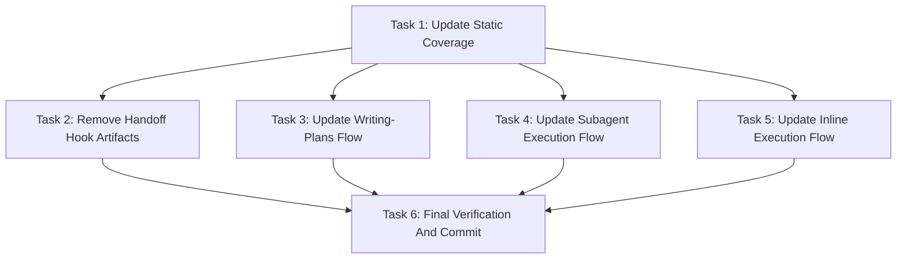

# Simple Power Flow Updates Implementation Plan

> **For agentic workers:** REQUIRED SUB-SKILL: Use `simplepower:subagent-driven-development` wave-by-wave. Dispatch one wave at a time, respect review boundaries, and keep task tracking in checkbox (`- [ ]`) syntax. Use `simplepower:executing-plans` only when subagents are unavailable or the user explicitly requests inline execution.

**Goal:** Remove the obsolete implementation handoff JSON flow, add task-level plan progress tracking, route known user choices through Codex multiple-choice questions, and make the coordinator create one final commit after verified implementation.

**Architecture:** Plan files become the only implementation handoff artifact. `writing-plans` defines the generated `## Task Progress` table and post-plan multiple-choice question, while `subagent-driven-development` and `executing-plans` update the plan table during execution. Static tests enforce removal of JSON hook state and the new coordinator-only final commit rule.

**Tech Stack:** Markdown skill docs, shell static tests, Codex `request_user_input`/`askUserQuestion` style question tool, git verification.

---

## Task Progress

| Task | Implemented | Reviewed | Fixed | Verified |
|------|-------------|----------|-------|----------|
| Task 1: Update Static Coverage | [x] | [x] | N/A | [x] |
| Task 2: Remove Handoff Hook Artifacts | [x] | [x] | N/A | [x] |
| Task 3: Update Writing-Plans Flow | [x] | [x] | N/A | [x] |
| Task 4: Update Subagent Execution Flow | [x] | [x] | N/A | [x] |
| Task 5: Update Inline Execution Flow | [x] | [x] | N/A | [x] |
| Task 6: Final Verification And Commit | [x] | [x] | N/A | [x] |

## Dependency Graph



Task 1 defines the required static assertions and is the only planned bottleneck
before implementation tasks. Tasks 2, 3, 4, and 5 can run in parallel after Task
1 because their write scopes do not overlap. Task 6 is the final verification
and commit bottleneck.

## Dispatch Plan

### Wave 1

**Tasks:** Task 1
**Dependencies satisfied:** none
**Parallel:** no
**Review boundary:** Static test assertions are updated and fail for the missing implementation.
**Reviewer/fixer dispatch:** `mini-high reviewer/fixer`, because this is a localized shell test update.
**Verification before downstream work:** `bash tests/simplepower-static/run-tests.sh` fails until Tasks 2-5 implement the required strings and removals.

### Wave 2

**Tasks:** Tasks 2, 3, 4, 5
**Dependencies satisfied:** Task 1
**Parallel:** yes, all four tasks own different files.
**Review boundary:** Handoff artifacts are removed, skill docs describe the new question/progress/commit flow, and prompt templates preserve worker no-commit behavior.
**Reviewer/fixer dispatch:** `main-equivalent reviewer/fixer`, because this wave changes workflow semantics across planning and execution skills.
**Verification before downstream work:** `bash tests/simplepower-static/run-tests.sh` passes.

### Wave 3

**Tasks:** Task 6
**Dependencies satisfied:** Tasks 2, 3, 4, 5
**Parallel:** no
**Review boundary:** All verification commands pass, task progress table is complete, and one final commit is created.
**Reviewer/fixer dispatch:** `mini-high reviewer/fixer`, because this task performs final checks and commit only.
**Verification before completion:** `bash tests/simplepower-static/run-tests.sh`, `bash tests/skill-triggering/run-all.sh`, `bash tests/explicit-skill-requests/run-all.sh`, `bash tests/codex-plugin-sync/test-sync-to-codex-plugin.sh`, `npm --prefix tests/brainstorm-server test`, and `git diff --check` all pass before the commit.

## Write Scope Table

| Task | Write scope | Files | Parallel | Risk | Review boundary | Reviewer/fixer dispatch | Verification |
|------|-------------|-------|----------|------|-----------------|--------------------------|--------------|
| Task 1 | Static test assertions only | `tests/simplepower-static/run-tests.sh` | No | Medium: assertions define the target behavior for the rest of the work | Static tests fail for missing new flow and obsolete handoff references | `mini-high reviewer/fixer` | `bash tests/simplepower-static/run-tests.sh` fails before Tasks 2-5 and passes after Tasks 2-5 |
| Task 2 | Remove obsolete hook artifacts and Codex hook docs | `skills/writing-plans/scripts/implementation-handoff-hook`, `tests/implementation-handoff/run-tests.sh`, `docs/README.codex.md` | Yes, with Tasks 3-5 | Medium: removes a documented hook flow | No active docs or tests reference the removed JSON hook | `main-equivalent reviewer/fixer` | `bash tests/simplepower-static/run-tests.sh` |
| Task 3 | Planning skill workflow text | `skills/writing-plans/SKILL.md`, `skills/writing-plans/plan-document-reviewer-prompt.md` | Yes, with Tasks 2, 4, 5 | High: changes generated plan structure and post-plan user choice behavior | Writing-plans requires task progress and removes handoff JSON | `main-equivalent reviewer/fixer` | `bash tests/simplepower-static/run-tests.sh` |
| Task 4 | Subagent execution workflow and prompts | `skills/subagent-driven-development/SKILL.md`, `skills/subagent-driven-development/implementer-prompt.md`, `skills/subagent-driven-development/wave-reviewer-fixer-prompt.md` | Yes, with Tasks 2, 3, 5 | High: changes wave lifecycle semantics and final commit behavior | SDD has task progress update checkpoints and coordinator-only final commit | `main-equivalent reviewer/fixer` | `bash tests/simplepower-static/run-tests.sh` |
| Task 5 | Inline execution workflow | `skills/executing-plans/SKILL.md` | Yes, with Tasks 2-4 | Medium: aligns inline fallback with SDD semantics | Executing-plans has task progress updates and final commit behavior | `main-equivalent reviewer/fixer` | `bash tests/simplepower-static/run-tests.sh` |
| Task 6 | Final verification, plan progress update, and final commit | `docs/simplepower/plans/2026-05-02-simplepower-flow-updates.md` plus git commit metadata | No | Medium: creates the final repository commit | All checks pass, the plan progress table is complete, and a single final commit exists | `mini-high reviewer/fixer` | Full verification command list exits 0 |

## Task 1: Update Static Coverage

**Depends on:** none
**Write scope:** `tests/simplepower-static/run-tests.sh`
**Parallel:** No.
**Risk:** Medium, because these assertions define the target behavior for the rest of the implementation.
**Review boundary:** Static tests fail for the new required assertions before Tasks 2-5.
**Reviewer/fixer dispatch:** `mini-high reviewer/fixer`, because the change is localized to one shell test file.
**Verification:** `bash tests/simplepower-static/run-tests.sh`; expected before Tasks 2-5: fail on obsolete hook assertions and missing new flow strings. Expected after Tasks 2-5: pass.

**Files:**
- Modify: `tests/simplepower-static/run-tests.sh`

- [ ] **Step 1: Remove old positive handoff assertions**

  In `tests/simplepower-static/run-tests.sh`, remove these lines:

  ```bash
  require_executable "skills/writing-plans/scripts/implementation-handoff-hook" "implementation handoff hook script is executable"
  require_contains "docs/README.codex.md" "implementation-handoff-hook" "Codex install guide documents the implementation handoff hook"
  require_contains "docs/README.codex.md" "~/.codex/hooks.json" "Codex install guide documents config-layer hook setup"
  require_contains "docs/README.codex.md" ".simplepower/implementation-handoff.json" "Codex install guide documents the handoff artifact"
  ```

  Also remove these lines from the writing-plans assertion block:

  ```bash
  require_contains "skills/writing-plans/SKILL.md" "Clear context and start implementation" "writing-plans asks about clear-context implementation handoff"
  require_contains "skills/writing-plans/SKILL.md" ".simplepower/implementation-handoff.json" "writing-plans names the implementation handoff artifact"
  require_contains "skills/writing-plans/SKILL.md" "implementation-handoff-hook" "writing-plans references the handoff hook script"
  require_contains "skills/writing-plans/SKILL.md" 'model="gpt-5.4-mini"' "writing-plans records the sp-impl worker model in the handoff"
  require_contains "skills/writing-plans/SKILL.md" "hookSpecificOutput.additionalContext" "writing-plans documents hook context injection"
  ```

- [ ] **Step 2: Add handoff removal assertions**

  In the same file, after the `docs/README.codex.md` namespace/path assertions, add:

  ```bash
  require_not_contains "docs/README.codex.md" "implementation-handoff-hook" "Codex install guide no longer documents the implementation handoff hook"
  require_not_contains "docs/README.codex.md" ".simplepower/implementation-handoff.json" "Codex install guide no longer documents the handoff artifact"
  ```

  In the writing-plans block, after the `docs/simplepower/plans` assertion, add:

  ```bash
  require_not_contains "skills/writing-plans/SKILL.md" ".simplepower/implementation-handoff.json" "writing-plans no longer names the implementation handoff artifact"
  require_not_contains "skills/writing-plans/SKILL.md" "implementation-handoff-hook" "writing-plans no longer references the handoff hook script"
  require_not_contains "skills/writing-plans/SKILL.md" "hookSpecificOutput.additionalContext" "writing-plans no longer documents hook context injection"
  ```

  Near the existing `require_dir_absent` checks for old reviewer prompts, add:

  ```bash
  require_dir_absent "skills/writing-plans/scripts/implementation-handoff-hook" "implementation handoff hook script is absent"
  require_dir_absent "tests/implementation-handoff" "implementation handoff hook tests are absent"
  ```

- [ ] **Step 3: Add new planning flow assertions**

  In the writing-plans assertion block, after the `Write Scope Table` assertion, add:

  ```bash
  require_contains "skills/writing-plans/SKILL.md" "Task Progress" "writing-plans requires a task progress table"
  require_contains "skills/writing-plans/SKILL.md" "askUserQuestion" "writing-plans names the Codex user-question tool"
  require_contains "skills/writing-plans/SKILL.md" "(Recommended)" "writing-plans marks recommended user choices"
  require_contains "skills/writing-plans/SKILL.md" "Start subagent implementation" "writing-plans offers subagent implementation after planning"
  require_contains "skills/writing-plans/plan-document-reviewer-prompt.md" "Task Progress" "plan reviewer checks task progress table coverage"
  ```

- [ ] **Step 4: Add new execution flow assertions**

  In the subagent-driven-development assertion block, after the `fork_context=false` assertion, add:

  ```bash
  require_contains "skills/subagent-driven-development/SKILL.md" "Task Progress" "SDD updates the task progress table"
  require_contains "skills/subagent-driven-development/SKILL.md" "Implemented" "SDD records implemented task state"
  require_contains "skills/subagent-driven-development/SKILL.md" "Reviewed" "SDD records reviewed task state"
  require_contains "skills/subagent-driven-development/SKILL.md" "Fixed" "SDD records fixed task state"
  require_contains "skills/subagent-driven-development/SKILL.md" "Verified" "SDD records verified task state"
  require_contains "skills/subagent-driven-development/SKILL.md" "one final commit" "SDD requires one final coordinator commit"
  require_contains "skills/subagent-driven-development/implementer-prompt.md" "Do not edit the plan progress table" "implementer prompt prevents worker progress-table writes"
  require_contains "skills/subagent-driven-development/wave-reviewer-fixer-prompt.md" "Task review outcomes" "reviewer/fixer prompt reports task outcomes"
  ```

  After the subagent-driven-development assertion block, add an executing-plans block:

  ```bash
  require_contains "skills/executing-plans/SKILL.md" "Task Progress" "executing-plans updates the task progress table"
  require_contains "skills/executing-plans/SKILL.md" "Implemented" "executing-plans records implemented task state"
  require_contains "skills/executing-plans/SKILL.md" "Reviewed" "executing-plans records reviewed task state"
  require_contains "skills/executing-plans/SKILL.md" "Fixed" "executing-plans records fixed task state"
  require_contains "skills/executing-plans/SKILL.md" "Verified" "executing-plans records verified task state"
  require_contains "skills/executing-plans/SKILL.md" "one final commit" "executing-plans requires one final coordinator commit"
  ```

- [ ] **Step 5: Replace the final commit static check**

  Replace:

  ```bash
  require_no_active_match "git commit" "active planning and wave workflows do not require per-task commits" skills/writing-plans skills/subagent-driven-development
  ```

  with:

  ```bash
  require_contains "skills/writing-plans/SKILL.md" "No per-task commits" "writing-plans still forbids per-task commits"
  require_contains "skills/subagent-driven-development/SKILL.md" "No per-task commits" "SDD still forbids per-task commits"
  require_contains "skills/executing-plans/SKILL.md" "No per-task commits" "executing-plans still forbids per-task commits"
  ```

- [ ] **Step 6: Run static tests and confirm expected failure**

  Run:

  ```bash
  bash tests/simplepower-static/run-tests.sh
  ```

  Expected before Tasks 2-5: FAIL. The failures mention missing new strings, still-present handoff docs/artifacts, or both.

- [ ] **Step 7: Report completion**

  State: changed files, verification command, expected failing result, and any concerns. Do not commit from this task.

## Task 2: Remove Handoff Hook Artifacts

**Depends on:** Task 1
**Write scope:** `skills/writing-plans/scripts/implementation-handoff-hook`, `tests/implementation-handoff/run-tests.sh`, `docs/README.codex.md`
**Parallel:** Yes, with Tasks 3, 4, and 5.
**Risk:** Medium, because this removes a documented hook flow and its focused tests.
**Review boundary:** No active docs or tests reference `.simplepower/implementation-handoff.json` or `implementation-handoff-hook`.
**Reviewer/fixer dispatch:** `main-equivalent reviewer/fixer`, because this removes user-facing setup documentation.
**Verification:** `bash tests/simplepower-static/run-tests.sh`; expected after Tasks 2-5: pass.

**Files:**
- Delete: `skills/writing-plans/scripts/implementation-handoff-hook`
- Delete: `tests/implementation-handoff/run-tests.sh`
- Modify: `docs/README.codex.md`

- [ ] **Step 1: Delete the hook script**

  Delete:

  ```text
  skills/writing-plans/scripts/implementation-handoff-hook
  ```

- [ ] **Step 2: Delete the hook test directory**

  Delete:

  ```text
  tests/implementation-handoff/run-tests.sh
  ```

  If the directory becomes empty, remove `tests/implementation-handoff/`.

- [ ] **Step 3: Replace the Codex install guide hook section**

  In `docs/README.codex.md`, replace the `## Implementation Handoff Hook` section with:

  ```markdown
  ## Implementation Flow

  Simple Power keeps generated implementation plans in
  `docs/simplepower/plans/`. After `simplepower:writing-plans` saves a plan,
  it asks whether to start subagent implementation, start inline
  implementation, or stop after planning.

  Use `simplepower:subagent-driven-development` for wave-based implementation
  when subagents are available. Use `simplepower:executing-plans` for inline
  execution when subagents are unavailable or when you explicitly want the work
  done in the current agent.
  ```

  Keep the surrounding `## Usage` section unchanged.

- [ ] **Step 4: Run focused static verification**

  Run:

  ```bash
  bash tests/simplepower-static/run-tests.sh
  ```

  Expected before Tasks 3-5: FAIL only for missing skill flow strings owned by Tasks 3-5. It must not fail because docs or files still reference the removed handoff hook.

- [ ] **Step 5: Report completion**

  State: changed/deleted files, verification command and result, and any concerns. Do not commit from this task.

## Task 3: Update Writing-Plans Flow

**Depends on:** Task 1
**Write scope:** `skills/writing-plans/SKILL.md`, `skills/writing-plans/plan-document-reviewer-prompt.md`
**Parallel:** Yes, with Tasks 2, 4, and 5.
**Risk:** High, because this changes the plan format and post-plan handoff behavior.
**Review boundary:** `writing-plans` requires `## Task Progress`, uses the multiple-choice post-plan question, removes handoff JSON, and keeps final commit behavior coordinator-only.
**Reviewer/fixer dispatch:** `main-equivalent reviewer/fixer`, because this is workflow-shaping text.
**Verification:** `bash tests/simplepower-static/run-tests.sh`; expected after Tasks 2-5: pass.

**Files:**
- Modify: `skills/writing-plans/SKILL.md`
- Modify: `skills/writing-plans/plan-document-reviewer-prompt.md`

- [ ] **Step 1: Update the overview and task granularity**

  In `skills/writing-plans/SKILL.md`, keep the overview's `No per-task commits` wording. Replace the bite-sized example:

  ```markdown
  - "Report completion without committing" - step
  ```

  with:

  ```markdown
  - "Report completion without committing from this task" - worker step
  - "Create one final commit after all verification passes" - final coordinator step
  ```

- [ ] **Step 2: Add Task Progress to required plan sections**

  After the plan header template and before `## Dependency Graph`, insert:

  ````markdown
  ## Task Progress

  Every plan MUST include this section before the dependency graph:

  ```markdown
  ## Task Progress

  | Task | Implemented | Reviewed | Fixed | Verified |
  |------|-------------|----------|-------|----------|
  | Task 1: [Task Name] | [ ] | [ ] | N/A | [ ] |
  | Task 2: [Task Name] | [ ] | [ ] | N/A | [ ] |
  ```

  Include one row for every task. `Fixed` starts as `N/A`; execution changes it
  to `[x]` only when review finds issues and a fix pass is applied.
  ````
- [ ] **Step 3: Update the task template final step**

  In the Task Structure template, replace:

  ```markdown
  - [ ] **Step 5: Report completion without committing**

  State: `Do not commit. Report the changed files, the verification commands you ran, the results, and any remaining risks or follow-up dependencies.`
  ```

  with:

  ```markdown
  - [ ] **Step 5: Report task completion without committing**

  State: `Do not commit from this task. Report the changed files, the verification commands you ran, the results, and any remaining risks or follow-up dependencies. The coordinator will update Task Progress and create one final commit after all tasks pass final verification.`
  ```

- [ ] **Step 4: Update the self-review checklist**

  Replace self-review item 6:

  ```markdown
  **6. No commit steps:** Search the plan for commit commands, per-task commits, or any other commit requirement. Replace them with the reporting step if found.
  ```

  with:

  ```markdown
  **6. Commit policy:** Search the plan for per-task commit commands or worker commit instructions. Replace them with task reporting steps if found. The only allowed commit instruction is the final coordinator commit after all task progress is complete and final verification passes.
  ```

  Add a new checklist item before `Placeholder scan`:

  ```markdown
  **7. Task Progress coverage:** Confirm the `## Task Progress` table has one row for every task and that every `Fixed` cell starts as `N/A`.
  ```

  Renumber the following items so the list remains sequential.

- [ ] **Step 5: Replace clear-context handoff with multiple-choice implementation question**

  Delete the entire `## Clear-Context Implementation Handoff` section and the current `## Execution Handoff` section.

  Replace them with:

  ```markdown
  ## Execution Handoff

  After saving and self-reviewing the plan, ask the user which implementation
  path to use.

  Use Codex's built-in `askUserQuestion` or `request_user_input` style tool
  when it is available. Ask one multiple-choice question with these options:

  1. **Start subagent implementation (Recommended)** - Use
     `simplepower:subagent-driven-development` wave-by-wave.
  2. **Start inline implementation** - Use `simplepower:executing-plans` in
     the current agent.
  3. **Stop after plan** - Leave the plan ready for later.

  If the tool is unavailable in the active mode, ask the same three options in
  plain text and continue from the user's answer.

  Do not write `.simplepower/implementation-handoff.json`. The saved plan file
  is the handoff artifact.

  If the user chooses subagent implementation, invoke
  `simplepower:subagent-driven-development` and execute the plan wave-by-wave.
  If the user chooses inline implementation, invoke `simplepower:executing-plans`.
  If the user chooses to stop after the plan, report the plan path and stop.
  ```

- [ ] **Step 6: Update the plan reviewer prompt**

  In `skills/writing-plans/plan-document-reviewer-prompt.md`, add `Task Progress`
  to the review table. Insert this row after `Completeness`:

  ```markdown
  | Task Progress | `## Task Progress` exists, has one row per task, and all `Fixed` cells start as `N/A` |
  ```

  Update the `Commit Policy` row to:

  ```markdown
  | Commit Policy | No per-task commits or worker commits; only the final coordinator commit is allowed after final verification |
  ```

- [ ] **Step 7: Run focused static verification**

  Run:

  ```bash
  bash tests/simplepower-static/run-tests.sh
  ```

  Expected before Tasks 2, 4, and 5 are complete: FAIL only for missing strings owned by Tasks 2, 4, and 5. It must not fail on writing-plans or plan reviewer assertions.

- [ ] **Step 8: Report completion**

  State: changed files, verification command and result, and any concerns. Do not commit from this task.

## Task 4: Update Subagent Execution Flow

**Depends on:** Task 1
**Write scope:** `skills/subagent-driven-development/SKILL.md`, `skills/subagent-driven-development/implementer-prompt.md`, `skills/subagent-driven-development/wave-reviewer-fixer-prompt.md`
**Parallel:** Yes, with Tasks 2, 3, and 5.
**Risk:** High, because this changes wave lifecycle semantics and final commit behavior.
**Review boundary:** SDD updates Task Progress after each task lifecycle event, prompts keep workers away from progress-table edits, and final commit is coordinator-only.
**Reviewer/fixer dispatch:** `main-equivalent reviewer/fixer`, because this is workflow-shaping text.
**Verification:** `bash tests/simplepower-static/run-tests.sh`; expected after Tasks 2-5: pass.

**Files:**
- Modify: `skills/subagent-driven-development/SKILL.md`
- Modify: `skills/subagent-driven-development/implementer-prompt.md`
- Modify: `skills/subagent-driven-development/wave-reviewer-fixer-prompt.md`

- [ ] **Step 1: Update SDD core principle and process graph**

  In `skills/subagent-driven-development/SKILL.md`, update the core principle to:

  ```markdown
  **Core principle:** wave-by-wave execution with explicit dependency checks,
  bounded write scopes, task-level `Task Progress` updates, one review/fix pass
  per wave, verification before downstream work, and one final coordinator
  commit after all tasks are complete.
  ```

  In the process graph, add these nodes after validating changed files and review:

  ```dot
      "Mark accepted worker tasks Implemented in plan Task Progress" [shape=box];
      "Mark reviewed tasks Reviewed and Fixed or N/A in plan Task Progress" [shape=box];
      "Mark verified tasks Verified in plan Task Progress" [shape=box];
      "Run final verification and create one final coordinator commit" [shape=box style=filled fillcolor=lightgreen];
  ```

  Wire them so accepted worker tasks are marked `Implemented` before reviewer/fixer dispatch, reviewed tasks are marked after reviewer/fixer lifecycle cleanup, and verified tasks are marked after wave verification passes. Replace the final node `Run final verification and prepare diff handoff report` with `Run final verification and create one final coordinator commit`.

- [ ] **Step 2: Add Task Progress rules**

  After `## Wave Rules`, add:

  ```markdown
  ## Task Progress Updates

  The coordinator updates the plan's `## Task Progress` table. Workers and
  reviewer/fixers report task outcomes, but the coordinator edits the table to
  avoid parallel write conflicts.

  For each task:

  1. Mark `Implemented` as `[x]` after the `sp-impl` worker returns and the
     coordinator accepts the changed files as in-scope.
  2. Mark `Reviewed` as `[x]` after the wave reviewer/fixer reviews that task.
  3. Keep `Fixed` as `N/A` when review finds no issues for that task. Change
     `Fixed` to `[x]` only when the reviewer/fixer applies a fix for that task.
  4. Mark `Verified` as `[x]` after the task's required verification or the
     containing wave verification passes.

  Do not start a downstream wave until every task in the current wave has
  `Implemented`, `Reviewed`, and `Verified` checked, with `Fixed` set to either
  `[x]` or `N/A`.
  ```

- [ ] **Step 3: Update final handoff to final commit**

  Replace the `Final handoff` section with:

  ```markdown
  **Final completion:**
  - Run the final verification commands from the plan and any repo-required
    checks.
  - Confirm every task in `## Task Progress` has `Implemented`, `Reviewed`, and
    `Verified` checked, with `Fixed` set to either `[x]` or `N/A`.
  - Inspect `git status --short` and summarize the final diff.
  - Create one final commit for the completed change set.
  - Report the final verification results, commit SHA, changed files, and
    confirmation that all finished subagents were closed or have an active
    written reason to remain open.
  - Do not merge, push, or create a PR unless the user separately asks.

  No per-task commits. Workers and reviewer/fixers must not commit.
  ```

- [ ] **Step 4: Update red flags**

  In the Red Flags list, keep `Require per-task commits` and add:

  ```markdown
  - Let a worker or reviewer/fixer update the plan progress table unless that
    edit is explicitly assigned
  - Start a downstream wave before current-wave tasks are marked `Implemented`,
    `Reviewed`, `Fixed` or `N/A`, and `Verified` in `Task Progress`
  - Skip the final coordinator commit after all verification passes
  - Merge, push, or create a PR without a separate user request
  ```

- [ ] **Step 5: Update the implementer prompt**

  In `skills/subagent-driven-development/implementer-prompt.md`, add this rule to `## Working Rules`:

  ```markdown
  - Do not edit the plan progress table; the coordinator updates Task Progress
  ```

  In `## Report Format`, add:

  ```markdown
  - Whether the task is ready for the coordinator to mark `Implemented`
  ```

  Keep both existing `Do not commit` lines.

- [ ] **Step 6: Update the wave reviewer/fixer prompt**

  In `skills/subagent-driven-development/wave-reviewer-fixer-prompt.md`, add this rule to `## Important Rules`:

  ```markdown
  - Do not edit the plan progress table; report task review outcomes for the
    coordinator to apply
  ```

  Add this subsection before `## Report Format`:

  ```markdown
  ## Task review outcomes

  Report one outcome per task in the wave:

  - `Reviewed`: yes or no
  - `Fixed`: `[x]` if you applied fixes for that task, otherwise `N/A`
  - `Ready for verification`: yes or no
  ```

  In `## Report Format`, add:

  ```markdown
  - Task review outcomes
  ```

  Keep the existing `Do not commit` line.

- [ ] **Step 7: Run focused static verification**

  Run:

  ```bash
  bash tests/simplepower-static/run-tests.sh
  ```

  Expected before Tasks 2, 3, and 5 are complete: FAIL only for missing strings owned by Tasks 2, 3, and 5. It must not fail on SDD or prompt assertions.

- [ ] **Step 8: Report completion**

  State: changed files, verification command and result, and any concerns. Do not commit from this task.

## Task 5: Update Inline Execution Flow

**Depends on:** Task 1
**Write scope:** `skills/executing-plans/SKILL.md`
**Parallel:** Yes, with Tasks 2, 3, and 4.
**Risk:** Medium, because this aligns the inline fallback with the new SDD lifecycle.
**Review boundary:** Executing-plans updates Task Progress and performs one final coordinator commit after verification.
**Reviewer/fixer dispatch:** `main-equivalent reviewer/fixer`, because this changes execution semantics.
**Verification:** `bash tests/simplepower-static/run-tests.sh`; expected after Tasks 2-5: pass.

**Files:**
- Modify: `skills/executing-plans/SKILL.md`

- [ ] **Step 1: Update overview**

  Replace:

  ```markdown
  Load the plan, review it critically, execute each task in order, verify at the planned checkpoints, and hand back the diff plus any open concerns.
  ```

  with:

  ```markdown
  Load the plan, review it critically, execute each task in order, update the
  plan's `Task Progress` table at each lifecycle checkpoint, verify at the
  planned checkpoints, and create one final coordinator commit after all
  verification passes.
  ```

  Replace:

  ```markdown
  **This is the Codex inline fallback:** keep the work in the current workspace, use explicit wave checkpoints, and finish with final verification and a concise diff handoff. Do not invent a commit, merge, or PR flow.
  ```

  with:

  ```markdown
  **This is the Codex inline fallback:** keep the work in the current workspace,
  use explicit wave checkpoints, update `Task Progress`, and finish with final
  verification plus one final coordinator commit. Do not merge, push, or create
  a PR unless the user separately asks.
  ```

- [ ] **Step 2: Add Task Progress lifecycle to task execution**

  Replace Wave 2's per-task list:

  ```markdown
  For each task:
  1. Mark as in_progress
  2. Follow each step exactly (plan has bite-sized steps)
  3. Run verifications as specified
  4. Mark as completed
  ```

  with:

  ```markdown
  For each task:
  1. Mark the task as in_progress in TodoWrite
  2. Follow each step exactly (plan has bite-sized steps)
  3. After implementation changes are accepted, mark that task `Implemented`
     as `[x]` in the plan's `Task Progress` table
  4. Review the task explicitly; for low-risk tasks, the main agent's
     self-review counts as the review event
  5. Mark that task `Reviewed` as `[x]`
  6. Keep `Fixed` as `N/A` if review found no issues; change `Fixed` to `[x]`
     only if a fix pass was applied for that task
  7. Run verifications as specified
  8. Mark that task `Verified` as `[x]` after verification passes
  9. Mark the task as completed in TodoWrite
  ```

- [ ] **Step 3: Replace final handoff with final commit**

  Replace `## Wave 4: Final Handoff` with:

  ```markdown
  ## Wave 4: Final Verification And Commit

  After all tasks are complete:
  1. Run the final verification commands from the plan and any repo-required
     checks
  2. Confirm every task in `## Task Progress` has `Implemented`, `Reviewed`,
     and `Verified` checked, with `Fixed` set to either `[x]` or `N/A`
  3. Inspect `git status --short` and summarize the final diff
  4. Create one final commit for the completed change set
  5. Report changed files, verification results, commit SHA, and any residual
     concerns
  ```

  In `## Remember`, replace:

  ```markdown
  - Finish with verification and a diff handoff, not an automatic branch workflow
  ```

  with:

  ```markdown
  - Finish with verification and one final commit, not merge/push/PR automation
  - No per-task commits
  ```

- [ ] **Step 4: Run focused static verification**

  Run:

  ```bash
  bash tests/simplepower-static/run-tests.sh
  ```

  Expected before Tasks 2-4 are complete: FAIL only for missing strings owned by Tasks 2-4. It must not fail on executing-plans assertions.

- [ ] **Step 5: Report completion**

  State: changed files, verification command and result, and any concerns. Do not commit from this task.

## Task 6: Final Verification And Commit

**Depends on:** Tasks 2, 3, 4, 5
**Write scope:** `docs/simplepower/plans/2026-05-02-simplepower-flow-updates.md`, git commit metadata
**Parallel:** No.
**Risk:** Medium, because this task validates the full workflow update and creates the final commit.
**Review boundary:** All checks pass, task progress table is complete, and a single final commit exists.
**Reviewer/fixer dispatch:** `mini-high reviewer/fixer`, because this is verification and commit only.
**Verification:** Full command list below exits 0.

**Files:**
- Modify: `docs/simplepower/plans/2026-05-02-simplepower-flow-updates.md`
- Commit: repository git metadata

- [ ] **Step 1: Run static checks**

  Run:

  ```bash
  bash tests/simplepower-static/run-tests.sh
  ```

  Expected: PASS with `All Simple Power static checks passed.`

- [ ] **Step 2: Run skill-triggering checks**

  Run:

  ```bash
  bash tests/skill-triggering/run-all.sh
  ```

  Expected: exits 0.

- [ ] **Step 3: Run explicit skill request checks**

  Run:

  ```bash
  bash tests/explicit-skill-requests/run-all.sh
  ```

  Expected: exits 0.

- [ ] **Step 4: Run Codex plugin sync checks**

  Run:

  ```bash
  bash tests/codex-plugin-sync/test-sync-to-codex-plugin.sh
  ```

  Expected: exits 0.

- [ ] **Step 5: Run brainstorm server tests**

  Run:

  ```bash
  npm --prefix tests/brainstorm-server test
  ```

  Expected: exits 0.

- [ ] **Step 6: Check whitespace**

  Run:

  ```bash
  git diff --check
  ```

  Expected: exits 0 with no output.

- [ ] **Step 7: Inspect final status**

  Run:

  ```bash
  git status --short
  ```

  Expected: shows the approved spec, this plan, and the implementation files from Tasks 1-5. It must not show `.simplepower/implementation-handoff.json`.

- [ ] **Step 8: Complete the plan progress table**

  In this plan's `## Task Progress` table, update each row so `Implemented`,
  `Reviewed`, and `Verified` are `[x]`. Keep `Fixed` as `N/A` for tasks that
  did not require review fixes; use `[x]` only for tasks that did require a fix
  pass.

- [ ] **Step 9: Create one final commit**

  Run:

  ```bash
  git add docs/simplepower/specs/2026-05-02-simplepower-flow-updates-design.md \
    docs/simplepower/plans/2026-05-02-simplepower-flow-updates.md \
    docs/README.codex.md \
    skills/writing-plans/SKILL.md \
    skills/writing-plans/plan-document-reviewer-prompt.md \
    skills/subagent-driven-development/SKILL.md \
    skills/subagent-driven-development/implementer-prompt.md \
    skills/subagent-driven-development/wave-reviewer-fixer-prompt.md \
    skills/executing-plans/SKILL.md \
    tests/simplepower-static/run-tests.sh
  ```

  If `git status --short` shows the deleted hook files, include them with:

  ```bash
  git add -u skills/writing-plans/scripts tests/implementation-handoff
  ```

  Commit:

  ```bash
  git commit -m "feat: update Simple Power implementation flow"
  ```

  Expected: commit succeeds and prints a new commit SHA.

- [ ] **Step 10: Report completion**

  Report: commit SHA, verification commands and results, changed files summary,
  and any remaining risks. Do not merge, push, or create a PR unless the user
  separately asks.
