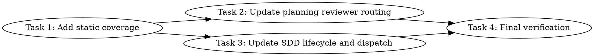

# Subagent Lifecycle And Reviewer Routing Implementation Plan

> **For agentic workers:** REQUIRED SUB-SKILL: Use `simplepower:subagent-driven-development` wave-by-wave. Dispatch one wave at a time, respect review boundaries, and keep task tracking in checkbox (`- [ ]`) syntax. Use `simplepower:executing-plans` only when subagents are unavailable or the user explicitly requests inline execution.

**Goal:** Add explicit subagent close lifecycle checkpoints and planning-time reviewer/fixer routing recommendations to the Simple Power workflow.

**Architecture:** Keep the changes inside the existing Markdown skill system and static checks. Update planning guidance to require a reviewer/fixer dispatch recommendation for each wave, then update subagent execution guidance to consume that recommendation and close completed subagents by default after their reports are consumed.

**Tech Stack:** Markdown skills, Bash static test harness.

---

## Dependency Graph



Tasks 2 and 3 can run in parallel after Task 1 because they modify separate
skill directories. Task 4 is the integration verification bottleneck.

## Dispatch Plan

### Wave 1

**Tasks:** Task 1
**Dependencies satisfied:** none
**Parallel:** no
**Review boundary:** static test assertions are added and fail before skill text changes
**Reviewer/fixer dispatch:** `mini-high reviewer/fixer` because this wave only changes localized Bash assertions
**Verification:** `bash tests/simplepower-static/run-tests.sh`
Expected before implementation: fails on the newly required lifecycle and reviewer-routing assertions.

### Wave 2

**Tasks:** Task 2, Task 3
**Dependencies satisfied:** Task 1
**Parallel:** yes, because Task 2 owns `skills/writing-plans/**` and Task 3 owns `skills/subagent-driven-development/**`
**Review boundary:** planning guidance and execution guidance both satisfy the new static assertions
**Reviewer/fixer dispatch:** `main-equivalent reviewer/fixer` because this wave changes behavior-shaping skill instructions
**Verification:** `bash tests/simplepower-static/run-tests.sh`
Expected after implementation: exits 0.

### Wave 3

**Tasks:** Task 4
**Dependencies satisfied:** Tasks 2 and 3
**Parallel:** no
**Review boundary:** no unintended repo-wide regressions remain
**Reviewer/fixer dispatch:** `mini-high reviewer/fixer` because this wave only runs verification and reports results
**Verification:** `bash tests/simplepower-static/run-tests.sh`, `npm --prefix tests/brainstorm-server test`, `bash tests/skill-triggering/run-all.sh`, `bash tests/explicit-skill-requests/run-all.sh`, `bash tests/codex-plugin-sync/test-sync-to-codex-plugin.sh`, `git diff --check`
Expected: all commands exit 0.

## Write Scope Table

| Task | Write scope | Files | Parallel | Risk | Review boundary | Reviewer/fixer dispatch | Verification |
|------|-------------|-------|----------|------|-----------------|--------------------------|--------------|
| Task 1 | Static assertions only | `tests/simplepower-static/run-tests.sh` | No | Low: localized test expectations | Assertions fail until Tasks 2 and 3 implement the expected wording | `mini-high reviewer/fixer` | `bash tests/simplepower-static/run-tests.sh` fails on new assertions before implementation |
| Task 2 | Planning skill and plan reviewer prompt | `skills/writing-plans/SKILL.md`, `skills/writing-plans/plan-document-reviewer-prompt.md` | Yes, with Task 3 | Medium: wording shapes future plans | Planning text requires per-wave reviewer/fixer dispatch recommendations and plan review checks them | `main-equivalent reviewer/fixer` | `bash tests/simplepower-static/run-tests.sh` |
| Task 3 | Subagent execution skill and reviewer prompt | `skills/subagent-driven-development/SKILL.md`, `skills/subagent-driven-development/wave-reviewer-fixer-prompt.md` | Yes, with Task 2 | Medium: wording shapes live subagent orchestration | Execution text requires lifecycle checkpoints and follows planned reviewer/fixer routing | `main-equivalent reviewer/fixer` | `bash tests/simplepower-static/run-tests.sh` |
| Task 4 | Verification only | no writes expected | No | Low: command-only validation | Full local verification passes and remaining diff is known | `mini-high reviewer/fixer` | Full command list in Wave 3 |

## Task 1: Add Static Coverage

**Depends on:** none
**Write scope:** `tests/simplepower-static/run-tests.sh`
**Parallel:** No.
**Risk:** Low, because this only adds string assertions to an existing static test file.
**Review boundary:** The new assertions cover lifecycle checkpoints and reviewer/fixer routing before implementation begins.
**Verification:** `bash tests/simplepower-static/run-tests.sh` should fail before Tasks 2 and 3, because the expected new phrases are not present yet.

**Files:**
- Modify: `tests/simplepower-static/run-tests.sh`

- [ ] **Step 1: Add failing assertions for planning reviewer routing**

  In `tests/simplepower-static/run-tests.sh`, immediately after the existing
  `skills/writing-plans/SKILL.md` assertions, add:

  ```bash
  require_contains "skills/writing-plans/SKILL.md" "reviewer/fixer dispatch recommendation" "writing-plans requires reviewer/fixer dispatch recommendations"
  require_contains "skills/writing-plans/SKILL.md" "mini-high reviewer/fixer" "writing-plans documents the mini-high reviewer tier"
  require_contains "skills/writing-plans/SKILL.md" "main-equivalent reviewer/fixer" "writing-plans documents the main-equivalent reviewer tier"
  require_contains "skills/writing-plans/plan-document-reviewer-prompt.md" "Reviewer/Fixer Routing" "plan reviewer checks reviewer/fixer routing"
  ```

- [ ] **Step 2: Add failing assertions for subagent lifecycle cleanup**

  In `tests/simplepower-static/run-tests.sh`, immediately after the existing
  `skills/subagent-driven-development/SKILL.md` assertions, add:

  ```bash
  require_contains "skills/subagent-driven-development/SKILL.md" "subagent lifecycle checkpoint" "SDD requires subagent lifecycle checkpoints"
  require_contains "skills/subagent-driven-development/SKILL.md" "Default lifecycle decision: close" "SDD defaults finished subagents to close"
  require_contains "skills/subagent-driven-development/SKILL.md" "written reason" "SDD requires written reasons for keeping finished subagents open"
  require_contains "skills/subagent-driven-development/SKILL.md" "reviewer/fixer dispatch recommendation" "SDD follows planned reviewer/fixer dispatch recommendations"
  ```

- [ ] **Step 3: Run static tests and confirm the expected failure**

  Run:

  ```bash
  bash tests/simplepower-static/run-tests.sh
  ```

  Expected: non-zero exit because the new lifecycle and reviewer-routing strings
  are not present in the skill files yet.

- [ ] **Step 4: Report completion without committing**

  State: `Do not commit. Report the changed files, the verification commands you ran, the results, and any remaining risks or follow-up dependencies.`

## Task 2: Update Planning Reviewer Routing

**Depends on:** Task 1
**Write scope:** `skills/writing-plans/SKILL.md`, `skills/writing-plans/plan-document-reviewer-prompt.md`
**Parallel:** Yes, with Task 3.
**Risk:** Medium, because this changes future planning behavior and plan review criteria.
**Review boundary:** Plans require reviewer/fixer dispatch recommendations for every wave, and the plan reviewer checks that routing against wave risk.
**Verification:** `bash tests/simplepower-static/run-tests.sh` should pass after Task 3 is also complete.

**Files:**
- Modify: `skills/writing-plans/SKILL.md`
- Modify: `skills/writing-plans/plan-document-reviewer-prompt.md`

- [ ] **Step 1: Update the overview**

  In `skills/writing-plans/SKILL.md`, update the overview paragraph so it says
  plans include reviewer/fixer dispatch recommendations:

  ```markdown
  Write comprehensive implementation plans assuming the engineer has zero context for our codebase and questionable taste. Document everything they need to know: which files to touch for each task, code, testing, docs they might need to check, how to test it. Give them the whole plan as bite-sized tasks organized as a dependency graph with explicit dispatch waves, review boundaries, and reviewer/fixer dispatch recommendations. DRY. YAGNI. TDD where relevant. No per-task commits.
  ```

- [ ] **Step 2: Extend Dispatch Plan requirements**

  In the `## Dispatch Plan` section of `skills/writing-plans/SKILL.md`, add this
  bullet to the list of required wave details:

  ```markdown
  - The reviewer/fixer dispatch recommendation for the wave
  ```

  After the paragraph about serialization, add:

  ```markdown
  Every wave must include one reviewer/fixer dispatch recommendation chosen by
  the main agent during planning:

  - `mini-high reviewer/fixer`: use a worker/general subagent with
    `model="gpt-5.4-mini"` and `reasoning_effort="high"` for obvious,
    localized, low-risk waves.
  - `main-equivalent reviewer/fixer`: use the main agent's agent type, model,
    and reasoning effort for broad, risky, ambiguous, cross-cutting, or
    behavior-shaping waves.

  If the planned tier is `mini-high reviewer/fixer` but the actual diff becomes
  riskier than expected, the main agent may escalate the wave review to
  `main-equivalent reviewer/fixer` during execution.
  ```

- [ ] **Step 3: Extend the Write Scope Table columns**

  In `skills/writing-plans/SKILL.md`, add this required column after `Review boundary`:

  ```markdown
  - Reviewer/fixer dispatch
  ```

- [ ] **Step 4: Extend the task template**

  In the task template in `skills/writing-plans/SKILL.md`, add this field after
  `**Review boundary:**`:

  ```markdown
  **Reviewer/fixer dispatch:** `mini-high reviewer/fixer` | `main-equivalent reviewer/fixer`, with a one-sentence reason.
  ```

- [ ] **Step 5: Extend self-review**

  In the `## Self-Review` section, add this checklist item after parallel
  safety and renumber the later items:

  ```markdown
  **4. Reviewer/fixer routing:** Does every wave include a reviewer/fixer dispatch recommendation? Is `mini-high reviewer/fixer` limited to obvious, localized, low-risk waves, and `main-equivalent reviewer/fixer` used for broad, risky, ambiguous, cross-cutting, or behavior-shaping waves?
  ```

- [ ] **Step 6: Update execution handoff text**

  In `skills/writing-plans/SKILL.md`, update the handoff sentence so it includes
  the reviewer routing requirement:

  ```markdown
  **"Plan complete and saved to `docs/simplepower/plans/<filename>.md`. Recommended handoff: use `simplepower:subagent-driven-development` wave-by-wave. Start with Wave 1, dispatch only tasks whose dependencies are satisfied and write scopes do not collide, use the wave's reviewer/fixer dispatch recommendation at the review boundary, then proceed to the next wave only after review and verification pass."**
  ```

- [ ] **Step 7: Update the plan reviewer prompt**

  In `skills/writing-plans/plan-document-reviewer-prompt.md`, add this row to
  the `What to Check` table:

  ```markdown
  | Reviewer/Fixer Routing | Every wave has a reviewer/fixer dispatch recommendation, and the selected tier matches the wave risk |
  ```

  In the approval calibration paragraph, include reviewer routing in the serious
  gaps list:

  ```markdown
  missing verification, missing reviewer/fixer routing, commit policy violations,
  ```

- [ ] **Step 8: Run focused static verification**

  Run:

  ```bash
  bash tests/simplepower-static/run-tests.sh
  ```

  Expected: exits 0 after Task 3 is complete. If Task 3 is still in progress,
  failures should be limited to `skills/subagent-driven-development/SKILL.md`
  lifecycle assertions.

- [ ] **Step 9: Report completion without committing**

  State: `Do not commit. Report the changed files, the verification commands you ran, the results, and any remaining risks or follow-up dependencies.`

## Task 3: Update SDD Lifecycle And Reviewer Dispatch

**Depends on:** Task 1
**Write scope:** `skills/subagent-driven-development/SKILL.md`, `skills/subagent-driven-development/wave-reviewer-fixer-prompt.md`
**Parallel:** Yes, with Task 2.
**Risk:** Medium, because this changes live subagent orchestration instructions.
**Review boundary:** SDD requires lifecycle checkpoints after every final subagent result and follows the plan's reviewer/fixer dispatch recommendation.
**Verification:** `bash tests/simplepower-static/run-tests.sh` should pass after Task 2 is also complete.

**Files:**
- Modify: `skills/subagent-driven-development/SKILL.md`
- Modify: `skills/subagent-driven-development/wave-reviewer-fixer-prompt.md`

- [ ] **Step 1: Update the core principle**

  In `skills/subagent-driven-development/SKILL.md`, replace the core principle
  sentence with:

  ```markdown
  **Core principle:** wave-by-wave execution with explicit dependency checks,
  bounded write scopes, one review/fix pass per wave, and subagent lifecycle
  checkpoints after final results are consumed.
  ```

- [ ] **Step 2: Update the process graph nodes**

  In the process graph in `skills/subagent-driven-development/SKILL.md`, add
  these nodes:

  ```dot
      "Run subagent lifecycle checkpoint for each worker" [shape=box];
      "Dispatch one wave reviewer/fixer using the plan's recommendation" [shape=box];
      "Run subagent lifecycle checkpoint for reviewer/fixer" [shape=box];
  ```

  Replace the current reviewer dispatch node:

  ```dot
      "Dispatch one wave reviewer/fixer on the actual wave diff" [shape=box];
  ```

  with the new planned dispatch node.

- [ ] **Step 3: Update the process graph edges**

  In the same graph, route worker completion through lifecycle cleanup:

  ```dot
      "Wait for all workers to finish" -> "Run subagent lifecycle checkpoint for each worker";
      "Run subagent lifecycle checkpoint for each worker" -> "Validate changed files against write scopes";
  ```

  Route review completion through lifecycle cleanup:

  ```dot
      "Any out-of-scope edit or missing required file?" -> "Dispatch one wave reviewer/fixer using the plan's recommendation" [label="no"];
      "Dispatch one wave reviewer/fixer using the plan's recommendation" -> "Wave reviewer/fixer inspects diff, fixes in-scope issues, reports";
      "Wave reviewer/fixer inspects diff, fixes in-scope issues, reports" -> "Run subagent lifecycle checkpoint for reviewer/fixer";
      "Run subagent lifecycle checkpoint for reviewer/fixer" -> "Run wave verification";
  ```

  Remove the old edges that jump directly from worker completion to write-scope
  validation and directly from reviewer/fixer completion to verification.

- [ ] **Step 4: Add lifecycle rules**

  In `skills/subagent-driven-development/SKILL.md`, add this section after
  `## Wave Rules`:

  ```markdown
  ## Subagent Lifecycle Checkpoint

  Run a subagent lifecycle checkpoint after every subagent returns a final result,
  including `sp-impl` workers and wave reviewer/fixers.

  **Default lifecycle decision: close.**

  At each checkpoint:

  1. Read and consume the subagent's final report.
  2. Decide whether the subagent is still needed.
  3. Close the subagent by default.
  4. If keeping it open, record a short written reason tied to the current wave
     or task.
  5. Close the subagent as soon as that reason is resolved.

  Do not close a subagent that is still running, blocked, or awaiting input.
  Do not reach final completion while finished subagents remain open without an
  active written reason.
  ```

- [ ] **Step 5: Extend Wave Rules**

  In the numbered wave rules, update the worker and reviewer steps to include
  lifecycle checkpoints:

  ```markdown
  4. Wait for every worker to finish, then run the subagent lifecycle checkpoint
     for each returned worker result.
  6. Dispatch one wave reviewer/fixer for the completed wave, using the actual
     diff and the plan's reviewer/fixer dispatch recommendation.
  7. After the reviewer/fixer returns, run the subagent lifecycle checkpoint for
     that reviewer/fixer result.
  8. Run wave verification after review/fix and lifecycle cleanup, before any
     downstream wave.
  9. Advance to the next wave only after the current wave is verified.
  ```

- [ ] **Step 6: Update model selection**

  In `skills/subagent-driven-development/SKILL.md`, replace the current wave
  reviewer/fixer bullet with:

  ```markdown
  - Wave reviewer/fixer: follow the plan's reviewer/fixer dispatch
    recommendation:
    - `mini-high reviewer/fixer`: use a worker/general subagent with
      `model="gpt-5.4-mini"` and `reasoning_effort="high"`
    - `main-equivalent reviewer/fixer`: use the same agent type, model, and
      reasoning effort as the main agent
  ```

  Then add:

  ```markdown
  If the plan recommends `mini-high reviewer/fixer` but the actual diff is
  broader, riskier, or more ambiguous than the plan predicted, escalate to
  `main-equivalent reviewer/fixer` before dispatching review.
  ```

- [ ] **Step 7: Extend red flags and final handoff**

  In the `Never` list, add:

  ```markdown
  - Skip the subagent lifecycle checkpoint after a final subagent result
  - Leave a finished subagent open without a written reason tied to the current
    wave or task
  - Ignore the plan's reviewer/fixer dispatch recommendation without recording
    why the wave risk changed
  ```

  In `Final handoff`, replace the first sentence with:

  ```markdown
  Report the final verification results, changed files, remaining diff context,
  and confirmation that all finished subagents were closed or have an active
  written reason to remain open for the human.
  ```

- [ ] **Step 8: Update the reviewer/fixer prompt template**

  In `skills/subagent-driven-development/wave-reviewer-fixer-prompt.md`, add
  this section after `## Assigned Write Scope`:

  ```markdown
      ## Dispatch Tier

      [State `mini-high reviewer/fixer` or `main-equivalent reviewer/fixer`, plus
      the reason from the plan or escalation decision.]
  ```

  Add this rule to `## Important Rules`:

  ```markdown
      - Keep review depth appropriate for the assigned dispatch tier, but escalate
        in your report if the wave risk appears higher than the tier assumes
  ```

- [ ] **Step 9: Run focused static verification**

  Run:

  ```bash
  bash tests/simplepower-static/run-tests.sh
  ```

  Expected: exits 0 after Task 2 is complete. If Task 2 is still in progress,
  failures should be limited to `skills/writing-plans/**` reviewer-routing
  assertions.

- [ ] **Step 10: Report completion without committing**

  State: `Do not commit. Report the changed files, the verification commands you ran, the results, and any remaining risks or follow-up dependencies.`

## Task 4: Final Verification

**Depends on:** Task 2, Task 3
**Write scope:** no writes expected
**Parallel:** No.
**Risk:** Low, because this task only verifies the integrated change.
**Review boundary:** All focused and regression checks pass, and the remaining diff is limited to the planned files.
**Verification:** `bash tests/simplepower-static/run-tests.sh`, `npm --prefix tests/brainstorm-server test`, `bash tests/skill-triggering/run-all.sh`, `bash tests/explicit-skill-requests/run-all.sh`, `bash tests/codex-plugin-sync/test-sync-to-codex-plugin.sh`, `git diff --check`

**Files:**
- No writes expected.

- [ ] **Step 1: Run static tests**

  Run:

  ```bash
  bash tests/simplepower-static/run-tests.sh
  ```

  Expected: exits 0.

- [ ] **Step 2: Run brainstorm server tests**

  Run:

  ```bash
  npm --prefix tests/brainstorm-server test
  ```

  Expected: exits 0 with all server tests passing.

- [ ] **Step 3: Run skill trigger tests**

  Run:

  ```bash
  bash tests/skill-triggering/run-all.sh
  ```

  Expected: exits 0.

- [ ] **Step 4: Run explicit skill request tests**

  Run:

  ```bash
  bash tests/explicit-skill-requests/run-all.sh
  ```

  Expected: exits 0.

- [ ] **Step 5: Run Codex plugin sync tests**

  Run:

  ```bash
  bash tests/codex-plugin-sync/test-sync-to-codex-plugin.sh
  ```

  Expected: exits 0.

- [ ] **Step 6: Check whitespace in the diff**

  Run:

  ```bash
  git diff --check
  ```

  Expected: exits 0.

- [ ] **Step 7: Inspect the changed files**

  Run:

  ```bash
  git status --short
  ```

  Expected: changed files are limited to:

  ```text
  skills/writing-plans/SKILL.md
  skills/writing-plans/plan-document-reviewer-prompt.md
  skills/subagent-driven-development/SKILL.md
  skills/subagent-driven-development/wave-reviewer-fixer-prompt.md
  tests/simplepower-static/run-tests.sh
  ```

- [ ] **Step 8: Report completion without committing**

  State: `Do not commit. Report the changed files, the verification commands you ran, the results, and any remaining risks or follow-up dependencies.`
