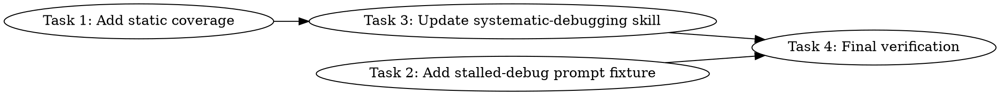

# Systematic Debugging Parallel Investigation Implementation Plan

> **For agentic workers:** REQUIRED SUB-SKILL: Use `simplepower:subagent-driven-development` wave-by-wave. Dispatch one wave at a time, respect review boundaries, and keep task tracking in checkbox (`- [ ]`) syntax. Use `simplepower:executing-plans` only when subagents are unavailable or the user explicitly requests inline execution.

**Goal:** Add bounded parallel investigation escalation to `simplepower:systematic-debugging` for hard bugs where initial Phase 1 root-cause work stalls.

**Architecture:** Keep the change inside the Markdown skill and existing Bash fixture tests. Add static assertions for the new escalation rules, add a stalled-debugging prompt fixture, then update `skills/systematic-debugging/SKILL.md` with a Phase 1 escalation section that dispatches investigation-only agents by distinct angle and model difficulty.

**Tech Stack:** Markdown skills, Bash static test harness, Bash prompt fixture harness.

---

## Dependency Graph



Tasks 1 and 2 can run in parallel because they write separate test harness files.
Task 3 depends on Task 1 because the static assertions define the required skill
phrases. Task 4 is the final verification bottleneck.

## Dispatch Plan

### Wave 1

**Tasks:** Task 1, Task 2
**Dependencies satisfied:** none
**Parallel:** yes, because Task 1 owns `tests/simplepower-static/run-tests.sh` and Task 2 owns `tests/skill-triggering/**`
**Review boundary:** static and fixture tests describe the new behavior before the skill text changes
**Reviewer/fixer dispatch:** `mini-high reviewer/fixer` because this wave only changes localized Bash assertions and prompt fixtures
**Verification:** `bash tests/simplepower-static/run-tests.sh`, `bash tests/skill-triggering/run-all.sh`
Expected after Task 1 but before Task 3: static checks fail on new `skills/systematic-debugging/SKILL.md` assertions.
Expected after Task 2: skill-triggering fixture checks exit 0.

### Wave 2

**Tasks:** Task 3
**Dependencies satisfied:** Task 1
**Parallel:** no
**Review boundary:** `simplepower:systematic-debugging` documents the escalation point, brief, angle selection, model routing, investigation-agent constraints, output contract, synthesis, and guardrails
**Reviewer/fixer dispatch:** `main-equivalent reviewer/fixer` because this wave changes behavior-shaping debugging instructions and subagent routing rules
**Verification:** `bash tests/simplepower-static/run-tests.sh`, `bash tests/skill-triggering/run-all.sh`
Expected: both commands exit 0.

### Wave 3

**Tasks:** Task 4
**Dependencies satisfied:** Tasks 2 and 3
**Parallel:** no
**Review boundary:** no unintended regressions remain in the Simple Power test suite
**Reviewer/fixer dispatch:** `mini-high reviewer/fixer` because this wave is command-only verification
**Verification:** `bash tests/simplepower-static/run-tests.sh`, `bash tests/skill-triggering/run-all.sh`, `bash tests/explicit-skill-requests/run-all.sh`, `git diff --check`
Expected: all commands exit 0.

## Write Scope Table

| Task | Write scope | Files | Parallel | Risk | Review boundary | Reviewer/fixer dispatch | Verification |
|------|-------------|-------|----------|------|-----------------|--------------------------|--------------|
| Task 1 | Static checks only | `tests/simplepower-static/run-tests.sh` | Yes, with Task 2 | Low: localized string assertions | New assertions fail until Task 3 implements the required wording | `mini-high reviewer/fixer` | `bash tests/simplepower-static/run-tests.sh` fails before Task 3 and passes after Task 3 |
| Task 2 | Skill-triggering fixture only | `tests/skill-triggering/run-test.sh`, `tests/skill-triggering/run-all.sh`, `tests/skill-triggering/prompts/systematic-debugging-stalled.txt` | Yes, with Task 1 | Low: fixture-only coverage | Stalled-debug fixture is included in run-all and passes | `mini-high reviewer/fixer` | `bash tests/skill-triggering/run-all.sh` exits 0 |
| Task 3 | Debugging skill instructions | `skills/systematic-debugging/SKILL.md` | No | Medium: changes live debugging workflow and subagent dispatch rules | Static checks and prompt fixture checks pass | `main-equivalent reviewer/fixer` | `bash tests/simplepower-static/run-tests.sh`, `bash tests/skill-triggering/run-all.sh` exit 0 |
| Task 4 | Verification only | no writes expected | No | Low: command-only validation | Final verification passes and remaining diff is known | `mini-high reviewer/fixer` | Full command list in Wave 3 exits 0 |

## Task 1: Add Static Coverage

**Depends on:** none
**Write scope:** `tests/simplepower-static/run-tests.sh`
**Parallel:** Yes, with Task 2.
**Risk:** Low, because this only adds string assertions to an existing static test file.
**Review boundary:** The new assertions cover the parallel investigation escalation before skill text changes.
**Reviewer/fixer dispatch:** `mini-high reviewer/fixer`, because this is a localized Bash assertion change.
**Verification:** `bash tests/simplepower-static/run-tests.sh` should fail before Task 3 because the new `systematic-debugging` phrases are not present yet.

**Files:**
- Modify: `tests/simplepower-static/run-tests.sh`

- [ ] **Step 1: Add static assertions for the debugging escalation**

  In `tests/simplepower-static/run-tests.sh`, immediately after the existing
  `skills/subagent-driven-development/SKILL.md` assertions and before the
  `skills/subagent-driven-development/implementer-prompt.md` assertion, add:

  ```bash
  require_contains "skills/systematic-debugging/SKILL.md" "parallel investigation escalation" "systematic-debugging documents parallel investigation escalation"
  require_contains "skills/systematic-debugging/SKILL.md" "only after initial Phase 1 investigation stalls" "systematic-debugging prevents immediate agent dispatch"
  require_contains "skills/systematic-debugging/SKILL.md" "do not dispatch agents" "systematic-debugging skips escalation when root cause is plausible"
  require_contains "skills/systematic-debugging/SKILL.md" "investigation brief" "systematic-debugging requires a brief before agent dispatch"
  require_contains "skills/systematic-debugging/SKILL.md" "initial Phase 1" "systematic-debugging requires initial Phase 1 work before escalation"
  require_contains "skills/systematic-debugging/SKILL.md" "at most six investigation agents" "systematic-debugging caps investigation agents"
  require_contains "skills/systematic-debugging/SKILL.md" 'model="gpt-5.4-mini"' "systematic-debugging routes narrow angles to mini"
  require_contains "skills/systematic-debugging/SKILL.md" 'model="gpt-5.4"' "systematic-debugging routes difficult angles to full model"
  require_contains "skills/systematic-debugging/SKILL.md" 'reasoning_effort="high"' "systematic-debugging requires high effort investigation agents"
  require_contains "skills/systematic-debugging/SKILL.md" "fork_context=false" "systematic-debugging defaults investigation agents to narrow context"
  require_contains "skills/systematic-debugging/SKILL.md" ".codex-debug/<instance-id>/" "systematic-debugging defines the temporary diagnostics directory"
  require_contains "skills/systematic-debugging/SKILL.md" "do not implement fixes" "systematic-debugging forbids fixes by investigation agents"
  require_contains "skills/systematic-debugging/SKILL.md" "Assigned angle" "systematic-debugging requires structured investigation-agent output"
  require_contains "skills/systematic-debugging/SKILL.md" "synthesize agent reports" "systematic-debugging requires synthesis before implementation"
  ```

- [ ] **Step 2: Run static tests and confirm the expected failure**

  Run:

  ```bash
  bash tests/simplepower-static/run-tests.sh
  ```

  Expected: non-zero exit because the new `systematic-debugging` assertions fail
  before Task 3 updates the skill text.

- [ ] **Step 3: Report completion without committing**

  State: `Do not commit. Report the changed files, the verification commands you ran, the results, and any remaining risks or follow-up dependencies.`

## Task 2: Add Stalled-Debug Prompt Fixture

**Depends on:** none
**Write scope:** `tests/skill-triggering/run-test.sh`, `tests/skill-triggering/run-all.sh`, `tests/skill-triggering/prompts/systematic-debugging-stalled.txt`
**Parallel:** Yes, with Task 1.
**Risk:** Low, because this only adds a prompt fixture and checks that the fixture preserves the stalled Phase 1 scenario.
**Review boundary:** The skill-triggering harness includes the stalled-debug prompt and verifies the prompt contains the escalation preconditions.
**Reviewer/fixer dispatch:** `mini-high reviewer/fixer`, because this is localized fixture coverage.
**Verification:** `bash tests/skill-triggering/run-all.sh` should exit 0.

**Files:**
- Modify: `tests/skill-triggering/run-test.sh`
- Modify: `tests/skill-triggering/run-all.sh`
- Create: `tests/skill-triggering/prompts/systematic-debugging-stalled.txt`

- [ ] **Step 1: Add the stalled-debug prompt fixture**

  Create `tests/skill-triggering/prompts/systematic-debugging-stalled.txt` with:

  ```text
  I am debugging a flaky integration failure and initial Phase 1 did not find the root cause yet.

  What I already did:
  - I read the full stack trace.
  - I reproduced the failure with `npm test -- auth-flow.test.ts` three times.
  - I checked recent changes in the auth service and session store.
  - I traced the obvious request data flow from API handler to session lookup.
  - I still cannot identify a plausible root cause.

  Please use simplepower:systematic-debugging and escalate with investigation agents if the skill says the stall criteria are met.
  ```

- [ ] **Step 2: Teach the fixture checker about the stalled prompt**

  In `tests/skill-triggering/run-test.sh`, inside the
  `systematic-debugging)` case, replace the single assertion block:

  ```bash
      systematic-debugging)
          require_contains "TypeError: Cannot read property 'value' of undefined" "debugging prompt preserves the failing stack trace"
          ;;
  ```

  with:

  ```bash
      systematic-debugging)
          case "$(basename "$PROMPT_FILE")" in
              systematic-debugging-stalled.txt)
                  require_contains "initial Phase 1 did not find the root cause yet" "stalled debugging prompt preserves the Phase 1 stall"
                  require_contains "I read the full stack trace" "stalled debugging prompt says the stack trace was read"
                  require_contains "I reproduced the failure" "stalled debugging prompt says the failure was reproduced"
                  require_contains "I checked recent changes" "stalled debugging prompt says recent changes were checked"
                  require_contains "I still cannot identify a plausible root cause" "stalled debugging prompt preserves the escalation condition"
                  require_contains "investigation agents" "stalled debugging prompt requests agent escalation only after stall criteria"
                  ;;
              *)
                  require_contains "TypeError: Cannot read property 'value' of undefined" "debugging prompt preserves the failing stack trace"
                  ;;
          esac
          ;;
  ```

- [ ] **Step 3: Include the stalled prompt in run-all**

  In `tests/skill-triggering/run-all.sh`, after the existing loop over
  `SKILLS`, add this explicit stalled-debug fixture check before the summary:

  ```bash
  echo "Checking: systematic-debugging-stalled"
  if "$SCRIPT_DIR/run-test.sh" "systematic-debugging" "$PROMPTS_DIR/systematic-debugging-stalled.txt"; then
      passed=$((passed + 1))
  else
      failed=$((failed + 1))
  fi
  echo ""
  ```

- [ ] **Step 4: Run the fixture verification**

  Run:

  ```bash
  bash tests/skill-triggering/run-all.sh
  ```

  Expected: exits 0 and reports one additional passed fixture for
  `systematic-debugging-stalled`.

- [ ] **Step 5: Report completion without committing**

  State: `Do not commit. Report the changed files, the verification commands you ran, the results, and any remaining risks or follow-up dependencies.`

## Task 3: Update Systematic Debugging Skill

**Depends on:** Task 1
**Write scope:** `skills/systematic-debugging/SKILL.md`
**Parallel:** No.
**Risk:** Medium, because this changes live debugging workflow instructions and adds conditional subagent dispatch.
**Review boundary:** The skill preserves root-cause-first debugging and adds a bounded investigation-only escalation after initial Phase 1 stalls.
**Reviewer/fixer dispatch:** `main-equivalent reviewer/fixer`, because this is behavior-shaping workflow text.
**Verification:** `bash tests/simplepower-static/run-tests.sh`, `bash tests/skill-triggering/run-all.sh` should both exit 0.

**Files:**
- Modify: `skills/systematic-debugging/SKILL.md`

- [ ] **Step 1: Add the escalation section after Phase 1**

  In `skills/systematic-debugging/SKILL.md`, insert this section immediately
  after the Phase 1 `Trace Data Flow` subsection and before `### Phase 2:
  Pattern Analysis`:

  ```markdown
  ### Phase 1 Escalation: Parallel Investigation

  Use parallel investigation escalation only after initial Phase 1 investigation
  stalls. This is an evidence-gathering escalation inside Phase 1, not permission
  to skip root-cause investigation.

  Before dispatching investigation agents, the main agent must have attempted the
  relevant initial Phase 1 steps:

  - Read the full error output or stack trace
  - Reproduced the failure, or documented why reproduction is not reliable yet
  - Checked recent changes or relevant diffs
  - Identified relevant files, commands, components, or system boundaries
  - Traced obvious data flow when the failure appears deep in the call stack

  If those steps reveal a plausible root cause, do not dispatch agents. Continue
  with Phase 2 and Phase 3.

  If root cause is still unknown, write an investigation brief before spawning
  agents. Include:

  - Symptom and observed behavior
  - Reproduction command or steps
  - Relevant error output, stack trace, or failing assertions
  - Known facts
  - Causes already ruled out
  - Relevant files, modules, components, or recent changes
  - Constraints: do not implement fixes and do not edit existing repo files
  - Expected output format

  Choose distinct investigation angles and dispatch at most six investigation
  agents, one per angle. Do not duplicate angles. Common angles:

  - Error-message and stack-trace interpretation
  - Recent-change regression analysis
  - Similar working pattern comparison
  - Data-flow or backward-tracing origin search
  - Async, timing, race, or flaky-test investigation
  - Configuration, environment, dependency, or boundary propagation analysis
  - Architecture-level coupling or invariant analysis

  Route each angle by predicted difficulty:

  - Localized, concrete, narrow angles with clear files or commands:
    `model="gpt-5.4-mini"`, `reasoning_effort="high"`,
    `fork_context=false`
  - Ambiguous, cross-cutting, architecture-level, async/timing, deep data-flow,
    or multi-component boundary angles: `model="gpt-5.4"`,
    `reasoning_effort="high"`, `fork_context=false`

  Investigation agents may read files, search, run existing tests or scripts,
  inspect read-only git history, and create temporary diagnostic scripts,
  fixtures, notes, logs, or outputs under `.codex-debug/<instance-id>/` by
  default. If a different temp location is necessary, the agent must explain why
  in its final report.

  Investigation agents must not edit, overwrite, format, rename, or delete
  existing repo files. They must not apply fixes, prepare patches as their
  primary output, or make broad refactors. If a diagnostic command unexpectedly
  modifies existing repo files, the agent must stop and report what changed.

  Each investigation agent returns:

  - Assigned angle
  - Files, commands, and artifacts inspected
  - Evidence found
  - Root-cause hypothesis, if any
  - Confidence level and why
  - Causes ruled out
  - Recommended next minimal diagnostic test
  - Temporary artifacts created
  - Confirmation that no existing repo files were intentionally modified

  After agents return, consume each report and close the agent unless there is a
  written reason to keep it open. Then synthesize agent reports into one of:

  - A supported root-cause hypothesis, followed by Phase 3 minimal testing
  - A next diagnostic test needed before forming the hypothesis
  - A documented "still unknown" state with what has been ruled out and whether
    to gather more evidence or discuss architecture-level concerns with the user

  Do not choose a root cause by vote count alone. If reports disagree, run the
  smallest diagnostic test that distinguishes between competing hypotheses.
  Do not proceed to implementation until synthesis supports a root-cause
  hypothesis.
  ```

- [ ] **Step 2: Add escalation red flags**

  In the `## Red Flags - STOP and Follow Process` list, after
  `Proposing solutions before tracing data flow`, add:

  ```markdown
  - Dispatching investigation agents before initial Phase 1 work
  - Dispatching more than six investigation agents
  - Giving multiple agents the same investigation angle
  - Asking investigation agents to implement fixes
  - Proceeding to fixes before you synthesize agent reports
  ```

- [ ] **Step 3: Update the quick reference**

  In the quick reference table, replace the Phase 1 row:

  ```markdown
  | **1. Root Cause** | Read errors, reproduce, check changes, gather evidence | Understand WHAT and WHY |
  ```

  with:

  ```markdown
  | **1. Root Cause** | Read errors, reproduce, check changes, gather evidence, escalate to bounded parallel investigation only if initial Phase 1 stalls | Understand WHAT and WHY |
  ```

- [ ] **Step 4: Run focused verification**

  Run:

  ```bash
  bash tests/simplepower-static/run-tests.sh
  bash tests/skill-triggering/run-all.sh
  ```

  Expected: both commands exit 0.

- [ ] **Step 5: Report completion without committing**

  State: `Do not commit. Report the changed files, the verification commands you ran, the results, and any remaining risks or follow-up dependencies.`

## Task 4: Final Verification

**Depends on:** Task 2, Task 3
**Write scope:** no writes expected
**Parallel:** No.
**Risk:** Low, because this task only verifies the completed change set.
**Review boundary:** All focused and regression verification passes.
**Reviewer/fixer dispatch:** `mini-high reviewer/fixer`, because this is command-only validation.
**Verification:** `bash tests/simplepower-static/run-tests.sh`, `bash tests/skill-triggering/run-all.sh`, `bash tests/explicit-skill-requests/run-all.sh`, `git diff --check` should all exit 0.

**Files:**
- No file modifications expected.

- [ ] **Step 1: Run static checks**

  Run:

  ```bash
  bash tests/simplepower-static/run-tests.sh
  ```

  Expected: exits 0.

- [ ] **Step 2: Run skill-triggering fixture checks**

  Run:

  ```bash
  bash tests/skill-triggering/run-all.sh
  ```

  Expected: exits 0.

- [ ] **Step 3: Run explicit skill request fixture checks**

  Run:

  ```bash
  bash tests/explicit-skill-requests/run-all.sh
  ```

  Expected: exits 0.

- [ ] **Step 4: Check diff whitespace**

  Run:

  ```bash
  git diff --check
  ```

  Expected: exits 0 with no whitespace errors.

- [ ] **Step 5: Report completion without committing**

  State: `Do not commit. Report the changed files, the verification commands you ran, the results, and any remaining risks or follow-up dependencies.`
