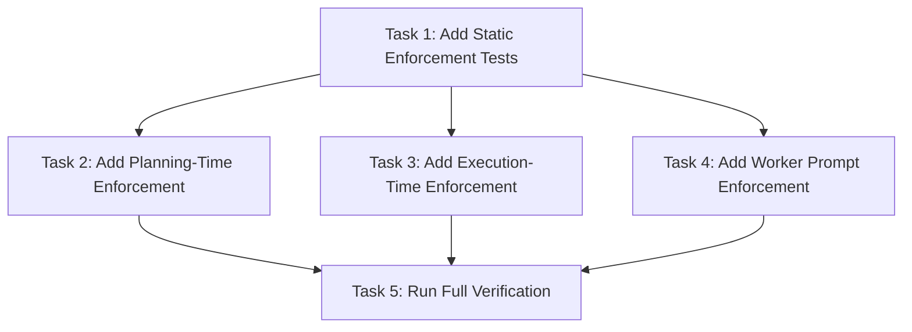

# Simple Power Approved Path Enforcement Implementation Plan

> **For agentic workers:** REQUIRED SUB-SKILL: Use `simplepower:subagent-driven-development` wave-by-wave. Dispatch one wave at a time, respect review boundaries, and keep task tracking in checkbox (`- [ ]`) syntax. Use `simplepower:executing-plans` only when subagents are unavailable or the user explicitly requests inline execution.

**Goal:** Add explicit approved-path enforcement across Simple Power specs, plans, execution skills, subagent prompts, and static tests.

**Architecture:** This is a prompt-and-harness documentation change. Add one named contract, `Approved Path Enforcement`, then repeat it at authoring, planning, reviewing, execution, worker, reviewer, fixer, and test boundaries so no stage can substitute easier work without fresh user approval.

**Tech Stack:** Markdown skill files, Markdown subagent prompt templates, Bash static assertions in `tests/simplepower-static/run-tests.sh`.

**Model Allocation:** FAST/BEST tiers are assigned per task and wave below. FAST defaults to `SIMPLEPOWER_FAST_MODEL` (`gpt-5.4-mini-high` when unset). BEST defaults to `SIMPLEPOWER_BEST_MODEL` (`gpt-5.5-high` when unset). Fixers always use BEST.

**Commit Policy:** Workers, reviewers, and fixers must not commit. The coordinator commits the spec and plan after plan self-review, commits each verified wave after `Task Progress` is updated, and creates a final commit only if final verification leaves uncommitted changes.

---

## Task Progress

| Task | Implemented | Reviewed | Fixed | Verified |
|------|-------------|----------|-------|----------|
| Task 1: Add Static Enforcement Tests | [x] | [x] | N/A | [x] |
| Task 2: Add Planning-Time Enforcement | [x] | [x] | N/A | [x] |
| Task 3: Add Execution-Time Enforcement | [x] | [x] | N/A | [x] |
| Task 4: Add Worker Prompt Enforcement | [x] | [x] | N/A | [x] |
| Task 5: Run Full Verification | [x] | [x] | N/A | [x] |

## Model Allocation

| Stage | Execution role | Model tier | Resolved default model and effort | Reason |
|-------|----------------|------------|-----------------------------------|--------|
| Task 1 implementation | `sp-impl-reviewer` | BEST | `model="gpt-5.5"`, `reasoning_effort="high"` | Test harness wording defines behavior-shaping acceptance gates. |
| Task 1 fixer | `fixer` | BEST | `model="gpt-5.5"`, `reasoning_effort="high"` | Every fixer stage uses BEST. |
| Task 2 implementation | `sp-impl-reviewer` | BEST | `model="gpt-5.5"`, `reasoning_effort="high"` | Planning and brainstorming instructions shape future workflow behavior. |
| Task 2 fixer | `fixer` | BEST | `model="gpt-5.5"`, `reasoning_effort="high"` | Every fixer stage uses BEST. |
| Task 3 implementation | `sp-impl-reviewer` | BEST | `model="gpt-5.5"`, `reasoning_effort="high"` | Execution rules are cross-cutting and high-impact. |
| Task 3 fixer | `fixer` | BEST | `model="gpt-5.5"`, `reasoning_effort="high"` | Every fixer stage uses BEST. |
| Task 4 implementation | `sp-impl-reviewer` | BEST | `model="gpt-5.5"`, `reasoning_effort="high"` | Worker prompts directly constrain subagent behavior. |
| Task 4 fixer | `fixer` | BEST | `model="gpt-5.5"`, `reasoning_effort="high"` | Every fixer stage uses BEST. |
| Task 5 implementation | `sp-impl-reviewer` | BEST | `model="gpt-5.5"`, `reasoning_effort="high"` | Final verification covers the full harness and static test suite. |
| Task 5 fixer | `fixer` | BEST | `model="gpt-5.5"`, `reasoning_effort="high"` | Every fixer stage uses BEST. |

## Dependency Graph



Tasks 2, 3, and 4 may run in parallel after Task 1 because their write scopes do not overlap. Task 5 depends on all implementation tasks.

## Dispatch Plan

**Wave 1: Task 1**

- Dependencies satisfied: none.
- Parallel tasks: none.
- Review boundary: static tests for the new contract are added and fail before implementation because the target skill files do not yet contain `Approved Path Enforcement`.
- Implementation role: `sp-impl-reviewer`.
- Review mode: inline reviewer.
- Reviewer role when separate review is used: `reviewer`.
- Fixer policy: BEST-tier `fixer` only when review or verification finds issues requiring edits.
- Model tier: BEST for implementation and any fixer.
- Verification before downstream work: `bash tests/simplepower-static/run-tests.sh` must fail with missing approved-path enforcement assertions.

**Wave 2: Tasks 2, 3, and 4**

- Dependencies satisfied: Task 1.
- Parallel tasks: Tasks 2, 3, and 4 may run together.
- Review boundary: each task updates only its assigned Markdown files, self-reviews for approved spec coverage, and runs focused `rg` checks for the exact phrases it owns.
- Implementation role: `sp-impl-reviewer`.
- Review mode: inline reviewer.
- Reviewer role when separate review is used: `reviewer`.
- Fixer policy: BEST-tier `fixer` only when review or verification finds issues requiring edits.
- Model tier: BEST for implementation and any fixer.
- Verification before downstream work: focused `rg` checks in each task must pass.

**Wave 3: Task 5**

- Dependencies satisfied: Tasks 2, 3, and 4.
- Parallel tasks: none.
- Review boundary: full static suite passes and there are no unauthorized placeholder strings in edited files.
- Implementation role: `sp-impl-reviewer`.
- Review mode: inline reviewer.
- Reviewer role when separate review is used: `reviewer`.
- Fixer policy: BEST-tier `fixer` only when review or verification finds issues requiring edits.
- Model tier: BEST for implementation and any fixer.
- Verification before downstream work: `bash tests/simplepower-static/run-tests.sh` passes.

## Write Scope Table

| Task | Write scope | Files | Parallel | Risk | Review boundary | Execution role | Model tier | Review mode | Fixer policy | Verification |
|------|-------------|-------|----------|------|-----------------|----------------|------------|-------------|--------------|--------------|
| Task 1 | Static tests only | `tests/simplepower-static/run-tests.sh` | No | Medium: test wording locks the contract surface | Tests added and initially fail before docs updates | `sp-impl-reviewer` | BEST | inline reviewer | BEST-tier `fixer` only when review or verification finds issues requiring edits | `bash tests/simplepower-static/run-tests.sh` fails with missing enforcement text |
| Task 2 | Planning-time skill docs | `skills/brainstorming/SKILL.md`, `skills/writing-plans/SKILL.md`, `skills/writing-plans/plan-document-reviewer-prompt.md` | Yes, with Tasks 3 and 4 | High: planning instructions shape all future work | Contract appears in brainstorming, writing-plans, and plan reviewer prompt | `sp-impl-reviewer` | BEST | inline reviewer | BEST-tier `fixer` only when review or verification finds issues requiring edits | Focused `rg` checks for `Approved Path Enforcement` and `fresh explicit approval` pass |
| Task 3 | Execution skill docs | `skills/subagent-driven-development/SKILL.md`, `skills/executing-plans/SKILL.md` | Yes, with Tasks 2 and 4 | High: execution gates control whether alternates can proceed | Contract appears in both execution skills and red flags cover substitutions | `sp-impl-reviewer` | BEST | inline reviewer | BEST-tier `fixer` only when review or verification finds issues requiring edits | Focused `rg` checks for execution enforcement phrases pass |
| Task 4 | Subagent prompt templates | `skills/subagent-driven-development/implementer-prompt.md`, `skills/subagent-driven-development/impl-reviewer-prompt.md`, `skills/subagent-driven-development/reviewer-prompt.md`, `skills/subagent-driven-development/fixer-prompt.md` | Yes, with Tasks 2 and 3 | High: worker prompts constrain delegated implementation and review | Workers stop instead of substituting; reviewers flag shortcuts; fixers stay narrow | `sp-impl-reviewer` | BEST | inline reviewer | BEST-tier `fixer` only when review or verification finds issues requiring edits | Focused `rg` checks for `BLOCKED`, `docs-only substitute`, and `stub substitute` pass |
| Task 5 | Verification only, plus fixes if required | All files changed by Tasks 1-4 | No | Medium: integrates all wording and static tests | Full static tests pass and `git status --short` shows only expected files | `sp-impl-reviewer` | BEST | inline reviewer | BEST-tier `fixer` only when review or verification finds issues requiring edits | `bash tests/simplepower-static/run-tests.sh` passes |

## Task 1: Add Static Enforcement Tests

**Depends on:** None
**Write scope:** `tests/simplepower-static/run-tests.sh`
**Parallel:** No.
**Risk:** Medium, because these assertions define the durable enforcement surface.
**Review boundary:** The new assertions are added and fail before implementation updates the target files.
**Execution role:** `sp-impl-reviewer`
**Model tier:** BEST, because this shapes behavior across the harness.
**Review mode:** inline reviewer
**Fixer policy:** BEST-tier `fixer` only when review or verification finds issues requiring edits.
**Verification:** `bash tests/simplepower-static/run-tests.sh` should fail before Tasks 2-4 with at least one missing `Approved Path Enforcement` assertion.

**Files:**
- Modify: `tests/simplepower-static/run-tests.sh`

- [ ] **Step 1: Add static assertions for approved path enforcement**

Add this block after the existing plan reviewer assertions near the current `No worker commits or per-task commits` plan-reviewer check:

```bash
require_contains "skills/brainstorming/SKILL.md" "Approved Path Enforcement" "brainstorming documents approved path enforcement"
require_contains "skills/brainstorming/SKILL.md" "fresh explicit approval" "brainstorming requires fresh approval for alternate paths"
require_contains "skills/brainstorming/SKILL.md" "backup plan" "brainstorming blocks backup plans"
require_contains "skills/brainstorming/SKILL.md" "escape plan" "brainstorming blocks escape plans"

require_contains "skills/writing-plans/SKILL.md" "Approved Path Enforcement" "writing-plans documents approved path enforcement"
require_contains "skills/writing-plans/SKILL.md" "docs-only substitute" "writing-plans blocks docs-only substitutes"
require_contains "skills/writing-plans/SKILL.md" "stub substitute" "writing-plans blocks stub substitutes"
require_contains "skills/writing-plans/SKILL.md" "execution-mode switch" "writing-plans blocks unapproved execution-mode switches"
require_contains "skills/writing-plans/SKILL.md" "fresh explicit approval" "writing-plans requires fresh approval for alternate paths"

require_contains "skills/writing-plans/plan-document-reviewer-prompt.md" "Approved Path Enforcement" "plan reviewer checks approved path enforcement"
require_contains "skills/writing-plans/plan-document-reviewer-prompt.md" "blocking issue" "plan reviewer treats approved path violations as blocking"
require_contains "skills/writing-plans/plan-document-reviewer-prompt.md" "docs-only substitute" "plan reviewer rejects docs-only substitutes"
require_contains "skills/writing-plans/plan-document-reviewer-prompt.md" "stub substitute" "plan reviewer rejects stub substitutes"

require_contains "skills/subagent-driven-development/SKILL.md" "Approved Path Enforcement" "SDD documents approved path enforcement"
require_contains "skills/subagent-driven-development/SKILL.md" "fresh explicit approval" "SDD requires fresh approval for alternate paths"
require_contains "skills/subagent-driven-development/SKILL.md" "backup plan" "SDD blocks backup plans"
require_contains "skills/subagent-driven-development/SKILL.md" "escape plan" "SDD blocks escape plans"
require_contains "skills/subagent-driven-development/SKILL.md" "execution-mode switch" "SDD blocks unapproved execution-mode switches"

require_contains "skills/executing-plans/SKILL.md" "Approved Path Enforcement" "executing-plans documents approved path enforcement"
require_contains "skills/executing-plans/SKILL.md" "fresh explicit approval" "executing-plans requires fresh approval for alternate paths"
require_contains "skills/executing-plans/SKILL.md" "docs-only substitute" "executing-plans blocks docs-only substitutes"
require_contains "skills/executing-plans/SKILL.md" "stub substitute" "executing-plans blocks stub substitutes"

require_contains "skills/subagent-driven-development/implementer-prompt.md" "Approved Path Enforcement" "implementer prompt documents approved path enforcement"
require_contains "skills/subagent-driven-development/implementer-prompt.md" "BLOCKED" "implementer prompt reports blocked substitutions"
require_contains "skills/subagent-driven-development/implementer-prompt.md" "docs-only substitute" "implementer prompt blocks docs-only substitutes"
require_contains "skills/subagent-driven-development/implementer-prompt.md" "stub substitute" "implementer prompt blocks stub substitutes"

require_contains "skills/subagent-driven-development/impl-reviewer-prompt.md" "Approved Path Enforcement" "inline reviewer prompt documents approved path enforcement"
require_contains "skills/subagent-driven-development/impl-reviewer-prompt.md" "BLOCKED" "inline reviewer prompt reports blocked substitutions"
require_contains "skills/subagent-driven-development/impl-reviewer-prompt.md" "docs-only substitute" "inline reviewer prompt blocks docs-only substitutes"
require_contains "skills/subagent-driven-development/impl-reviewer-prompt.md" "stub substitute" "inline reviewer prompt blocks stub substitutes"

require_contains "skills/subagent-driven-development/reviewer-prompt.md" "Approved Path Enforcement" "reviewer prompt documents approved path enforcement"
require_contains "skills/subagent-driven-development/reviewer-prompt.md" "blocking issue" "reviewer prompt flags approved path violations as blocking"
require_contains "skills/subagent-driven-development/reviewer-prompt.md" "docs-only substitute" "reviewer prompt flags docs-only substitutes"
require_contains "skills/subagent-driven-development/reviewer-prompt.md" "stub substitute" "reviewer prompt flags stub substitutes"

require_contains "skills/subagent-driven-development/fixer-prompt.md" "Approved Path Enforcement" "fixer prompt documents approved path enforcement"
require_contains "skills/subagent-driven-development/fixer-prompt.md" "BLOCKED" "fixer prompt reports blocked alternate fixes"
require_contains "skills/subagent-driven-development/fixer-prompt.md" "docs-only substitute" "fixer prompt blocks docs-only substitutes"
require_contains "skills/subagent-driven-development/fixer-prompt.md" "stub substitute" "fixer prompt blocks stub substitutes"
```

- [ ] **Step 2: Run static tests to prove the new assertions fail before implementation**

Run:

```bash
bash tests/simplepower-static/run-tests.sh
```

Expected: FAIL with at least one missing enforcement assertion, such as a line containing `brainstorming documents approved path enforcement`.

- [ ] **Step 3: Self-review the test diff**

Run:

```bash
git diff -- tests/simplepower-static/run-tests.sh
```

Expected: the diff only adds `require_contains` assertions for approved path enforcement and does not weaken or remove existing assertions.

- [ ] **Step 4: Report task completion without committing**

State: `Do not commit from this task. Report the changed file, the failing verification command, the failure text that proves the assertions are active, and any concerns.`

## Task 2: Add Planning-Time Enforcement

**Depends on:** Task 1
**Write scope:** `skills/brainstorming/SKILL.md`, `skills/writing-plans/SKILL.md`, `skills/writing-plans/plan-document-reviewer-prompt.md`
**Parallel:** Yes, with Tasks 3 and 4.
**Risk:** High, because these files define approved spec and plan behavior.
**Review boundary:** Planning-time files contain the named contract, fresh approval rule, and substitution-language review checks.
**Execution role:** `sp-impl-reviewer`
**Model tier:** BEST, because planning instructions are cross-cutting and behavior-shaping.
**Review mode:** inline reviewer
**Fixer policy:** BEST-tier `fixer` only when review or verification finds issues requiring edits.
**Verification:** Focused `rg` checks in Step 5 pass.

**Files:**
- Modify: `skills/brainstorming/SKILL.md`
- Modify: `skills/writing-plans/SKILL.md`
- Modify: `skills/writing-plans/plan-document-reviewer-prompt.md`

- [ ] **Step 1: Add the contract to brainstorming**

In `skills/brainstorming/SKILL.md`, add this section after the hard gate and before `## Anti-Pattern: "This Is Too Simple To Need A Design"`:

```markdown
## Approved Path Enforcement

The approved spec is authoritative. Do not design backup plans, escape plans,
fallback implementations, reduced scope, docs-only substitutes, stub
substitutes, skipped verification, skipped review, execution-mode switches, or
easier alternate paths as authorized work.

If the approved design path may be blocked, unsafe, underspecified, or
mismatched with the codebase, describe the blocker or decision point. Do not
authorize alternate implementation work. Any alternate path requires fresh
explicit approval from the user at the moment the deviation is needed.
```

- [ ] **Step 2: Extend brainstorming spec self-review**

In `skills/brainstorming/SKILL.md`, replace the existing four-item `Spec Self-Review` checklist with this five-item checklist:

```markdown
1. **Placeholder scan:** Any "TBD", "TODO", incomplete sections, or vague requirements? Fix them.
2. **Internal consistency:** Do any sections contradict each other? Does the architecture match the feature descriptions?
3. **Scope check:** Is this focused enough for a single implementation plan, or does it need decomposition?
4. **Ambiguity check:** Could any requirement be interpreted two different ways? If so, pick one and make it explicit.
5. **Approved path enforcement:** Does the spec authorize any backup plan, escape plan, fallback implementation, reduced scope, docs-only substitute, stub substitute, skipped verification, skipped review, execution-mode switch, or easier alternate path? If so, rewrite it as a blocker or decision point that requires fresh explicit approval.
```

- [ ] **Step 3: Add the contract to writing-plans**

In `skills/writing-plans/SKILL.md`, add this section after `## Scope Check` and before `## File Structure`:

```markdown
## Approved Path Enforcement

The approved spec and approved plan are authoritative. No backup plan, escape
plan, fallback implementation, reduced scope, docs-only substitute, stub
substitute, skipped verification, skipped review, execution-mode switch, or
easier alternate path may be used unless the user gives fresh explicit approval
at the moment the deviation is needed.

Plans may describe blockers and decision points, but must not authorize
alternate implementation work. Pre-approved alternates in specs or plans do not
count as execution approval. If the approved path is blocked during execution,
the agent must stop, report the exact mismatch, show current status, and ask
the user before changing approach.
```

- [ ] **Step 4: Extend writing-plans required content and self-review**

In `skills/writing-plans/SKILL.md`, add this bullet to `## No Placeholders` after the worker commit failure bullet:

```markdown
- Backup plans, escape plans, fallback implementations, reduced scope, docs-only substitutes, stub substitutes, skipped verification, skipped review, execution-mode switches, or easier alternate paths that do not stop for fresh explicit user approval
```

Then add this self-review item after current `**9. Type consistency:**`:

```markdown
**10. Approved path enforcement:** Search the plan for substitution language: "backup", "escape", "fallback", "if this is too hard", "skip", "stub for now", "document instead", "defer implementation", "later", and "optional shortcut". Legitimate blocker-reporting text is allowed only when it stops for fresh explicit approval. Remove or rewrite any text that authorizes alternate implementation work, reduced scope, skipped review, skipped verification, docs-only substitutes, stub substitutes, or execution-mode switches.
```

- [ ] **Step 5: Add the plan reviewer check**

In `skills/writing-plans/plan-document-reviewer-prompt.md`, add this row to the `What to Check` table after `Spec Alignment`:

```markdown
    | Approved Path Enforcement | No backup plan, escape plan, fallback implementation, reduced scope, docs-only substitute, stub substitute, skipped verification, skipped review, execution-mode switch, or easier alternate path is authorized without fresh explicit approval |
```

Then replace the calibration paragraph that starts with `Approve unless there are serious gaps` with:

```markdown
    Approve unless there are serious gaps — missing requirements from the spec,
    contradictory steps, placeholder content, invalid graph structure, unsafe
    parallelization, missing verification, missing role and tier routing,
    approved path enforcement violations, commit policy violations, or tasks so
    vague they can't be acted on.

    Any approved path enforcement violation is a blocking issue. Reject plans
    that authorize a backup plan, escape plan, fallback implementation, reduced
    scope, docs-only substitute, stub substitute, skipped verification, skipped
    review, execution-mode switch, or easier alternate path without fresh
    explicit approval.
```

- [ ] **Step 6: Run focused planning-time checks**

Run:

```bash
rg -n "Approved Path Enforcement|fresh explicit approval|backup plan|escape plan" skills/brainstorming/SKILL.md skills/writing-plans/SKILL.md skills/writing-plans/plan-document-reviewer-prompt.md
rg -n "docs-only substitute|stub substitute|execution-mode switch|blocking issue" skills/writing-plans/SKILL.md skills/writing-plans/plan-document-reviewer-prompt.md
```

Expected: both commands return matches in the edited planning-time files.

- [ ] **Step 7: Self-review the planning-time diff**

Run:

```bash
git diff -- skills/brainstorming/SKILL.md skills/writing-plans/SKILL.md skills/writing-plans/plan-document-reviewer-prompt.md
```

Expected: the diff adds approved path enforcement text without removing existing brainstorming gates, plan sections, model allocation rules, checkpoint commit policy, or plan reviewer checks.

- [ ] **Step 8: Report task completion without committing**

State: `Do not commit from this task. Report the changed files, focused checks, results, and any remaining concerns.`

## Task 3: Add Execution-Time Enforcement

**Depends on:** Task 1
**Write scope:** `skills/subagent-driven-development/SKILL.md`, `skills/executing-plans/SKILL.md`
**Parallel:** Yes, with Tasks 2 and 4.
**Risk:** High, because execution instructions determine whether agents can switch paths.
**Review boundary:** Execution skills contain stop-and-ask gates before accepting substituted or incomplete work.
**Execution role:** `sp-impl-reviewer`
**Model tier:** BEST, because execution behavior is cross-cutting and high impact.
**Review mode:** inline reviewer
**Fixer policy:** BEST-tier `fixer` only when review or verification finds issues requiring edits.
**Verification:** Focused `rg` checks in Step 4 pass.

**Files:**
- Modify: `skills/subagent-driven-development/SKILL.md`
- Modify: `skills/executing-plans/SKILL.md`

- [ ] **Step 1: Add approved path enforcement to subagent-driven-development**

In `skills/subagent-driven-development/SKILL.md`, add this section after the core principle paragraph and before `## When to Use`:

```markdown
## Approved Path Enforcement

The approved plan is authoritative. Do not use a backup plan, escape plan,
fallback implementation, reduced scope, docs-only substitute, stub substitute,
skipped verification, skipped review, execution-mode switch, or easier alternate
path unless the user gives fresh explicit approval at the moment the deviation
is needed.

Before dispatch, after worker results, after review or fixer results, before
`Task Progress` updates, before wave verification, and before checkpoint
commits, compare actual work against the approved plan and write scope. If work
is incomplete, substituted, stubbed, docs-only, out of scope, missing required
review, missing required verification, or based on a different execution mode,
do not accept it as progress.

If the approved path is blocked, stop, report the exact mismatch and current
status, and ask the user before changing approach. Diagnostic investigation is
allowed; alternate implementation work is not.
```

- [ ] **Step 2: Add subagent-driven-development red flags**

In `skills/subagent-driven-development/SKILL.md`, add these bullets to the `**Never:**` list after `Accept out-of-scope edits`:

```markdown
- Accept substituted, incomplete, stubbed, docs-only, or reduced-scope work as
  progress against the approved plan
- Use a backup plan, escape plan, fallback implementation, execution-mode
  switch, or easier alternate path without fresh explicit user approval
- Continue implementation on an alternate path after a blocker before asking the
  user
```

Then replace the worker blocker bullets with:

```markdown
**If a worker reports a blocker:**
- Treat it as real
- Gather only the diagnostic context needed to explain the blocker
- Stop before alternate implementation work
- Ask the user for fresh explicit approval before changing scope, plan, review
  mode, verification, or implementation strategy
```

- [ ] **Step 3: Add approved path enforcement to executing-plans**

In `skills/executing-plans/SKILL.md`, add this section after the inline fallback paragraph and before `## Review Modes`:

```markdown
## Approved Path Enforcement

The approved plan is authoritative. Do not use a backup plan, escape plan,
fallback implementation, reduced scope, docs-only substitute, stub substitute,
skipped verification, skipped review, execution-mode switch, or easier alternate
path unless the user gives fresh explicit approval at the moment the deviation
is needed.

Inline execution must follow the plan exactly. If the plan is blocked,
impossible, unsafe, underspecified, unexpectedly expensive, or mismatched with
the codebase, stop, report the exact mismatch and current status, and ask the
user before changing approach. Diagnostic investigation is allowed; alternate
implementation work is not.
```

Then add these bullets to `## Remember` after `Follow plan steps exactly`:

```markdown
- Do not reduce scope, write docs-only substitutes, add stub substitutes, skip
  review, skip verification, or switch execution mode without fresh explicit
  approval
- Stop and ask before using any backup plan, escape plan, fallback
  implementation, or easier alternate path
```

- [ ] **Step 4: Run focused execution-time checks**

Run:

```bash
rg -n "Approved Path Enforcement|fresh explicit approval|backup plan|escape plan|execution-mode switch" skills/subagent-driven-development/SKILL.md skills/executing-plans/SKILL.md
rg -n "docs-only substitute|stub substitute|alternate implementation work" skills/subagent-driven-development/SKILL.md skills/executing-plans/SKILL.md
```

Expected: both commands return matches in both execution skill files.

- [ ] **Step 5: Self-review the execution-time diff**

Run:

```bash
git diff -- skills/subagent-driven-development/SKILL.md skills/executing-plans/SKILL.md
```

Expected: the diff adds approved path enforcement without removing wave rules, lifecycle checkpoints, model selection, task progress, verification, or checkpoint commit requirements.

- [ ] **Step 6: Report task completion without committing**

State: `Do not commit from this task. Report the changed files, focused checks, results, and any remaining concerns.`

## Task 4: Add Worker Prompt Enforcement

**Depends on:** Task 1
**Write scope:** `skills/subagent-driven-development/implementer-prompt.md`, `skills/subagent-driven-development/impl-reviewer-prompt.md`, `skills/subagent-driven-development/reviewer-prompt.md`, `skills/subagent-driven-development/fixer-prompt.md`
**Parallel:** Yes, with Tasks 2 and 3.
**Risk:** High, because these prompts directly constrain subagent work.
**Review boundary:** Workers report blockers instead of substitutes, reviewers flag approved path violations, and fixers stop on alternate-path fixes.
**Execution role:** `sp-impl-reviewer`
**Model tier:** BEST, because prompt contracts affect delegated implementation behavior.
**Review mode:** inline reviewer
**Fixer policy:** BEST-tier `fixer` only when review or verification finds issues requiring edits.
**Verification:** Focused `rg` checks in Step 5 pass.

**Files:**
- Modify: `skills/subagent-driven-development/implementer-prompt.md`
- Modify: `skills/subagent-driven-development/impl-reviewer-prompt.md`
- Modify: `skills/subagent-driven-development/reviewer-prompt.md`
- Modify: `skills/subagent-driven-development/fixer-prompt.md`

- [ ] **Step 1: Add approved path enforcement to implementer prompt**

In `skills/subagent-driven-development/implementer-prompt.md`, add this section after `## Model Tier`:

```markdown
    ## Approved Path Enforcement

    The assigned task and approved plan are authoritative. Do not use a backup
    plan, escape plan, fallback implementation, reduced scope, docs-only
    substitute, stub substitute, skipped verification, skipped review,
    execution-mode switch, or easier alternate path.

    If the task cannot be completed as assigned, stop and report `BLOCKED` or
    `NEEDS_CONTEXT`. Explain the exact mismatch and current status. Do not
    implement substitute work while waiting for fresh explicit approval from the
    user.
```

Then add these bullets to `## Working Rules` after `Do not broaden the task on your own`:

```markdown
    - Do not shrink scope, create docs-only substitutes, create stub substitutes,
      skip required verification, or use an easier alternate implementation
    - Do not use a backup plan, escape plan, fallback implementation, or
      execution-mode switch without fresh explicit approval
```

- [ ] **Step 2: Add approved path enforcement to inline reviewer prompt**

In `skills/subagent-driven-development/impl-reviewer-prompt.md`, add this section after `## Model Tier`:

```markdown
    ## Approved Path Enforcement

    The assigned task and approved plan are authoritative. Do not use a backup
    plan, escape plan, fallback implementation, reduced scope, docs-only
    substitute, stub substitute, skipped verification, skipped review,
    execution-mode switch, or easier alternate path.

    If the task cannot be implemented and reviewed as assigned, stop and report
    `BLOCKED` or `NEEDS_CONTEXT`. Explain the exact mismatch and current status.
    Do not implement substitute work while waiting for fresh explicit approval
    from the user.
```

Then add these bullets to `## Working Rules` after `Do not broaden the task`:

```markdown
    - Do not shrink scope, create docs-only substitutes, create stub substitutes,
      skip required verification, or use an easier alternate implementation
    - Do not use a backup plan, escape plan, fallback implementation, or
      execution-mode switch without fresh explicit approval
```

- [ ] **Step 3: Add approved path enforcement to reviewer prompt**

In `skills/subagent-driven-development/reviewer-prompt.md`, add this section after `## Actual Diff`:

```markdown
    ## Approved Path Enforcement

    Treat any unapproved backup plan, escape plan, fallback implementation,
    reduced scope, docs-only substitute, stub substitute, skipped verification,
    skipped review, execution-mode switch, or easier alternate path as a
    blocking issue.
```

Then add this bullet to `## Important Rules` after `Inspect the actual changed files, not just worker reports`:

```markdown
    - Flag scope shrink, missing spec coverage, docs-only substitutes, stub
      substitutes, skipped verification, skipped review, fallback work, and
      unapproved execution-mode switches as blocking issues
```

- [ ] **Step 4: Add approved path enforcement to fixer prompt**

In `skills/subagent-driven-development/fixer-prompt.md`, add this section after `## Actual Diff`:

```markdown
    ## Approved Path Enforcement

    Apply only the requested fixes inside the assigned scope. Do not use a
    backup plan, escape plan, fallback implementation, reduced scope, docs-only
    substitute, stub substitute, skipped verification, skipped review,
    execution-mode switch, broader rewrite, or easier alternate path.

    If the requested fix requires any alternate path, stop and report `BLOCKED`
    or `NEEDS_CONTEXT` with the exact mismatch and current status.
```

Then add these bullets to `## Important Rules` after `Stop if a fix requires out-of-scope edits`:

```markdown
    - Stop if a fix requires reduced scope, docs-only substitutes, stub
      substitutes, skipped verification, changed behavior, or a broader rewrite
    - Do not use a backup plan, escape plan, fallback implementation, or
      execution-mode switch without fresh explicit approval
```

- [ ] **Step 5: Run focused prompt checks**

Run:

```bash
rg -n "Approved Path Enforcement|BLOCKED|fresh explicit approval|backup plan|escape plan" skills/subagent-driven-development/implementer-prompt.md skills/subagent-driven-development/impl-reviewer-prompt.md skills/subagent-driven-development/reviewer-prompt.md skills/subagent-driven-development/fixer-prompt.md
rg -n "docs-only substitute|stub substitute|execution-mode switch|blocking issue" skills/subagent-driven-development/implementer-prompt.md skills/subagent-driven-development/impl-reviewer-prompt.md skills/subagent-driven-development/reviewer-prompt.md skills/subagent-driven-development/fixer-prompt.md
```

Expected: both commands return matches across the prompt files. `reviewer-prompt.md` must include `blocking issue`; the other prompt files must include `BLOCKED`.

- [ ] **Step 6: Self-review the prompt diff**

Run:

```bash
git diff -- skills/subagent-driven-development/implementer-prompt.md skills/subagent-driven-development/impl-reviewer-prompt.md skills/subagent-driven-development/reviewer-prompt.md skills/subagent-driven-development/fixer-prompt.md
```

Expected: the diff adds approved path enforcement without removing role identity, write-scope rules, report formats, or no-commit rules.

- [ ] **Step 7: Report task completion without committing**

State: `Do not commit from this task. Report the changed files, focused checks, results, and any remaining concerns.`

## Task 5: Run Full Verification

**Depends on:** Tasks 2, 3, and 4
**Write scope:** All files changed by Tasks 1-4, but only for fixes required by verification or review.
**Parallel:** No.
**Risk:** Medium, because this integrates static tests and wording across all touched files.
**Review boundary:** Full static tests pass, edited files contain the enforcement phrases required by the spec, and no unrelated files are changed.
**Execution role:** `sp-impl-reviewer`
**Model tier:** BEST, because final verification confirms cross-cutting harness behavior.
**Review mode:** inline reviewer
**Fixer policy:** BEST-tier `fixer` only when review or verification finds issues requiring edits.
**Verification:** `bash tests/simplepower-static/run-tests.sh` passes.

**Files:**
- Modify only if needed: `tests/simplepower-static/run-tests.sh`
- Modify only if needed: `skills/brainstorming/SKILL.md`
- Modify only if needed: `skills/writing-plans/SKILL.md`
- Modify only if needed: `skills/writing-plans/plan-document-reviewer-prompt.md`
- Modify only if needed: `skills/subagent-driven-development/SKILL.md`
- Modify only if needed: `skills/executing-plans/SKILL.md`
- Modify only if needed: `skills/subagent-driven-development/implementer-prompt.md`
- Modify only if needed: `skills/subagent-driven-development/impl-reviewer-prompt.md`
- Modify only if needed: `skills/subagent-driven-development/reviewer-prompt.md`
- Modify only if needed: `skills/subagent-driven-development/fixer-prompt.md`

- [ ] **Step 1: Run the static test suite**

Run:

```bash
bash tests/simplepower-static/run-tests.sh
```

Expected: PASS.

- [ ] **Step 2: Run a focused contract phrase check across all target files**

Run:

```bash
rg -n "Approved Path Enforcement|fresh explicit approval|backup plan|escape plan|docs-only substitute|stub substitute|execution-mode switch" \
  skills/brainstorming/SKILL.md \
  skills/writing-plans/SKILL.md \
  skills/writing-plans/plan-document-reviewer-prompt.md \
  skills/subagent-driven-development/SKILL.md \
  skills/executing-plans/SKILL.md \
  skills/subagent-driven-development/implementer-prompt.md \
  skills/subagent-driven-development/impl-reviewer-prompt.md \
  skills/subagent-driven-development/reviewer-prompt.md \
  skills/subagent-driven-development/fixer-prompt.md
```

Expected: every target file appears in the output with at least one approved path enforcement phrase.

- [ ] **Step 3: Check for weakening language in edited files**

Run:

```bash
rg -n "should likely|maybe use|probably use|authorized fallback|authorized escape" \
  skills/brainstorming/SKILL.md \
  skills/writing-plans/SKILL.md \
  skills/writing-plans/plan-document-reviewer-prompt.md \
  skills/subagent-driven-development/SKILL.md \
  skills/executing-plans/SKILL.md \
  skills/subagent-driven-development/implementer-prompt.md \
  skills/subagent-driven-development/impl-reviewer-prompt.md \
  skills/subagent-driven-development/reviewer-prompt.md \
  skills/subagent-driven-development/fixer-prompt.md
```

Expected: no matches. This check intentionally avoids `TODO` and `TBD` because
the existing skills mention those words as examples of placeholder text to
reject.

- [ ] **Step 4: Inspect working tree**

Run:

```bash
git status --short
```

Expected: only the approved spec, this plan, and files in the write scope are changed.

- [ ] **Step 5: Review final diff**

Run:

```bash
git diff --stat
git diff -- tests/simplepower-static/run-tests.sh skills/brainstorming/SKILL.md skills/writing-plans/SKILL.md skills/writing-plans/plan-document-reviewer-prompt.md skills/subagent-driven-development/SKILL.md skills/executing-plans/SKILL.md skills/subagent-driven-development/implementer-prompt.md skills/subagent-driven-development/impl-reviewer-prompt.md skills/subagent-driven-development/reviewer-prompt.md skills/subagent-driven-development/fixer-prompt.md
```

Expected: the diff is limited to approved path enforcement wording and static tests. It does not remove existing Simple Power rules, model allocation, review routing, lifecycle checkpoints, verification, or checkpoint commit policy.

- [ ] **Step 6: Report task completion without committing**

State: `Do not commit from this task. Report full verification commands, results, changed files, and any residual concerns.`

## Plan Self-Review Notes

- Spec coverage: Task 1 covers static tests; Task 2 covers brainstorming, planning, and plan reviewer changes; Task 3 covers subagent and inline execution changes; Task 4 covers worker, reviewer, and fixer prompt changes; Task 5 covers full verification.
- Graph validity: The graph is acyclic. Task 1 precedes documentation and prompt updates because it adds failing tests. Task 5 follows all implementation tasks.
- Parallel safety: Tasks 2, 3, and 4 use disjoint file scopes and can run in parallel.
- Role and tier routing: Every implementation and fixer stage is BEST due behavior-shaping risk. Fixers are BEST.
- Verification coverage: Each task has focused checks. Task 5 runs the full static suite.
- Commit policy: Workers do not commit. The coordinator handles the spec+plan checkpoint, verified wave commits, and any final leftover commit.
- Task Progress coverage: Every task has one row and every `Fixed` cell starts as `N/A`.
- Placeholder scan: No placeholder work is authorized.
- Type consistency: No code APIs or generated types are introduced.
- Approved path enforcement: The plan names substitution language only to prohibit it or require fresh explicit approval. It does not authorize alternate implementation work.
