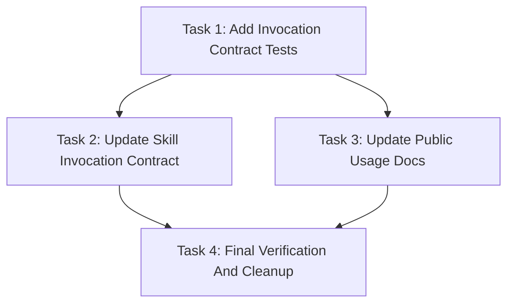

# Explicit Simple Power Skill Invocation Implementation Plan

> **For agentic workers:** REQUIRED SUB-SKILL: Use `simplepower:subagent-driven-development` wave-by-wave. Dispatch one wave at a time, respect review boundaries, and keep task tracking in checkbox (`- [ ]`) syntax. Use `simplepower:executing-plans` only when subagents are unavailable or the user explicitly requests inline execution.

**Goal:** Make Simple Power skills require explicit user request or approved chain handoff instead of semantic auto-triggering.

**Architecture:** The invocation contract lives in `skills/using-simplepower/SKILL.md`; active skill frontmatter becomes explicit-only discovery metadata; docs and fixtures describe the same contract. Static tests guard against reintroducing broad trigger language, while fixture tests preserve explicit request and approved handoff examples.

**Tech Stack:** Markdown skill files, Bash static/fixture test harnesses, repository docs.

**Model Allocation:** FAST/BEST tiers are assigned per task and wave below. FAST defaults to `SIMPLEPOWER_FAST_MODEL` (`gpt-5.4-mini-high` when unset). BEST defaults to `SIMPLEPOWER_BEST_MODEL` (`gpt-5.5-high` when unset). Fixers always use BEST.

**Commit Policy:** Workers, reviewers, and fixers must not commit. The coordinator commits the spec and plan after plan self-review, commits each verified wave after `Task Progress` is updated, and creates a final commit only if final verification leaves uncommitted changes.

---

## Task Progress

| Task | Implemented | Reviewed | Fixed | Verified |
|------|-------------|----------|-------|----------|
| Task 1: Add Invocation Contract Tests | [x] | [x] | N/A | [x] |
| Task 2: Update Skill Invocation Contract | [x] | [x] | N/A | [x] |
| Task 3: Update Public Usage Docs | [x] | [x] | N/A | [x] |
| Task 4: Final Verification And Cleanup | [x] | [x] | [x] | [x] |

## Model Allocation

| Stage | Execution role | Model tier | Resolved default model and effort | Reason |
|-------|----------------|------------|-----------------------------------|--------|
| Task 1 implementation | `sp-impl-reviewer` | BEST | `model="gpt-5.5"`, `reasoning_effort="high"` | Test coverage defines the new behavioral contract and must avoid accidentally preserving the old trigger model. |
| Task 2 implementation | `sp-impl-reviewer` | BEST | `model="gpt-5.5"`, `reasoning_effort="high"` | Core skill text controls when every Simple Power workflow starts, so ambiguity is high risk. |
| Task 3 implementation | `sp-impl-reviewer` | FAST | `model="gpt-5.4-mini"`, `reasoning_effort="high"` | Public docs mirror the approved contract and have localized write scope. |
| Task 4 implementation | `sp-impl-reviewer` | BEST | `model="gpt-5.5"`, `reasoning_effort="high"` | Final verification spans tests, skill metadata, docs, and fixture consistency. |
| Reviewer for all waves | `reviewer` | BEST | `model="gpt-5.5"`, `reasoning_effort="high"` | Review must catch contradictions between the explicit-only rule and chain handoffs. |
| Fixer for any wave | `fixer` | BEST | `model="gpt-5.5"`, `reasoning_effort="high"` | Fixers always use BEST. |

## Dependency Graph



Task 2 and Task 3 can run in parallel after Task 1 because Task 2 owns skill
files and Task 3 owns public docs. Task 4 waits for both.

## Dispatch Plan

### Wave 1

- Tasks: Task 1
- Dependencies satisfied: none
- Parallelism: no parallel task in this wave
- Review boundary: the static and fixture tests express the explicit-only
  contract and fail against the current broad trigger language
- Implementation role: `sp-impl-reviewer`
- Review mode: inline reviewer
- Fixer policy: BEST-tier `fixer` only when review or verification finds issues requiring edits
- Model tier: BEST, because the tests define the expected behavior
- Verification before downstream work:
  `bash tests/simplepower-static/run-tests.sh` is expected to fail before Task 2
  removes old trigger wording; `bash tests/explicit-skill-requests/run-all.sh`
  should pass or report only fixture checks directly changed by this task

### Wave 2

- Tasks: Task 2 and Task 3
- Dependencies satisfied: Task 1
- Parallelism: Task 2 and Task 3 may run together because their write scopes do
  not overlap
- Review boundary: skill files and docs consistently say explicit request or
  approved chain handoff
- Implementation role: `sp-impl-reviewer`
- Review mode: inline reviewer
- Fixer policy: BEST-tier `fixer` only when review or verification finds issues requiring edits
- Model tiers: Task 2 BEST; Task 3 FAST
- Verification before downstream work:
  `bash tests/simplepower-static/run-tests.sh`,
  `bash tests/explicit-skill-requests/run-all.sh`, and
  `bash tests/skill-triggering/run-all.sh`

### Wave 3

- Tasks: Task 4
- Dependencies satisfied: Task 2 and Task 3
- Parallelism: no parallel task in this wave
- Review boundary: all approved verification commands pass and `git diff`
  contains only the planned invocation-contract work
- Implementation role: `sp-impl-reviewer`
- Review mode: inline reviewer
- Fixer policy: BEST-tier `fixer` only when review or verification finds issues requiring edits
- Model tier: BEST, because this validates cross-file consistency
- Verification before completion:
  `bash tests/simplepower-static/run-tests.sh`,
  `bash tests/explicit-skill-requests/run-all.sh`,
  `bash tests/skill-triggering/run-all.sh`, and
  `git status --short`

## Write Scope Table

| Task | Write scope | Files | Parallel | Risk | Review boundary | Execution role | Model tier | Review mode | Fixer policy | Verification |
|------|-------------|-------|----------|------|-----------------|----------------|------------|-------------|--------------|--------------|
| Task 1 | Static and fixture coverage for invocation contract | `tests/simplepower-static/run-tests.sh`; `tests/skill-triggering/run-all.sh`; `tests/skill-triggering/run-test.sh`; `tests/skill-triggering/prompts/*.txt`; `tests/explicit-skill-requests/run-test.sh`; `tests/explicit-skill-requests/run-all.sh`; `tests/explicit-skill-requests/prompts/*.txt` | No | High, because test wording defines the new contract | Tests check explicit requests, approved handoffs, and absence of old broad trigger wording | `sp-impl-reviewer` | BEST | inline reviewer | BEST-tier `fixer` only when review or verification finds issues requiring edits | `bash tests/simplepower-static/run-tests.sh`; `bash tests/explicit-skill-requests/run-all.sh`; `bash tests/skill-triggering/run-all.sh` |
| Task 2 | Core skill invocation policy and active skill frontmatter | `skills/using-simplepower/SKILL.md`; `skills/*/SKILL.md` | Yes, with Task 3 | High, because this changes workflow entry semantics | Every active skill frontmatter uses explicit-only wording and chain handoffs remain intact | `sp-impl-reviewer` | BEST | inline reviewer | BEST-tier `fixer` only when review or verification finds issues requiring edits | `bash tests/simplepower-static/run-tests.sh`; `bash tests/skill-triggering/run-all.sh` |
| Task 3 | Public usage documentation | `README.md`; `docs/README.codex.md`; `docs/testing.md` | Yes, with Task 2 | Low, because this mirrors the skill contract in docs | Public docs no longer promise semantic auto-activation and still document chain usage | `sp-impl-reviewer` | FAST | inline reviewer | BEST-tier `fixer` only when review or verification finds issues requiring edits | `bash tests/simplepower-static/run-tests.sh` |
| Task 4 | Final consistency cleanup and verification | Any file from Tasks 1-3 only, if verification exposes inconsistencies | No | Medium, because fixes may touch several planned files | All verification passes and no out-of-scope files changed | `sp-impl-reviewer` | BEST | inline reviewer | BEST-tier `fixer` only when review or verification finds issues requiring edits | `bash tests/simplepower-static/run-tests.sh`; `bash tests/explicit-skill-requests/run-all.sh`; `bash tests/skill-triggering/run-all.sh`; `git status --short` |

## Task 1: Add Invocation Contract Tests

**Depends on:** none
**Write scope:** `tests/simplepower-static/run-tests.sh`, `tests/skill-triggering/**`, `tests/explicit-skill-requests/**`
**Parallel:** No.
**Risk:** High, because test wording becomes the executable description of the invocation contract.
**Review boundary:** The test suite must distinguish explicit requests and approved handoffs from ambient task-shape triggers.
**Execution role:** `sp-impl-reviewer`
**Model tier:** BEST, because preserving the old auto-trigger rule in tests would invalidate the change.
**Review mode:** inline reviewer
**Fixer policy:** BEST-tier `fixer` only when review or verification finds issues requiring edits.
**Verification:** Run the three test harnesses listed below. Static tests may fail until Task 2 removes old broad trigger wording; fixture scripts should be internally consistent.

**Files:**
- Modify: `tests/simplepower-static/run-tests.sh`
- Modify: `tests/skill-triggering/run-all.sh`
- Modify: `tests/skill-triggering/run-test.sh`
- Modify: `tests/skill-triggering/prompts/*.txt`
- Modify: `tests/explicit-skill-requests/run-test.sh` only if a positive fixture assertion needs a new approved-handoff case
- Modify: `tests/explicit-skill-requests/run-all.sh` only if a positive fixture is added
- Create: `tests/explicit-skill-requests/prompts/<approved-handoff-name>.txt` only if existing handoff fixtures do not cover the chain case

- [ ] **Step 1: Add static checks for the explicit invocation contract**

  In `tests/simplepower-static/run-tests.sh`, add `require_contains` checks that
  assert `skills/using-simplepower/SKILL.md` contains all of these exact
  phrases after Task 2:

  ```bash
  require_contains "skills/using-simplepower/SKILL.md" "Explicit user request required" "using-simplepower requires explicit invocation"
  require_contains "skills/using-simplepower/SKILL.md" "authorized Simple Power chain handoff" "using-simplepower preserves approved chain handoffs"
  require_contains "skills/using-simplepower/SKILL.md" "Do not invoke Simple Power skills from semantic task matching alone" "using-simplepower blocks semantic auto-triggering"
  ```

- [ ] **Step 2: Add static checks that reject old broad trigger wording**

  Add active-skill scans near the existing `require_no_active_match` helpers:

  ```bash
  require_no_active_match "1% chance|Might any skill apply|task matches a skill|Ask for work that matches a skill description" "active docs no longer allow broad semantic skill triggering" skills README.md docs/README.codex.md docs/testing.md
  require_no_active_match "^description: Use when|MUST use this before any creative work|Use when implementing any feature or bugfix" "active skill frontmatter avoids broad trigger descriptions" skills/*/SKILL.md
  ```

- [ ] **Step 3: Add static checks that preserve chain handoffs**

  Add checks that the approved chain still names the next skills:

  ```bash
  require_contains "skills/brainstorming/SKILL.md" "simplepower:writing-plans" "brainstorming still hands off to writing-plans"
  require_contains "skills/writing-plans/SKILL.md" "simplepower:subagent-driven-development" "writing-plans still offers subagent implementation"
  require_contains "skills/writing-plans/SKILL.md" "simplepower:executing-plans" "writing-plans still offers inline implementation"
  ```

- [ ] **Step 4: Repurpose skill-triggering fixtures to contract fixtures**

  Keep the directory name for minimal churn. Update
  `tests/skill-triggering/run-all.sh` labels and fixture list so the suite
  checks explicit-only examples rather than old semantic auto-trigger examples.
  Use fixture names such as:

  ```bash
  tests=(
      "ordinary-feature-request|$PROMPTS_DIR/ordinary-feature-request.txt"
      "ordinary-bug-report|$PROMPTS_DIR/ordinary-bug-report.txt"
      "ordinary-plan-request|$PROMPTS_DIR/ordinary-plan-request.txt"
      "approved-brainstorming-handoff|$PROMPTS_DIR/approved-brainstorming-handoff.txt"
      "approved-planning-handoff|$PROMPTS_DIR/approved-planning-handoff.txt"
  )
  ```

  The ordinary fixtures should not contain `simplepower:`. Approved handoff
  fixtures should contain the next skill name because they simulate text inside
  an already active chain.

- [ ] **Step 5: Update `tests/skill-triggering/run-test.sh` assertions**

  Replace skill-specific old assertions with fixture-name assertions:

  ```bash
  case "$basename" in
      ordinary-feature-request.txt)
          require_not_contains "simplepower:" "ordinary feature request does not explicitly request a Simple Power skill"
          ;;
      ordinary-bug-report.txt)
          require_not_contains "simplepower:" "ordinary bug report does not explicitly request a Simple Power skill"
          ;;
      ordinary-plan-request.txt)
          require_not_contains "simplepower:" "ordinary plan request does not explicitly request a Simple Power skill"
          ;;
      approved-brainstorming-handoff.txt)
          require_contains "simplepower:writing-plans" "approved brainstorming handoff names the planning skill"
          ;;
      approved-planning-handoff.txt)
          require_contains "simplepower:subagent-driven-development" "approved planning handoff names the implementation skill"
          ;;
      *)
          fail "unknown invocation contract fixture: $basename"
          ;;
  esac
  ```

- [ ] **Step 6: Replace prompt fixtures with contract examples**

  Rewrite or create the prompt files used by Step 4:

  ```text
  Build a small email validation helper.
  ```

  ```text
  The parser test is failing with TypeError: Cannot read property 'value' of undefined.
  Can you figure out what is wrong?
  ```

  ```text
  I have requirements for an auth system and need an implementation plan.
  ```

  ```text
  The written spec has been approved. Invoke simplepower:writing-plans to create
  the implementation plan.
  ```

  ```text
  The plan is complete and model allocation is approved.
  simplepower:subagent-driven-development, please execute it wave-by-wave.
  ```

- [ ] **Step 7: Run tests to capture expected red state**

  Run:

  ```bash
  bash tests/simplepower-static/run-tests.sh
  bash tests/explicit-skill-requests/run-all.sh
  bash tests/skill-triggering/run-all.sh
  ```

  Expected before Task 2: `tests/simplepower-static/run-tests.sh` fails on old
  broad trigger language in active skills. The fixture scripts should pass once
  their own assertions and prompt files are internally consistent.

- [ ] **Step 8: Report task completion without committing**

  State: `Do not commit from this task. Report the changed files, the verification commands you ran, the results, and any remaining risks or follow-up dependencies. The coordinator will update Task Progress and create coordinator checkpoint commits after verified wave boundaries.`

## Task 2: Update Skill Invocation Contract

**Depends on:** Task 1
**Write scope:** `skills/using-simplepower/SKILL.md`, `skills/*/SKILL.md`
**Parallel:** Yes, with Task 3.
**Risk:** High, because this is the core workflow entry policy.
**Review boundary:** Active skill text must say explicit request or authorized chain handoff, and must not say semantic task matching is enough.
**Execution role:** `sp-impl-reviewer`
**Model tier:** BEST, because ambiguity here would reintroduce unwanted skill activation.
**Review mode:** inline reviewer
**Fixer policy:** BEST-tier `fixer` only when review or verification finds issues requiring edits.
**Verification:** `bash tests/simplepower-static/run-tests.sh` and `bash tests/skill-triggering/run-all.sh` pass after Task 3 is also complete.

**Files:**
- Modify: `skills/using-simplepower/SKILL.md`
- Modify: every active `skills/*/SKILL.md` frontmatter description
- Modify: `skills/brainstorming/SKILL.md` body only where needed to name `simplepower:writing-plans` explicitly
- Modify: `skills/writing-plans/SKILL.md` body only where needed to clarify approved chain handoffs

- [ ] **Step 1: Replace the broad policy in using-simplepower**

  In `skills/using-simplepower/SKILL.md`, replace the `<EXTREMELY-IMPORTANT>`
  block with:

  ```md
  <INVOCATION-CONTRACT>
  Explicit user request required.

  Invoke a Simple Power skill only when:
  1. The user explicitly names the skill, such as `simplepower:brainstorming`.
  2. The user explicitly accepts a presented option that names the skill.
  3. A currently active Simple Power skill reaches an authorized Simple Power
     chain handoff documented by that skill.

  Do not invoke Simple Power skills from semantic task matching alone. A request
  that resembles a skill description is not enough.
  </INVOCATION-CONTRACT>
  ```

- [ ] **Step 2: Rewrite the "Using Skills" rule and graph**

  Replace the old "1% chance" rule and graph with an explicit-only flow:

  ```md
  ## The Rule

  **Invoke explicitly requested Simple Power skills before any response or
  action.** If no skill is explicitly requested and no active Simple Power chain
  handoff applies, continue with normal Codex behavior.

  Frontmatter descriptions help users discover skills; they do not authorize
  automatic invocation from ordinary task requests.
  ```

  The graph should branch on:

  - user explicitly named a `simplepower:*` skill
  - active Simple Power skill reached authorized handoff
  - otherwise respond normally

- [ ] **Step 3: Replace red flags that teach auto-triggering**

  Remove rows that say ordinary questions, file reads, or context gathering must
  trigger a skill check. Replace with rows that prevent accidental auto-trigger:

  ```md
  | Thought | Reality |
  |---------|---------|
  | "This task looks like brainstorming" | Similarity is not an explicit request. Do not invoke the skill unless the user names it or an active chain handoff applies. |
  | "The user probably wanted TDD" | Ask or proceed normally; do not activate `simplepower:test-driven-development` without an explicit request or approved handoff. |
  | "The previous skill suggested the next step" | Chain handoff is allowed only at the documented approval point for the active workflow. |
  ```

- [ ] **Step 4: Update frontmatter descriptions**

  For every active skill, replace the `description:` value with explicit-only
  wording. Use this exact pattern where the skill name changes per file:

  ```yaml
  description: Use only when the user explicitly requests simplepower:brainstorming or an authorized Simple Power chain invokes it.
  ```

  Apply the same pattern to `writing-plans`, `subagent-driven-development`,
  `executing-plans`, `systematic-debugging`, `test-driven-development`,
  `requesting-code-review`, `verification-before-completion`,
  `dispatching-parallel-agents`, `receiving-code-review`,
  `finishing-a-development-branch`, `using-git-worktrees`,
  `using-simplepower`, and `writing-skills`.

- [ ] **Step 5: Clarify brainstorming's chain handoff**

  In `skills/brainstorming/SKILL.md`, keep the design gate intact and ensure
  the handoff text names the next skill exactly:

  ```md
  - Invoke `simplepower:writing-plans` to create a detailed implementation plan
  ```

  Do not weaken the design approval, spec write, self-review, or user review
  gates.

- [ ] **Step 6: Clarify writing-plans' implementation handoff**

  In `skills/writing-plans/SKILL.md`, keep the model allocation and execution
  path gates intact. Ensure the text says current-session implementation starts
  only after the user selects an option naming:

  - `simplepower:subagent-driven-development`
  - `simplepower:executing-plans`

  Preserve `/clear` commands that explicitly name
  `simplepower:subagent-driven-development`.

- [ ] **Step 7: Run focused checks**

  Run:

  ```bash
  bash tests/simplepower-static/run-tests.sh
  bash tests/skill-triggering/run-all.sh
  ```

  Expected after Task 2 and Task 3: both pass.

- [ ] **Step 8: Report task completion without committing**

  State: `Do not commit from this task. Report the changed files, the verification commands you ran, the results, and any remaining risks or follow-up dependencies. The coordinator will update Task Progress and create coordinator checkpoint commits after verified wave boundaries.`

## Task 3: Update Public Usage Docs

**Depends on:** Task 1
**Write scope:** `README.md`, `docs/README.codex.md`, `docs/testing.md`
**Parallel:** Yes, with Task 2.
**Risk:** Low, because this mirrors the invocation contract in public docs.
**Review boundary:** Docs explain explicit requests and approved handoffs without promising semantic auto-activation.
**Execution role:** `sp-impl-reviewer`
**Model tier:** FAST, because changes are localized and mostly wording.
**Review mode:** inline reviewer
**Fixer policy:** BEST-tier `fixer` only when review or verification finds issues requiring edits.
**Verification:** `bash tests/simplepower-static/run-tests.sh`.

**Files:**
- Modify: `README.md`
- Modify: `docs/README.codex.md`
- Modify: `docs/testing.md`

- [ ] **Step 1: Update README usage language**

  In `README.md`, add or revise a usage paragraph near "Core Workflow":

  ```md
  Invoke Simple Power deliberately by naming a `simplepower:*` skill. Once a
  Simple Power workflow is active, continue through approved handoffs when the
  skill asks for confirmation. Ordinary feature, bug, or planning requests do
  not activate Simple Power skills unless the user names the skill.
  ```

- [ ] **Step 2: Update Codex install guide usage bullets**

  In `docs/README.codex.md`, replace bullets that say task matching activates a
  skill with:

  ```md
  - Mention a skill by name, such as `simplepower:brainstorming`.
  - Continue through approved Simple Power handoffs when prompted.
  - Use `simplepower:writing-plans` after a design is approved, or approve the
    `simplepower:brainstorming` handoff to it.
  - Use `simplepower:subagent-driven-development` for wave-based
    implementation when explicitly selected.
  ```

- [ ] **Step 3: Update testing docs smoke-test expectations**

  In `docs/testing.md`, replace any wording that expects automatic
  `simplepower:brainstorming` activation before code is written with wording
  that expects explicit invocation. Use:

  ```md
  - Codex should trigger `simplepower:brainstorming` only when the prompt names
    `simplepower:brainstorming` or the active Simple Power chain hands off to it.
  ```

- [ ] **Step 4: Search docs for old semantic-trigger promises**

  Run:

  ```bash
  rg -n "matches a skill description|task matches|will activate|automatically.*skill|before any code is written" README.md docs skills
  ```

  Rewrite matches in active docs when they promise semantic auto-triggering.
  Historical docs under `docs/superpowers/` do not need edits unless active
  tests include them.

- [ ] **Step 5: Run focused checks**

  Run:

  ```bash
  bash tests/simplepower-static/run-tests.sh
  ```

  Expected after Task 2 and Task 3: pass.

- [ ] **Step 6: Report task completion without committing**

  State: `Do not commit from this task. Report the changed files, the verification commands you ran, the results, and any remaining risks or follow-up dependencies. The coordinator will update Task Progress and create coordinator checkpoint commits after verified wave boundaries.`

## Task 4: Final Verification And Cleanup

**Depends on:** Task 2 and Task 3
**Write scope:** Any file from Tasks 1-3 only, if verification exposes an inconsistency.
**Parallel:** No.
**Risk:** Medium, because final fixes may require coordinating skill text, docs, and tests.
**Review boundary:** All verification commands pass and the diff contains only planned invocation-contract changes.
**Execution role:** `sp-impl-reviewer`
**Model tier:** BEST, because this task validates cross-file consistency.
**Review mode:** inline reviewer
**Fixer policy:** BEST-tier `fixer` only when review or verification finds issues requiring edits.
**Verification:** All commands below pass.

**Files:**
- Modify: only files already listed in Tasks 1-3, if required by verification

- [ ] **Step 1: Run full verification**

  Run:

  ```bash
  bash tests/simplepower-static/run-tests.sh
  bash tests/explicit-skill-requests/run-all.sh
  bash tests/skill-triggering/run-all.sh
  ```

  Expected: all pass.

- [ ] **Step 2: Search for forbidden trigger wording in active files**

  Run:

  ```bash
  rg -n "1% chance|Might any skill apply|task matches a skill|Ask for work that matches a skill description|^description: Use when|MUST use this before any creative work|Use when implementing any feature or bugfix" skills README.md docs/README.codex.md docs/testing.md
  ```

  Expected: no matches in active files.

- [ ] **Step 3: Confirm approved chain wording remains**

  Run:

  ```bash
  rg -n "simplepower:writing-plans|simplepower:subagent-driven-development|simplepower:executing-plans" skills/brainstorming/SKILL.md skills/writing-plans/SKILL.md README.md docs/README.codex.md
  ```

  Expected: matches show the approved brainstorming-to-planning handoff and the
  approved planning-to-implementation choices.

- [ ] **Step 4: Review final diff**

  Run:

  ```bash
  git status --short
  git diff -- skills README.md docs tests
  ```

  Expected: changed files are limited to the approved write scopes.

- [ ] **Step 5: Update Task Progress and create coordinator checkpoint commit**

  After verification passes, update this plan's `Task Progress` table:

  - mark all tasks `Implemented`, `Reviewed`, and `Verified` as `[x]`
  - leave `Fixed` as `N/A` unless a fixer pass was applied

  Then run:

  ```bash
  git status --short
  git add docs/simplepower/plans/2026-05-03-explicit-simplepower-skill-invocation.md skills README.md docs tests
  git commit -m "feat: require explicit Simple Power skill invocation"
  git rev-parse --short HEAD
  ```

  Expected: one coordinator checkpoint commit records the verified
  implementation. Do not merge, push, or create a PR.

- [ ] **Step 6: Report completion**

  Summarize changed files, verification commands, commit hash, and any residual
  risk. Do not claim completion until verification output has been checked.
