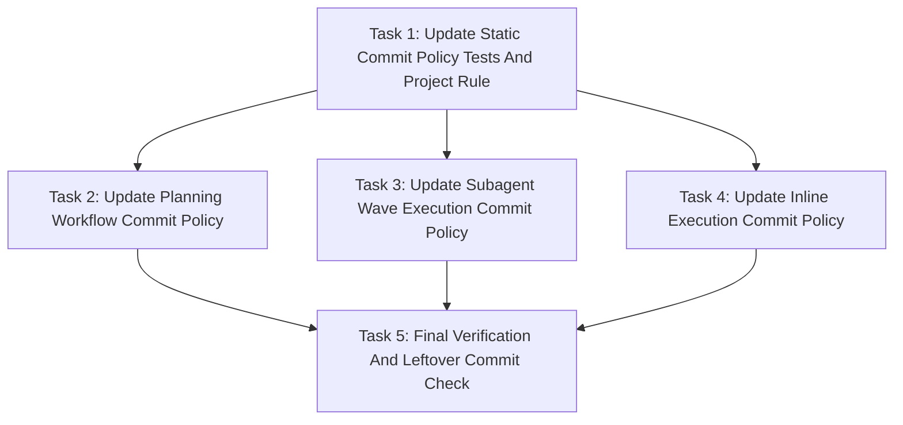

# Simple Power Checkpoint Commits Implementation Plan

> **For agentic workers:** REQUIRED SUB-SKILL: Use `simplepower:subagent-driven-development` wave-by-wave. Dispatch one wave at a time, respect review boundaries, and keep task tracking in checkbox (`- [ ]`) syntax. Use `simplepower:executing-plans` only when subagents are unavailable or the user explicitly requests inline execution.

**Goal:** Replace Simple Power's single-final-commit workflow with coordinator-owned checkpoint commits after planning and after each verified implementation wave.

**Architecture:** Keep commit ownership centralized in the main coordinator while preserving the existing worker/reviewer/fixer no-commit boundary. Update workflow skill text, plan review expectations, project rules, and static tests so the new checkpoint policy is enforceable and internally consistent.

**Tech Stack:** Markdown skill docs, Bash static test harness, git command guidance.

**Model Allocation:** FAST/BEST tiers are assigned per task and wave below. FAST defaults to `SIMPLEPOWER_FAST_MODEL` (`gpt-5.4-mini-high` when unset). BEST defaults to `SIMPLEPOWER_BEST_MODEL` (`gpt-5.5-high` when unset). Fixers always use BEST.

---

## Task Progress

| Task | Implemented | Reviewed | Fixed | Verified |
|------|-------------|----------|-------|----------|
| Task 1: Update Static Commit Policy Tests And Project Rule | [x] | [x] | N/A | [x] |
| Task 2: Update Planning Workflow Commit Policy | [x] | [x] | N/A | [x] |
| Task 3: Update Subagent Wave Execution Commit Policy | [x] | [x] | N/A | [x] |
| Task 4: Update Inline Execution Commit Policy | [x] | [x] | N/A | [x] |
| Task 5: Final Verification And Leftover Commit Check | [x] | [x] | N/A | [x] |

## Model Allocation

| Stage | Execution role | Model tier | Resolved default | Reason |
|-------|----------------|------------|------------------|--------|
| Wave 1 Task 1 implementation | `sp-impl-reviewer` | FAST | `model="gpt-5.4-mini"`, `reasoning_effort="high"` | Localized static assertions and AGENTS wording. |
| Wave 1 Task 1 fixer, if needed | `fixer` | BEST | `model="gpt-5.5"`, `reasoning_effort="high"` | All fixers use BEST. |
| Wave 2 Task 2 implementation | `sp-impl-reviewer` | BEST | `model="gpt-5.5"`, `reasoning_effort="high"` | Planning skill wording controls future workflow handoff and commit behavior. |
| Wave 2 Task 2 fixer, if needed | `fixer` | BEST | `model="gpt-5.5"`, `reasoning_effort="high"` | All fixers use BEST. |
| Wave 2 Task 3 implementation | `sp-impl-reviewer` | BEST | `model="gpt-5.5"`, `reasoning_effort="high"` | Subagent execution policy is behavior-shaping and cross-cutting. |
| Wave 2 Task 3 fixer, if needed | `fixer` | BEST | `model="gpt-5.5"`, `reasoning_effort="high"` | All fixers use BEST. |
| Wave 2 Task 4 implementation | `sp-impl-reviewer` | FAST | `model="gpt-5.4-mini"`, `reasoning_effort="high"` | Inline execution mirrors the subagent policy in one small file. |
| Wave 2 Task 4 fixer, if needed | `fixer` | BEST | `model="gpt-5.5"`, `reasoning_effort="high"` | All fixers use BEST. |
| Wave 3 Task 5 verification | `sp-impl-reviewer` | FAST | `model="gpt-5.4-mini"`, `reasoning_effort="high"` | Verification and reporting are mechanical after workflow text is updated. |
| Wave 3 Task 5 fixer, if needed | `fixer` | BEST | `model="gpt-5.5"`, `reasoning_effort="high"` | All fixers use BEST. |

## Dependency Graph



Task 1 comes first because it defines the expected static coverage and updates the project rule that the remaining workflow text must satisfy. Tasks 2, 3, and 4 may run in parallel after Task 1 because their write scopes do not overlap. Task 5 depends on all workflow text updates.

## Dispatch Plan

### Wave 1

- Tasks: Task 1.
- Dependencies satisfied: None.
- Parallelism: No parallel tasks in this wave.
- Review boundary: AGENTS wording and static assertions describe coordinator checkpoint commits while still forbidding worker and per-task commits.
- Implementation role: `sp-impl-reviewer`.
- Review mode: inline reviewer.
- Reviewer role when separate review is used: `reviewer` is not used in this wave unless the user changes review mode.
- Fixer policy: BEST-tier `fixer` only when review or verification finds issues requiring edits.
- Model tier: FAST for implementation, BEST for fixer.
- Verification: `bash tests/simplepower-static/run-tests.sh` is expected to fail until later waves satisfy the new assertions; additionally run focused `rg` commands from Task 1.
- Checkpoint commit: after focused verification, inline review, Task Progress update, and saved plan update, commit Task 1 changes with a coordinator checkpoint commit.

### Wave 2

- Tasks: Task 2, Task 3, Task 4.
- Dependencies satisfied: Task 1 verified and checkpoint committed.
- Parallelism: Tasks 2, 3, and 4 may run in parallel because their write scopes are separate skill files.
- Review boundary: Planning, subagent execution, and inline execution docs all match the checkpoint commit policy and satisfy static assertions.
- Implementation role: `sp-impl-reviewer`.
- Review mode: inline reviewer.
- Reviewer role when separate review is used: `reviewer` is not used in this wave unless the user changes review mode.
- Fixer policy: BEST-tier `fixer` only when review or verification finds issues requiring edits.
- Model tier: BEST for Tasks 2 and 3, FAST for Task 4, BEST for any fixer.
- Verification: run the focused `rg` commands from Tasks 2, 3, and 4, then run `bash tests/simplepower-static/run-tests.sh` expecting PASS.
- Checkpoint commit: after wave verification, inline review, Task Progress updates for Tasks 2-4, and saved plan update, commit the verified wave changes with a coordinator checkpoint commit.

### Wave 3

- Tasks: Task 5.
- Dependencies satisfied: Tasks 1-4 verified and checkpoint committed.
- Parallelism: No parallel tasks in this wave.
- Review boundary: full static test suite passes, final diff is inspected, and a final commit is created only if final verification leaves uncommitted changes.
- Implementation role: `sp-impl-reviewer`.
- Review mode: inline reviewer.
- Reviewer role when separate review is used: `reviewer` is not used in this wave unless the user changes review mode.
- Fixer policy: BEST-tier `fixer` only when review or verification finds issues requiring edits.
- Model tier: FAST for verification, BEST for any fixer.
- Verification: `bash tests/simplepower-static/run-tests.sh` exits 0, `git status --short` is inspected, and final report lists checkpoint commit SHAs.
- Checkpoint commit: final commit only if uncommitted changes remain after final verification.

## Write Scope Table

| Task | Write scope | Files | Parallel | Risk | Review boundary | Execution role | Model tier | Review mode | Fixer policy | Verification |
|------|-------------|-------|----------|------|-----------------|----------------|------------|-------------|--------------|--------------|
| Task 1 | Static commit policy coverage and project-level contributor rule | `tests/simplepower-static/run-tests.sh`, `AGENTS.md`, this plan's `Task Progress` table | No | Medium: test expectations drive all later workflow text | Static assertions express the new policy and AGENTS no longer forbids verified-wave commits | `sp-impl-reviewer` | FAST | inline reviewer | BEST-tier `fixer` only when review or verification finds issues requiring edits | Focused `rg`; static suite may fail until later waves |
| Task 2 | Planning workflow and plan reviewer commit policy | `skills/writing-plans/SKILL.md`, `skills/writing-plans/plan-document-reviewer-prompt.md` | Yes, with Tasks 3 and 4 after Task 1 | High: changes the planning handoff boundary | Planning docs require spec+plan commit after self-review and reject worker/per-task commits | `sp-impl-reviewer` | BEST | inline reviewer | BEST-tier `fixer` only when review or verification finds issues requiring edits | Focused `rg`; static suite |
| Task 3 | Same-session subagent execution checkpoint commits | `skills/subagent-driven-development/SKILL.md` | Yes, with Tasks 2 and 4 after Task 1 | High: changes wave execution semantics | SDD commits after wave verification and Task Progress update, final commit only if changes remain | `sp-impl-reviewer` | BEST | inline reviewer | BEST-tier `fixer` only when review or verification finds issues requiring edits | Focused `rg`; static suite |
| Task 4 | Inline execution checkpoint commits | `skills/executing-plans/SKILL.md` | Yes, with Tasks 2 and 3 after Task 1 | Medium: mirrors SDD behavior in fallback flow | executing-plans commits after inline wave verification and Task Progress update | `sp-impl-reviewer` | FAST | inline reviewer | BEST-tier `fixer` only when review or verification finds issues requiring edits | Focused `rg`; static suite |
| Task 5 | Final verification, plan progress update, and leftover commit check | This plan's `Task Progress` table and git commit metadata | No | Low: verification and reporting only | Final static checks pass and final commit happens only if uncommitted changes remain | `sp-impl-reviewer` | FAST | inline reviewer | BEST-tier `fixer` only when review or verification finds issues requiring edits | `bash tests/simplepower-static/run-tests.sh`; `git status --short` |

## Tasks

### Task 1: Update Static Commit Policy Tests And Project Rule

**Depends on:** None
**Write scope:** `tests/simplepower-static/run-tests.sh`, `AGENTS.md`, `docs/simplepower/plans/2026-05-03-simplepower-checkpoint-commits.md`
**Parallel:** No.
**Risk:** Medium, because static assertions define the expected policy for every later workflow edit.
**Review boundary:** Static tests assert coordinator checkpoint commits, final commit only if changes remain, and no worker/per-task commits.
**Execution role:** `sp-impl-reviewer`
**Model tier:** FAST, because changes are localized to one test script and one project rule file.
**Review mode:** inline reviewer
**Fixer policy:** BEST-tier `fixer` only when review or verification finds issues requiring edits.
**Verification:** Focused `rg` commands below pass. `bash tests/simplepower-static/run-tests.sh` may fail until Tasks 2-4 implement the new assertions.

**Files:**
- Modify: `AGENTS.md`
- Modify: `tests/simplepower-static/run-tests.sh`
- Modify: `docs/simplepower/plans/2026-05-03-simplepower-checkpoint-commits.md`

- [ ] **Step 1: Update AGENTS commit rule**

In `AGENTS.md`, replace:

```markdown
- Do not add per-task commit requirements to planning or execution workflows.
```

with:

```markdown
- Do not add worker-owned or per-task commit requirements to planning or
  execution workflows.
- Coordinator-owned commits are allowed only at approved checkpoints: after
  spec+plan planning, after verified wave progress updates, and after final
  verification when uncommitted changes remain.
```

- [ ] **Step 2: Update writing-plans static assertions**

In `tests/simplepower-static/run-tests.sh`, keep the existing writing-plans assertions and add these assertions after the current `require_contains "skills/writing-plans/SKILL.md" "docs/simplepower/plans"` line:

```bash
require_contains "skills/writing-plans/SKILL.md" "commit the written spec and implementation plan together" "writing-plans commits the spec and plan after self-review"
require_contains "skills/writing-plans/SKILL.md" "before model allocation approval" "writing-plans commits before model allocation approval"
require_contains "skills/writing-plans/SKILL.md" "worker commits or per-task commit commands" "writing-plans forbids worker and per-task commit commands"
```

- [ ] **Step 3: Update plan reviewer static assertions**

In `tests/simplepower-static/run-tests.sh`, add these assertions after the existing plan reviewer `Task Progress` assertion:

```bash
require_contains "skills/writing-plans/plan-document-reviewer-prompt.md" "coordinator checkpoint commits" "plan reviewer expects coordinator checkpoint commits"
require_contains "skills/writing-plans/plan-document-reviewer-prompt.md" "No worker commits or per-task commits" "plan reviewer rejects worker and per-task commits"
```

- [ ] **Step 4: Replace SDD final-commit assertion**

In `tests/simplepower-static/run-tests.sh`, replace:

```bash
require_contains "skills/subagent-driven-development/SKILL.md" "one final coordinator commit" "SDD requires one final coordinator commit"
```

with:

```bash
require_contains "skills/subagent-driven-development/SKILL.md" "coordinator checkpoint commit" "SDD requires coordinator checkpoint commits"
require_contains "skills/subagent-driven-development/SKILL.md" "after wave verification and Task Progress updates" "SDD commits after verified wave progress updates"
require_contains "skills/subagent-driven-development/SKILL.md" "final commit only if uncommitted changes remain" "SDD only commits at final verification when changes remain"
```

- [ ] **Step 5: Replace executing-plans final-commit assertion**

In `tests/simplepower-static/run-tests.sh`, replace:

```bash
require_contains "skills/executing-plans/SKILL.md" "one final commit" "executing-plans requires one final coordinator commit"
```

with:

```bash
require_contains "skills/executing-plans/SKILL.md" "coordinator checkpoint commit" "executing-plans requires coordinator checkpoint commits"
require_contains "skills/executing-plans/SKILL.md" "after verification and Task Progress updates" "executing-plans commits after verified progress updates"
require_contains "skills/executing-plans/SKILL.md" "final commit only if uncommitted changes remain" "executing-plans only commits at final verification when changes remain"
```

- [ ] **Step 6: Update final no-per-task assertions**

At the end of `tests/simplepower-static/run-tests.sh`, keep the three existing `No per-task commits` assertions and add:

```bash
require_contains "AGENTS.md" "Do not add worker-owned or per-task commit requirements" "AGENTS forbids worker-owned and per-task commits"
require_contains "AGENTS.md" "Coordinator-owned commits are allowed only at approved checkpoints" "AGENTS allows coordinator checkpoint commits"
require_contains "skills/writing-plans/SKILL.md" "No worker commits or per-task commits" "writing-plans clarifies commit ban"
require_contains "skills/subagent-driven-development/SKILL.md" "No worker commits or per-task commits" "SDD clarifies commit ban"
require_contains "skills/executing-plans/SKILL.md" "No worker commits or per-task commits" "executing-plans clarifies commit ban"
```

- [ ] **Step 7: Run focused verification**

Run:

```bash
rg -n "Coordinator-owned commits are allowed only at approved checkpoints|Do not add worker-owned or per-task commit requirements" AGENTS.md
rg -n "coordinator checkpoint commit|final commit only if uncommitted changes remain|worker commits or per-task commit commands" tests/simplepower-static/run-tests.sh
```

Expected: matches show the new AGENTS rule and static assertions.

- [ ] **Step 8: Run static suite and record expected temporary failure**

Run:

```bash
bash tests/simplepower-static/run-tests.sh
```

Expected: the suite may fail on newly added assertions until Tasks 2-4 update the skill files. Record the failing assertion names in the wave notes and continue only after confirming the failures correspond to the expected future text.

- [ ] **Step 9: Inline review**

Review the diff and confirm:

- AGENTS no longer conflicts with verified-wave coordinator commits.
- Tests still forbid worker and per-task commits.
- Tests no longer require the old one-final-commit-only policy.

- [ ] **Step 10: Update Task Progress and create checkpoint commit**

After focused verification and inline review, update this plan's Task 1 row to:

```markdown
| Task 1: Update Static Commit Policy Tests And Project Rule | [x] | [x] | N/A | [x] |
```

Then run:

```bash
git status --short
git add AGENTS.md tests/simplepower-static/run-tests.sh docs/simplepower/plans/2026-05-03-simplepower-checkpoint-commits.md
git commit -m "test: cover Simple Power checkpoint commits"
git rev-parse --short HEAD
```

Expected: a coordinator checkpoint commit is created after the plan progress update.

### Task 2: Update Planning Workflow Commit Policy

**Depends on:** Task 1
**Write scope:** `skills/writing-plans/SKILL.md`, `skills/writing-plans/plan-document-reviewer-prompt.md`
**Parallel:** Yes, with Tasks 3 and 4 after Task 1 is verified and committed.
**Risk:** High, because this controls future plan handoff and the spec+plan commit checkpoint.
**Review boundary:** Planning docs require committing spec and plan together after plan self-review, before model allocation approval.
**Execution role:** `sp-impl-reviewer`
**Model tier:** BEST, because planning workflow text is behavior-shaping.
**Review mode:** inline reviewer
**Fixer policy:** BEST-tier `fixer` only when review or verification finds issues requiring edits.
**Verification:** Focused `rg` commands pass; full static suite passes after Tasks 2-4.

**Files:**
- Modify: `skills/writing-plans/SKILL.md`
- Modify: `skills/writing-plans/plan-document-reviewer-prompt.md`

- [ ] **Step 1: Update writing-plans overview**

In `skills/writing-plans/SKILL.md`, replace the overview's final sentence:

```markdown
Give them the whole plan as bite-sized tasks organized as a dependency graph with explicit dispatch waves, review boundaries, role routing, model tiers, and fixer policy. DRY. YAGNI. TDD where relevant. No per-task commits.
```

with:

```markdown
Give them the whole plan as bite-sized tasks organized as a dependency graph with explicit dispatch waves, review boundaries, role routing, model tiers, fixer policy, and coordinator checkpoint commits. DRY. YAGNI. TDD where relevant. No worker commits or per-task commits.
```

- [ ] **Step 2: Update bite-sized commit examples**

In `skills/writing-plans/SKILL.md`, replace the current commit-related examples:

```markdown
- "Report completion without committing from this task" - worker step
- "Create one final commit after all verification passes" - final coordinator step
```

with:

```markdown
- "Report completion without committing from this task" - worker step
- "Create a coordinator checkpoint commit after verified wave progress is saved" - wave coordinator step
- "Create a final commit only if final verification leaves uncommitted changes" - final coordinator step
```

- [ ] **Step 3: Update plan header commit policy**

In the required plan header snippet in `skills/writing-plans/SKILL.md`, replace the current `**Model Allocation:**` line block with the same text plus this new line immediately before the `---` separator:

```markdown
**Commit Policy:** Workers, reviewers, and fixers must not commit. The coordinator commits the spec and plan after plan self-review, commits each verified wave after `Task Progress` is updated, and creates a final commit only if final verification leaves uncommitted changes.
```

- [ ] **Step 4: Update task reporting step**

In the task structure example in `skills/writing-plans/SKILL.md`, replace the Step 5 state text:

```markdown
State: `Do not commit from this task. Report the changed files, the verification commands you ran, the results, and any remaining risks or follow-up dependencies. The coordinator will update Task Progress and create one final commit after all tasks pass final verification.`
```

with:

```markdown
State: `Do not commit from this task. Report the changed files, the verification commands you ran, the results, and any remaining risks or follow-up dependencies. The coordinator will update Task Progress and create coordinator checkpoint commits after verified wave boundaries.`
```

- [ ] **Step 5: Update No Placeholders commit failure**

In `skills/writing-plans/SKILL.md`, replace:

```markdown
- Per-task commit instructions or any commit command
```

with:

```markdown
- Worker commit instructions, per-task commit instructions, or task-local `git commit` commands
```

- [ ] **Step 6: Update Remember section**

In `skills/writing-plans/SKILL.md`, replace:

```markdown
- No per-task commits
```

with:

```markdown
- No worker commits or per-task commits
- Coordinator checkpoint commits only after the spec+plan checkpoint, verified wave progress updates, or final verification with uncommitted changes
```

- [ ] **Step 7: Update self-review commit policy**

In `skills/writing-plans/SKILL.md`, replace the current self-review item 6:

```markdown
**6. Commit policy:** Search the plan for per-task commit commands or worker commit instructions. Replace them with task reporting steps if found. The only allowed commit instruction is the final coordinator commit after all task progress is complete and final verification passes.
```

with:

```markdown
**6. Commit policy:** Search the plan for worker commits, per-task commit commands, or task-local `git commit` instructions. Replace them with task reporting steps if found. The allowed commit instructions are coordinator checkpoint commits after spec+plan planning, after verified wave progress updates, and after final verification only if uncommitted changes remain.
```

- [ ] **Step 8: Add planning checkpoint commit before model allocation approval**

In `skills/writing-plans/SKILL.md`, in `## Execution Handoff`, replace:

```markdown
After saving and self-reviewing the plan, first ask the user to approve the
model allocation.
```

with:

````markdown
After saving and self-reviewing the plan, create one coordinator checkpoint
commit that includes the written spec and implementation plan. Do this before
model allocation approval or implementation handoff.

Run:

```bash
git status --short
# Use the actual saved spec path, plan path, and feature name for the current workflow.
git add "$SPEC_PATH" "$PLAN_PATH"
git commit -m "docs: add ${FEATURE_NAME} spec and plan"
git rev-parse --short HEAD
```

Report the commit SHA. If there are no changes, continue only when the spec and
plan were already committed and `git status --short` is clean. If the commit
fails for any other reason, stop before implementation handoff.

After the spec+plan checkpoint commit succeeds, ask the user to approve the
model allocation.
````

- [ ] **Step 9: Update plan reviewer commit policy row**

In `skills/writing-plans/plan-document-reviewer-prompt.md`, replace:

```markdown
| Commit Policy | No per-task commits or worker commits; only the final coordinator commit is allowed after final verification |
```

with:

```markdown
| Commit Policy | No worker commits or per-task commits; coordinator checkpoint commits are required after spec+plan planning and after verified wave progress updates; final commit only if uncommitted changes remain after final verification |
```

- [ ] **Step 10: Update plan reviewer calibration**

In `skills/writing-plans/plan-document-reviewer-prompt.md`, keep the existing calibration paragraph and ensure it still treats "commit policy violations" as blocking. No wording change is needed unless the old final-only policy remains elsewhere.

- [ ] **Step 11: Run focused verification**

Run:

```bash
rg -n "commit the written spec and implementation plan together|before model allocation approval|No worker commits or per-task commits|coordinator checkpoint commits|final commit only if uncommitted changes remain|worker commits or per-task commit commands" skills/writing-plans
```

Expected: matches appear in `SKILL.md` and `plan-document-reviewer-prompt.md`.

- [ ] **Step 12: Run static suite**

Run:

```bash
bash tests/simplepower-static/run-tests.sh
```

Expected: may still fail until Tasks 3 and 4 complete. Any failure should correspond only to SDD or executing-plans assertions from Task 1.

- [ ] **Step 13: Inline review**

Review the diff and confirm:

- The planning checkpoint commit happens after plan self-review and before model allocation approval.
- The plan reviewer prompt expects coordinator checkpoint commits.
- No worker or per-task commit permission was introduced.

- [ ] **Step 14: Report completion without committing from this task**

State: `Do not commit from this task if running as a worker. Report the changed files, the verification commands you ran, the results, and any remaining risks. The coordinator will update Task Progress and create the wave checkpoint commit after all Wave 2 tasks pass verification.`

### Task 3: Update Subagent Wave Execution Commit Policy

**Depends on:** Task 1
**Write scope:** `skills/subagent-driven-development/SKILL.md`
**Parallel:** Yes, with Tasks 2 and 4 after Task 1 is verified and committed.
**Risk:** High, because this changes the same-session subagent execution lifecycle.
**Review boundary:** SDD commits after wave verification and Task Progress updates, and final completion commits only if changes remain.
**Execution role:** `sp-impl-reviewer`
**Model tier:** BEST, because subagent execution policy is behavior-shaping.
**Review mode:** inline reviewer
**Fixer policy:** BEST-tier `fixer` only when review or verification finds issues requiring edits.
**Verification:** Focused `rg` commands pass; full static suite passes after Tasks 2-4.

**Files:**
- Modify: `skills/subagent-driven-development/SKILL.md`

- [ ] **Step 1: Update core principle**

In `skills/subagent-driven-development/SKILL.md`, replace:

```markdown
**Core principle:** wave-by-wave execution with explicit dependency checks,
bounded write scopes, task-level `Task Progress` updates, verification before
downstream work, subagent lifecycle checkpoints after final results are
consumed, and one final coordinator commit after all tasks are complete.
```

with:

```markdown
**Core principle:** wave-by-wave execution with explicit dependency checks,
bounded write scopes, task-level `Task Progress` updates, verification before
downstream work, subagent lifecycle checkpoints after final results are
consumed, and coordinator checkpoint commits after verified wave progress is
saved.
```

- [ ] **Step 2: Update process graph final and wave nodes**

In the DOT graph in `skills/subagent-driven-development/SKILL.md`, replace:

```dot
"Mark wave complete in TodoWrite" [shape=box];
"More waves remain?" [shape=diamond];
"Run final verification and create one final coordinator commit" [shape=box style=filled fillcolor=lightgreen];
```

with:

```dot
"Mark wave complete in TodoWrite" [shape=box];
"Create coordinator checkpoint commit" [shape=box];
"More waves remain?" [shape=diamond];
"Run final verification and create final commit only if uncommitted changes remain" [shape=box style=filled fillcolor=lightgreen];
```

Then replace:

```dot
"Mark verified tasks Verified in plan Task Progress" -> "Mark wave complete in TodoWrite";
"Mark wave complete in TodoWrite" -> "More waves remain?";
```

with:

```dot
"Mark verified tasks Verified in plan Task Progress" -> "Mark wave complete in TodoWrite";
"Mark wave complete in TodoWrite" -> "Create coordinator checkpoint commit";
"Create coordinator checkpoint commit" -> "More waves remain?";
```

Finally replace:

```dot
"More waves remain?" -> "Run final verification and create one final coordinator commit" [label="no"];
```

with:

```dot
"More waves remain?" -> "Run final verification and create final commit only if uncommitted changes remain" [label="no"];
```

- [ ] **Step 3: Add wave commit rule**

In `## Wave Rules`, after the existing rule:

```markdown
11. Advance to the next wave only after the current wave is verified.
```

replace it with:

```markdown
11. After wave verification passes, update the plan's `Task Progress` table and
    save the plan update.
12. Create a coordinator checkpoint commit after wave verification and Task
    Progress updates.
13. Advance to the next wave only after the current wave is verified and the
    checkpoint commit succeeds.
```

- [ ] **Step 4: Add checkpoint commit section**

In `skills/subagent-driven-development/SKILL.md`, after `## Task Progress Updates`, add:

````markdown
## Coordinator Checkpoint Commits

After every wave is reviewed, fixed if needed, verified, and reflected in
`Task Progress`, create a coordinator checkpoint commit before starting any
downstream wave.

Run:

```bash
git status --short
# Use the actual plan path, changed files, feature name, and wave number for the current wave.
git add "$PLAN_PATH" $WAVE_CHANGED_FILES
git commit -m "feat: complete ${FEATURE_NAME} wave ${WAVE_NUMBER}"
git rev-parse --short HEAD
```

Record the commit SHA in the main agent's wave notes or final report.

The commit must happen after wave verification and Task Progress updates, not
before. Workers, reviewers, and fixers must not commit.

If `git status --short` is clean, continue only when the wave made no file
changes or the changes were already committed and that state is expected. If
the commit fails for any other reason, stop before downstream work.
````

- [ ] **Step 5: Update Red Flags**

In `skills/subagent-driven-development/SKILL.md`, replace:

```markdown
- Require per-task commits
```

with:

```markdown
- Require worker commits or per-task commits
```

Replace:

```markdown
- Skip the final coordinator commit after all verification passes
```

with:

```markdown
- Skip the coordinator checkpoint commit after a verified wave and saved Task Progress update
- Start a downstream wave while verified current-wave changes remain uncommitted
```

- [ ] **Step 6: Update final completion**

In `skills/subagent-driven-development/SKILL.md`, replace the final completion list:

```markdown
- Run the final verification commands from the plan and any repo-required
  checks.
- Confirm every task in `## Task Progress` has `Implemented`, `Reviewed`, and
  `Verified` checked, with `Fixed` set to either `[x]` or `N/A`.
- Inspect `git status --short` and summarize the final diff.
- Create one final coordinator commit for the completed change set.
- Report the final verification results, commit SHA, changed files, and
  confirmation that all finished subagents were closed or have an active
  written reason to remain open.
- Do not merge, push, or create a PR unless the user separately asks.
```

with:

```markdown
- Run the final verification commands from the plan and any repo-required
  checks.
- Confirm every task in `## Task Progress` has `Implemented`, `Reviewed`, and
  `Verified` checked, with `Fixed` set to either `[x]` or `N/A`.
- Inspect `git status --short` and summarize any remaining diff.
- Create a final commit only if uncommitted changes remain after final
  verification.
- Report the final verification results, checkpoint commit SHAs, any final
  commit SHA, changed files, and confirmation that all finished subagents were
  closed or have an active written reason to remain open.
- Do not merge, push, or create a PR unless the user separately asks.
```

- [ ] **Step 7: Update closing commit sentence**

In `skills/subagent-driven-development/SKILL.md`, replace:

```markdown
No per-task commits. Workers, reviewers, and fixers must not commit.
```

with:

```markdown
No worker commits or per-task commits. Workers, reviewers, and fixers must not commit. Coordinator checkpoint commits are required after verified wave progress updates. Create a final commit only if uncommitted changes remain after final verification.
```

- [ ] **Step 8: Run focused verification**

Run:

```bash
rg -n "coordinator checkpoint commit|after wave verification and Task Progress updates|final commit only if uncommitted changes remain|No worker commits or per-task commits|verified current-wave changes remain uncommitted" skills/subagent-driven-development/SKILL.md
```

Expected: all checkpoint and no-worker-commit phrases are present.

- [ ] **Step 9: Run static suite**

Run:

```bash
bash tests/simplepower-static/run-tests.sh
```

Expected: may still fail until Tasks 2 and 4 complete. Any failure should correspond only to those unfinished write scopes.

- [ ] **Step 10: Inline review**

Review the diff and confirm:

- SDD commits after plan progress is saved, not before.
- Downstream waves are gated on checkpoint commit success.
- Final commit is conditional on leftover uncommitted changes.

- [ ] **Step 11: Report completion without committing from this task**

State: `Do not commit from this task if running as a worker. Report the changed files, the verification commands you ran, the results, and any remaining risks. The coordinator will update Task Progress and create the wave checkpoint commit after all Wave 2 tasks pass verification.`

### Task 4: Update Inline Execution Commit Policy

**Depends on:** Task 1
**Write scope:** `skills/executing-plans/SKILL.md`
**Parallel:** Yes, with Tasks 2 and 3 after Task 1 is verified and committed.
**Risk:** Medium, because it mirrors the SDD change in the inline fallback workflow.
**Review boundary:** executing-plans uses coordinator checkpoint commits after verification and Task Progress updates, and final commit only if changes remain.
**Execution role:** `sp-impl-reviewer`
**Model tier:** FAST, because the change is localized and mirrors Task 3.
**Review mode:** inline reviewer
**Fixer policy:** BEST-tier `fixer` only when review or verification finds issues requiring edits.
**Verification:** Focused `rg` commands pass; full static suite passes after Tasks 2-4.

**Files:**
- Modify: `skills/executing-plans/SKILL.md`

- [ ] **Step 1: Update overview**

In `skills/executing-plans/SKILL.md`, replace:

```markdown
Load the plan, review it critically, execute each task in order, update the
plan's `Task Progress` table at each lifecycle checkpoint, verify at the
planned checkpoints, and create one final coordinator commit after all
verification passes.
```

with:

```markdown
Load the plan, review it critically, execute each task or wave in order, update
the plan's `Task Progress` table at each lifecycle checkpoint, verify at the
planned checkpoints, and create coordinator checkpoint commits after verified
progress updates.
```

- [ ] **Step 2: Update Codex inline fallback paragraph**

In `skills/executing-plans/SKILL.md`, replace:

```markdown
**This is the Codex inline fallback:** keep the work in the current workspace,
use explicit wave checkpoints, update `Task Progress`, and finish with final
verification plus one final coordinator commit. Do not merge, push, or create a
PR unless the user separately asks.
```

with:

```markdown
**This is the Codex inline fallback:** keep the work in the current workspace,
use explicit wave checkpoints, update `Task Progress`, and create coordinator
checkpoint commits after verification and Task Progress updates. Finish with a
final commit only if uncommitted changes remain after final verification. Do
not merge, push, or create a PR unless the user separately asks.
```

- [ ] **Step 3: Add checkpoint commit step to Wave 2**

In `skills/executing-plans/SKILL.md`, in `### Wave 2: Execute Tasks`, after:

```markdown
10. Mark the task as completed in TodoWrite
```

add:

```markdown
11. Inspect `git status --short`
12. Create a coordinator checkpoint commit after verification and Task Progress
    updates
13. Continue downstream only after the checkpoint commit succeeds
```

- [ ] **Step 4: Add coordinator checkpoint section**

In `skills/executing-plans/SKILL.md`, after `### Wave 3: Checkpoint and Re-scan`, add:

````markdown
### Wave Checkpoint Commits

After each task or wave verification boundary passes and `Task Progress` is
updated, create a coordinator checkpoint commit before continuing downstream.

Run:

```bash
git status --short
# Use the actual plan path, changed files, feature name, and wave number for the current wave.
git add "$PLAN_PATH" $WAVE_CHANGED_FILES
git commit -m "feat: complete ${FEATURE_NAME} wave ${WAVE_NUMBER}"
git rev-parse --short HEAD
```

Record the commit SHA. The commit happens after verification and Task Progress
updates, not before. If there are no changes, continue only when that is
expected and `git status --short` is clean. If the commit fails for any other
reason, stop before downstream work.
````

- [ ] **Step 5: Update final verification section**

In `skills/executing-plans/SKILL.md`, replace `## Wave 4: Final Verification And Commit` with:

```markdown
## Wave 4: Final Verification And Leftover Commit

After all tasks are complete:
1. Run the final verification commands from the plan and any repo-required
   checks
2. Confirm every task in `## Task Progress` has `Implemented`, `Reviewed`, and
   `Verified` checked, with `Fixed` set to either `[x]` or `N/A`
3. Inspect `git status --short` and summarize any remaining diff
4. Create a final commit only if uncommitted changes remain after final
   verification
5. Report changed files, verification results, checkpoint commit SHAs, any
   final commit SHA, and any residual concerns
```

- [ ] **Step 6: Update Remember section**

In `skills/executing-plans/SKILL.md`, replace:

```markdown
- Finish with verification and one final commit, not merge/push/PR automation
- No per-task commits
```

with:

```markdown
- Finish with verification and a final commit only if uncommitted changes remain, not merge/push/PR automation
- No worker commits or per-task commits
- Create coordinator checkpoint commits after verified progress updates
```

- [ ] **Step 7: Run focused verification**

Run:

```bash
rg -n "coordinator checkpoint commit|after verification and Task Progress updates|final commit only if uncommitted changes remain|No worker commits or per-task commits" skills/executing-plans/SKILL.md
```

Expected: all checkpoint and no-worker-commit phrases are present.

- [ ] **Step 8: Run static suite**

Run:

```bash
bash tests/simplepower-static/run-tests.sh
```

Expected: may still fail until Tasks 2 and 3 complete. Any failure should correspond only to those unfinished write scopes.

- [ ] **Step 9: Inline review**

Review the diff and confirm:

- Inline execution commits after plan progress is saved, not before.
- Final commit is conditional on leftover uncommitted changes.
- The flow still stops on blockers and does not add merge/push/PR automation.

- [ ] **Step 10: Report completion without committing from this task**

State: `Do not commit from this task if running as a worker. Report the changed files, the verification commands you ran, the results, and any remaining risks. The coordinator will update Task Progress and create the wave checkpoint commit after all Wave 2 tasks pass verification.`

### Task 5: Final Verification And Leftover Commit Check

**Depends on:** Tasks 2, 3, and 4
**Write scope:** `docs/simplepower/plans/2026-05-03-simplepower-checkpoint-commits.md`, git commit metadata
**Parallel:** No.
**Risk:** Low, because this task verifies already-updated workflow text.
**Review boundary:** Static checks pass, Task Progress is complete, and the final commit is created only if uncommitted changes remain.
**Execution role:** `sp-impl-reviewer`
**Model tier:** FAST, because final verification is mechanical.
**Review mode:** inline reviewer
**Fixer policy:** BEST-tier `fixer` only when review or verification finds issues requiring edits.
**Verification:** `bash tests/simplepower-static/run-tests.sh` exits 0.

**Files:**
- Modify: `docs/simplepower/plans/2026-05-03-simplepower-checkpoint-commits.md`
- Git metadata: final commit only if required

- [ ] **Step 1: Run full static checks**

Run:

```bash
bash tests/simplepower-static/run-tests.sh
```

Expected: all Simple Power static checks pass.

- [ ] **Step 2: Verify checkpoint policy coverage**

Run:

```bash
rg -n "coordinator checkpoint commit|checkpoint commits|final commit only if uncommitted changes remain|No worker commits or per-task commits|Do not add worker-owned or per-task commit requirements" AGENTS.md skills/writing-plans skills/subagent-driven-development/SKILL.md skills/executing-plans/SKILL.md tests/simplepower-static/run-tests.sh
```

Expected: matches cover AGENTS, writing-plans, plan reviewer prompt, SDD, executing-plans, and static tests.

- [ ] **Step 3: Verify old final-only policy is gone from active workflow assertions**

Run:

```bash
rg -n "one final coordinator commit|only the final coordinator commit|one final commit after all verification passes" skills/writing-plans skills/subagent-driven-development/SKILL.md skills/executing-plans/SKILL.md tests/simplepower-static/run-tests.sh || true
```

Expected: no matches in active workflow skills or the static test script.

- [ ] **Step 4: Inspect final diff**

Run:

```bash
git status --short
git diff -- AGENTS.md skills/writing-plans/SKILL.md skills/writing-plans/plan-document-reviewer-prompt.md skills/subagent-driven-development/SKILL.md skills/executing-plans/SKILL.md tests/simplepower-static/run-tests.sh docs/simplepower/specs/2026-05-03-simplepower-checkpoint-commits-design.md docs/simplepower/plans/2026-05-03-simplepower-checkpoint-commits.md
```

Expected: changed files are limited to the approved scope plus this spec and plan.

- [ ] **Step 5: Update Task Progress**

Update this plan's Task 5 row to:

```markdown
| Task 5: Final Verification And Leftover Commit Check | [x] | [x] | N/A | [x] |
```

- [ ] **Step 6: Create final commit only if changes remain**

Run:

```bash
git status --short
```

If uncommitted changes remain, run:

```bash
git add docs/simplepower/plans/2026-05-03-simplepower-checkpoint-commits.md
git commit -m "docs: finish checkpoint commit plan progress"
git rev-parse --short HEAD
```

Expected: a final commit is created only if final verification or the final plan progress update left uncommitted changes. If `git status --short` is clean, report that no final commit was needed.

- [ ] **Step 7: Report completion**

Report:

Report the static test result, the spec+plan checkpoint SHA, the Wave 1
checkpoint SHA, the Wave 2 checkpoint SHA, whether a final leftover commit was
needed, and the changed files list.

## Final Verification

Run:

```bash
bash tests/simplepower-static/run-tests.sh
rg -n "coordinator checkpoint commit|checkpoint commits|final commit only if uncommitted changes remain|No worker commits or per-task commits|Do not add worker-owned or per-task commit requirements" AGENTS.md skills/writing-plans skills/subagent-driven-development/SKILL.md skills/executing-plans/SKILL.md tests/simplepower-static/run-tests.sh
rg -n "one final coordinator commit|only the final coordinator commit|one final commit after all verification passes" skills/writing-plans skills/subagent-driven-development/SKILL.md skills/executing-plans/SKILL.md tests/simplepower-static/run-tests.sh || true
git status --short
```

Expected:

- Static checks pass.
- New checkpoint commit policy appears in every active workflow surface.
- Old final-only commit policy is absent from active workflow skills and static tests.
- `git status --short` is clean after required checkpoint commits, or contains only final verification/progress changes that are then committed by Task 5.
