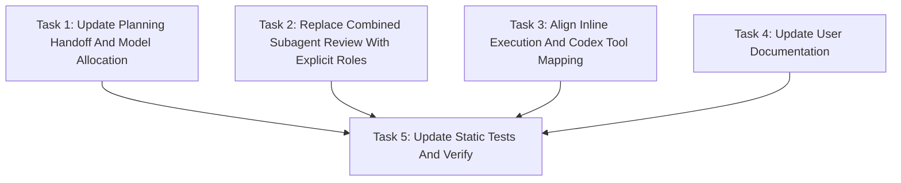

# Simple Power Implementation Routing And Model Allocation Implementation Plan

> **For agentic workers:** REQUIRED SUB-SKILL: Use `simplepower:subagent-driven-development` wave-by-wave. Dispatch one wave at a time, respect review boundaries, and keep task tracking in checkbox (`- [ ]`) syntax. Use `simplepower:executing-plans` only when subagents are unavailable or the user explicitly requests inline execution.

**Goal:** Update Simple Power so implementation handoff, worker roles, review routing, and model allocation are explicit, configurable, and reviewable before execution starts.

**Architecture:** The plan updates the workflow documentation skills first, then aligns prompt templates, install/user docs, and static tests. The workflow uses four explicit roles (`sp-impl`, `reviewer`, `sp-impl-reviewer`, `fixer`) and FAST/BEST model tiers resolved from environment variables.

**Tech Stack:** Markdown skill files, Bash static tests, Codex subagent dispatch conventions.

---

## Task Progress

| Task | Implemented | Reviewed | Fixed | Verified |
|------|-------------|----------|-------|----------|
| Task 1: Update Planning Handoff And Model Allocation | [x] | [x] | N/A | [x] |
| Task 2: Replace Combined Subagent Review With Explicit Roles | [x] | [x] | N/A | [x] |
| Task 3: Align Inline Execution And Codex Tool Mapping | [x] | [x] | N/A | [x] |
| Task 4: Update User Documentation | [x] | [x] | N/A | [x] |
| Task 5: Update Static Tests And Verify | [x] | [x] | N/A | [x] |

## Model Allocation

| Stage | Execution role | Model tier | Resolved default | Reason |
|-------|----------------|------------|------------------|--------|
| Task 1 implementation | `sp-impl-reviewer` | BEST | `gpt-5.5` high | `writing-plans` controls the handoff and plan schema, so errors affect every downstream workflow. |
| Task 2 implementation | `sp-impl-reviewer` | BEST | `gpt-5.5` high | `subagent-driven-development` is the core multi-agent executor and changes role dispatch semantics. |
| Task 3 implementation | `sp-impl-reviewer` | BEST | `gpt-5.5` high | Inline execution and Codex tool mapping must agree with subagent dispatch semantics. |
| Task 4 implementation | `sp-impl-reviewer` | FAST | `gpt-5.4-mini` high | README and install guide updates are localized documentation changes. |
| Task 5 implementation | `sp-impl-reviewer` | FAST | `gpt-5.4-mini` high | Static checks are localized assertions over known strings. |
| Separate reviewer stages, if selected | `reviewer` | BEST for Tasks 1-3, FAST for Tasks 4-5 | See task tier | Review tier follows the task risk. |
| Fix stages, if needed | `fixer` | BEST | `gpt-5.5` high | Fixers always use BEST. |

These defaults come from `SIMPLEPOWER_BEST_MODEL="gpt-5.5-high"` and
`SIMPLEPOWER_FAST_MODEL="gpt-5.4-mini-high"` when the environment variables are
unset.

## Dependency Graph



Tasks 1, 2, 3, and 4 can run in parallel because their write scopes do not
overlap. Task 5 depends on all workflow and docs text being present so the
static assertions can match final wording.

## Dispatch Plan

### Wave 1: Workflow And Documentation Text

- **Tasks:** Task 1, Task 2, Task 3, Task 4.
- **Dependencies satisfied:** Approved spec exists at `docs/simplepower/specs/2026-05-03-simplepower-implementation-routing-and-model-allocation-design.md`.
- **Parallelism:** All four tasks may run in parallel. They touch distinct files.
- **Review boundary:** Each task must update only its assigned files, run the focused `rg` checks listed in the task, and report changed files.
- **Execution roles:** Use `sp-impl-reviewer` if inline reviewer mode is selected. Use `sp-impl` plus `reviewer` if separate reviewer mode is selected.
- **Reviewer/fixer dispatch recommendation:** `main-equivalent reviewer/fixer` for the full wave because the four tasks together change the workflow contract. If the user selected inline reviewer mode, the implementation workers perform the review inline and no separate reviewer is dispatched.
- **Model allocation:** BEST for Tasks 1-3, FAST for Task 4. Any fixer uses BEST.
- **Verification before downstream work:** Run the focused `rg` commands from each task. Do not start Task 5 until all pass.

### Wave 2: Static Tests And Full Verification

- **Tasks:** Task 5.
- **Dependencies satisfied:** Wave 1 files are updated.
- **Parallelism:** No parallel tasks in this wave.
- **Review boundary:** Static checks must encode the new invariants and remove assertions that depend on the retired combined reviewer/fixer prompt.
- **Execution roles:** Use `sp-impl-reviewer` if inline reviewer mode is selected. Use `sp-impl` plus `reviewer` if separate reviewer mode is selected.
- **Reviewer/fixer dispatch recommendation:** `mini-high reviewer/fixer` because the changes are localized Bash assertions over known strings. Escalate to BEST if the test runner exposes broader workflow contradictions.
- **Model allocation:** FAST for implementation and review. Any fixer uses BEST.
- **Verification before completion:** Run `bash tests/simplepower-static/run-tests.sh`, `npm --prefix tests/brainstorm-server test`, and `bash tests/codex-plugin-sync/test-sync-to-codex-plugin.sh`.

## Write Scope Table

| Task | Write scope | Files | Parallel | Risk | Review boundary | Reviewer/fixer dispatch | Execution role | Model tier | Review mode | Verification |
|------|-------------|-------|----------|------|-----------------|--------------------------|----------------|------------|-------------|--------------|
| Task 1 | Planning skill and plan reviewer prompt only | `skills/writing-plans/SKILL.md`, `skills/writing-plans/plan-document-reviewer-prompt.md` | Yes, with Tasks 2-4 | High: controls handoff and plan schema | Plan skill documents model approval, four current-session options, and two `/clear` commands | `main-equivalent reviewer/fixer` | `sp-impl-reviewer` or `sp-impl` plus `reviewer` | BEST | Inline or separate by user choice | Focused `rg` checks in task |
| Task 2 | Subagent execution skill and role prompts only | `skills/subagent-driven-development/SKILL.md`, `skills/subagent-driven-development/implementer-prompt.md`, `skills/subagent-driven-development/reviewer-prompt.md`, `skills/subagent-driven-development/impl-reviewer-prompt.md`, `skills/subagent-driven-development/fixer-prompt.md`, `skills/subagent-driven-development/wave-reviewer-fixer-prompt.md` | Yes, with Tasks 1, 3, 4 | High: changes core subagent workflow | Role docs and prompts clearly separate implementation, review, inline review, and fixing | `main-equivalent reviewer/fixer` | `sp-impl-reviewer` or `sp-impl` plus `reviewer` | BEST | Inline or separate by user choice | Focused `rg` checks in task |
| Task 3 | Inline executor and Codex mapping only | `skills/executing-plans/SKILL.md`, `skills/using-simplepower/references/codex-tools.md` | Yes, with Tasks 1, 2, 4 | High: must match dispatch behavior | Inline modes and spawn mappings match the new role model | `main-equivalent reviewer/fixer` | `sp-impl-reviewer` or `sp-impl` plus `reviewer` | BEST | Inline or separate by user choice | Focused `rg` checks in task |
| Task 4 | User-facing docs only | `README.md`, `docs/README.codex.md` | Yes, with Tasks 1-3 | Low: localized docs | Docs cover env vars, `/clear`, author, and upstream thanks | `mini-high reviewer/fixer` | `sp-impl-reviewer` or `sp-impl` plus `reviewer` | FAST | Inline or separate by user choice | Focused `rg` checks in task |
| Task 5 | Static test assertions only | `tests/simplepower-static/run-tests.sh` | No | Medium: assertions must match final wording | Static checks pass and old combined role assertions are removed | `mini-high reviewer/fixer` | `sp-impl-reviewer` or `sp-impl` plus `reviewer` | FAST | Inline or separate by user choice | Full verification commands |

## Task 1: Update Planning Handoff And Model Allocation

**Depends on:** None
**Write scope:** `skills/writing-plans/SKILL.md`, `skills/writing-plans/plan-document-reviewer-prompt.md`
**Parallel:** Yes, with Tasks 2, 3, and 4.
**Risk:** High, because this skill defines the implementation plan format and post-plan handoff.
**Review boundary:** The skill must require model allocation fields, a model allocation approval question, four current-session execution options, and two `/clear` subagent new-session commands.
**Reviewer/fixer dispatch:** `main-equivalent reviewer/fixer`, because the handoff behavior is workflow-shaping.
**Execution role:** `sp-impl-reviewer` for inline reviewer mode, or `sp-impl` then `reviewer` for separate reviewer mode.
**Model tier:** BEST.
**Review mode:** User-selected.
**Verification:** Run the focused `rg` commands listed below and expect every required phrase to match.

**Files:**
- Modify: `skills/writing-plans/SKILL.md`
- Modify: `skills/writing-plans/plan-document-reviewer-prompt.md`

- [ ] **Step 1: Add model environment variables to the writing-plans overview**

In `skills/writing-plans/SKILL.md`, add this section after the save-path block:

````markdown
## Model Tiers

Simple Power uses two configurable model tiers when planning implementation and
review work:

```bash
SIMPLEPOWER_BEST_MODEL="gpt-5.5-high"
SIMPLEPOWER_FAST_MODEL="gpt-5.4-mini-high"
```

If either environment variable is unset, use the default shown above. Interpret
the final dash-delimited segment as `reasoning_effort` and the preceding string
as `model`. For example, `gpt-5.4-mini-high` resolves to
`model="gpt-5.4-mini"` and `reasoning_effort="high"`.

Use FAST for narrow, low-risk, localized implementation or review work. Use
BEST for broad, cross-cutting, ambiguous, behavior-shaping, high-risk, or
hard-to-test implementation or review work. If the allocation is unclear, choose
BEST. Every `fixer` stage uses BEST.
````

- [ ] **Step 2: Extend the plan header requirements**

In the required plan header example in `skills/writing-plans/SKILL.md`, add this
field after `**Tech Stack:**`:

```markdown
**Model Allocation:** FAST/BEST tiers are assigned per task and wave below. FAST defaults to `SIMPLEPOWER_FAST_MODEL` (`gpt-5.4-mini-high` when unset). BEST defaults to `SIMPLEPOWER_BEST_MODEL` (`gpt-5.5-high` when unset). Fixers always use BEST.
```

- [ ] **Step 3: Add model allocation requirements before the dependency graph**

In `skills/writing-plans/SKILL.md`, add a required `## Model Allocation` section
between `## Task Progress` and `## Dependency Graph`:

```markdown
## Model Allocation

Every plan MUST include this section after `## Task Progress` and before
`## Dependency Graph`.

List each implementation, review, and fixer stage with:
- Stage
- Execution role: `sp-impl`, `reviewer`, `sp-impl-reviewer`, or `fixer`
- Model tier: FAST or BEST
- Resolved default model and effort
- Reason for the tier

Rules:
- `sp-impl`, `reviewer`, and `sp-impl-reviewer` use FAST or BEST based on risk.
- `fixer` always uses BEST.
- If a FAST stage becomes broader or riskier during execution, escalate to BEST
  and record the reason in the wave notes.
```

- [ ] **Step 4: Replace reviewer/fixer recommendation language with role and tier language**

In the `Dispatch Plan`, `Write Scope Table`, `Task Structure`, and `Self-Review`
sections of `skills/writing-plans/SKILL.md`, replace the current two-tier
`mini-high reviewer/fixer` and `main-equivalent reviewer/fixer` requirements
with role-based wording:

```markdown
Every wave must include:
- Implementation role: `sp-impl` or `sp-impl-reviewer`
- Review mode: inline reviewer or separate reviewer
- Reviewer role when separate review is used: `reviewer`
- Fixer policy: `fixer` only when review or verification finds issues requiring edits
- Model tier for each stage: FAST or BEST
- The reason each tier is appropriate

FAST is appropriate for obvious, localized, low-risk work. BEST is required for
broad, risky, ambiguous, cross-cutting, behavior-shaping, high-risk, or
hard-to-test work. Every `fixer` stage is BEST.
```

Update the write scope table required columns to include:

```markdown
- Execution role
- Model tier
- Review mode
- Fixer policy
```

Update the task template fields to include:

```markdown
**Execution role:** `sp-impl` | `reviewer` | `sp-impl-reviewer` | `fixer`
**Model tier:** FAST | BEST, with the reason.
**Review mode:** inline reviewer | separate reviewer
**Fixer policy:** BEST-tier `fixer` only when review or verification finds issues requiring edits.
```

- [ ] **Step 5: Replace the execution handoff section**

Replace the current `## Execution Handoff` section in
`skills/writing-plans/SKILL.md` with:

````markdown
## Execution Handoff

After saving and self-reviewing the plan, first ask the user to approve the
model allocation.

Use Codex's built-in `askUserQuestion` or `request_user_input` style tool when
it is available. Ask one multiple-choice question with these options:

1. **Accept model allocation (Recommended)** - Use the plan's FAST/BEST choices.
2. **Adjust model allocation before implementation** - Revise the plan's model
   allocation table before choosing execution mode.

If the user asks for changes, update the plan's model allocation and rerun the
self-review checks for model tier consistency before asking again.

After model allocation is accepted, ask which implementation path to use. Use
Codex's user-question tool when available; otherwise ask in plain text.

Current-session options:

1. **Subagent impl in this session, inline reviewer (Recommended)** - Use
   `simplepower:subagent-driven-development` with `sp-impl-reviewer` workers.
2. **Subagent impl in this session, separate reviewer** - Use
   `simplepower:subagent-driven-development` with `sp-impl`, then `reviewer`,
   then BEST-tier `fixer` only if needed.
3. **Inline impl in this session, inline reviewer** - Use
   `simplepower:executing-plans`; the main agent implements and self-reviews.
4. **Inline impl in this session, separate reviewer** - Use
   `simplepower:executing-plans`; the main agent implements, then dispatches
   `reviewer`, then BEST-tier `fixer` only if needed.

Also show these new-session commands:

```text
/clear
Use `simplepower:subagent-driven-development` to execute
`<PLAN_PATH>` wave-by-wave with subagent implementation and inline reviewer
mode. Use the plan's approved FAST/BEST model allocation. Use
`sp-impl-reviewer` for implementation plus self-review and BEST-tier `fixer` for
any required fix pass.
```

```text
/clear
Use `simplepower:subagent-driven-development` to execute
`<PLAN_PATH>` wave-by-wave with subagent implementation and separate reviewer
mode. Use the plan's approved FAST/BEST model allocation. Use `sp-impl` for
implementation, `reviewer` for spec and quality review, and BEST-tier `fixer`
for any required fix pass.
```

Tell the user to run `/clear` manually before copying either new-session command.
Do not write a project-local implementation handoff JSON artifact. The saved
plan file is the handoff artifact.

If the user chooses a current-session subagent path, invoke
`simplepower:subagent-driven-development` and execute the plan wave-by-wave. If
the user chooses a current-session inline path, invoke
`simplepower:executing-plans`. If the user chooses a new-session command, stop
after displaying the command.
````

- [ ] **Step 6: Update the plan reviewer prompt**

In `skills/writing-plans/plan-document-reviewer-prompt.md`, add these rows to
the review checklist table:

```markdown
| Model Allocation | The plan has a `## Model Allocation` section, every implementation and review stage has FAST or BEST, and every fixer stage is BEST |
| Execution Roles | Every wave and task states `sp-impl`, `reviewer`, `sp-impl-reviewer`, or `fixer` as applicable |
| Implementation Handoff | The plan supports model allocation approval, four current-session choices, and two `/clear` subagent new-session commands |
```

Replace the old `Reviewer/Fixer Routing` row with:

```markdown
| Role And Tier Routing | Every wave has clear implementation, review, and fixer routing; FAST/BEST choices match the stated risk |
```

- [ ] **Step 7: Run focused verification**

Run:

```bash
rg -n 'SIMPLEPOWER_BEST_MODEL|SIMPLEPOWER_FAST_MODEL|Model Allocation|Accept model allocation|Adjust model allocation|Subagent impl in this session|Inline impl in this session|/clear|sp-impl-reviewer|BEST-tier `fixer`' skills/writing-plans/SKILL.md
rg -n "Model Allocation|Execution Roles|Implementation Handoff|Role And Tier Routing" skills/writing-plans/plan-document-reviewer-prompt.md
```

Expected: both commands print matches. If either command has no matches, fix the
skill text before reporting completion.

- [ ] **Step 8: Report completion without committing**

State: `Do not commit from this task. Report the changed files, the verification commands you ran, the results, and any remaining risks or follow-up dependencies. The coordinator will update Task Progress and create one final commit after all tasks pass final verification.`

## Task 2: Replace Combined Subagent Review With Explicit Roles

**Depends on:** None
**Write scope:** `skills/subagent-driven-development/SKILL.md`, `skills/subagent-driven-development/implementer-prompt.md`, `skills/subagent-driven-development/reviewer-prompt.md`, `skills/subagent-driven-development/impl-reviewer-prompt.md`, `skills/subagent-driven-development/fixer-prompt.md`, `skills/subagent-driven-development/wave-reviewer-fixer-prompt.md`
**Parallel:** Yes, with Tasks 1, 3, and 4.
**Risk:** High, because this changes the core subagent execution loop.
**Review boundary:** The skill and prompts must document four separate roles and must not teach the combined reviewer/fixer role as active behavior.
**Reviewer/fixer dispatch:** `main-equivalent reviewer/fixer`, because role dispatch is behavior-shaping.
**Execution role:** `sp-impl-reviewer` for inline reviewer mode, or `sp-impl` then `reviewer` for separate reviewer mode.
**Model tier:** BEST.
**Review mode:** User-selected.
**Verification:** Run focused `rg` commands listed below and expect role names, env vars, and BEST-only fixer rules to match.

**Files:**
- Modify: `skills/subagent-driven-development/SKILL.md`
- Modify: `skills/subagent-driven-development/implementer-prompt.md`
- Create: `skills/subagent-driven-development/reviewer-prompt.md`
- Create: `skills/subagent-driven-development/impl-reviewer-prompt.md`
- Create: `skills/subagent-driven-development/fixer-prompt.md`
- Delete: `skills/subagent-driven-development/wave-reviewer-fixer-prompt.md`

- [ ] **Step 1: Update the skill overview and process**

In `skills/subagent-driven-development/SKILL.md`, replace the opening overview
with wording equivalent to:

```markdown
Execute a plan by reading its DAG, grouping independent tasks into waves, and
running each wave through the review mode selected during handoff:

- Inline reviewer mode dispatches `sp-impl-reviewer` workers that implement and
  self-review.
- Separate reviewer mode dispatches `sp-impl` workers, then `reviewer`
  subagents, then BEST-tier `fixer` subagents only when issues require edits.

Core principle: wave-by-wave execution with explicit dependency checks, bounded
write scopes, task-level `Task Progress` updates, verification before downstream
work, subagent lifecycle checkpoints after final results are consumed, and one
final coordinator commit after all tasks are complete.
```

Update the process graph so it has branches for:

```dot
"Review mode?" [shape=diamond];
"Dispatch sp-impl-reviewer workers" [shape=box];
"Dispatch sp-impl workers" [shape=box];
"Dispatch reviewer" [shape=box];
"Review finds issues requiring edits?" [shape=diamond];
"Dispatch BEST-tier fixer" [shape=box];
```

- [ ] **Step 2: Replace wave rules with role-based rules**

In `skills/subagent-driven-development/SKILL.md`, update `## Wave Rules` so it
includes:

```markdown
3. Determine the selected review mode from the handoff or plan notes.
4. Inline reviewer mode: dispatch one `sp-impl-reviewer` worker per task in the
   wave.
5. Separate reviewer mode: dispatch one `sp-impl` worker per task in the wave,
   then dispatch `reviewer` after worker results and write-scope validation.
6. Dispatch `fixer` only when review or verification finds issues requiring
   edits. Every `fixer` uses BEST.
```

Keep the existing lifecycle checkpoint, write-scope validation, verification,
and downstream gating rules.

- [ ] **Step 3: Replace model selection with env-based FAST/BEST routing**

In `skills/subagent-driven-development/SKILL.md`, replace the current model
selection section with:

```markdown
## Model Selection

Use the plan's approved FAST/BEST allocation unless the user explicitly
overrides it. These settings are an explicit Simple Power override to generic
same-model defaults from AGENTS.md or other ambient instructions.

Defaults:

```bash
SIMPLEPOWER_BEST_MODEL="gpt-5.5-high"
SIMPLEPOWER_FAST_MODEL="gpt-5.4-mini-high"
```

If either variable is unset, use the default above. Resolve the final
dash-delimited segment as `reasoning_effort` and the preceding string as
`model`.

Role routing:

- `sp-impl`: use the plan's FAST or BEST tier, `agent_type="worker"`,
  `fork_context=false`.
- `sp-impl-reviewer`: use the plan's FAST or BEST tier,
  `agent_type="worker"`, `fork_context=false`.
- `reviewer`: use the plan's FAST or BEST tier, `agent_type="worker"`,
  `fork_context=false`.
- `fixer`: always use BEST, `agent_type="worker"`, `fork_context=false`.

If a planned FAST stage is broader, riskier, more ambiguous, or more
behavior-shaping than the plan predicted, escalate that stage to BEST and record
the reason in the wave notes before dispatch.
```

- [ ] **Step 4: Update task progress rules**

In `skills/subagent-driven-development/SKILL.md`, update `## Task Progress
Updates` so:

```markdown
- Inline reviewer mode marks `Implemented` and `Reviewed` after the
  `sp-impl-reviewer` result is accepted.
- Separate reviewer mode marks `Implemented` after `sp-impl` results are
  accepted and marks `Reviewed` after the `reviewer` result is accepted.
- `Fixed` stays `N/A` unless a `fixer` applies edits for that task.
- `Verified` is marked only after required verification passes.
```

- [ ] **Step 5: Update red flags and integration**

In `skills/subagent-driven-development/SKILL.md`, update red flags to include:

```markdown
- Do not use the retired combined wave reviewer/fixer role.
- Do not let a `reviewer` edit files.
- Do not dispatch a `fixer` with FAST.
- Do not skip `reviewer` in separate reviewer mode.
- Do not dispatch `reviewer` in inline reviewer mode unless the user explicitly changes review mode.
```

Update prompt template references to:

```markdown
- `./implementer-prompt.md` - Template for `sp-impl`
- `./reviewer-prompt.md` - Template for `reviewer`
- `./impl-reviewer-prompt.md` - Template for `sp-impl-reviewer`
- `./fixer-prompt.md` - Template for `fixer`
```

- [ ] **Step 6: Update `implementer-prompt.md`**

Keep `skills/subagent-driven-development/implementer-prompt.md` focused on
implementation only. Ensure it says:

```markdown
You are `sp-impl`, the implementation-only worker for Task M: [task name].
```

Add this rule:

```markdown
- Do not perform the formal `reviewer` role. Self-check your own diff before
  reporting, but leave spec compliance and code quality review to the separate
  `reviewer` stage when separate reviewer mode is selected.
```

- [ ] **Step 7: Add `reviewer-prompt.md`**

Create `skills/subagent-driven-development/reviewer-prompt.md` with:

````markdown
# Reviewer Prompt Template

Use this template when dispatching the `reviewer` role in separate reviewer
mode.

```
Task tool (general-purpose):
  description: "Review Wave N"
  prompt: |
    You are `reviewer`, the review-only worker for Wave N.

    ## Wave Requirements

    [Paste the wave-level requirements and relevant task text here]

    ## Assigned Review Scope

    [Paste the exact files, tasks, and diff the reviewer should inspect]

    ## Model Tier

    [State FAST or BEST and the reason from the plan or escalation decision.]

    ## Actual Diff

    [Paste or summarize the actual changed files and diff for the wave]

    ## Important Rules

    - Review spec compliance and code quality
    - Inspect the actual changed files, not just worker reports
    - Do not edit files
    - Do not update the plan progress table
    - Do not commit
    - If issues require edits, report them for a BEST-tier `fixer`

    ## Report Format

    When done, report:
    - **Status:** APPROVED | ISSUES_FOUND | BLOCKED | NEEDS_CONTEXT
    - Spec compliance findings
    - Code quality findings
    - Required fixes, if any
    - Files reviewed
    - Verification or checks run, if any
    - Task review outcomes
    - Any remaining concerns
```
````

- [ ] **Step 8: Add `impl-reviewer-prompt.md`**

Create `skills/subagent-driven-development/impl-reviewer-prompt.md` with:

````markdown
# sp-impl-reviewer Prompt Template

Use this template when dispatching the `sp-impl-reviewer` role in inline
reviewer mode.

```
Task tool (general-purpose):
  description: "Implement And Review Wave N Task M: [task name]"
  prompt: |
    You are `sp-impl-reviewer`, the implementation plus inline review worker
    for Task M: [task name].

    ## Task Description

    [FULL TEXT of task from plan - paste it here; do not make the worker read
    the plan file]

    ## Assigned Write Scope

    [Paste the exact write-scope boundaries here]

    ## Model Tier

    [State FAST or BEST and the reason from the plan or escalation decision.]

    ## Your Job

    1. Implement exactly what the task specifies
    2. Run focused verification when practical
    3. Review your implementation for spec compliance
    4. Review your implementation for code quality, clarity, and maintainability
    5. Fix issues you find inside your assigned write scope
    6. Report changed files, verification, and review outcomes

    ## Working Rules

    - Do not edit outside the assigned write scope
    - Do not edit the plan progress table
    - Do not broaden the task
    - Stop and report if required fixes need out-of-scope edits
    - Do not commit

    ## Report Format

    When done, report:
    - **Status:** DONE | DONE_WITH_CONCERNS | BLOCKED | NEEDS_CONTEXT
    - What you implemented
    - Spec compliance review findings
    - Code quality review findings
    - Fixes made during self-review, if any
    - Verification run and results
    - Changed files
    - Whether the task is ready for `Implemented`, `Reviewed`, and verification
```
````

- [ ] **Step 9: Add `fixer-prompt.md`**

Create `skills/subagent-driven-development/fixer-prompt.md` with:

````markdown
# Fixer Prompt Template

Use this template when dispatching the BEST-tier `fixer` role.

```
Task tool (general-purpose):
  description: "Fix Wave N Issues"
  prompt: |
    You are `fixer`, the BEST-tier fix worker for Wave N.

    ## Issues To Fix

    [Paste reviewer findings, verification failures, and coordinator notes]

    ## Assigned Write Scope

    [Paste the exact write-scope boundaries for allowed fixes]

    ## Actual Diff

    [Paste or summarize the current changed files and relevant diff]

    ## Important Rules

    - Apply only the requested fixes
    - Stay inside the assigned write scope
    - Stop if a fix requires out-of-scope edits
    - Run focused verification after fixes when practical
    - Do not perform a broad redesign
    - Do not update the plan progress table
    - Do not commit

    ## Report Format

    When done, report:
    - **Status:** FIXED | PARTIALLY_FIXED | BLOCKED | NEEDS_CONTEXT
    - Fixes made
    - Files changed
    - Verification run and results
    - Issues remaining, if any
    - Task fix outcomes
```
````

- [ ] **Step 10: Remove the retired combined prompt**

Delete `skills/subagent-driven-development/wave-reviewer-fixer-prompt.md`.

- [ ] **Step 11: Run focused verification**

Run:

```bash
rg -n "sp-impl-reviewer|reviewer|fixer|SIMPLEPOWER_BEST_MODEL|SIMPLEPOWER_FAST_MODEL|always use BEST|fork_context=false|Task Progress|lifecycle checkpoint" skills/subagent-driven-development/SKILL.md
test -f skills/subagent-driven-development/reviewer-prompt.md
test -f skills/subagent-driven-development/impl-reviewer-prompt.md
test -f skills/subagent-driven-development/fixer-prompt.md
test ! -e skills/subagent-driven-development/wave-reviewer-fixer-prompt.md
rg -n "Do not edit files|ISSUES_FOUND" skills/subagent-driven-development/reviewer-prompt.md
rg -n "sp-impl-reviewer|Spec compliance review findings|Code quality review findings" skills/subagent-driven-development/impl-reviewer-prompt.md
rg -n 'BEST-tier `fixer`|FIXED|PARTIALLY_FIXED' skills/subagent-driven-development/fixer-prompt.md
```

Expected: every command exits successfully.

- [ ] **Step 12: Report completion without committing**

State: `Do not commit from this task. Report the changed files, the verification commands you ran, the results, and any remaining risks or follow-up dependencies. The coordinator will update Task Progress and create one final commit after all tasks pass final verification.`

## Task 3: Align Inline Execution And Codex Tool Mapping

**Depends on:** None
**Write scope:** `skills/executing-plans/SKILL.md`, `skills/using-simplepower/references/codex-tools.md`
**Parallel:** Yes, with Tasks 1, 2, and 4.
**Risk:** High, because inline execution and tool mapping must match the new role semantics.
**Review boundary:** Inline modes and Codex spawn mappings must reference the four roles and FAST/BEST environment variables consistently.
**Reviewer/fixer dispatch:** `main-equivalent reviewer/fixer`, because mapping errors cause wrong subagent dispatch.
**Execution role:** `sp-impl-reviewer` for inline reviewer mode, or `sp-impl` then `reviewer` for separate reviewer mode.
**Model tier:** BEST.
**Review mode:** User-selected.
**Verification:** Run focused `rg` commands listed below.

**Files:**
- Modify: `skills/executing-plans/SKILL.md`
- Modify: `skills/using-simplepower/references/codex-tools.md`

- [ ] **Step 1: Add review mode selection to executing-plans**

In `skills/executing-plans/SKILL.md`, add this section after the overview:

```markdown
## Review Modes

`simplepower:executing-plans` supports two current-session inline modes:

- **Inline impl, inline reviewer:** the main agent implements each task and
  performs spec compliance plus code quality self-review before marking the task
  `Reviewed`.
- **Inline impl, separate reviewer:** the main agent implements each task or
  wave, then dispatches a `reviewer` subagent for spec compliance and code
  quality review. If review finds issues that require edits, dispatch a
  BEST-tier `fixer` unless the plan explicitly keeps the fix in the coordinator.

Use the plan's approved FAST/BEST model allocation for reviewer dispatch.
Every `fixer` uses BEST.
```

- [ ] **Step 2: Update execution task steps**

In the task execution section of `skills/executing-plans/SKILL.md`, replace the
single review step with:

```markdown
4. Apply the selected review mode:
   - Inline reviewer mode: perform a spec compliance review and a code quality
     review yourself.
   - Separate reviewer mode: dispatch `reviewer` with the task requirements,
     actual diff, write scope, and model tier from the plan.
5. If review finds issues requiring edits, dispatch BEST-tier `fixer` unless
   the plan explicitly keeps the fix in the coordinator.
6. Mark that task `Reviewed` as `[x]` after inline review or accepted reviewer
   results.
7. Keep `Fixed` as `N/A` if no fix pass was needed; change `Fixed` to `[x]`
   only if a fix pass was applied for that task.
```

Renumber the remaining steps without changing the verification and progress
requirements.

- [ ] **Step 3: Update Codex tool mapping role table**

In `skills/using-simplepower/references/codex-tools.md`, replace the current
`sp-impl` and `wave reviewer/fixer` rows with:

```markdown
| `sp-impl` implementer | `spawn_agent(agent_type="worker", model=<FAST_or_BEST_model>, reasoning_effort=<FAST_or_BEST_effort>, fork_context=false, message=...)` |
| `reviewer` review-only worker | `spawn_agent(agent_type="worker", model=<FAST_or_BEST_model>, reasoning_effort=<FAST_or_BEST_effort>, fork_context=false, message=...)` |
| `sp-impl-reviewer` implement plus inline review worker | `spawn_agent(agent_type="worker", model=<FAST_or_BEST_model>, reasoning_effort=<FAST_or_BEST_effort>, fork_context=false, message=...)` |
| `fixer` fix worker | `spawn_agent(agent_type="worker", model=<BEST_model>, reasoning_effort=<BEST_effort>, fork_context=false, message=...)` |
```

- [ ] **Step 4: Add env var resolution to Codex tool mapping**

In `skills/using-simplepower/references/codex-tools.md`, replace the old
`sp-impl` override paragraph with:

```markdown
The role mappings are an explicit Simple Power override to generic same-model
defaults from AGENTS.md or other ambient instructions. Resolve
`SIMPLEPOWER_BEST_MODEL` and `SIMPLEPOWER_FAST_MODEL` before dispatch. If unset,
use `SIMPLEPOWER_BEST_MODEL="gpt-5.5-high"` and
`SIMPLEPOWER_FAST_MODEL="gpt-5.4-mini-high"`. The final dash-delimited segment
is `reasoning_effort`; the preceding string is `model`.

Use the plan's approved FAST/BEST allocation for `sp-impl`, `reviewer`, and
`sp-impl-reviewer`. Always dispatch `fixer` with BEST.
```

- [ ] **Step 5: Update review prompt dispatch wording**

In the `Review prompt dispatch` section of
`skills/using-simplepower/references/codex-tools.md`, change the example prompt
list from the retired combined prompt to the new role prompts:

```markdown
skills/subagent-driven-development/reviewer-prompt.md
skills/subagent-driven-development/impl-reviewer-prompt.md
skills/subagent-driven-development/fixer-prompt.md
```

- [ ] **Step 6: Run focused verification**

Run:

```bash
rg -n 'Inline impl, inline reviewer|Inline impl, separate reviewer|reviewer|BEST-tier `fixer`|FAST/BEST' skills/executing-plans/SKILL.md
rg -n 'SIMPLEPOWER_BEST_MODEL|SIMPLEPOWER_FAST_MODEL|sp-impl-reviewer|reviewer|fixer|Always dispatch `fixer` with BEST|fork_context=false' skills/using-simplepower/references/codex-tools.md
```

Expected: both commands print matches.

- [ ] **Step 7: Report completion without committing**

State: `Do not commit from this task. Report the changed files, the verification commands you ran, the results, and any remaining risks or follow-up dependencies. The coordinator will update Task Progress and create one final commit after all tasks pass final verification.`

## Task 4: Update User Documentation

**Depends on:** None
**Write scope:** `README.md`, `docs/README.codex.md`
**Parallel:** Yes, with Tasks 1, 2, and 3.
**Risk:** Low, because this is localized user-facing documentation.
**Review boundary:** README and Codex install docs must explain env vars, `/clear` commands, role options, author, and upstream thanks.
**Reviewer/fixer dispatch:** `mini-high reviewer/fixer`, because this is localized docs.
**Execution role:** `sp-impl-reviewer` for inline reviewer mode, or `sp-impl` then `reviewer` for separate reviewer mode.
**Model tier:** FAST.
**Review mode:** User-selected.
**Verification:** Run focused `rg` commands listed below.

**Files:**
- Modify: `README.md`
- Modify: `docs/README.codex.md`

- [ ] **Step 1: Update README introduction and authorship**

In `README.md`, replace the opening paragraphs with:

```markdown
# Simple Power

Simple Power is a Codex-only fork of
[Superpowers](https://github.com/obra/superpowers) by Jesse Vincent / Prime
Radiant.

The README should not include a personal author line.

This fork exists because I use Codex only and want a smaller workflow tuned for
faster parallel implementation while keeping the design and review discipline
that works well in Superpowers.

Thanks to Jesse Vincent / Prime Radiant for creating Superpowers, the upstream
project this fork builds on.
```

- [ ] **Step 2: Add README model tier documentation**

In `README.md`, add this section after Installation:

````markdown
## Model Tiers

Simple Power chooses between FAST and BEST model tiers when writing and
executing implementation plans.

```bash
export SIMPLEPOWER_BEST_MODEL="gpt-5.5-high"
export SIMPLEPOWER_FAST_MODEL="gpt-5.4-mini-high"
```

If unset, those are the defaults. The final dash-delimited segment is the
reasoning effort; the preceding string is the model name. For example,
`gpt-5.4-mini-high` means `model="gpt-5.4-mini"` with
`reasoning_effort="high"`.

Use FAST for localized, low-risk work. Use BEST for broad, ambiguous,
behavior-shaping, high-risk, or hard-to-test work. Fixers always use BEST.
````

- [ ] **Step 3: Update README core workflow**

In `README.md`, replace the implementation part of the Core Workflow with:

```markdown
3. `simplepower:writing-plans` asks you to approve the FAST/BEST model
   allocation, then choose an implementation path.
4. `simplepower:subagent-driven-development` executes wave-based work with
   explicit roles:
   - `sp-impl` for implementation only
   - `reviewer` for separate review only
   - `sp-impl-reviewer` for implementation plus inline self-review
   - `fixer` for BEST-tier fixes
5. `simplepower:executing-plans` is the inline current-session fallback.
6. `simplepower:requesting-code-review` and
   `simplepower:verification-before-completion` review and verify the work
   before handoff.
```

- [ ] **Step 4: Add README clear-context implementation section**

In `README.md`, add:

````markdown
## Starting Implementation After `/clear`

After a plan is written, Simple Power shows copyable commands for starting
subagent implementation in a fresh session. Run `/clear` manually, then paste
one of the commands.

Inline reviewer mode:

```text
Use `simplepower:subagent-driven-development` to execute
`docs/simplepower/plans/<plan-file>.md` wave-by-wave with subagent
implementation and inline reviewer mode. Use the plan's approved FAST/BEST
model allocation. Use `sp-impl-reviewer` for implementation plus self-review and
BEST-tier `fixer` for any required fix pass.
```

Separate reviewer mode:

```text
Use `simplepower:subagent-driven-development` to execute
`docs/simplepower/plans/<plan-file>.md` wave-by-wave with subagent
implementation and separate reviewer mode. Use the plan's approved FAST/BEST
model allocation. Use `sp-impl` for implementation, `reviewer` for spec and
quality review, and BEST-tier `fixer` for any required fix pass.
```
````

- [ ] **Step 5: Update Codex install guide implementation flow**

In `docs/README.codex.md`, update `## Implementation Flow` so it mentions:

```markdown
After `simplepower:writing-plans` saves a plan, it asks you to approve the
FAST/BEST model allocation and then choose one of four current-session paths:
subagent implementation with inline reviewer, subagent implementation with
separate reviewer, inline implementation with inline reviewer, or inline
implementation with separate reviewer.

For a fresh implementation session, run `/clear` manually and paste one of the
subagent new-session commands that `simplepower:writing-plans` prints.
```

Also add the same `## Model Tiers` section from README, shortened if needed, but
keep both env var names and default values.

- [ ] **Step 6: Run focused verification**

Run:

```bash
rg -n 'Jesse Vincent|SIMPLEPOWER_BEST_MODEL|SIMPLEPOWER_FAST_MODEL|Starting Implementation After `/clear`|sp-impl-reviewer|BEST-tier `fixer`' README.md
rg -n "FAST/BEST|SIMPLEPOWER_BEST_MODEL|SIMPLEPOWER_FAST_MODEL|/clear|inline reviewer|separate reviewer" docs/README.codex.md
```

Expected: both commands print matches.

- [ ] **Step 7: Report completion without committing**

State: `Do not commit from this task. Report the changed files, the verification commands you ran, the results, and any remaining risks or follow-up dependencies. The coordinator will update Task Progress and create one final commit after all tasks pass final verification.`

## Task 5: Update Static Tests And Verify

**Depends on:** Task 1, Task 2, Task 3, Task 4.
**Write scope:** `tests/simplepower-static/run-tests.sh`
**Parallel:** No.
**Risk:** Medium, because static assertions need to match the final workflow wording and avoid stale combined-role checks.
**Review boundary:** Static tests fail on the retired combined role and pass on new env vars, roles, handoff options, and docs.
**Reviewer/fixer dispatch:** `mini-high reviewer/fixer`, because this is localized Bash assertion work. Escalate if it reveals broader contradictions.
**Execution role:** `sp-impl-reviewer` for inline reviewer mode, or `sp-impl` then `reviewer` for separate reviewer mode.
**Model tier:** FAST.
**Review mode:** User-selected.
**Verification:** Run full repo checks listed below.

**Files:**
- Modify: `tests/simplepower-static/run-tests.sh`

- [ ] **Step 1: Update writing-plans assertions**

In `tests/simplepower-static/run-tests.sh`, add assertions:

```bash
require_contains "skills/writing-plans/SKILL.md" "SIMPLEPOWER_BEST_MODEL" "writing-plans documents the BEST model env var"
require_contains "skills/writing-plans/SKILL.md" "SIMPLEPOWER_FAST_MODEL" "writing-plans documents the FAST model env var"
require_contains "skills/writing-plans/SKILL.md" "Accept model allocation" "writing-plans asks users to approve model allocation"
require_contains "skills/writing-plans/SKILL.md" "Adjust model allocation before implementation" "writing-plans lets users adjust model allocation"
require_contains "skills/writing-plans/SKILL.md" "Subagent impl in this session, inline reviewer" "writing-plans offers subagent inline-review execution"
require_contains "skills/writing-plans/SKILL.md" "Subagent impl in this session, separate reviewer" "writing-plans offers subagent separate-review execution"
require_contains "skills/writing-plans/SKILL.md" "Inline impl in this session, inline reviewer" "writing-plans offers inline self-review execution"
require_contains "skills/writing-plans/SKILL.md" "Inline impl in this session, separate reviewer" "writing-plans offers inline separate-review execution"
require_contains "skills/writing-plans/SKILL.md" "/clear" "writing-plans shows clear-context new-session commands"
require_contains "skills/writing-plans/SKILL.md" "sp-impl-reviewer" "writing-plans documents the impl-reviewer role"
require_contains "skills/writing-plans/SKILL.md" "fixer" "writing-plans documents the fixer role"
```

Replace old reviewer/fixer tier checks with checks for role and tier routing:

```bash
require_contains "skills/writing-plans/plan-document-reviewer-prompt.md" "Model Allocation" "plan reviewer checks model allocation"
require_contains "skills/writing-plans/plan-document-reviewer-prompt.md" "Execution Roles" "plan reviewer checks execution roles"
require_contains "skills/writing-plans/plan-document-reviewer-prompt.md" "Role And Tier Routing" "plan reviewer checks role and tier routing"
```

- [ ] **Step 2: Update subagent-driven-development assertions**

In `tests/simplepower-static/run-tests.sh`, replace assertions that require the
combined `wave reviewer/fixer` prompt with:

```bash
require_contains "skills/subagent-driven-development/SKILL.md" "sp-impl-reviewer" "SDD documents the impl-reviewer worker"
require_contains "skills/subagent-driven-development/SKILL.md" "reviewer" "SDD documents the reviewer worker"
require_contains "skills/subagent-driven-development/SKILL.md" "fixer" "SDD documents the fixer worker"
require_contains "skills/subagent-driven-development/SKILL.md" "SIMPLEPOWER_BEST_MODEL" "SDD documents the BEST model env var"
require_contains "skills/subagent-driven-development/SKILL.md" "SIMPLEPOWER_FAST_MODEL" "SDD documents the FAST model env var"
require_contains "skills/subagent-driven-development/SKILL.md" 'Every `fixer` uses BEST' "SDD requires BEST for fixers"
require_contains "skills/subagent-driven-development/reviewer-prompt.md" "Review spec compliance and code quality" "reviewer prompt is review-only"
require_contains "skills/subagent-driven-development/impl-reviewer-prompt.md" "sp-impl-reviewer" "impl-reviewer prompt is present"
require_contains "skills/subagent-driven-development/fixer-prompt.md" 'BEST-tier `fixer`' "fixer prompt is BEST-tier"
require_file "skills/subagent-driven-development/reviewer-prompt.md" "reviewer prompt exists"
require_file "skills/subagent-driven-development/impl-reviewer-prompt.md" "impl-reviewer prompt exists"
require_file "skills/subagent-driven-development/fixer-prompt.md" "fixer prompt exists"
require_dir_absent "skills/subagent-driven-development/wave-reviewer-fixer-prompt.md" "combined wave reviewer/fixer prompt is absent"
```

- [ ] **Step 3: Update executing-plans and tool mapping assertions**

Add assertions:

```bash
require_contains "skills/executing-plans/SKILL.md" "Inline impl, inline reviewer" "executing-plans documents inline self-review mode"
require_contains "skills/executing-plans/SKILL.md" "Inline impl, separate reviewer" "executing-plans documents inline separate-review mode"
require_contains "skills/executing-plans/SKILL.md" 'BEST-tier `fixer`' "executing-plans routes fixes to BEST-tier fixer"
require_contains "skills/using-simplepower/references/codex-tools.md" "SIMPLEPOWER_BEST_MODEL" "Codex tool mapping documents BEST model env var"
require_contains "skills/using-simplepower/references/codex-tools.md" "SIMPLEPOWER_FAST_MODEL" "Codex tool mapping documents FAST model env var"
require_contains "skills/using-simplepower/references/codex-tools.md" "sp-impl-reviewer" "Codex tool mapping documents impl-reviewer dispatch"
require_contains "skills/using-simplepower/references/codex-tools.md" 'Always dispatch `fixer` with BEST' "Codex tool mapping routes fixer to BEST"
```

- [ ] **Step 4: Update README and Codex docs assertions**

Add assertions:

```bash
require_not_contains "README.md" "author =" "README does not include a personal author line"
require_contains "README.md" "Thanks to Jesse Vincent / Prime Radiant" "README thanks the upstream Superpowers author"
require_contains "README.md" "SIMPLEPOWER_BEST_MODEL" "README documents BEST model env var"
require_contains "README.md" "SIMPLEPOWER_FAST_MODEL" "README documents FAST model env var"
require_contains "README.md" 'Starting Implementation After `/clear`' "README documents clear-context implementation"
require_contains "docs/README.codex.md" "SIMPLEPOWER_BEST_MODEL" "Codex install guide documents BEST model env var"
require_contains "docs/README.codex.md" "SIMPLEPOWER_FAST_MODEL" "Codex install guide documents FAST model env var"
require_contains "docs/README.codex.md" "/clear" "Codex install guide documents clear-context implementation"
```

- [ ] **Step 5: Remove stale assertions**

Remove or replace assertions that require:

```text
wave reviewer/fixer
mini-high reviewer/fixer
main-equivalent reviewer/fixer
skills/subagent-driven-development/wave-reviewer-fixer-prompt.md
```

Keep assertions for lifecycle checkpoints, `fork_context=false`, `Task Progress`,
`Implemented`, `Reviewed`, `Fixed`, `Verified`, and one final coordinator commit.

- [ ] **Step 6: Run static tests**

Run:

```bash
bash tests/simplepower-static/run-tests.sh
```

Expected: exits 0 and prints `PASS: Simple Power static checks`.

- [ ] **Step 7: Run brainstorm server tests**

Run:

```bash
npm --prefix tests/brainstorm-server test
```

Expected: exits 0.

- [ ] **Step 8: Run Codex plugin sync tests**

Run:

```bash
bash tests/codex-plugin-sync/test-sync-to-codex-plugin.sh
```

Expected: exits 0.

- [ ] **Step 9: Inspect final diff**

Run:

```bash
git status --short
git diff --stat
```

Expected: changed files are limited to the spec, this plan, the workflow skill
files, prompt templates, docs, and static test runner.

- [ ] **Step 10: Report completion without committing**

State: `Do not commit from this task. Report the changed files, the verification commands you ran, the results, and any remaining risks or follow-up dependencies. The coordinator will update Task Progress and create one final commit after all tasks pass final verification.`

## Final Coordinator Verification

After all tasks complete and review/fix passes are resolved:

1. Confirm every task in `## Task Progress` has `Implemented`, `Reviewed`, and
   `Verified` checked, with `Fixed` set to either `[x]` or `N/A`.
2. Run:

```bash
bash tests/simplepower-static/run-tests.sh
npm --prefix tests/brainstorm-server test
bash tests/codex-plugin-sync/test-sync-to-codex-plugin.sh
```

3. Run:

```bash
rg -n "wave reviewer/fixer|mini-high reviewer/fixer|main-equivalent reviewer/fixer" skills/subagent-driven-development skills/writing-plans tests/simplepower-static/run-tests.sh || true
rg -n 'SIMPLEPOWER_BEST_MODEL|SIMPLEPOWER_FAST_MODEL|sp-impl-reviewer|BEST-tier `fixer`' README.md docs/README.codex.md skills tests/simplepower-static/run-tests.sh
git status --short
git diff --stat
```

Expected: active workflow files no longer depend on the retired combined role,
new env vars and role names are present, and only intentional files are changed.

4. Create one final coordinator commit after verification passes.
