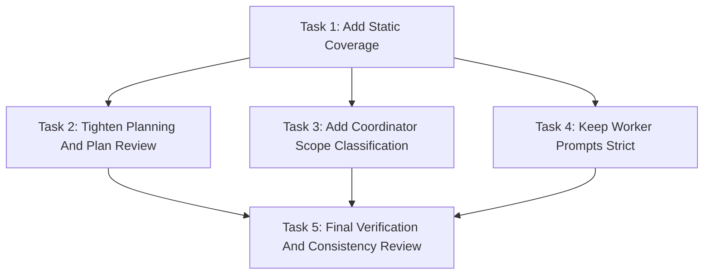

# Implied Write-Scope Corrections Implementation Plan

> **For agentic workers:** REQUIRED SUB-SKILL: Use `simplepower:subagent-driven-development` wave-by-wave. Dispatch one wave at a time, respect review boundaries, and keep task tracking in checkbox (`- [ ]`) syntax. Use `simplepower:executing-plans` only when subagents are unavailable or the user explicitly requests inline execution.

**Goal:** Add an implied write-scope audit and a narrow coordinator-owned plan-correction path for files already implied by an approved Simple Power spec or plan.

**Architecture:** Keep the change inside the Markdown skill system and static checks. Planning becomes stricter by requiring an implied write-scope audit; execution gains a coordinator-only classification step that distinguishes implied-scope omissions from true scope expansions; worker prompts remain strict and continue to stop instead of editing out of scope.

**Tech Stack:** Markdown skill files, Bash static test harness.

**Model Allocation:** FAST/BEST tiers are assigned per task and wave below. FAST defaults to `SIMPLEPOWER_FAST_MODEL` (`gpt-5.4-mini-high` when unset). BEST defaults to `SIMPLEPOWER_BEST_MODEL` (`gpt-5.5-high` when unset). Fixers always use BEST.

**Commit Policy:** Workers, reviewers, and fixers must not commit. The coordinator commits the spec and plan after plan self-review, commits each verified wave after `Task Progress` is updated, and creates a final commit only if final verification leaves uncommitted changes.

---

## File Structure

- `tests/simplepower-static/run-tests.sh`: Static regression checks for required Simple Power workflow wording.
- `skills/writing-plans/SKILL.md`: Planning requirements and self-review checklist for implied write-scope audits.
- `skills/writing-plans/plan-document-reviewer-prompt.md`: Plan reviewer checks that implied write-scope mismatches are blocking.
- `skills/subagent-driven-development/SKILL.md`: Coordinator rules for classifying and correcting implied-scope omissions during subagent execution.
- `skills/executing-plans/SKILL.md`: Matching coordinator rules for inline plan execution.
- `skills/subagent-driven-development/implementer-prompt.md`: `sp-impl` worker reporting guidance for suspected implied omissions.
- `skills/subagent-driven-development/impl-reviewer-prompt.md`: `sp-impl-reviewer` reporting guidance for suspected implied omissions.
- `skills/subagent-driven-development/fixer-prompt.md`: `fixer` reporting guidance for suspected implied omissions.

## Task Progress

| Task | Implemented | Reviewed | Fixed | Verified |
|------|-------------|----------|-------|----------|
| Task 1: Add Static Coverage | [x] | [x] | N/A | [x] |
| Task 2: Tighten Planning And Plan Review | [x] | [x] | N/A | [x] |
| Task 3: Add Coordinator Scope Classification | [x] | [x] | N/A | [x] |
| Task 4: Keep Worker Prompts Strict | [x] | [x] | N/A | [x] |
| Task 5: Final Verification And Consistency Review | [x] | [x] | N/A | [x] |

## Model Allocation

| Stage | Execution Role | Model Tier | Resolved Default | Reason |
|-------|----------------|------------|------------------|--------|
| Task 1 implementation | `sp-impl-reviewer` | FAST | `gpt-5.4-mini`, high | Static assertions are localized Bash checks with obvious expected strings. |
| Task 2 implementation | `sp-impl-reviewer` | BEST | `gpt-5.5`, high | Planning wording shapes future implementation plans and review gates. |
| Task 3 implementation | `sp-impl-reviewer` | BEST | `gpt-5.5`, high | Execution wording changes approved-path behavior during live coordination. |
| Task 4 implementation | `sp-impl-reviewer` | BEST | `gpt-5.5`, high | Worker prompt wording must preserve strict write-scope boundaries while adding reporting nuance. |
| Task 5 implementation | `sp-impl-reviewer` | FAST | `gpt-5.4-mini`, high | Final verification is command-oriented and should not introduce new behavior. |
| Any fixer | `fixer` | BEST | `gpt-5.5`, high | Fixers always use BEST per Simple Power policy. |

## Dependency Graph



Task 1 is the test-first root. Tasks 2, 3, and 4 can run in parallel after Task 1 because their write scopes do not overlap. Task 5 depends on all wording tasks and is the final verification boundary.

## Dispatch Plan

### Wave 1

- **Tasks:** Task 1.
- **Dependencies satisfied:** Approved spec.
- **Parallel:** No.
- **Review boundary:** Static tests contain failing assertions for planning, plan review, execution, and worker-prompt language.
- **Implementation role:** `sp-impl-reviewer`.
- **Review mode:** inline reviewer.
- **Reviewer role:** N/A for inline reviewer mode.
- **Fixer policy:** BEST-tier `fixer` only when review or verification finds issues requiring edits.
- **Model tier:** FAST because this is localized Bash assertion work.
- **Verification before downstream:** `bash tests/simplepower-static/run-tests.sh` fails because the required wording is not implemented yet.

### Wave 2

- **Tasks:** Task 2, Task 3, and Task 4.
- **Dependencies satisfied:** Task 1 verified as a failing static contract.
- **Parallel:** Yes. Task 2 owns planning files, Task 3 owns execution files, and Task 4 owns worker prompt files.
- **Review boundary:** Each task's owned skill files contain the required implied write-scope contract language and preserve approved-path enforcement.
- **Implementation role:** `sp-impl-reviewer`.
- **Review mode:** inline reviewer.
- **Reviewer role:** N/A for inline reviewer mode.
- **Fixer policy:** BEST-tier `fixer` only when review or verification finds issues requiring edits.
- **Model tier:** BEST for Tasks 2, 3, and 4 because these instructions shape future agent behavior.
- **Verification before downstream:** `bash tests/simplepower-static/run-tests.sh` passes after all three tasks are complete.

### Wave 3

- **Tasks:** Task 5.
- **Dependencies satisfied:** Tasks 2, 3, and 4 verified.
- **Parallel:** No.
- **Review boundary:** Static tests pass, the plan progress table is ready for coordinator update, and no unrelated files are changed.
- **Implementation role:** `sp-impl-reviewer`.
- **Review mode:** inline reviewer.
- **Reviewer role:** N/A for inline reviewer mode.
- **Fixer policy:** BEST-tier `fixer` only when review or verification finds issues requiring edits.
- **Model tier:** FAST because this is final command verification and consistency checking.
- **Verification:** `bash tests/simplepower-static/run-tests.sh`; `git status --short`.

## Write Scope Table

| Task | Write scope | Files | Parallel | Risk | Review boundary | Execution role | Model tier | Review mode | Fixer policy | Verification |
|------|-------------|-------|----------|------|-----------------|----------------|------------|-------------|--------------|--------------|
| Task 1 | Static assertions only | `tests/simplepower-static/run-tests.sh` | No | Low | New assertions fail before implementation | `sp-impl-reviewer` | FAST | inline reviewer | BEST `fixer` only on issues | `bash tests/simplepower-static/run-tests.sh` fails before Tasks 2-4 |
| Task 2 | Planning and plan-review contract | `skills/writing-plans/SKILL.md`, `skills/writing-plans/plan-document-reviewer-prompt.md` | Yes with Tasks 3 and 4 | High | Planning requires implied write-scope audits and plan review blocks mismatches | `sp-impl-reviewer` | BEST | inline reviewer | BEST `fixer` only on issues | `bash tests/simplepower-static/run-tests.sh` after Tasks 3 and 4 |
| Task 3 | Coordinator execution classification | `skills/subagent-driven-development/SKILL.md`, `skills/executing-plans/SKILL.md` | Yes with Tasks 2 and 4 | High | Coordinators classify implied-scope omissions and true scope expansions before asking the user | `sp-impl-reviewer` | BEST | inline reviewer | BEST `fixer` only on issues | `bash tests/simplepower-static/run-tests.sh` after Tasks 2 and 4 |
| Task 4 | Worker prompt reporting rules | `skills/subagent-driven-development/implementer-prompt.md`, `skills/subagent-driven-development/impl-reviewer-prompt.md`, `skills/subagent-driven-development/fixer-prompt.md` | Yes with Tasks 2 and 3 | High | Workers still cannot edit out of scope and must report suspected implied omissions | `sp-impl-reviewer` | BEST | inline reviewer | BEST `fixer` only on issues | `bash tests/simplepower-static/run-tests.sh` after Tasks 2 and 3 |
| Task 5 | Final verification only | No source writes expected; only this plan's Task Progress table is updated by the coordinator | No | Low | All static checks pass and status is understood | `sp-impl-reviewer` | FAST | inline reviewer | BEST `fixer` only on issues | `bash tests/simplepower-static/run-tests.sh`; `git status --short` |

## Task 1: Add Static Coverage

**Depends on:** Approved spec.
**Write scope:** `tests/simplepower-static/run-tests.sh`
**Parallel:** No.
**Risk:** Low, because this task only adds static string checks.
**Review boundary:** Static checks fail before the skill wording is implemented.
**Execution role:** `sp-impl-reviewer`
**Model tier:** FAST, because the changes are localized assertions.
**Review mode:** inline reviewer
**Fixer policy:** BEST-tier `fixer` only when review or verification finds issues requiring edits.
**Verification:** `bash tests/simplepower-static/run-tests.sh` fails before Tasks 2-4.

**Files:**
- Modify: `tests/simplepower-static/run-tests.sh`

- [ ] **Step 1: Add planning and review assertions**

In `tests/simplepower-static/run-tests.sh`, after the existing `skills/writing-plans/plan-document-reviewer-prompt.md` assertions, add:

```bash
require_contains "skills/writing-plans/SKILL.md" "implied write-scope audit" "writing-plans requires implied write-scope audits"
require_contains "skills/writing-plans/SKILL.md" "task steps, prose, code snippets, verification instructions, public declaration requirements, file-structure responsibilities, and relevant spec requirements" "writing-plans cross-checks implied files against task write scope"
require_contains "skills/writing-plans/SKILL.md" "every implied file is present in that task's write scope" "writing-plans requires every implied file in scope"
require_contains "skills/writing-plans/plan-document-reviewer-prompt.md" "Implied Write Scope" "plan reviewer checks implied write scopes"
require_contains "skills/writing-plans/plan-document-reviewer-prompt.md" "A mismatch between files implied by task steps, snippets, file lists, file-structure responsibilities, or spec requirements and that task's write scope is a blocking issue" "plan reviewer blocks implied write-scope mismatches"
```

- [ ] **Step 2: Add execution assertions**

After the existing `skills/executing-plans/SKILL.md` approved-path assertions, add:

```bash
require_contains "skills/subagent-driven-development/SKILL.md" "Implied Write-Scope Corrections" "SDD documents implied write-scope corrections"
require_contains "skills/subagent-driven-development/SKILL.md" "implied-scope omission" "SDD classifies implied-scope omissions"
require_contains "skills/subagent-driven-development/SKILL.md" "true scope expansion" "SDD classifies true scope expansions"
require_contains "skills/subagent-driven-development/SKILL.md" "update the plan's write-scope line and write-scope table for that task" "SDD lets coordinator correct implied omissions"
require_contains "skills/subagent-driven-development/SKILL.md" "If the missing file or strategy is not already implied" "SDD stops for true scope expansion approval"
require_contains "skills/executing-plans/SKILL.md" "Implied Write-Scope Corrections" "executing-plans documents implied write-scope corrections"
require_contains "skills/executing-plans/SKILL.md" "implied-scope omission" "executing-plans classifies implied-scope omissions"
require_contains "skills/executing-plans/SKILL.md" "true scope expansion" "executing-plans classifies true scope expansions"
```

- [ ] **Step 3: Add worker prompt assertions**

After the existing worker prompt approved-path assertions, add:

```bash
require_contains "skills/subagent-driven-development/implementer-prompt.md" "suspected implied-scope omission" "implementer prompt reports suspected implied omissions"
require_contains "skills/subagent-driven-development/implementer-prompt.md" "Do not edit the out-of-scope file yourself" "implementer prompt forbids self-expanding scope"
require_contains "skills/subagent-driven-development/impl-reviewer-prompt.md" "suspected implied-scope omission" "inline reviewer prompt reports suspected implied omissions"
require_contains "skills/subagent-driven-development/impl-reviewer-prompt.md" "Do not edit the out-of-scope file yourself" "inline reviewer prompt forbids self-expanding scope"
require_contains "skills/subagent-driven-development/fixer-prompt.md" "suspected implied-scope omission" "fixer prompt reports suspected implied omissions"
require_contains "skills/subagent-driven-development/fixer-prompt.md" "Do not edit the out-of-scope file yourself" "fixer prompt forbids self-expanding scope"
```

- [ ] **Step 4: Run static checks and confirm they fail**

Run:

```bash
bash tests/simplepower-static/run-tests.sh
```

Expected: FAIL because the new required wording has not been implemented in the skill files yet.

- [ ] **Step 5: Report task completion without committing**

State: `Do not commit from this task. Report the changed files, the verification commands you ran, the results, and any remaining risks or follow-up dependencies. The coordinator will update Task Progress and create coordinator checkpoint commits after verified wave boundaries.`

## Task 2: Tighten Planning And Plan Review

**Depends on:** Task 1.
**Write scope:** `skills/writing-plans/SKILL.md`, `skills/writing-plans/plan-document-reviewer-prompt.md`
**Parallel:** Yes, with Tasks 3 and 4.
**Risk:** High, because planning guidance determines future task write scopes and review gates.
**Review boundary:** Planning and plan-review instructions make implied write-scope mismatches blocking.
**Execution role:** `sp-impl-reviewer`
**Model tier:** BEST, because this is behavior-shaping workflow text.
**Review mode:** inline reviewer
**Fixer policy:** BEST-tier `fixer` only when review or verification finds issues requiring edits.
**Verification:** `bash tests/simplepower-static/run-tests.sh` passes after Tasks 3 and 4 are also complete.

**Files:**
- Modify: `skills/writing-plans/SKILL.md`
- Modify: `skills/writing-plans/plan-document-reviewer-prompt.md`

- [ ] **Step 1: Add an implied write-scope audit section**

In `skills/writing-plans/SKILL.md`, after the paragraph under `## Write Scope Table` that starts `The write scope must be exact`, add:

```markdown
## Implied Write-Scope Audit

For every task, perform an implied write-scope audit before finalizing the plan.
Compare that task's write-scope line and write-scope table row against files
named or structurally required by task steps, prose, code snippets,
verification instructions, public declaration requirements, file-structure
responsibilities, and relevant spec requirements.

Every implied file is present in that task's write scope. If a task says to add
public declarations to a header, lists a file in its `Files:` block, includes a
path in a code snippet, or relies on a file responsibility from the plan's file
structure section, that file belongs in the task write scope. Explain deliberate
shared-file overlap as serialized, review-gated, or safe for parallelism.
```

- [ ] **Step 2: Add self-review coverage**

In `skills/writing-plans/SKILL.md`, in `## Self-Review`, add this item after the current parallel safety item and renumber later items:

```markdown
**4. Implied write-scope audit:** For each task, compare task steps, prose, code snippets, verification instructions, public declaration requirements, file-structure responsibilities, and relevant spec requirements against that task's write scope. Confirm every implied file is present in that task's write scope. If a task needs a file not listed in its write scope, add it or rewrite the task so the scope and instructions match.
```

After renumbering, the approved path enforcement item should remain the final self-review item.

- [ ] **Step 3: Add plan reviewer category**

In `skills/writing-plans/plan-document-reviewer-prompt.md`, add this row after the `Write Scopes` row:

```markdown
    | Implied Write Scope | A mismatch between files implied by task steps, snippets, file lists, file-structure responsibilities, or spec requirements and that task's write scope is a blocking issue |
```

- [ ] **Step 4: Add reviewer calibration sentence**

In `skills/writing-plans/plan-document-reviewer-prompt.md`, in `## Calibration`, after the sentence listing serious gaps, add:

```markdown
    Reject plans where a task's instructions require a file that is missing from
    that task's write scope, even when the task is serialized and has no
    parallel collision.
```

- [ ] **Step 5: Run focused static check**

Run:

```bash
bash tests/simplepower-static/run-tests.sh
```

Expected: FAIL until Tasks 3 and 4 also implement their required wording. The failures should no longer include the Task 2 assertions.

- [ ] **Step 6: Report task completion without committing**

State: `Do not commit from this task. Report the changed files, the verification commands you ran, the results, and any remaining risks or follow-up dependencies. The coordinator will update Task Progress and create coordinator checkpoint commits after verified wave boundaries.`

## Task 3: Add Coordinator Scope Classification

**Depends on:** Task 1.
**Write scope:** `skills/subagent-driven-development/SKILL.md`, `skills/executing-plans/SKILL.md`
**Parallel:** Yes, with Tasks 2 and 4.
**Risk:** High, because execution wording controls when coordinators proceed versus stop for approval.
**Review boundary:** Coordinators can correct only implied-scope omissions and must still stop for true scope expansions.
**Execution role:** `sp-impl-reviewer`
**Model tier:** BEST, because this changes live execution control flow.
**Review mode:** inline reviewer
**Fixer policy:** BEST-tier `fixer` only when review or verification finds issues requiring edits.
**Verification:** `bash tests/simplepower-static/run-tests.sh` passes after Tasks 2 and 4 are also complete.

**Files:**
- Modify: `skills/subagent-driven-development/SKILL.md`
- Modify: `skills/executing-plans/SKILL.md`

- [ ] **Step 1: Add SDD implied correction section**

In `skills/subagent-driven-development/SKILL.md`, after `## Approved Path Enforcement`, add:

```markdown
## Implied Write-Scope Corrections

When a worker reports that a required file is outside its assigned write scope,
or the coordinator detects that a task step needs a file missing from the task
write scope, classify the mismatch before asking the user.

An `implied-scope omission` exists only when the missing file is already named
or structurally required by the approved spec, plan file-structure section,
task `Files:` block, task prose, task snippets, verification instructions, or
public declaration requirements. For an implied-scope omission, the coordinator
may update the plan's write-scope line and write-scope table for that task,
record a short wave note describing the correction, and continue with the same
approved task.

A `true scope expansion` exists when the missing file or strategy is not already
implied by approved text. If the missing file or strategy is not already
implied, stop and ask the user for fresh explicit approval before changing
scope, strategy, verification, review mode, or implementation work.

Workers, reviewers, and fixers must not self-expand write scope. They report
`BLOCKED` or `NEEDS_CONTEXT`; the coordinator owns classification and any plan
correction.
```

- [ ] **Step 2: Update SDD worker blocker handling**

In `skills/subagent-driven-development/SKILL.md`, under `**If a worker reports a blocker:**`, replace the current bullets with:

```markdown
- Treat it as real
- Gather only the diagnostic context needed to explain the blocker
- If the blocker is a missing write-scope file, classify it as an
  `implied-scope omission` or `true scope expansion` using the approved spec and
  plan
- For an `implied-scope omission`, update the plan write scope, record a wave
  note, and continue with the same approved task
- For a `true scope expansion`, stop before alternate implementation work
- Ask the user for fresh explicit approval before changing scope, plan, review
  mode, verification, implementation strategy, or any file not implied by
  approved text
```

- [ ] **Step 3: Add inline execution implied correction section**

In `skills/executing-plans/SKILL.md`, after `## Approved Path Enforcement`, add:

```markdown
## Implied Write-Scope Corrections

When inline execution finds that a task needs a file missing from its write
scope, classify the mismatch before asking the user.

An `implied-scope omission` exists only when the missing file is already named
or structurally required by the approved spec, plan file-structure section,
task `Files:` block, task prose, task snippets, verification instructions, or
public declaration requirements. For an implied-scope omission, the coordinator
may update the plan's write-scope line and write-scope table for that task,
record a short task or wave note describing the correction, and continue with
the same approved task.

A `true scope expansion` exists when the missing file or strategy is not already
implied by approved text. If the missing file or strategy is not already
implied, stop and ask the user for fresh explicit approval before changing
scope, strategy, verification, review mode, or implementation work.
```

- [ ] **Step 4: Update inline stop criteria**

In `skills/executing-plans/SKILL.md`, under `## When to Stop and Ask for Help`, add this bullet:

```markdown
- Need a true scope expansion: the required file or strategy is not already
  implied by the approved spec or plan
```

Keep the existing instruction to stop for blockers. Do not remove any approved-path enforcement wording.

- [ ] **Step 5: Run focused static check**

Run:

```bash
bash tests/simplepower-static/run-tests.sh
```

Expected: FAIL until Tasks 2 and 4 also implement their required wording. The failures should no longer include the Task 3 assertions.

- [ ] **Step 6: Report task completion without committing**

State: `Do not commit from this task. Report the changed files, the verification commands you ran, the results, and any remaining risks or follow-up dependencies. The coordinator will update Task Progress and create coordinator checkpoint commits after verified wave boundaries.`

## Task 4: Keep Worker Prompts Strict

**Depends on:** Task 1.
**Write scope:** `skills/subagent-driven-development/implementer-prompt.md`, `skills/subagent-driven-development/impl-reviewer-prompt.md`, `skills/subagent-driven-development/fixer-prompt.md`
**Parallel:** Yes, with Tasks 2 and 3.
**Risk:** High, because worker prompts must not turn implied corrections into worker-owned scope expansion.
**Review boundary:** Prompts tell workers to report suspected implied omissions and still forbid out-of-scope edits.
**Execution role:** `sp-impl-reviewer`
**Model tier:** BEST, because prompt wording controls worker behavior.
**Review mode:** inline reviewer
**Fixer policy:** BEST-tier `fixer` only when review or verification finds issues requiring edits.
**Verification:** `bash tests/simplepower-static/run-tests.sh` passes after Tasks 2 and 3 are also complete.

**Files:**
- Modify: `skills/subagent-driven-development/implementer-prompt.md`
- Modify: `skills/subagent-driven-development/impl-reviewer-prompt.md`
- Modify: `skills/subagent-driven-development/fixer-prompt.md`

- [ ] **Step 1: Update implementer prompt**

In `skills/subagent-driven-development/implementer-prompt.md`, under `## Working Rules`, after `If you discover an out-of-scope need, stop and report BLOCKED or NEEDS_CONTEXT`, add:

```markdown
    - If the out-of-scope file appears to be required by the approved task text,
      report a suspected implied-scope omission and cite the task text that
      implies the file. Do not edit the out-of-scope file yourself; the
      coordinator must classify and correct the plan if appropriate.
```

- [ ] **Step 2: Update inline reviewer worker prompt**

In `skills/subagent-driven-development/impl-reviewer-prompt.md`, under `## Working Rules`, after `Stop and report if required fixes need out-of-scope edits`, add:

```markdown
    - If the out-of-scope file appears to be required by the approved task text,
      report a suspected implied-scope omission and cite the task text that
      implies the file. Do not edit the out-of-scope file yourself; the
      coordinator must classify and correct the plan if appropriate.
```

- [ ] **Step 3: Update fixer prompt**

In `skills/subagent-driven-development/fixer-prompt.md`, under `## Important Rules`, after `Stop if a fix requires out-of-scope edits`, add:

```markdown
    - If the out-of-scope file appears to be required by the approved task text,
      report a suspected implied-scope omission and cite the task text that
      implies the file. Do not edit the out-of-scope file yourself; the
      coordinator must classify and correct the plan if appropriate.
```

- [ ] **Step 4: Run focused static check**

Run:

```bash
bash tests/simplepower-static/run-tests.sh
```

Expected: FAIL until Tasks 2 and 3 also implement their required wording. The failures should no longer include the Task 4 assertions.

- [ ] **Step 5: Report task completion without committing**

State: `Do not commit from this task. Report the changed files, the verification commands you ran, the results, and any remaining risks or follow-up dependencies. The coordinator will update Task Progress and create coordinator checkpoint commits after verified wave boundaries.`

## Task 5: Final Verification And Consistency Review

**Depends on:** Tasks 2, 3, and 4.
**Write scope:** No source writes expected; only this plan's Task Progress table is updated by the coordinator.
**Parallel:** No.
**Risk:** Low, because this task verifies the completed wording contract.
**Review boundary:** Static checks pass and the working tree contains only expected changes.
**Execution role:** `sp-impl-reviewer`
**Model tier:** FAST, because this is command verification and consistency review.
**Review mode:** inline reviewer
**Fixer policy:** BEST-tier `fixer` only when review or verification finds issues requiring edits.
**Verification:** `bash tests/simplepower-static/run-tests.sh` and `git status --short`.

**Files:**
- No source writes expected.

- [ ] **Step 1: Run full static verification**

Run:

```bash
bash tests/simplepower-static/run-tests.sh
```

Expected: PASS with all Simple Power static checks passing.

- [ ] **Step 2: Inspect final status**

Run:

```bash
git status --short
```

Expected: changes are limited to:

```text
M  tests/simplepower-static/run-tests.sh
M  skills/writing-plans/SKILL.md
M  skills/writing-plans/plan-document-reviewer-prompt.md
M  skills/subagent-driven-development/SKILL.md
M  skills/executing-plans/SKILL.md
M  skills/subagent-driven-development/implementer-prompt.md
M  skills/subagent-driven-development/impl-reviewer-prompt.md
M  skills/subagent-driven-development/fixer-prompt.md
M  docs/simplepower/plans/2026-05-04-implied-write-scope-corrections.md
```

The spec and plan may already be committed from the planning checkpoint.

- [ ] **Step 3: Check approved-path guardrails remain present**

Run:

```bash
rg -n "backup plan|escape plan|fallback implementation|fresh explicit approval|docs-only substitute|stub substitute" skills/writing-plans skills/subagent-driven-development skills/executing-plans
```

Expected: output shows the existing approved-path enforcement terms still present in planning, execution, and worker prompt files.

- [ ] **Step 4: Report final verification without committing from the task**

State: `Do not commit from this task. Report the verification commands you ran, the results, changed files, and any residual concerns. The coordinator will update Task Progress and create coordinator checkpoint commits after verified wave boundaries.`

## Plan Self-Review Notes

- Spec coverage: Task 2 covers planning and plan review requirements; Task 3 covers subagent and inline execution classification; Task 4 covers worker prompt strictness; Task 1 and Task 5 cover static test enforcement and final verification.
- Graph validity: The graph is acyclic. Task 1 feeds Tasks 2-4, and Tasks 2-4 feed Task 5.
- Parallel safety: Tasks 2, 3, and 4 can run in parallel because their write scopes are disjoint.
- Implied write-scope audit: Each task's steps, snippets, files, and verification commands refer only to files listed in that task's write scope, except Task 5 which explicitly expects no source writes and only reads verification output.
- Role and tier routing: Every task uses `sp-impl-reviewer`; Tasks 1 and 5 are FAST, Tasks 2-4 are BEST, and all fixers are BEST.
- Verification coverage: Task 1 defines failing static checks; Tasks 2-4 each run the static suite with expected partial failure until all wave tasks complete; Task 5 runs final static verification.
- Commit policy: Worker steps only report completion. Coordinator checkpoint commits are reserved for the planning checkpoint, verified wave progress updates, and final verification with uncommitted changes.
- Task Progress coverage: Every task has one row, and every `Fixed` cell starts as `N/A`.
- Placeholder scan: The plan contains no placeholder markers, incomplete steps, or placeholder implementation instructions.
- Type consistency: Workflow terms are consistent across planning, execution, and prompt tasks: `implied write-scope audit`, `implied-scope omission`, and `true scope expansion`.
- Approved path enforcement: The plan allows coordinator-owned corrections only for files already implied by approved text. It does not authorize backup plans, escape plans, fallback implementations, reduced scope, docs-only substitutes, stub substitutes, skipped verification, skipped review, execution-mode switches, or easier alternate paths without fresh explicit approval.
