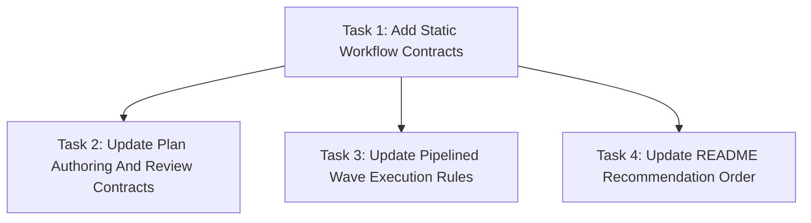

# Pipelined Separate Reviewer Workflow Implementation Plan

> **For agentic workers:** REQUIRED SUB-SKILL: Use `simplepower:subagent-driven-development` wave-by-wave. Dispatch one wave at a time, respect review boundaries, and keep task tracking in checkbox (`- [ ]`) syntax. Use `simplepower:executing-plans` only when subagents are unavailable or the user explicitly requests inline execution.

**Goal:** Make separate reviewer mode the recommended Simple Power implementation path, add deterministic fresh-context recommendation ordering, and allow pipelined next-wave implementation during current-wave review.

**Architecture:** Update the workflow contracts in `writing-plans`, `subagent-driven-development`, the plan reviewer prompt, README, and static tests. The tests define stable text contracts first, then the skill docs are changed to satisfy those contracts without changing runtime scripts.

**Tech Stack:** Markdown skill files, Bash static test harness, README documentation.

**Model Allocation:** FAST/BEST tiers are assigned per task and wave below. FAST defaults to `SIMPLEPOWER_FAST_MODEL` (`gpt-5.4-mini-high` when unset). BEST defaults to `SIMPLEPOWER_BEST_MODEL` (`gpt-5.5-high` when unset). Fixers always use BEST.

**Commit Policy:** Workers, reviewers, and fixers must not commit. The coordinator commits the spec and plan after plan self-review, commits each verified wave after `Task Progress` is updated, and creates a final commit only if final verification leaves uncommitted changes.

---

## File Structure

- `tests/simplepower-static/run-tests.sh`: owns static regression checks for Simple Power workflow text. Add assertions for separate-reviewer recommendation order, `wc -c` threshold wording, pipelined DAG semantics, and README ordering.
- `skills/writing-plans/SKILL.md`: owns plan format, self-review, model approval, and implementation handoff. Update it so separate reviewer mode is recommended first, context-size routing uses `wc -c`, and plans define implementation/review/acceptance readiness plus interface contracts.
- `skills/writing-plans/plan-document-reviewer-prompt.md`: owns plan review criteria. Add checks for separate-reviewer-first handoff, context-size routing, pipelined readiness states, interface contracts, provisional downstream work, and checkpoint gating.
- `skills/subagent-driven-development/SKILL.md`: owns wave execution. Update the process, wave rules, task progress, checkpoint commits, and red flags to allow provisional next-wave implementation during current-wave separate review while preserving upstream acceptance gates.
- `README.md`: owns user-facing workflow overview and `/clear` examples. Reorder `/clear` examples so separate reviewer is first and document that it is the recommended path.

Each file has one responsibility and the tasks below keep write scopes exact. Shared behavior between `writing-plans` and `subagent-driven-development` is expressed through explicit terms: implementation readiness, review readiness, acceptance readiness, interface contracts, provisional downstream work, and upstream acceptance.

## Task Progress

| Task | Implemented | Reviewed | Fixed | Verified |
|------|-------------|----------|-------|----------|
| Task 1: Add Static Workflow Contracts | [x] | [x] | N/A | [x] |
| Task 2: Update Plan Authoring And Review Contracts | [x] | [x] | [x] | [x] |
| Task 3: Update Pipelined Wave Execution Rules | [x] | [x] | N/A | [x] |
| Task 4: Update README Recommendation Order | [x] | [x] | N/A | [x] |

## Model Allocation

| Stage | Execution role | Model tier | Resolved default | Reason |
|-------|----------------|------------|------------------|--------|
| Task 1 implementation | `sp-impl` | FAST | `gpt-5.4-mini`, `high` | Localized Bash assertions with exact expected strings. |
| Task 1 review | `reviewer` | FAST | `gpt-5.4-mini`, `high` | Static test additions are narrow and easy to inspect. |
| Task 2 implementation | `sp-impl` | BEST | `gpt-5.5`, `high` | Cross-cutting workflow contract that affects planning, handoff, and plan review. |
| Task 2 review | `reviewer` | BEST | `gpt-5.5`, `high` | Review must catch semantic contradictions in workflow guidance. |
| Task 3 implementation | `sp-impl` | BEST | `gpt-5.5`, `high` | Behavior-shaping execution rules with concurrency and checkpoint implications. |
| Task 3 review | `reviewer` | BEST | `gpt-5.5`, `high` | Review must validate acceptance gates and provisional downstream semantics. |
| Task 4 implementation | `sp-impl` | FAST | `gpt-5.4-mini`, `high` | README reorder and short prose update. |
| Task 4 review | `reviewer` | FAST | `gpt-5.4-mini`, `high` | User-facing docs change is localized. |
| Any fixer | `fixer` | BEST | `gpt-5.5`, `high` | All fixer stages use BEST by policy. |

## Dependency Graph



Task 1 defines the static text contracts. Tasks 2, 3, and 4 can run in parallel after Task 1 because their write scopes do not overlap. The bottleneck is Task 1 because it creates the failing checks that establish the implementation target.

## Dispatch Plan

### Wave 1

- Tasks: Task 1.
- Dependencies already satisfied: approved spec.
- Parallel tasks: none.
- Implementation readiness: the approved spec is available.
- Review readiness: `tests/simplepower-static/run-tests.sh` has new failing assertions.
- Acceptance readiness: the static test fails for the new expected strings before implementation, then passes after Tasks 2-4.
- Interface contracts produced: exact static assertion strings that downstream skill and README edits must satisfy.
- Review boundary: reviewer confirms the assertions cover `writing-plans`, SDD, plan reviewer prompt, and README.
- Implementation role: `sp-impl`.
- Review mode: separate reviewer.
- Reviewer role: `reviewer`.
- Fixer policy: BEST-tier `fixer` only when review or verification finds issues requiring edits.
- Model tiers: FAST implementation, FAST review, BEST fixer if needed.
- Verification before downstream work starts: `bash tests/simplepower-static/run-tests.sh` should fail before Tasks 2-4 because new strings are absent. After Tasks 2-4, the same command must pass.

### Wave 2

- Tasks: Task 2, Task 3, Task 4.
- Dependencies already satisfied: Task 1 implemented and write-scope validated.
- Parallel tasks: Task 2, Task 3, and Task 4 may run in parallel because they modify disjoint files.
- Implementation readiness: Task 1 static contracts are present.
- Review readiness: each task's file changes are complete and write scopes validate.
- Acceptance readiness: each task is reviewed; any fixes are applied; `bash tests/simplepower-static/run-tests.sh` passes; `Task Progress` is updated; the coordinator checkpoint commit is created.
- Interface contracts produced:
  - Task 2: plan authoring terms and handoff ordering consumed by future generated plans and plan review.
  - Task 3: SDD execution terms consumed by coordinators running pipelined separate reviewer mode.
  - Task 4: README user command ordering consumed by fresh-context users.
- Review boundary: separate reviewers confirm each file matches the approved spec and the static assertions.
- Implementation role: `sp-impl`.
- Review mode: separate reviewer.
- Reviewer role: `reviewer`.
- Fixer policy: BEST-tier `fixer` only when review or verification finds issues requiring edits.
- Model tiers: Task 2 BEST implementation/review; Task 3 BEST implementation/review; Task 4 FAST implementation/review; BEST fixer if needed.
- Verification before downstream acceptance: `bash tests/simplepower-static/run-tests.sh` must pass.

## Write Scope Table

| Task | Write scope | Files | Parallel | Risk | Review boundary | Execution role | Model tier | Review mode | Fixer policy | Verification |
|------|-------------|-------|----------|------|-----------------|----------------|------------|-------------|--------------|--------------|
| Task 1 | Add static assertions only. | `tests/simplepower-static/run-tests.sh` | No in Wave 1. | Medium because assertions define the implementation contract. | New assertions fail before implementation and cover all spec goals. | `sp-impl` | FAST | separate reviewer | BEST-tier `fixer` only when review or verification finds issues requiring edits. | `bash tests/simplepower-static/run-tests.sh` fails before Tasks 2-4; passes after Wave 2. |
| Task 2 | Update planning and plan-review text only. | `skills/writing-plans/SKILL.md`, `skills/writing-plans/plan-document-reviewer-prompt.md` | Yes with Tasks 3 and 4 after Task 1. | High because this changes the generated plan and handoff contract. | Reviewer confirms handoff ordering, `wc -c`, readiness states, interface contracts, and plan review checks. | `sp-impl` | BEST | separate reviewer | BEST-tier `fixer` only when review or verification finds issues requiring edits. | `bash tests/simplepower-static/run-tests.sh` |
| Task 3 | Update SDD execution contract only. | `skills/subagent-driven-development/SKILL.md` | Yes with Tasks 2 and 4 after Task 1. | High because this changes concurrency and acceptance rules. | Reviewer confirms provisional downstream implementation cannot be accepted before upstream acceptance. | `sp-impl` | BEST | separate reviewer | BEST-tier `fixer` only when review or verification finds issues requiring edits. | `bash tests/simplepower-static/run-tests.sh` |
| Task 4 | Update README workflow docs only. | `README.md` | Yes with Tasks 2 and 3 after Task 1. | Low because this is localized user-facing documentation. | Reviewer confirms separate reviewer appears before inline reviewer and is labeled recommended. | `sp-impl` | FAST | separate reviewer | BEST-tier `fixer` only when review or verification finds issues requiring edits. | `bash tests/simplepower-static/run-tests.sh` |

Shared-file overlap: none. The plan file itself is updated only by the coordinator for `Task Progress`; workers do not edit this plan unless explicitly assigned by the coordinator.

## Implied Write-Scope Audit

- Task 1 steps mention only `tests/simplepower-static/run-tests.sh`; its write scope includes that file.
- Task 2 steps mention `skills/writing-plans/SKILL.md` and `skills/writing-plans/plan-document-reviewer-prompt.md`; its write scope includes both files.
- Task 3 steps mention only `skills/subagent-driven-development/SKILL.md`; its write scope includes that file.
- Task 4 steps mention only `README.md`; its write scope includes that file.
- Verification uses existing test runner files but does not require workers to edit them outside Task 1.

## Task 1: Add Static Workflow Contracts

**Depends on:** none
**Write scope:** `tests/simplepower-static/run-tests.sh`
**Parallel:** No.
**Risk:** Medium, because the new assertions define the rest of the implementation contract.
**Review boundary:** The reviewer confirms the assertions cover recommendation order, byte threshold routing, DAG readiness terms, interface contracts, provisional downstream work, checkpoint gating, and README ordering.
**Execution role:** `sp-impl`
**Model tier:** FAST, because the change is localized Bash assertions.
**Review mode:** separate reviewer
**Fixer policy:** BEST-tier `fixer` only when review or verification finds issues requiring edits.
**Verification:** `bash tests/simplepower-static/run-tests.sh`; expected before Tasks 2-4: FAIL on the new assertions. Expected after Wave 2: PASS.

**Files:**
- Modify: `tests/simplepower-static/run-tests.sh`

- [ ] **Step 1: Add writing-plans recommendation and threshold assertions**

In `tests/simplepower-static/run-tests.sh`, after the existing `writing-plans` assertions around `/clear`, `sp-impl-reviewer`, and `BEST-tier fixer`, add:

```bash
require_contains "skills/writing-plans/SKILL.md" "Subagent impl in this session, separate reviewer (Recommended)" "writing-plans recommends current-session separate reviewer"
require_contains "skills/writing-plans/SKILL.md" "Fresh-context subagent impl, separate reviewer (Recommended)" "writing-plans recommends fresh-context separate reviewer when context is large"
require_contains "skills/writing-plans/SKILL.md" 'wc -c "$SPEC_PATH" "$PLAN_PATH"' "writing-plans uses wc byte counts for context recommendation"
require_contains "skills/writing-plans/SKILL.md" "greater than 35840 bytes" "writing-plans uses strict 35 KiB context threshold"
require_contains "skills/writing-plans/SKILL.md" "implementation readiness" "writing-plans requires implementation readiness in DAG planning"
require_contains "skills/writing-plans/SKILL.md" "review readiness" "writing-plans requires review readiness in DAG planning"
require_contains "skills/writing-plans/SKILL.md" "acceptance readiness" "writing-plans requires acceptance readiness in DAG planning"
require_contains "skills/writing-plans/SKILL.md" "interface contracts" "writing-plans requires interface contracts for pipelined dependencies"
require_contains "skills/writing-plans/SKILL.md" "provisional" "writing-plans describes provisional downstream work"
```

- [ ] **Step 2: Add plan reviewer assertions**

After the existing `plan-document-reviewer-prompt.md` assertions, add:

```bash
require_contains "skills/writing-plans/plan-document-reviewer-prompt.md" "separate reviewer mode is the first recommendation" "plan reviewer checks separate reviewer recommendation order"
require_contains "skills/writing-plans/plan-document-reviewer-prompt.md" "wc -c" "plan reviewer checks wc-based context sizing"
require_contains "skills/writing-plans/plan-document-reviewer-prompt.md" "greater than 35840" "plan reviewer checks strict context threshold"
require_contains "skills/writing-plans/plan-document-reviewer-prompt.md" "implementation readiness, review readiness, and acceptance readiness" "plan reviewer checks pipelined readiness states"
require_contains "skills/writing-plans/plan-document-reviewer-prompt.md" "interface contract" "plan reviewer checks interface contracts"
require_contains "skills/writing-plans/plan-document-reviewer-prompt.md" "downstream work is provisional" "plan reviewer checks provisional downstream work"
```

- [ ] **Step 3: Add SDD pipelining assertions**

After the existing `subagent-driven-development` checkpoint and red-flag assertions, add:

```bash
require_contains "skills/subagent-driven-development/SKILL.md" "Pipelined Separate Reviewer Mode" "SDD documents pipelined separate reviewer mode"
require_contains "skills/subagent-driven-development/SKILL.md" "wave N+1 implementation" "SDD allows next-wave implementation during current review"
require_contains "skills/subagent-driven-development/SKILL.md" "provisional" "SDD marks downstream work provisional"
require_contains "skills/subagent-driven-development/SKILL.md" "upstream acceptance" "SDD gates downstream acceptance on upstream acceptance"
require_contains "skills/subagent-driven-development/SKILL.md" "before accepting, verifying, or checkpointing downstream work" "SDD updates checkpoint gating for pipelined execution"
require_contains "skills/subagent-driven-development/SKILL.md" "invalidates an interface" "SDD handles reviewer findings that invalidate downstream interfaces"
```

- [ ] **Step 4: Add README ordering assertions**

After the existing README `/clear` assertion, add:

```bash
require_contains "README.md" "Separate reviewer (Recommended)" "README recommends separate reviewer for fresh-session implementation"
require_contains "README.md" "Inline reviewer" "README still documents inline reviewer"
```

- [ ] **Step 5: Run the static test to verify it fails before implementation**

Run:

```bash
bash tests/simplepower-static/run-tests.sh
```

Expected before Tasks 2-4: FAIL, with missing expected strings from `skills/writing-plans/SKILL.md`, `skills/writing-plans/plan-document-reviewer-prompt.md`, `skills/subagent-driven-development/SKILL.md`, and `README.md`.

- [ ] **Step 6: Report task completion without committing**

State: `Do not commit from this task. Changed file: tests/simplepower-static/run-tests.sh. Verification: bash tests/simplepower-static/run-tests.sh failed as expected before implementation. Remaining dependencies: Tasks 2-4 must satisfy the new assertions.`

## Task 2: Update Plan Authoring And Review Contracts

**Depends on:** Task 1
**Write scope:** `skills/writing-plans/SKILL.md`, `skills/writing-plans/plan-document-reviewer-prompt.md`
**Parallel:** Yes, with Tasks 3 and 4 after Task 1.
**Risk:** High, because it changes generated plan structure and implementation handoff behavior.
**Review boundary:** The reviewer confirms the plan authoring text is separate-reviewer-first, uses deterministic byte count routing, defines readiness states and interface contracts, and makes downstream work provisional.
**Execution role:** `sp-impl`
**Model tier:** BEST, because this is broad workflow text.
**Review mode:** separate reviewer
**Fixer policy:** BEST-tier `fixer` only when review or verification finds issues requiring edits.
**Verification:** `bash tests/simplepower-static/run-tests.sh`; expected after Wave 2: PASS.

**Files:**
- Modify: `skills/writing-plans/SKILL.md`
- Modify: `skills/writing-plans/plan-document-reviewer-prompt.md`

- [ ] **Step 1: Update the writing-plans overview**

In `skills/writing-plans/SKILL.md`, update the overview sentence so it names interface contracts and pipelined separate-reviewer execution:

```markdown
Write comprehensive implementation plans assuming the engineer has zero context for our codebase and questionable taste. Document everything they need to know: which files to touch for each task, code, testing, docs they might need to check, how to test it. Give them the whole plan as bite-sized tasks organized as a dependency graph with explicit dispatch waves, interface contracts, implementation readiness, review readiness, acceptance readiness, role routing, model tiers, fixer policy, and coordinator checkpoint commits. Plan primarily for separate reviewer mode while preserving inline reviewer mode as an available lower-latency variant. DRY. YAGNI. TDD where relevant. No worker commits or per-task commits.
```

- [ ] **Step 2: Add plan DAG readiness requirements**

In the `## Dependency Graph` section, after the paragraph that says the graph must make parallelism obvious, add:

```markdown
Plan primarily for separate reviewer mode. Distinguish these states when a downstream wave depends on an upstream wave:
- **Implementation readiness:** dependencies required before `sp-impl` may start.
- **Review readiness:** implementation is complete and write-scope validation has passed.
- **Acceptance readiness:** review, required fixes, verification, `Task Progress`, and coordinator checkpoint commit are complete.

Avoid vague "wave complete" wording when the plan means implementation-complete, reviewed, or verified.
```

- [ ] **Step 3: Add dispatch-plan interface contract requirements**

In the `## Dispatch Plan` section, add `The interface contracts produced for downstream tasks` to the wave fields. The field list should include:

```markdown
- The interface contracts produced for downstream tasks
- Which upstream interface contracts each downstream task relies on
```

Then add this paragraph after the existing parallel safety paragraph:

```markdown
Because separate reviewer mode pipelines review and downstream implementation by default, every wave that feeds downstream work must name its interface contracts. Contracts may include public functions, command behavior, file formats, skill text rules, generated document structure, test fixtures, or other externally consumed behavior.
```

- [ ] **Step 4: Update task structure with readiness and contracts**

In the task template, after `**Review boundary:**`, add:

```markdown
**Implementation readiness:** What upstream implementation outputs must exist before this task can start.
**Review readiness:** What must be true before this task can be reviewed.
**Acceptance readiness:** What must be true before downstream work can be accepted.
**Interface contracts:** Contracts this task produces or consumes.
```

- [ ] **Step 5: Update self-review checks**

In `## Self-Review`, add a new check after parallel safety:

```markdown
**4. Pipelined readiness and contracts:** Does the DAG distinguish implementation readiness, review readiness, and acceptance readiness where downstream work can overlap with upstream review? Does every pipelined dependency name the interface contracts it consumes or produces? Does the plan say downstream work is provisional until upstream acceptance?
```

Renumber the following checks by one if needed. The final checklist should still include implied write-scope audit, role and tier routing, verification coverage, commit policy, task progress coverage, placeholder scan, type consistency, and approved path enforcement.

- [ ] **Step 6: Replace implementation path choices with separate-reviewer-first choices**

In `## Execution Handoff`, replace the current implementation-path options with:

````markdown
Before asking which implementation path to use, compute the combined saved spec
and plan size:

```bash
wc -c "$SPEC_PATH" "$PLAN_PATH"
```

If the combined byte count is greater than 35840 bytes, recommend fresh context
first. If it is 35840 bytes or less, recommend current-session execution first.
Use bytes from the saved files, not characters, lines, or token estimates.

Current-session options when the combined byte count is 35840 bytes or less:

1. **Subagent impl in this session, separate reviewer (Recommended)** - Use
   `simplepower:subagent-driven-development` with `sp-impl`, then `reviewer`,
   then BEST-tier `fixer` only if needed. Downstream implementation may run
   provisionally during upstream review when the plan's pipelined readiness and
   interface-contract rules are satisfied.
2. **Subagent impl in this session, inline reviewer** - Use
   `simplepower:subagent-driven-development` with `sp-impl-reviewer` workers.
3. **Inline impl in this session, separate reviewer** - Use
   `simplepower:executing-plans`; the main agent implements, then dispatches
   `reviewer`, then BEST-tier `fixer` only if needed.
4. **Inline impl in this session, inline reviewer** - Use
   `simplepower:executing-plans`; the main agent implements and self-reviews.

Fresh-context options when the combined byte count is greater than 35840 bytes:

1. **Fresh-context subagent impl, separate reviewer (Recommended)** - Run
   `/clear`, then use `simplepower:subagent-driven-development` with `sp-impl`,
   then `reviewer`, then BEST-tier `fixer` only if needed.
2. **Fresh-context subagent impl, inline reviewer** - Run `/clear`, then use
   `simplepower:subagent-driven-development` with `sp-impl-reviewer` workers.
````

- [ ] **Step 7: Reorder `/clear` command examples**

In `## Execution Handoff`, show the separate reviewer `/clear` command before the inline reviewer command. Use this separate reviewer command:

```text
/clear
Use `simplepower:subagent-driven-development` to execute
`<PLAN_PATH>` wave-by-wave with subagent implementation and separate reviewer
mode. Use the plan's approved FAST/BEST model allocation. Use `sp-impl` for
implementation, `reviewer` for spec and quality review, and BEST-tier `fixer`
for any required fix pass. Treat downstream implementation as provisional until
upstream review, fixes, verification, Task Progress update, and checkpoint
commit are complete.
```

Then keep an inline reviewer command after it:

```text
/clear
Use `simplepower:subagent-driven-development` to execute
`<PLAN_PATH>` wave-by-wave with subagent implementation and inline reviewer
mode. Use the plan's approved FAST/BEST model allocation. Use
`sp-impl-reviewer` for implementation plus self-review and BEST-tier `fixer` for
any required fix pass.
```

- [ ] **Step 8: Update plan reviewer checklist**

In `skills/writing-plans/plan-document-reviewer-prompt.md`, add rows to the review table:

```markdown
| Recommendation Order | Separate reviewer mode is the first recommendation; inline reviewer remains available but is not first |
| Context Size Routing | The handoff uses `wc -c` on the saved spec and plan, recommends fresh context only when the combined byte count is greater than 35840, and recommends current-session execution at or below that threshold |
| Pipelined Readiness | The DAG distinguishes implementation readiness, review readiness, and acceptance readiness |
| Interface Contracts | Every pipelined downstream dependency names the upstream interface contract it relies on |
| Provisional Downstream Work | The plan says downstream work is provisional until upstream review, fixes, verification, progress update, and checkpoint commit are complete |
```

Also add this calibration sentence:

```markdown
Reject plans that allow pipelined downstream implementation without named interface contracts, or that allow downstream acceptance, verification, or checkpointing before upstream acceptance.
```

- [ ] **Step 9: Run static tests**

Run:

```bash
bash tests/simplepower-static/run-tests.sh
```

Expected after Wave 2: PASS if Tasks 3 and 4 are also complete; otherwise fail only on strings owned by unfinished parallel tasks.

- [ ] **Step 10: Report task completion without committing**

State: `Do not commit from this task. Changed files: skills/writing-plans/SKILL.md, skills/writing-plans/plan-document-reviewer-prompt.md. Verification: bash tests/simplepower-static/run-tests.sh passes if all Wave 2 tasks are complete; otherwise it fails only on expected strings owned by unfinished Tasks 3 or 4. Remaining risks: any failures from Tasks 3 or 4 if they are not complete.`

## Task 3: Update Pipelined Wave Execution Rules

**Depends on:** Task 1
**Write scope:** `skills/subagent-driven-development/SKILL.md`
**Parallel:** Yes, with Tasks 2 and 4 after Task 1.
**Risk:** High, because it changes wave concurrency, review gating, and commit timing.
**Review boundary:** The reviewer confirms that next-wave implementation may start during current-wave review only as provisional work and that downstream acceptance is blocked until upstream acceptance.
**Execution role:** `sp-impl`
**Model tier:** BEST, because execution semantics are behavior-shaping.
**Review mode:** separate reviewer
**Fixer policy:** BEST-tier `fixer` only when review or verification finds issues requiring edits.
**Verification:** `bash tests/simplepower-static/run-tests.sh`; expected after Wave 2: PASS.

**Files:**
- Modify: `skills/subagent-driven-development/SKILL.md`

- [ ] **Step 1: Update the core principle**

Replace the existing core principle paragraph with:

```markdown
**Core principle:** DAG-aware execution with explicit dependency checks,
bounded write scopes, task-level `Task Progress` updates, separate-reviewer
pipelining where downstream implementation may run provisionally during
upstream review, verification before downstream acceptance, subagent lifecycle
checkpoints after final results are consumed, and coordinator checkpoint commits
after verified wave progress is saved.
```

- [ ] **Step 2: Add a Pipelined Separate Reviewer Mode section**

After `## Implied Write-Scope Corrections`, add:

```markdown
## Pipelined Separate Reviewer Mode

In separate reviewer mode, wave N+1 implementation may start after wave N
implementation workers finish and the coordinator validates wave N changed
files against wave N write scopes. Wave N review may run at the same time as
wave N+1 implementation.

This pipelining is the default when the plan's dependency graph allows wave
N+1 to consume wave N implementation outputs, write scopes do not collide, and
the plan names the upstream interface contracts that wave N+1 depends on.

Wave N+1 implementation is provisional until wave N reaches upstream
acceptance: review is accepted, required fixes are complete, verification
passes, `Task Progress` is updated, and the wave checkpoint commit is created.
Do not accept, verify, or checkpoint downstream work before upstream
acceptance.

If wave N review or verification invalidates an interface consumed by running
wave N+1 work, let already-running workers finish by default, but do not accept
their result as-is. Treat the downstream work as needing adjustment before
acceptance.
```

- [ ] **Step 3: Update process graph wording**

In the process graph, add nodes or labels for provisional downstream implementation. The graph must include these exact labels somewhere:

```dot
"Start eligible wave N+1 implementation provisionally" [shape=box];
"Upstream acceptance complete?" [shape=diamond];
"Accept, verify, or checkpoint downstream work" [shape=box];
```

Connect them so provisional downstream work can start after write-scope validation in separate reviewer mode, while downstream acceptance waits until upstream review, fix, verification, progress update, and checkpoint commit are complete.

- [ ] **Step 4: Update wave rules**

Replace Wave Rules 5, 10, 12, and 13 with text that includes:

```markdown
5. Separate reviewer mode: dispatch one `sp-impl` worker per task in the wave,
   then dispatch `reviewer` after worker results and write-scope validation.
   After write-scope validation, eligible wave N+1 implementation may start
   provisionally while wave N review runs.
10. Run wave verification after review/fix and lifecycle cleanup, before
    accepting, verifying, or checkpointing downstream work.
12. Create a coordinator checkpoint commit after wave verification and Task
    Progress updates, even if eligible downstream implementation has already
    started.
13. Accept downstream work only after the upstream checkpoint commit succeeds.
```

- [ ] **Step 5: Update Task Progress rules**

Replace the paragraph that currently says not to start downstream waves until all current-wave progress cells are complete with:

```markdown
In separate reviewer mode, downstream implementation may start provisionally
after upstream implementation is accepted and write scopes validate. Do not mark
downstream tasks `Reviewed` or `Verified`, run downstream acceptance
verification, or checkpoint downstream work until every upstream task it depends
on has `Implemented`, `Reviewed`, and `Verified` checked, with `Fixed` set to
either `[x]` or `N/A`, and the upstream checkpoint commit has succeeded.
```

- [ ] **Step 6: Update checkpoint commit wording**

In `## Coordinator Checkpoint Commits`, replace the opening paragraph with:

```markdown
Every wave is reviewed, fixed if needed, verified, reflected in `Task
Progress`, then committed before downstream work is accepted. The coordinator
checkpoint commit happens after wave verification and Task Progress updates,
even if eligible downstream implementation has already started, but before
accepting, verifying, or checkpointing downstream work.
```

Replace any sentence that says the coordinator must start downstream work only after the checkpoint with:

```markdown
If there are no current-wave file changes beyond already committed work, do not
create an empty commit. Record that no coordinator checkpoint commit was needed
for that wave before accepting, verifying, or checkpointing downstream work.
```

- [ ] **Step 7: Update red flags**

Replace red flags that forbid all downstream starts before current-wave review and verification with these:

```markdown
- Start downstream implementation before upstream implementation is accepted
  and write scopes validate
- Accept, verify, or checkpoint downstream work before upstream acceptance
- Treat provisional downstream implementation as reviewed, verified, or
  checkpoint-ready
- Ignore a reviewer finding that invalidates an interface consumed by running
  downstream work
```

- [ ] **Step 8: Run static tests**

Run:

```bash
bash tests/simplepower-static/run-tests.sh
```

Expected after Wave 2: PASS if Tasks 2 and 4 are also complete; otherwise fail only on strings owned by unfinished parallel tasks.

- [ ] **Step 9: Report task completion without committing**

State: `Do not commit from this task. Changed file: skills/subagent-driven-development/SKILL.md. Verification: bash tests/simplepower-static/run-tests.sh passes if all Wave 2 tasks are complete; otherwise it fails only on expected strings owned by unfinished Tasks 2 or 4. Remaining risks: any failures from Tasks 2 or 4 if they are not complete.`

## Task 4: Update README Recommendation Order

**Depends on:** Task 1
**Write scope:** `README.md`
**Parallel:** Yes, with Tasks 2 and 3 after Task 1.
**Risk:** Low, because this is a localized documentation update.
**Review boundary:** The reviewer confirms separate reviewer is shown before inline reviewer and marked recommended.
**Execution role:** `sp-impl`
**Model tier:** FAST, because the change is localized.
**Review mode:** separate reviewer
**Fixer policy:** BEST-tier `fixer` only when review or verification finds issues requiring edits.
**Verification:** `bash tests/simplepower-static/run-tests.sh`; expected after Wave 2: PASS.

**Files:**
- Modify: `README.md`

- [ ] **Step 1: Update the fresh-session intro**

In `README.md`, replace the paragraph under `## Starting Implementation After /clear` with:

```markdown
When you want to start implementation from a fresh session, run `/clear` first
and then use one of these commands. Separate reviewer mode is recommended
because the reviewer has fresh context and does not review its own
implementation.
```

- [ ] **Step 2: Move separate reviewer before inline reviewer**

Move the separate reviewer section above the inline reviewer section and change its heading to:

```markdown
### Separate reviewer (Recommended)
```

Keep the command body, but append the provisional downstream sentence:

```text
Treat downstream implementation as provisional until upstream review, fixes,
verification, Task Progress update, and checkpoint commit are complete.
```

- [ ] **Step 3: Keep inline reviewer as available**

Keep the inline reviewer section after separate reviewer with this heading:

```markdown
### Inline reviewer
```

Do not remove the existing inline reviewer command.

- [ ] **Step 4: Run static tests**

Run:

```bash
bash tests/simplepower-static/run-tests.sh
```

Expected after Wave 2: PASS if Tasks 2 and 3 are also complete; otherwise fail only on strings owned by unfinished parallel tasks.

- [ ] **Step 5: Report task completion without committing**

State: `Do not commit from this task. Changed file: README.md. Verification: bash tests/simplepower-static/run-tests.sh passes if all Wave 2 tasks are complete; otherwise it fails only on expected strings owned by unfinished Tasks 2 or 3. Remaining risks: any failures from Tasks 2 or 3 if they are not complete.`

## Final Verification

After all tasks are implemented, reviewed, fixed if needed, and verified:

1. Run:

   ```bash
   bash tests/simplepower-static/run-tests.sh
   ```

   Expected: PASS.

2. Run:

   ```bash
   bash tests/explicit-skill-requests/run-all.sh
   ```

   Expected: PASS.

3. Inspect:

   ```bash
   git status --short
   ```

   Expected: only intended files changed unless coordinator checkpoint commits have already consumed them.

4. Confirm `Task Progress` has every task marked `Implemented`, `Reviewed`, and `Verified`, with `Fixed` as `N/A` or `[x]`.

5. Create the final coordinator commit only if final verification leaves uncommitted changes.
