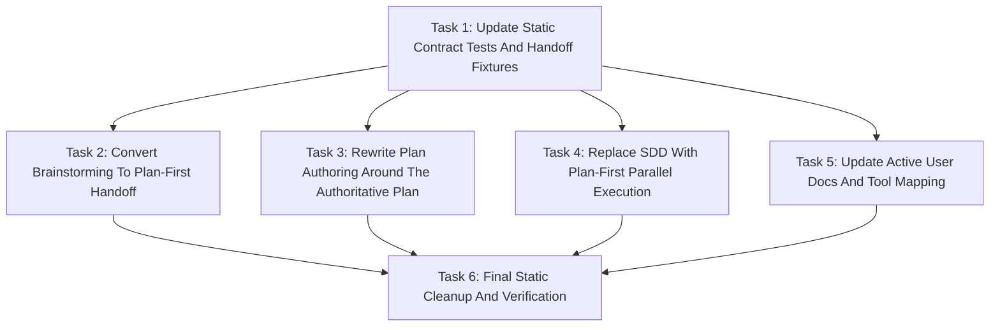

# Plan-First Parallel Workflow Implementation Plan

> **For agentic workers:** REQUIRED SUB-SKILL: Use `simplepower:subagent-driven-development` wave-by-wave. Dispatch one wave at a time, respect review boundaries, and keep task tracking in checkbox (`- [ ]`) syntax. Use `simplepower:executing-plans` only when subagents are unavailable or the user explicitly requests inline execution. This transition plan uses the current execution format only to replace the active workflow with plan-first parallel implementation.

**Goal:** Replace Simple Power's active spec-first, wave-review workflow with a plan-first parallel implementation workflow.

**Architecture:** Brainstorming remains the conversational design gate, then hands directly to plan writing. The plan becomes the only authoritative artifact, reviewed by a BEST-tier plan reviewer, approved by the user, and executed through broad parallel `sp-impl` file-edit workers, a quick verifier, and one BEST-tier review+fix agent.

**Tech Stack:** Markdown skills and docs, Bash static tests, Codex skill prompt templates, existing Simple Power repository layout.

**Model Allocation:** FAST/BEST tiers are assigned per task and wave below. FAST defaults to `SIMPLEPOWER_FAST_MODEL` (`gpt-5.4-mini-high` when unset). BEST defaults to `SIMPLEPOWER_BEST_MODEL` (`gpt-5.5-high` when unset). Fixers always use BEST. The new quick verifier role must use `model="gpt-5.3-codex-spark"` and `reasoning_effort="high"`.

**Commit Policy:** Workers, reviewers, and fixers must not commit. The coordinator commits the spec and plan after plan self-review, commits each verified wave after `Task Progress` is updated, and creates a final commit only if final verification leaves uncommitted changes. The implementation changes the future active workflow to these checkpoints: after accepted plan, after all file edits plus quick verification before review, and after final review/fix plus final verification.

---

## Design Summary

The approved design keeps `simplepower:brainstorming` as the valuable front
door, but removes standalone spec files from future normal use. After
brainstorming questions and conversational design approval, Simple Power invokes
`simplepower:writing-plans` directly. `writing-plans` saves one plan under
`docs/simplepower/plans/` with a compact `Design Summary`, exact file
ownership, model allocation, review allocation, verification commands, timeout
requirements, `/clear` handoff guidance, and three coordinator commit
checkpoints.

Before implementation, a BEST-tier plan reviewer checks the plan and
allocation. The user approves both. The coordinator commits the accepted plan.
Implementation then dispatches all non-conflicting `sp-impl` file-edit workers
in parallel. After all workers finish, a quick verifier using
`gpt-5.3-codex-spark` high effort runs linting, build/compile checks, and tests
with proper timeouts. It may fix only tiny typo-level issues. The coordinator
commits the quick-verified implementation, then dispatches one BEST-tier
review+fix agent for whole-implementation review and fixes. The coordinator
runs final verification, commits final changes, and reports.

## Task Progress

| Task | Implemented | Reviewed | Fixed | Verified |
|------|-------------|----------|-------|----------|
| Task 1: Update Static Contract Tests And Handoff Fixtures | [x] | [x] | [x] | [x] |
| Task 2: Convert Brainstorming To Plan-First Handoff | [x] | [x] | [x] | [x] |
| Task 3: Rewrite Plan Authoring Around The Authoritative Plan | [x] | [x] | [x] | [x] |
| Task 4: Replace SDD With Plan-First Parallel Execution | [x] | [x] | N/A | [x] |
| Task 5: Update Active User Docs And Tool Mapping | [x] | [x] | [x] | [x] |
| Task 6: Final Static Cleanup And Verification | [x] | [x] | N/A | [x] |

## Model Allocation

| Stage | Execution role | Model tier | Resolved default model and effort | Reason |
|-------|----------------|------------|-----------------------------------|--------|
| Task 1 implementation | `sp-impl` | BEST | `model="gpt-5.5"`, `reasoning_effort="high"` | Static tests define the new active workflow contract and touch many assertions. |
| Task 1 review | `reviewer` | BEST | `model="gpt-5.5"`, `reasoning_effort="high"` | The test contract must reject old flow wording without overmatching historical archives. |
| Task 2 implementation | `sp-impl` | BEST | `model="gpt-5.5"`, `reasoning_effort="high"` | Brainstorming changes the workflow entry point and removes a user-facing gate. |
| Task 2 review | `reviewer` | BEST | `model="gpt-5.5"`, `reasoning_effort="high"` | Review must catch any leftover spec-writing or spec-review instruction. |
| Task 3 implementation | `sp-impl` | BEST | `model="gpt-5.5"`, `reasoning_effort="high"` | `writing-plans` is the core behavior being redesigned. |
| Task 3 review | `reviewer` | BEST | `model="gpt-5.5"`, `reasoning_effort="high"` | Plan reviewer, user approval, handoff, and commit policy must be internally consistent. |
| Task 4 implementation | `sp-impl` | BEST | `model="gpt-5.5"`, `reasoning_effort="high"` | SDD and prompt roles are cross-cutting and remove old reviewer/fixer routing. |
| Task 4 review | `reviewer` | BEST | `model="gpt-5.5"`, `reasoning_effort="high"` | Review must verify role boundaries and model routing. |
| Task 5 implementation | `sp-impl` | BEST | `model="gpt-5.5"`, `reasoning_effort="high"` | Active docs and tool mapping must align with deleted or renamed roles. |
| Task 5 review | `reviewer` | BEST | `model="gpt-5.5"`, `reasoning_effort="high"` | Review must catch stale user-facing old-flow references. |
| Task 6 implementation | `sp-impl` | BEST | `model="gpt-5.5"`, `reasoning_effort="high"` | Final cleanup is cross-file and verification-focused. |
| Any required fixer | `fixer` | BEST | `model="gpt-5.5"`, `reasoning_effort="high"` | Fixers always use BEST. |

## Dependency Graph



Task 1 establishes the new static contract. Tasks 2, 3, 4, and 5 can run in
parallel after Task 1 because their write scopes do not overlap. Task 6 waits
for all implementation tasks so it can run repo-wide verification and fix
contract drift inside the already-approved file set.

## Dispatch Plan

### Wave 1: Static Contract

- **Tasks:** Task 1.
- **Dependencies satisfied:** Approved design exists at `docs/simplepower/specs/2026-05-06-plan-first-parallel-workflow-design.md`.
- **Parallelism:** No parallel task in this wave.
- **Review boundary:** Static tests encode the new plan-first workflow and the handoff fixtures no longer ask for spec approval or wave-by-wave execution.
- **Interface contracts produced:** Test assertions for plan-first brainstorming, authoritative plans, quick verifier routing, one BEST review+fix agent, three future commit checkpoints, and `/clear` command text.
- **Downstream contracts consumed:** Tasks 2-5 consume the new static-test strings and absence checks.
- **Implementation role:** `sp-impl`.
- **Review mode:** separate reviewer.
- **Reviewer role:** `reviewer`.
- **Fixer policy:** BEST-tier `fixer` only when review or verification finds issues requiring edits.
- **Model tier:** BEST for implementation and review because the test contract controls all downstream edits.
- **Implementation-readiness boundary:** Approved design is available.
- **Acceptance gate:** Task 1 review is complete, the focused red check fails for expected old-flow content, `Task Progress` is updated, and the coordinator checkpoint commit succeeds.

### Wave 2: Parallel Active Workflow Rewrite

- **Tasks:** Task 2, Task 3, Task 4, Task 5.
- **Dependencies satisfied:** Task 1 accepted and checkpointed.
- **Parallelism:** Tasks 2-5 may run in parallel because they own distinct file sets.
- **Review boundary:** Each task removes old-flow guidance from its owned files and satisfies the Task 1 static contract for those files.
- **Interface contracts produced:** Brainstorming handoff contract, plan authoring contract, SDD execution contract, prompt role contract, user-doc/tool-mapping contract.
- **Downstream contracts consumed:** Task 6 consumes all active workflow contracts and verifies them together.
- **Implementation role:** `sp-impl`.
- **Review mode:** separate reviewer.
- **Reviewer role:** `reviewer`.
- **Fixer policy:** BEST-tier `fixer` only when review or verification finds issues requiring edits.
- **Model tier:** BEST for all implementation and review stages because this wave changes core workflow behavior.
- **Implementation-readiness boundary:** Task 1's static assertions and fixture wording are committed.
- **Acceptance gate:** Tasks 2-5 are implemented, reviewed, fixed if required, focused checks pass for each task, `Task Progress` is updated, and the coordinator checkpoint commit succeeds.

### Wave 3: Final Cleanup And Verification

- **Tasks:** Task 6.
- **Dependencies satisfied:** Tasks 2-5 accepted and checkpointed.
- **Parallelism:** No parallel task in this wave.
- **Review boundary:** Static tests, prompt fixture tests, brainstorm server tests, and Codex plugin sync tests pass with explicit timeouts.
- **Interface contracts produced:** Final verified active workflow with no stale old-flow references in active guidance.
- **Downstream contracts consumed:** Final user handoff consumes the verification results and commit SHAs.
- **Implementation role:** `sp-impl`.
- **Review mode:** separate reviewer.
- **Reviewer role:** `reviewer`.
- **Fixer policy:** BEST-tier `fixer` only when review or verification finds issues requiring edits outside Task 6 cleanup.
- **Model tier:** BEST because final verification is cross-file.
- **Implementation-readiness boundary:** All earlier tasks are accepted.
- **Acceptance gate:** Final verification passes, `Task Progress` is complete, and any final uncommitted changes are committed.

## Write Scope Table

| Task | Write scope | Files | Parallel | Risk | Review boundary | Execution role | Model tier | Review mode | Fixer policy | Verification |
|------|-------------|-------|----------|------|-----------------|----------------|------------|-------------|--------------|--------------|
| Task 1 | Static tests and prompt fixtures only | `tests/simplepower-static/run-tests.sh`; `tests/skill-triggering/run-test.sh`; `tests/skill-triggering/prompts/approved-brainstorming-handoff.txt`; `tests/skill-triggering/prompts/approved-planning-handoff.txt`; `tests/explicit-skill-requests/run-test.sh`; `tests/explicit-skill-requests/prompts/action-oriented.txt`; `tests/explicit-skill-requests/prompts/after-planning-flow.txt`; `tests/explicit-skill-requests/prompts/codex-suggested-it.txt`; `tests/explicit-skill-requests/prompts/i-know-what-sdd-means.txt`; `tests/explicit-skill-requests/prompts/mid-conversation-execute-plan.txt`; `tests/explicit-skill-requests/prompts/skip-formalities.txt`; `tests/explicit-skill-requests/prompts/subagent-driven-development-please.txt` | No. It is scheduled alone to create tests first. | High, because a bad static contract can mask old-flow leftovers | New assertions fail against current old-flow files for the expected reasons | `sp-impl` | BEST | separate reviewer | BEST-tier `fixer` only for test-contract defects | `timeout 60s bash tests/simplepower-static/run-tests.sh` expected to fail before implementation with old-flow missing/new-flow absent assertions |
| Task 2 | Brainstorming and invocation contract docs | `skills/brainstorming/SKILL.md`; `skills/brainstorming/spec-document-reviewer-prompt.md`; `skills/using-simplepower/SKILL.md` | Yes with Tasks 3-5 | High, because this changes the workflow entry gate | Brainstorming no longer writes specs or asks for written spec review, and using-simplepower no longer says generated specs are normal | `sp-impl` | BEST | separate reviewer | BEST-tier `fixer` only for review or verification findings | `timeout 30s rg -n "docs/simplepower/specs|spec review|User reviews written spec|Write design doc" skills/brainstorming/SKILL.md skills/using-simplepower/SKILL.md` returns no active old-flow hits |
| Task 3 | Plan authoring and plan reviewer | `skills/writing-plans/SKILL.md`; `skills/writing-plans/plan-document-reviewer-prompt.md` | Yes with Tasks 2, 4, and 5 | High, because this is the authoritative future workflow | Writing-plans requires `Design Summary`, BEST plan review, user approval, plan-only `wc -c`, and the new implementation command | `sp-impl` | BEST | separate reviewer | BEST-tier `fixer` only for review or verification findings | `timeout 30s rg -n "Design Summary|BEST-tier plan reviewer|wc -c \\\"\\$PLAN_PATH\\\"|gpt-5.3-codex-spark|plan-first parallel implementation" skills/writing-plans` returns matches |
| Task 4 | SDD execution and role prompts | `skills/subagent-driven-development/SKILL.md`; `skills/subagent-driven-development/implementer-prompt.md`; `skills/subagent-driven-development/quick-verifier-prompt.md`; `skills/subagent-driven-development/review-fix-prompt.md`; `skills/subagent-driven-development/reviewer-prompt.md`; `skills/subagent-driven-development/fixer-prompt.md`; `skills/subagent-driven-development/impl-reviewer-prompt.md` | Yes with Tasks 2, 3, and 5 | High, because this removes old runtime roles and adds new verifier/review+fix roles | SDD describes broad parallel file-edit workers, quick verifier, pre-review commit, one BEST review+fix agent, final verification, and final commit | `sp-impl` | BEST | separate reviewer | BEST-tier `fixer` only for review or verification findings | `timeout 30s rg -n "plan-first parallel implementation|quick-verifier-prompt.md|review-fix-prompt.md|gpt-5.3-codex-spark|one BEST-tier review\\+fix agent" skills/subagent-driven-development` returns matches |
| Task 5 | Active user docs, plugin metadata, and tool mapping | `README.md`; `AGENTS.md`; `docs/README.codex.md`; `docs/testing.md`; `.codex-plugin/plugin.json`; `skills/using-simplepower/references/codex-tools.md`; `skills/executing-plans/SKILL.md`; remove empty `skills/executing-plans/`; `skills/finishing-a-development-branch/SKILL.md`; `skills/using-git-worktrees/SKILL.md` | Yes with Tasks 2-4 | High, because these are active user-facing and tool-routing docs | Active docs describe plan-first workflow, no generated spec requirement, no inline/separate reviewer choices, and no executing-plans routing | `sp-impl` | BEST | separate reviewer | BEST-tier `fixer` only for review or verification findings | `timeout 30s rg -n "wave-by-wave|wave-based|inline reviewer|separate reviewer|docs/simplepower/specs|simplepower:executing-plans" README.md AGENTS.md docs/README.codex.md docs/testing.md .codex-plugin/plugin.json skills/using-simplepower/references/codex-tools.md skills/finishing-a-development-branch/SKILL.md skills/using-git-worktrees/SKILL.md` returns no active old-flow hits |
| Task 6 | Final verification cleanup only | All files from Tasks 1-5, only for fixes required by final verification | Same as Tasks 1-5 | No | High, because this validates the complete active workflow | All required verification commands pass and old-flow scans are clean outside historical archives and this transition plan/spec | `sp-impl` | BEST | separate reviewer | BEST-tier `fixer` only if final review finds issues requiring edits | Full verification commands listed in Task 6 |

## Implied Write-Scope Audit

- **Task 1:** The task text names only static test and fixture files. Every fixture path named in the steps appears in the write scope. No skill or docs file is edited by this task.
- **Task 2:** The task text requires changing brainstorming checklist, process flow, after-design handoff, and removing spec reviewer routing. `skills/brainstorming/SKILL.md`, `skills/brainstorming/spec-document-reviewer-prompt.md`, and `skills/using-simplepower/SKILL.md` are all in scope.
- **Task 3:** The task text requires changing plan structure, plan review prompt, model allocation approval, plan-only context sizing, and implementation handoff. Both `skills/writing-plans/SKILL.md` and `skills/writing-plans/plan-document-reviewer-prompt.md` are in scope.
- **Task 4:** The task text requires changing SDD runtime instructions and role prompts. `SKILL.md`, implementer prompt, old reviewer/fixer/inline prompt files, and the new quick verifier and review+fix prompt files are in scope.
- **Task 5:** The task text requires changing active user docs, AGENTS contributor notes, plugin metadata, tool mapping, and active skills that reference `executing-plans`. Every path named by the old-flow scan is in scope. Wave 2 implied-scope correction: because the static contract requires the retired `skills/executing-plans` directory to be absent and the task already says to delete executing-plans, Task 5 also owns removing the empty `skills/executing-plans/` directory after deleting its `SKILL.md`.
- **Task 6:** The task text may fix only files already owned by Tasks 1-5. This is exact because the file list is the union of those tasks' write scopes, and no new file may be added during final cleanup without fresh explicit approval.

## Tasks

### Task 1: Update Static Contract Tests And Handoff Fixtures

**Depends on:** None
**Write scope:** `tests/simplepower-static/run-tests.sh`, `tests/skill-triggering/run-test.sh`, `tests/skill-triggering/prompts/approved-brainstorming-handoff.txt`, `tests/skill-triggering/prompts/approved-planning-handoff.txt`, `tests/explicit-skill-requests/run-test.sh`, `tests/explicit-skill-requests/prompts/action-oriented.txt`, `tests/explicit-skill-requests/prompts/after-planning-flow.txt`, `tests/explicit-skill-requests/prompts/codex-suggested-it.txt`, `tests/explicit-skill-requests/prompts/i-know-what-sdd-means.txt`, `tests/explicit-skill-requests/prompts/mid-conversation-execute-plan.txt`, `tests/explicit-skill-requests/prompts/skip-formalities.txt`, `tests/explicit-skill-requests/prompts/subagent-driven-development-please.txt`
**Parallel:** No. This task establishes the contract for later parallel edits.
**Risk:** High, because static tests can either miss stale old-flow text or overmatch historical archives.
**Review boundary:** Tests assert the new plan-first workflow and fail against the current old-flow implementation.
**Implementation readiness:** Approved design file exists.
**Review readiness:** Test and fixture diffs are complete, with no skill/doc implementation edits.
**Acceptance readiness:** Review accepted, focused red check proves old files fail the new contract, and coordinator checkpoint commit succeeds.
**Interface contracts:** Produces required strings and absence checks consumed by Tasks 2-5.
**Execution role:** `sp-impl`
**Model tier:** BEST, because this is a repo-wide behavior contract.
**Review mode:** separate reviewer
**Fixer policy:** BEST-tier `fixer` only when review or verification finds issues requiring edits.
**Verification:** `timeout 60s bash tests/simplepower-static/run-tests.sh` should fail before Tasks 2-5 with old-flow assertion failures; `timeout 30s bash tests/skill-triggering/run-all.sh` and `timeout 30s bash tests/explicit-skill-requests/run-all.sh` should pass after fixture updates.

**Files:**
- Modify: `tests/simplepower-static/run-tests.sh`
- Modify: `tests/skill-triggering/run-test.sh`
- Modify: `tests/skill-triggering/prompts/approved-brainstorming-handoff.txt`
- Modify: `tests/skill-triggering/prompts/approved-planning-handoff.txt`
- Modify: `tests/explicit-skill-requests/run-test.sh`
- Modify: `tests/explicit-skill-requests/prompts/action-oriented.txt`
- Modify: `tests/explicit-skill-requests/prompts/after-planning-flow.txt`
- Modify: `tests/explicit-skill-requests/prompts/codex-suggested-it.txt`
- Modify: `tests/explicit-skill-requests/prompts/i-know-what-sdd-means.txt`
- Modify: `tests/explicit-skill-requests/prompts/mid-conversation-execute-plan.txt`
- Modify: `tests/explicit-skill-requests/prompts/skip-formalities.txt`
- Modify: `tests/explicit-skill-requests/prompts/subagent-driven-development-please.txt`

- [ ] **Step 1: Update brainstorming handoff fixture**

Replace `tests/skill-triggering/prompts/approved-brainstorming-handoff.txt` with:

```text
The conversation design has been approved. Invoke simplepower:writing-plans to create
the authoritative implementation plan.
```

- [ ] **Step 2: Update planning handoff fixture**

Replace `tests/skill-triggering/prompts/approved-planning-handoff.txt` with:

```text
The reviewed plan and model allocation are approved.
simplepower:subagent-driven-development, please execute it with plan-first parallel implementation.
```

- [ ] **Step 3: Update fixture test descriptions and expectations**

In `tests/skill-triggering/run-test.sh`, keep the same skill-name assertions but update user-facing descriptions so they no longer say "wave executor":

```bash
require_contains "simplepower:subagent-driven-development" "approved planning handoff names the plan-first implementation skill"
```

In `tests/explicit-skill-requests/run-test.sh`, update descriptions for `simplepower:subagent-driven-development` fixtures so they say "plan-first implementation skill" rather than "wave executor".

- [ ] **Step 4: Update explicit SDD prompt fixtures**

Replace old review-between-tasks or wave wording in the SDD prompt fixtures with plan-first wording. Use this pattern where a fixture contains explanatory text:

```text
I have my implementation plan ready at docs/simplepower/plans/auth-system.md.

I want to use simplepower:subagent-driven-development to execute it with plan-first parallel implementation. That means:
- Dispatch non-conflicting sp-impl file-edit workers according to the approved plan
- Run the quick verifier with lint/build/tests and timeouts
- Run one BEST-tier review+fix pass before final verification

Let's start.
```

Fixtures that only need a short request should use:

```text
simplepower:subagent-driven-development, please execute the plan with plan-first parallel implementation.
```

- [ ] **Step 5: Replace old static assertions with new active workflow checks**

In `tests/simplepower-static/run-tests.sh`, remove assertions that require the
retired standalone-spec workflow, wave execution, inline execution routing,
combined implement-review workers, or split review mode choices. Add assertions
for the new flow:

```bash
require_not_contains "skills/brainstorming/SKILL.md" "docs/simplepower/specs" "brainstorming no longer writes standalone specs"
require_not_contains "skills/brainstorming/SKILL.md" "User reviews written spec" "brainstorming no longer has a written spec review gate"
require_dir_absent "skills/brainstorming/spec-document-reviewer-prompt.md" "old brainstorming spec reviewer prompt is absent"
require_contains "skills/writing-plans/SKILL.md" "Design Summary" "writing-plans requires a compact design summary"
require_contains "skills/writing-plans/SKILL.md" "BEST-tier plan reviewer" "writing-plans dispatches a BEST-tier plan reviewer"
require_contains "skills/writing-plans/SKILL.md" 'wc -c "$PLAN_PATH"' "writing-plans sizes the saved plan file only"
require_contains "skills/writing-plans/SKILL.md" "greater than 35840 bytes" "writing-plans keeps the strict fresh-context threshold"
require_contains "skills/writing-plans/SKILL.md" "plan-first parallel implementation" "writing-plans emits the plan-first implementation handoff"
require_contains "skills/subagent-driven-development/SKILL.md" "plan-first parallel implementation" "SDD documents plan-first parallel implementation"
require_contains "skills/subagent-driven-development/SKILL.md" "quick-verifier-prompt.md" "SDD references the quick verifier prompt"
require_contains "skills/subagent-driven-development/SKILL.md" "review-fix-prompt.md" "SDD references the review+fix prompt"
require_contains "skills/subagent-driven-development/SKILL.md" "gpt-5.3-codex-spark" "SDD pins the quick verifier model"
require_file "skills/subagent-driven-development/quick-verifier-prompt.md" "quick verifier prompt file exists"
require_file "skills/subagent-driven-development/review-fix-prompt.md" "review+fix prompt file exists"
require_dir_absent "skills/subagent-driven-development/impl-reviewer-prompt.md" "retired inline reviewer prompt is absent"
require_dir_absent "skills/subagent-driven-development/reviewer-prompt.md" "retired per-wave reviewer prompt is absent"
require_dir_absent "skills/subagent-driven-development/fixer-prompt.md" "retired per-wave fixer prompt is absent"
require_dir_absent "skills/executing-plans" "retired inline execution skill is absent"
```

- [ ] **Step 6: Add active old-flow absence scan**

Add or update an active path scan in `tests/simplepower-static/run-tests.sh` so active docs and skills reject these old-flow strings:

```bash
active_plan_first_paths=(
    README.md
    AGENTS.md
    .codex-plugin/plugin.json
    docs/README.codex.md
    docs/testing.md
    skills/brainstorming
    skills/subagent-driven-development
    skills/using-simplepower
    skills/writing-plans
    skills/finishing-a-development-branch
    skills/using-git-worktrees
    tests/explicit-skill-requests
    tests/skill-triggering
)

require_no_active_match "wave-by-wave|wave-based|inline reviewer|separate reviewer|spec review|spec[+]plan|docs/simplepower/specs|simplepower:executing-plans|sp-impl-reviewer" "active files do not describe the retired spec/wave workflow" "${active_plan_first_paths[@]}"
require_no_active_match "too[[:space:]]+hard|easier[[:space:]]+alternate|optional[[:space:]]+shortcut|stub[[:space:]]+for[[:space:]]+now|document[[:space:]]+instead" "active files do not contain unapproved shortcut language" "${active_plan_first_paths[@]}"
```

Do not include `docs/simplepower/specs` or `docs/simplepower/plans` in this scan because historical artifacts and this transition plan intentionally mention the retired flow.

- [ ] **Step 7: Run fixture checks**

Run:

```bash
timeout 30s bash tests/skill-triggering/run-all.sh
timeout 30s bash tests/explicit-skill-requests/run-all.sh
```

Expected: both commands pass after fixture updates.

- [ ] **Step 8: Run the static red check**

Run:

```bash
timeout 60s bash tests/simplepower-static/run-tests.sh
```

Expected before Tasks 2-5: command fails because active workflow files still contain old-flow text and new prompt files do not exist. Record the first five failing assertion names in the task report.

- [ ] **Step 9: Report task completion without committing**

State: `Do not commit from this task. Report the changed files, fixture check results, static red-check result, and any concerns.`

### Task 2: Convert Brainstorming To Plan-First Handoff

**Depends on:** Task 1
**Write scope:** `skills/brainstorming/SKILL.md`, `skills/brainstorming/spec-document-reviewer-prompt.md`, `skills/using-simplepower/SKILL.md`
**Parallel:** Yes. Can run with Tasks 3, 4, and 5.
**Risk:** High, because this changes the entry workflow and removes the spec artifact.
**Review boundary:** Brainstorming still asks questions and presents design, but hands directly to writing-plans after conversational approval.
**Implementation readiness:** Task 1 static contract is accepted.
**Review readiness:** `skills/brainstorming/SKILL.md` no longer contains the standalone spec write/review gate, and the spec reviewer prompt is removed.
**Acceptance readiness:** Focused scans pass, review accepted, and coordinator checkpoint commit succeeds for the wave.
**Interface contracts:** Produces the approved brainstorming-to-planning handoff contract.
**Execution role:** `sp-impl`
**Model tier:** BEST, because workflow gates are behavior-shaping.
**Review mode:** separate reviewer
**Fixer policy:** BEST-tier `fixer` only when review or verification finds issues requiring edits.
**Verification:** Focused `rg` commands listed below.

**Files:**
- Modify: `skills/brainstorming/SKILL.md`
- Delete: `skills/brainstorming/spec-document-reviewer-prompt.md`
- Modify: `skills/using-simplepower/SKILL.md`

- [ ] **Step 1: Replace the brainstorming checklist**

In `skills/brainstorming/SKILL.md`, replace the current checklist with this active flow:

```markdown
## Checklist

You MUST create a task for each of these items and complete them in order:

1. **Explore project context** - check files, docs, recent commits
2. **Offer visual companion** (if topic will involve visual questions) - this is its own message, not combined with a clarifying question. See the Visual Companion section below.
3. **Ask clarifying questions** - one at a time, understand purpose/constraints/success criteria
4. **Propose 2-3 approaches** - with trade-offs and your recommendation
5. **Present design** - in sections scaled to their complexity, get user approval after each section
6. **Transition to implementation planning** - invoke `simplepower:writing-plans` to create the authoritative implementation plan
```

- [ ] **Step 2: Replace the process graph**

Update the process graph so the terminal state is `Invoke simplepower:writing-plans`. Remove graph nodes for writing a design doc, spec self-review, written spec review, and spec review loops.

Use this terminal note after the graph:

```markdown
**The terminal state is invoking `simplepower:writing-plans`.** Do NOT write a standalone spec document, invoke frontend-design, invoke mcp-builder, or take implementation action from brainstorming. The ONLY skill you invoke after brainstorming is `simplepower:writing-plans`.
```

- [ ] **Step 3: Replace the After The Design section**

Replace the documentation section that currently writes a spec file with:

```markdown
## After the Design

After the user approves the conversational design, invoke
`simplepower:writing-plans`. Pass the approved design summary, constraints,
decisions, and success criteria forward in the current conversation. The plan
file is the authoritative artifact for implementation.

Do not write a standalone spec document. Do not ask the user to review a
written spec. Do not create a spec-review loop. If the approved design is
blocked, unsafe, underspecified, or mismatched with the codebase, describe the
blocker and ask the user before changing the approved path.
```

- [ ] **Step 4: Remove spec document reviewer prompt**

Delete `skills/brainstorming/spec-document-reviewer-prompt.md`. The new flow has no active spec reviewer prompt.

- [ ] **Step 5: Update using-simplepower generated artifact wording**

In `skills/using-simplepower/SKILL.md`, replace:

```markdown
Generated specs live under `docs/simplepower/specs/` and generated plans live under `docs/simplepower/plans/`.
```

with:

```markdown
Generated implementation plans live under `docs/simplepower/plans/`. Future normal Simple Power workflows do not create standalone spec files.
```

- [ ] **Step 6: Run focused checks**

Run:

```bash
timeout 30s rg -n "docs/simplepower/specs|spec-document-reviewer|User reviews written spec|Write design doc|Spec self-review" skills/brainstorming/SKILL.md skills/using-simplepower/SKILL.md
test ! -e skills/brainstorming/spec-document-reviewer-prompt.md
```

Expected: the `rg` command returns no matches and `test ! -e` exits 0.

- [ ] **Step 7: Report task completion without committing**

State: `Do not commit from this task. Report the changed files, focused check results, and any remaining concerns.`

### Task 3: Rewrite Plan Authoring Around The Authoritative Plan

**Depends on:** Task 1
**Write scope:** `skills/writing-plans/SKILL.md`, `skills/writing-plans/plan-document-reviewer-prompt.md`
**Parallel:** Yes. Can run with Tasks 2, 4, and 5.
**Risk:** High, because this file defines future plan creation, review, approval, handoff, and commit policy.
**Review boundary:** Writing-plans creates a plan with `Design Summary`, gets BEST plan review, asks user to approve plan+allocation, commits accepted plan, and presents current-session or `/clear` command text.
**Implementation readiness:** Task 1 static contract is accepted.
**Review readiness:** The old spec+plan, Task Progress, wave DAG, inline/separate reviewer options, and executing-plans handoff are removed from active writing-plans guidance.
**Acceptance readiness:** Focused scans pass, review accepted, and coordinator checkpoint commit succeeds for the wave.
**Interface contracts:** Produces the authoritative future plan format and implementation handoff contract.
**Execution role:** `sp-impl`
**Model tier:** BEST, because plan authoring is the core workflow.
**Review mode:** separate reviewer
**Fixer policy:** BEST-tier `fixer` only when review or verification finds issues requiring edits.
**Verification:** Focused `rg` checks listed below.

**Files:**
- Modify: `skills/writing-plans/SKILL.md`
- Modify: `skills/writing-plans/plan-document-reviewer-prompt.md`

- [ ] **Step 1: Replace the writing-plans overview**

Rewrite `skills/writing-plans/SKILL.md` so its overview describes the new behavior:

```markdown
## Overview

Write the authoritative implementation plan directly from the approved
brainstorming design. The plan replaces standalone specs in the normal Simple
Power workflow. It must include a compact `Design Summary`, exact file
ownership, implementation task allocation, FAST/BEST model allocation, review
allocation, quick verification commands with timeouts, context-size handoff
guidance, and three coordinator commit checkpoints.

**Announce at start:** "I'm using the writing-plans skill to create the implementation plan."

**Save plans to:** `docs/simplepower/plans/YYYY-MM-DD-<feature-name>.md`
```

- [ ] **Step 2: Add the new required plan header**

Replace the old required header with:

```markdown
# [Feature Name] Implementation Plan

> **For agentic workers:** REQUIRED SUB-SKILL: Use `simplepower:subagent-driven-development` for plan-first parallel implementation. Dispatch all non-conflicting `sp-impl` file-edit workers according to the approved file ownership, run the quick verifier, commit the quick-verified implementation, then run one BEST-tier review+fix agent before final verification and final commit.

**Goal:** [One sentence describing what this builds]

**Design Summary:** [Compact summary of the approved brainstorming design, constraints, success criteria, and key decisions]

**Architecture:** [2-3 sentences about approach]

**Tech Stack:** [Key technologies/libraries]

**Model Allocation:** FAST/BEST tiers are assigned per task below. FAST defaults to `SIMPLEPOWER_FAST_MODEL` (`gpt-5.4-mini-high` when unset). BEST defaults to `SIMPLEPOWER_BEST_MODEL` (`gpt-5.5-high` when unset). The plan reviewer and final review+fix agent use BEST. The quick verifier uses `model="gpt-5.3-codex-spark"` and `reasoning_effort="high"`.

**Commit Policy:** The coordinator commits after the reviewed plan and allocation are accepted, after all file edits and quick verification complete before final review, and after final review/fix plus final verification. Workers, plan reviewers, quick verifiers, and review+fix agents must not commit.

---
```

- [ ] **Step 3: Replace wave-centric required sections**

Remove active requirements for `Task Progress`, wave DAG semantics, inline reviewer mode, separate reviewer mode, `sp-impl-reviewer`, `reviewer`, `fixer`, and `simplepower:executing-plans`.

Require these sections in order instead:

```markdown
## File Ownership

## Implementation Tasks

## Model Allocation

## Plan Review

## Quick Verification

## Final Review And Fix

## Commit Checkpoints

## Context-Size Handoff

## Verification
```

- [ ] **Step 4: Define plan review and user approval**

Add instructions that after writing and self-reviewing the plan, the coordinator dispatches a BEST-tier plan reviewer using `skills/writing-plans/plan-document-reviewer-prompt.md`. If the reviewer reports issues, the coordinator fixes the plan and reruns the focused self-review before asking the user.

Then ask the user to approve both the reviewed plan and model/task allocation. The accepted plan checkpoint commit happens after that user approval.

- [ ] **Step 5: Define plan-only context sizing and command text**

Replace spec+plan byte sizing with:

```bash
wc -c "$PLAN_PATH"
```

Use strict greater-than `35840` bytes. At or below the threshold, recommend current-session execution and show:

```text
Use `simplepower:subagent-driven-development` to execute `<PLAN_PATH>` with plan-first parallel implementation. Use the approved model allocation. Dispatch all non-conflicting `sp-impl` file-edit workers, run the quick `gpt-5.3-codex-spark` high-effort verifier with lint/build/tests and timeouts, commit the quick-verified implementation, then run one BEST-tier review+fix agent, final verification, and final commit.
```

Above the threshold, tell the user to run `/clear` manually and show:

```text
/clear
Use `simplepower:subagent-driven-development` to execute `<PLAN_PATH>` with plan-first parallel implementation. Use the approved model allocation. Dispatch all non-conflicting `sp-impl` file-edit workers, run the quick `gpt-5.3-codex-spark` high-effort verifier with lint/build/tests and timeouts, commit the quick-verified implementation, then run one BEST-tier review+fix agent, final verification, and final commit.
```

- [ ] **Step 6: Update the plan reviewer prompt**

Rewrite `skills/writing-plans/plan-document-reviewer-prompt.md` so it checks:

```markdown
| Category | What to Look For |
|----------|------------------|
| Design Summary | Compactly records the approved brainstorming decisions, constraints, and success criteria |
| File Ownership | Each implementation worker owns one practical non-conflicting file group |
| Model Allocation | `sp-impl` uses FAST for narrow work and BEST for risky work; plan reviewer and review+fix use BEST; quick verifier uses `gpt-5.3-codex-spark` high |
| Quick Verification | Linting, build/compile checks, tests, and proper timeouts are named |
| Quick Verifier Scope | Quick verifier may fix only tiny typo-level errors |
| Review+Fix | One BEST-tier review+fix agent reviews and fixes the whole implementation |
| Commit Policy | Exactly three future checkpoints: accepted plan; quick-verified implementation before review; final review/fix plus final verification |
| Context Handoff | `wc -c "$PLAN_PATH"` drives current-session versus `/clear`, and both exact commands are shown |
| Retired Flow Removal | No standalone design-doc artifact, document-review gate, staged execution loop, combined implement-review role, split review mode choice, or inline execution skill route |
| Approved Path Enforcement | The plan authorizes no reduced scope, docs-only substitute, stub substitute, skipped verification, skipped review, execution-mode switch, or unapproved change to the approved path |
```

- [ ] **Step 7: Run focused checks**

Run:

```bash
timeout 30s rg -n "Design Summary|BEST-tier plan reviewer|wc -c \"\\$PLAN_PATH\"|plan-first parallel implementation|gpt-5.3-codex-spark|review\\+fix" skills/writing-plans/SKILL.md skills/writing-plans/plan-document-reviewer-prompt.md
timeout 30s rg -n "docs/simplepower/specs|SPEC_PATH|sp-impl-reviewer|simplepower:executing-plans|inline reviewer|separate reviewer|wave-by-wave|Task Progress" skills/writing-plans/SKILL.md skills/writing-plans/plan-document-reviewer-prompt.md
```

Expected: first command returns matches; second command returns no matches.

- [ ] **Step 8: Report task completion without committing**

State: `Do not commit from this task. Report the changed files, focused check results, and any remaining concerns.`

### Task 4: Replace SDD With Plan-First Parallel Execution

**Depends on:** Task 1
**Write scope:** `skills/subagent-driven-development/SKILL.md`, `skills/subagent-driven-development/implementer-prompt.md`, `skills/subagent-driven-development/quick-verifier-prompt.md`, `skills/subagent-driven-development/review-fix-prompt.md`, `skills/subagent-driven-development/reviewer-prompt.md`, `skills/subagent-driven-development/fixer-prompt.md`, `skills/subagent-driven-development/impl-reviewer-prompt.md`
**Parallel:** Yes. Can run with Tasks 2, 3, and 5.
**Risk:** High, because this changes runtime orchestration and role boundaries.
**Review boundary:** SDD uses plan-first parallel implementation, quick verification, pre-review commit, one BEST review+fix agent, final verification, and final commit.
**Implementation readiness:** Task 1 static contract is accepted.
**Review readiness:** Old per-wave reviewer/fixer and inline reviewer prompts are removed or replaced by the new active prompts.
**Acceptance readiness:** Focused scans pass, review accepted, and coordinator checkpoint commit succeeds for the wave.
**Interface contracts:** Produces runtime dispatch and prompt contracts for future implementation.
**Execution role:** `sp-impl`
**Model tier:** BEST, because this is runtime orchestration.
**Review mode:** separate reviewer
**Fixer policy:** BEST-tier `fixer` only when review or verification finds issues requiring edits.
**Verification:** Focused `rg` checks listed below.

**Files:**
- Modify: `skills/subagent-driven-development/SKILL.md`
- Modify: `skills/subagent-driven-development/implementer-prompt.md`
- Create: `skills/subagent-driven-development/quick-verifier-prompt.md`
- Create: `skills/subagent-driven-development/review-fix-prompt.md`
- Delete: `skills/subagent-driven-development/reviewer-prompt.md`
- Delete: `skills/subagent-driven-development/fixer-prompt.md`
- Delete: `skills/subagent-driven-development/impl-reviewer-prompt.md`

- [ ] **Step 1: Rewrite SDD overview and process**

Replace the current SDD overview with:

```markdown
## Overview

Execute an approved Simple Power plan through plan-first parallel
implementation. Read the plan, validate file ownership, dispatch all
non-conflicting `sp-impl` file-edit workers, run the quick verifier with
lint/build/tests and timeouts, commit the quick-verified implementation, then
dispatch one BEST-tier review+fix agent before final verification and final
commit.
```

Remove active wave-by-wave, pipelined separate reviewer, inline reviewer,
`sp-impl-reviewer`, per-wave `reviewer`, per-wave `fixer`, and `Task Progress`
instructions.

- [ ] **Step 2: Define the new SDD process**

Add a process section with these steps:

```markdown
1. Read the approved plan and model allocation.
2. Validate file ownership and dependency constraints.
3. Dispatch all non-conflicting `sp-impl` file-edit workers.
4. Wait for all implementation workers to finish.
5. Run a lifecycle checkpoint and close finished workers by default.
6. Validate changed files against approved write scopes.
7. Dispatch the quick verifier with `model="gpt-5.3-codex-spark"` and `reasoning_effort="high"`.
8. Let the quick verifier fix only tiny typo-level issues.
9. Stop for user direction if quick verification finds non-trivial failures.
10. Commit the quick-verified implementation before final review.
11. Dispatch one BEST-tier review+fix agent with the whole diff and approved plan.
12. Run final verification.
13. Commit final changes.
14. Report verification results, commit SHAs, changed files, and subagent lifecycle status.
```

- [ ] **Step 3: Update implementer prompt**

In `implementer-prompt.md`, remove references to separate reviewer mode, plan progress tables, `Task Progress`, and a later `reviewer` stage. Keep exact write scope, no commits, no scope expansion, and reporting.

Use this role sentence:

```markdown
Use this template when dispatching a plan-first `sp-impl` file-edit worker.
```

- [ ] **Step 4: Add quick verifier prompt**

Create `skills/subagent-driven-development/quick-verifier-prompt.md` with:

```markdown
# Quick Verifier Prompt Template

Use this template when dispatching the quick verifier after all implementation
workers finish and before the pre-review implementation commit.

The quick verifier always uses `model="gpt-5.3-codex-spark"` and
`reasoning_effort="high"`.

## Rules

- Run linting checks, build or compile checks, and tests named in the plan.
- Use proper timeouts for every command.
- Inspect failures before editing.
- Fix only tiny typo-level issues that directly cause a command failure.
- Do not make broad behavioral, architectural, or scope-changing fixes.
- Do not skip commands.
- Do not commit.

## Report Format

- **Status:** PASSED | FIXED_TINY_ISSUES | NON_TRIVIAL_FAILURES | BLOCKED
- Commands run with timeouts
- Results
- Tiny fixes made, if any
- Non-trivial failures, if any
- Changed files
```

- [ ] **Step 5: Add review+fix prompt**

Create `skills/subagent-driven-development/review-fix-prompt.md` with:

```markdown
# Review+Fix Prompt Template

Use this template when dispatching the one BEST-tier review+fix agent after the
quick-verified implementation checkpoint.

## Rules

- Review the whole implementation against the approved plan.
- Inspect the actual diff, not only worker reports.
- Fix in-scope correctness, quality, and plan-compliance issues.
- Do not reduce scope, create docs-only substitutes, create stub substitutes,
  skip verification, skip review, switch execution mode, or change the approved
  implementation path.
- Stop and report `BLOCKED` if a required fix needs fresh user approval.
- Run focused verification for fixes when practical.
- Do not commit.

## Report Format

- **Status:** FIXED | APPROVED_WITHOUT_CHANGES | PARTIALLY_FIXED | BLOCKED
- Findings
- Fixes made
- Files changed
- Verification run and results
- Remaining issues or user decisions needed
```

- [ ] **Step 6: Delete old role prompts**

Delete:

```text
skills/subagent-driven-development/reviewer-prompt.md
skills/subagent-driven-development/fixer-prompt.md
skills/subagent-driven-development/impl-reviewer-prompt.md
```

- [ ] **Step 7: Run focused checks**

Run:

```bash
timeout 30s rg -n "plan-first parallel implementation|quick-verifier-prompt.md|review-fix-prompt.md|gpt-5.3-codex-spark|one BEST-tier review\\+fix agent" skills/subagent-driven-development/SKILL.md skills/subagent-driven-development/quick-verifier-prompt.md skills/subagent-driven-development/review-fix-prompt.md
test ! -e skills/subagent-driven-development/reviewer-prompt.md
test ! -e skills/subagent-driven-development/fixer-prompt.md
test ! -e skills/subagent-driven-development/impl-reviewer-prompt.md
timeout 30s rg -n "sp-impl-reviewer|inline reviewer|separate reviewer|wave-by-wave|Pipelined Separate Reviewer|Task Progress" skills/subagent-driven-development
```

Expected: first command returns matches; all `test ! -e` commands exit 0; final `rg` returns no matches.

- [ ] **Step 8: Report task completion without committing**

State: `Do not commit from this task. Report the changed files, created files, deleted files, focused check results, and any remaining concerns.`

### Task 5: Update Active User Docs And Tool Mapping

**Depends on:** Task 1
**Write scope:** `README.md`, `AGENTS.md`, `docs/README.codex.md`, `docs/testing.md`, `.codex-plugin/plugin.json`, `skills/using-simplepower/references/codex-tools.md`, `skills/executing-plans/SKILL.md`, remove empty `skills/executing-plans/`, `skills/finishing-a-development-branch/SKILL.md`, `skills/using-git-worktrees/SKILL.md`
**Parallel:** Yes. Can run with Tasks 2, 3, and 4.
**Risk:** High, because this updates user-facing active documentation and removes inline execution routing.
**Review boundary:** Active docs describe only the plan-first workflow and no longer mention generated specs, wave execution, inline/separate reviewer modes, `sp-impl-reviewer`, or `simplepower:executing-plans`.
**Implementation readiness:** Task 1 static contract is accepted.
**Review readiness:** Active docs and tool mapping match Task 3 and Task 4 contracts.
**Acceptance readiness:** Focused scans pass, review accepted, and coordinator checkpoint commit succeeds for the wave.
**Interface contracts:** Produces user-facing install, usage, and tool mapping guidance for the new active workflow.
**Execution role:** `sp-impl`
**Model tier:** BEST, because active docs and tool routing must match deleted roles.
**Review mode:** separate reviewer
**Fixer policy:** BEST-tier `fixer` only when review or verification finds issues requiring edits.
**Verification:** Focused scans listed below.

**Files:**
- Modify: `README.md`
- Modify: `AGENTS.md`
- Modify: `docs/README.codex.md`
- Modify: `docs/testing.md`
- Modify: `.codex-plugin/plugin.json`
- Modify: `skills/using-simplepower/references/codex-tools.md`
- Delete: `skills/executing-plans/SKILL.md`
- Modify: `skills/finishing-a-development-branch/SKILL.md`
- Modify: `skills/using-git-worktrees/SKILL.md`

- [ ] **Step 1: Update README core workflow**

In `README.md`, replace the old workflow list with:

```markdown
The usual path is:

1. `simplepower:brainstorming` to shape the problem and approve the design in conversation.
2. `simplepower:writing-plans` to create the authoritative implementation plan with a compact `Design Summary`, model allocation, verification commands, and commit checkpoints.
3. `simplepower:subagent-driven-development` to execute plan-first parallel implementation with `sp-impl` file-edit workers, the quick verifier, and one BEST-tier review+fix agent.
4. Final verification before handoff.
```

Replace `/clear` examples with the exact command from Task 3.

- [ ] **Step 2: Update AGENTS contributor notes**

In `AGENTS.md`, replace generated artifact and commit guidance with:

```markdown
- Use `simplepower:*` skill references in active docs and examples.
- Write generated plans under `docs/simplepower/plans/`.
- Do not add standalone spec generation to the normal active workflow.
- Do not add Claude, Gemini, OpenCode, Cursor, or Copilot harness support to
  the active repo.
- Do not add worker-owned or per-task commit requirements to planning or
  execution workflows.
- Coordinator-owned commits are allowed only at approved checkpoints: after the
  reviewed plan and allocation are accepted, after all implementation file edits
  plus quick verification before final review, and after final review/fix plus
  final verification.
- Preserve fork attribution in user-facing docs.
```

- [ ] **Step 3: Update Codex docs and testing docs**

In `docs/README.codex.md`, describe multi-agent support as enabling `sp-impl`,
quick verifier, and review+fix workers. Remove current-session implementation
option lists and inline execution references. Keep `/clear` instructions with
the exact command from Task 3.

In `docs/testing.md`, replace:

```markdown
Generated specs live under `docs/simplepower/specs/`, and generated plans
live under `docs/simplepower/plans/`.
```

with:

```markdown
Generated implementation plans live under `docs/simplepower/plans/`. The normal active workflow does not create standalone specs.
```

- [ ] **Step 4: Update plugin metadata**

In `.codex-plugin/plugin.json`, replace wave-based wording:

```json
"description": "Simple Power is a Codex-only skills workflow for brainstorming, plan-first planning, and parallel implementation.",
"longDescription": "Use Simple Power to guide Codex through brainstorming, authoritative implementation planning, plan-first parallel file edits, quick verification, one BEST-tier review+fix pass, and final verification."
```

Keep valid JSON.

- [ ] **Step 5: Update Codex tool mapping**

In `skills/using-simplepower/references/codex-tools.md`, replace old role rows with:

```markdown
| `sp-impl` file-edit worker | `spawn_agent(agent_type="worker", model=<FAST_or_BEST_model>, reasoning_effort=<FAST_or_BEST_effort>, fork_context=false, message=...)` |
| quick verifier | `spawn_agent(agent_type="worker", model="gpt-5.3-codex-spark", reasoning_effort="high", fork_context=false, message=...)` |
| review+fix agent | `spawn_agent(agent_type="worker", model=<BEST_model>, reasoning_effort=<BEST_effort>, fork_context=false, message=...)` |
| multiple independent file-edit tasks | Multiple `spawn_agent` calls, one per non-conflicting ownership unit, before `wait` |
```

Update prompt references to:

```text
skills/subagent-driven-development/implementer-prompt.md
skills/subagent-driven-development/quick-verifier-prompt.md
skills/subagent-driven-development/review-fix-prompt.md
```

- [ ] **Step 6: Delete executing-plans and update references**

Delete `skills/executing-plans/SKILL.md`.

In `skills/finishing-a-development-branch/SKILL.md` and
`skills/using-git-worktrees/SKILL.md`, replace references to
`simplepower:executing-plans` with `simplepower:subagent-driven-development`
or remove the inline execution route entirely.

- [ ] **Step 7: Run focused scans**

Run:

```bash
test ! -e skills/executing-plans/SKILL.md
timeout 30s rg -n "wave-by-wave|wave-based|inline reviewer|separate reviewer|docs/simplepower/specs|simplepower:executing-plans|sp-impl-reviewer" README.md AGENTS.md docs/README.codex.md docs/testing.md .codex-plugin/plugin.json skills/using-simplepower/references/codex-tools.md skills/finishing-a-development-branch/SKILL.md skills/using-git-worktrees/SKILL.md
timeout 30s rg -n "plan-first parallel implementation|quick verifier|review\\+fix|docs/simplepower/plans" README.md AGENTS.md docs/README.codex.md docs/testing.md .codex-plugin/plugin.json skills/using-simplepower/references/codex-tools.md
```

Expected: first `test` exits 0; first `rg` returns no matches; second `rg` returns matches.

- [ ] **Step 8: Report task completion without committing**

State: `Do not commit from this task. Report the changed files, deleted files, focused check results, and any remaining concerns.`

### Task 6: Final Static Cleanup And Verification

**Depends on:** Task 2, Task 3, Task 4, Task 5
**Write scope:** `tests/simplepower-static/run-tests.sh`, `tests/skill-triggering/run-test.sh`, `tests/skill-triggering/prompts/approved-brainstorming-handoff.txt`, `tests/skill-triggering/prompts/approved-planning-handoff.txt`, `tests/explicit-skill-requests/run-test.sh`, `tests/explicit-skill-requests/prompts/action-oriented.txt`, `tests/explicit-skill-requests/prompts/after-planning-flow.txt`, `tests/explicit-skill-requests/prompts/codex-suggested-it.txt`, `tests/explicit-skill-requests/prompts/i-know-what-sdd-means.txt`, `tests/explicit-skill-requests/prompts/mid-conversation-execute-plan.txt`, `tests/explicit-skill-requests/prompts/skip-formalities.txt`, `tests/explicit-skill-requests/prompts/subagent-driven-development-please.txt`, `skills/brainstorming/SKILL.md`, `skills/using-simplepower/SKILL.md`, `skills/writing-plans/SKILL.md`, `skills/writing-plans/plan-document-reviewer-prompt.md`, `skills/subagent-driven-development/SKILL.md`, `skills/subagent-driven-development/implementer-prompt.md`, `skills/subagent-driven-development/quick-verifier-prompt.md`, `skills/subagent-driven-development/review-fix-prompt.md`, `README.md`, `AGENTS.md`, `docs/README.codex.md`, `docs/testing.md`, `.codex-plugin/plugin.json`, `skills/using-simplepower/references/codex-tools.md`, `skills/finishing-a-development-branch/SKILL.md`, `skills/using-git-worktrees/SKILL.md`
**Parallel:** No.
**Risk:** High, because this task validates the whole change set.
**Review boundary:** All required tests pass and stale active old-flow references are removed.
**Implementation readiness:** Tasks 2-5 accepted.
**Review readiness:** Final verification has been run and any cleanup diff is limited to the listed files.
**Acceptance readiness:** Final verification passes and any remaining uncommitted changes are committed.
**Interface contracts:** Produces final verified workflow.
**Execution role:** `sp-impl`
**Model tier:** BEST, because final verification is cross-file.
**Review mode:** separate reviewer
**Fixer policy:** BEST-tier `fixer` only when review or verification finds issues requiring edits.
**Verification:** Full commands listed below.

**Files:**
- Modify only for verification-driven cleanup: all files listed in this task's write scope.

- [ ] **Step 1: Run active old-flow scan**

Run:

```bash
timeout 30s rg -n "wave-by-wave|wave-based|inline reviewer|separate reviewer|spec review|spec[+]plan|docs/simplepower/specs|simplepower:executing-plans|sp-impl-reviewer" README.md AGENTS.md .codex-plugin/plugin.json docs/README.codex.md docs/testing.md skills/brainstorming skills/subagent-driven-development skills/using-simplepower skills/writing-plans skills/finishing-a-development-branch skills/using-git-worktrees tests/explicit-skill-requests tests/skill-triggering
timeout 30s rg -n "too[[:space:]]+hard|easier[[:space:]]+alternate|optional[[:space:]]+shortcut|stub[[:space:]]+for[[:space:]]+now|document[[:space:]]+instead" README.md AGENTS.md .codex-plugin/plugin.json docs/README.codex.md docs/testing.md skills/brainstorming skills/subagent-driven-development skills/using-simplepower skills/writing-plans skills/finishing-a-development-branch skills/using-git-worktrees tests/explicit-skill-requests tests/skill-triggering
```

Expected: both commands return no matches. Historical archived docs under
`docs/simplepower/specs/`, `docs/simplepower/plans/`, `docs/superpowers/`, and
this transition plan/spec are not part of this active scan.

- [ ] **Step 2: Run static and fixture tests**

Run:

```bash
timeout 120s bash tests/simplepower-static/run-tests.sh
timeout 60s bash tests/skill-triggering/run-all.sh
timeout 60s bash tests/explicit-skill-requests/run-all.sh
```

Expected: all commands pass.

- [ ] **Step 3: Run integration tests**

Run:

```bash
timeout 120s npm --prefix tests/brainstorm-server test
timeout 120s bash tests/codex-plugin-sync/test-sync-to-codex-plugin.sh
```

Expected: both commands pass.

- [ ] **Step 4: Inspect final diff**

Run:

```bash
git status --short
git diff --stat
git diff -- README.md AGENTS.md docs/README.codex.md docs/testing.md .codex-plugin/plugin.json skills/brainstorming/SKILL.md skills/using-simplepower/SKILL.md skills/writing-plans/SKILL.md skills/writing-plans/plan-document-reviewer-prompt.md skills/subagent-driven-development/SKILL.md skills/subagent-driven-development/implementer-prompt.md skills/subagent-driven-development/quick-verifier-prompt.md skills/subagent-driven-development/review-fix-prompt.md skills/using-simplepower/references/codex-tools.md skills/finishing-a-development-branch/SKILL.md skills/using-git-worktrees/SKILL.md tests/simplepower-static/run-tests.sh tests/skill-triggering/run-test.sh tests/explicit-skill-requests/run-test.sh
```

Expected: the diff is limited to the approved workflow replacement, tests, docs, prompt additions, and retired file removals.

- [ ] **Step 5: Prepare coordinator progress update**

After verification passes, report that the coordinator can update every row in
`## Task Progress` so `Implemented`, `Reviewed`, and `Verified` are `[x]`. Do
not edit the plan progress table from this task worker. The coordinator owns
that edit after accepting the verification report.

- [ ] **Step 6: Report task completion without committing**

State: `Do not commit from this task. Report full verification commands, results, changed files, deleted files, created files, and any residual concerns.`

## Final Verification

Run these commands before final completion:

```bash
timeout 120s bash tests/simplepower-static/run-tests.sh
timeout 60s bash tests/skill-triggering/run-all.sh
timeout 60s bash tests/explicit-skill-requests/run-all.sh
timeout 120s npm --prefix tests/brainstorm-server test
timeout 120s bash tests/codex-plugin-sync/test-sync-to-codex-plugin.sh
```

Expected: all commands exit 0.

## Coordinator Checkpoints

This transition plan follows the current Simple Power coordinator checkpoint
policy:

1. Commit this approved spec and plan after plan self-review.
2. Commit verified Wave 1 progress after Task 1 is reviewed and verified.
3. Commit verified Wave 2 progress after Tasks 2-5 are reviewed and verified.
4. Commit verified Wave 3 progress after Task 6 is reviewed and verified.
5. Create a final commit only if final verification leaves uncommitted changes.

The implementation changes future active Simple Power workflow commits to:

1. Commit after the reviewed plan and allocation are accepted.
2. Commit after all implementation file edits plus quick verification before final review.
3. Commit after final review/fix plus final verification.

Workers, reviewers, quick verifiers, and review+fix agents must not commit.
