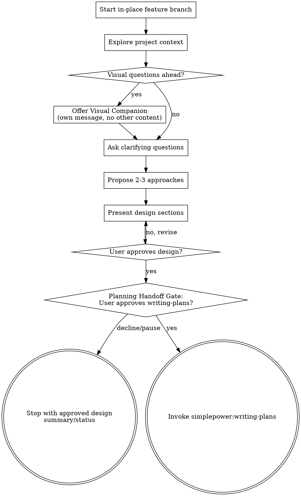

# Brainstorming Ideas Into Designs

Help turn ideas into fully formed designs through natural collaborative dialogue.

Start by creating or confirming the in-place feature branch, then understand the current project context and ask questions one at a time to refine the idea. Once you understand what you're building, present the design and get user approval.

<HARD-GATE>
Do NOT invoke any implementation skill, write any code, scaffold any project, or take any implementation action until you have presented a design and the user has approved it. This applies to EVERY project regardless of perceived simplicity.
</HARD-GATE>

## Approved Path Enforcement

The approved design is authoritative. Do not design backup plans, escape plans,
fallback implementations, reduced scope, docs-only substitutes, stub
substitutes, skipped verification, skipped review, execution-mode switches, or
lower-effort path variants as authorized work.

If the approved design path may be blocked, unsafe, underspecified, or
mismatched with the codebase, describe the blocker or decision point. Do not
authorize alternate implementation work. Any alternate path requires fresh explicit approval
from the user at the moment the deviation is needed.

## Anti-Pattern: "This Is Too Simple To Need A Design"

Every project goes through this process. A todo list, a single-function utility, a config change — all of them. "Simple" projects are where unexamined assumptions cause the most wasted work. The design can be short (a few sentences for truly simple projects), but you MUST present it and get approval.

## Checklist

You MUST create a task for each of these items and complete them in order:

1. **Start in-place feature branch** — create or confirm a normal current-checkout `feature/<slug>` branch before substantive context exploration
2. **Explore project context** — check files, docs, recent commits
3. **Offer visual companion** (if topic will involve visual questions) — this is its own message, not combined with a clarifying question. See the Visual Companion section below.
4. **Ask clarifying questions** — one at a time, understand purpose/constraints/success criteria
5. **Propose 2-3 approaches** — with trade-offs and your recommendation
6. **Present design** — in sections scaled to their complexity, get user approval after each section
7. **Planning handoff gate** — ask before invoking simplepower:writing-plans to create the authoritative implementation plan

## Start In-Place Feature Branch

Before substantive context exploration, create or confirm a normal current-checkout feature branch. This setup is not implementation work.

- Use an in-place branch: the current checkout gets a normal branch with `git checkout -b`, not a Git worktree.
- Default branch name: `feature/<slug>`, where `<slug>` is a short, descriptive slug from the user's request.
- If already on a `feature/` branch, report the branch and continue.
- If the worktree is dirty, branch creation is still allowed. Report that existing changes are carried onto the new branch, then continue.
- If `feature/<slug>` already exists, create a short unique suffix such as `feature/<slug>-2` and report the final branch name.
- If branch creation is unavailable, blocked, or unsafe, ask the user before deciding to continue in the current checkout.
- Do not invoke simplepower:using-git-worktrees by default; worktrees are not the default branch mechanism for brainstorming.

## Process Flow

**The terminal state is either invoking `simplepower:writing-plans` after explicit planning handoff approval, or stopping with the approved design summary/status when the user declines or pauses the handoff.** Do NOT write a standalone spec document, invoke frontend-design, invoke mcp-builder, or take implementation action from brainstorming. The ONLY skill you invoke after brainstorming is `simplepower:writing-plans`, and only after the planning handoff gate.

## The Process

**Understanding the idea:**

- Check out the current project state first (files, docs, recent commits)
- Before asking detailed questions, assess scope: if the request describes multiple independent subsystems (e.g., "build a platform with chat, file storage, billing, and analytics"), flag this immediately. Don't spend questions refining details of a project that needs to be decomposed first.
- If the project is too large for a single implementation plan, help the user decompose into sub-projects: what are the independent pieces, how do they relate, what order should they be built? Then brainstorm the first sub-project through the normal design flow. Each sub-project gets its own plan → implementation cycle.
- For appropriately-scoped projects, ask questions one at a time to refine the idea
- Prefer multiple choice questions when possible, but open-ended is fine too
- Only one question per message - if a topic needs more exploration, break it into multiple questions
- Focus on understanding: purpose, constraints, success criteria

**Exploring approaches:**

- Propose 2-3 different approaches with trade-offs
- Present options conversationally with your recommendation and reasoning
- Lead with your recommended option and explain why

**Presenting the design:**

- Once you believe you understand what you're building, present the design
- Scale each section to its complexity: a few sentences if straightforward, up to 200-300 words if nuanced
- Ask after each section whether it looks right so far
- Cover: architecture, components, data flow, error handling, testing
- Be ready to go back and clarify if something doesn't make sense

**Design for isolation and clarity:**

- Break the system into smaller units that each have one clear purpose, communicate through well-defined interfaces, and can be understood and tested independently
- For each unit, you should be able to answer: what does it do, how do you use it, and what does it depend on?
- Can someone understand what a unit does without reading its internals? Can you change the internals without breaking consumers? If not, the boundaries need work.
- Smaller, well-bounded units are also easier for you to work with - you reason better about code you can hold in context at once, and your edits are more reliable when files are focused. When a file grows large, that's often a signal that it's doing too much.

**Working in existing codebases:**

- Explore the current structure before proposing changes. Follow existing patterns.
- Where existing code has problems that affect the work (e.g., a file that's grown too large, unclear boundaries, tangled responsibilities), include targeted improvements as part of the design - the way a good developer improves code they're working in.
- Don't propose unrelated refactoring. Stay focused on what serves the current goal.

## After the Design

After the user approves the conversational design, ask whether to hand the
approved design to `simplepower:writing-plans`. You must ask before invoking
`simplepower:writing-plans`, and you must not invoke `simplepower:writing-plans`
until the user explicitly approves that planning handoff.

If the user approves, invoke `simplepower:writing-plans`. Pass the approved
design summary, constraints, decisions, and success criteria forward in the
current conversation. The plan file is the authoritative artifact for
implementation.

If the user declines or pauses, stop with the approved design summary and
current status instead of invoking another skill.

Do not write a standalone spec document. Do not ask the user to review a
written spec. Do not create a spec-review loop. If the approved design is
blocked, unsafe, underspecified, or mismatched with the codebase, describe the
blocker and ask the user before changing the approved path.

## Key Principles

- **One question at a time** - Don't overwhelm with multiple questions
- **Multiple choice preferred** - Easier to answer than open-ended when possible
- **YAGNI ruthlessly** - Remove unnecessary features from all designs
- **Explore alternatives** - Always propose 2-3 approaches before settling
- **Incremental validation** - Present design, get approval before moving on
- **Be flexible** - Go back and clarify when something doesn't make sense

## Visual Companion

A browser-based companion for showing mockups, diagrams, and visual options during brainstorming. Available as a tool — not a mode. Accepting the companion means it's available for questions that benefit from visual treatment; it does NOT mean every question goes through the browser.

If they agree, read `skills/brainstorming/visual-companion.md`, start the localhost server, give the local URL, and use that browser companion only for questions that benefit from seeing the idea. The browser pages are temporary brainstorming aids, not generated implementation plan artifacts. Optional inline visuals in saved Markdown plans belong to `simplepower:writing-plans`, not to brainstorming.

**Offering the companion:** When you anticipate that upcoming questions will involve visual content (mockups, layouts, diagrams), offer it once for consent:
> "Some of what we're working on might be easier to explain if I can show it to you in a web browser. I can put together mockups, diagrams, comparisons, and other visuals as we go. This feature is still new and can be token-intensive. Want to try it? (Requires opening a local URL)"

**This offer MUST be its own message.** Do not combine it with clarifying questions, context summaries, or any other content. The message should contain ONLY the offer above and nothing else. Wait for the user's response before continuing. If they decline, proceed with text-only brainstorming.

**Per-question decision:** Even after the user accepts, decide FOR EACH QUESTION whether to use the browser or the terminal. The test: **would the user understand this better by seeing it than reading it?**

- **Use the browser** for content that IS visual — mockups, wireframes, layout comparisons, architecture diagrams, side-by-side visual designs
- **Use the terminal** for content that is text — requirements questions, conceptual choices, tradeoff lists, A/B/C/D text options, scope decisions

A question about a UI topic is not automatically a visual question. "What does personality mean in this context?" is a conceptual question — use the terminal. "Which wizard layout works better?" is a visual question — use the browser.

If they agree to the companion, read the detailed guide before proceeding:
`skills/brainstorming/visual-companion.md`
