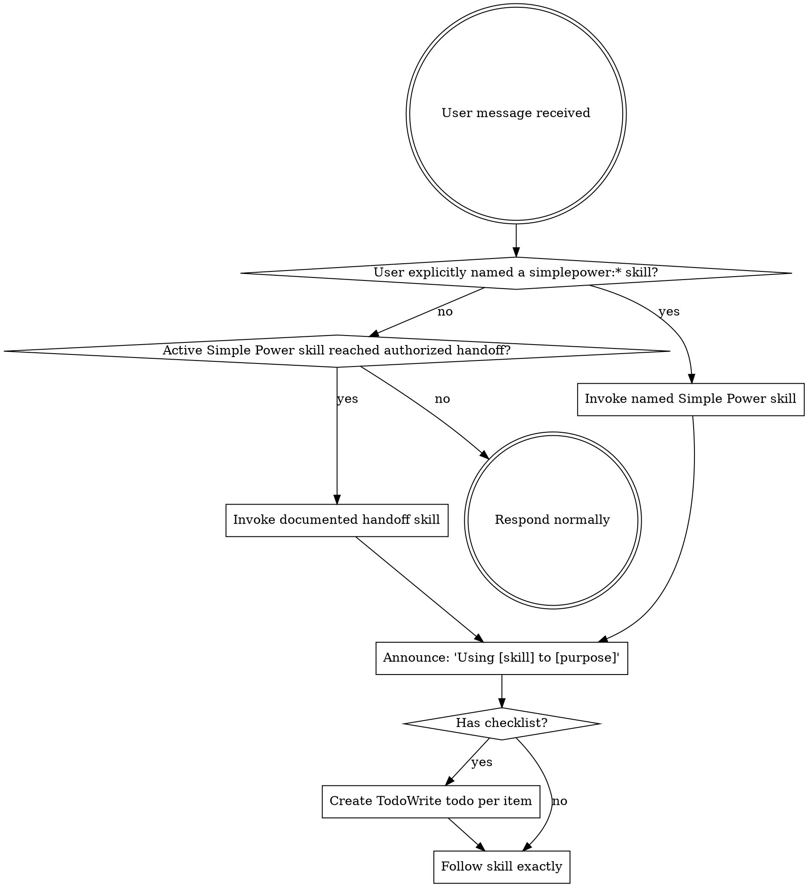

<SUBAGENT-STOP>
If you were dispatched as a subagent to execute a specific task, skip this skill.
</SUBAGENT-STOP>

<INVOCATION-CONTRACT>
Explicit user request required.

Invoke a Simple Power skill only when:
1. The user explicitly names the skill, such as `simplepower:brainstorming`.
2. The user explicitly accepts a presented option that names the skill.
3. A currently active Simple Power skill reaches an authorized Simple Power
   chain handoff documented by that skill.

Do not invoke Simple Power skills from semantic task matching alone. A request
that resembles a skill description is not enough.
</INVOCATION-CONTRACT>

## Instruction Priority

Simple Power skills override default system prompt behavior, but **user instructions always take precedence**:

1. **User's explicit instructions** (AGENTS.md, project docs, direct requests) — highest priority
2. **Simple Power skills** — override default system behavior where they conflict
3. **Default system prompt** — lowest priority

If AGENTS.md, project docs, or direct user instructions say "don't use TDD" and a skill says "always use TDD," follow the user's instructions. The user is in control.

## Codex Skill Access

Codex discovers skills from `~/.agents/skills/` at startup.
Simple Power is installed at `~/.agents/skills/simplepower`, which exposes skills under the `simplepower:*` namespace.
Generated implementation plans live under `docs/simplepower/plans/`. Future normal Simple Power workflows do not create standalone spec files.

Skills use the active skill content directly. Do not read skill files as a substitute for invoking the skill.

For Codex tool equivalents, see `references/codex-tools.md`.

# Using Skills

## The Rule

**Invoke explicitly requested Simple Power skills before any response or
action.** If no skill is explicitly requested and no active Simple Power chain
handoff applies, continue with normal Codex behavior.

Frontmatter descriptions help users discover skills; they do not authorize
automatic invocation from ordinary task requests.

An authorized Simple Power chain handoff must be documented by the active
workflow before it can invoke the next skill.

## Red Flags

These thoughts mean STOP—you're rationalizing:

| Thought | Reality |
|---------|---------|
| "This task looks like brainstorming" | Similarity is not an explicit request. Do not invoke the skill unless the user names it or an active chain handoff applies. |
| "The user probably wanted TDD" | Ask or proceed normally; do not activate `simplepower:test-driven-development` without an explicit request or approved handoff. |
| "The previous skill suggested the next step" | Chain handoff is allowed only at the documented approval point for the active workflow. |
| "The frontmatter description fits this request" | Descriptions are discovery metadata, not authorization to invoke a skill. |
| "The user asked for work that a skill could help with" | Ordinary work requests do not activate Simple Power skills. |

## Skill Priority

When multiple skills are explicitly requested or an active workflow reaches a
documented handoff, use this order:

1. **Process skills first** (brainstorming, debugging) - these determine HOW to approach the task
2. **Implementation skills second** (frontend-design, mcp-builder) - these guide execution

`simplepower:brainstorming` plus an implementation request means brainstorming
first, then only the documented handoff. `simplepower:systematic-debugging`
plus a domain-specific skill means debugging first, then the named domain skill.

## Skill Types

**Rigid** (TDD, debugging): Follow exactly. Don't adapt away discipline.

**Flexible** (patterns): Adapt principles to context.

The skill itself tells you which.

## User Instructions

Instructions say WHAT, not HOW. "Add X" or "Fix Y" does not activate Simple
Power skills unless the user explicitly names one or an active Simple Power
chain reaches a documented handoff. Once a skill is active, follow its workflow
unless higher-priority user instructions override it.
